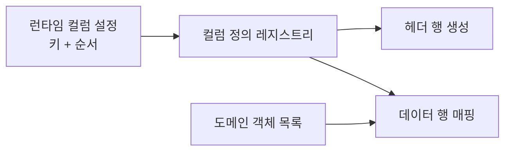

그 주엔 사용자마다 보고 싶은 컬럼과 그 순서가 다른 엑셀 다운로드를 다뤘다. 누군가는 "이름·금액·상태" 순을, 누군가는 "상태·이름·날짜" 순을 원했다. 컬럼을 코드에 고정해 두면 요구마다 분기문이 늘어난다. 핵심은 **컬럼 구성을 데이터로 다루는 것** — 무엇을, 어떤 순서로 출력할지를 런타임 설정으로 받아 엑셀을 조립한다.

## 컬럼 정의와 행 매핑을 분리한다

엑셀 한 장은 두 가지로 분해된다. **어떤 컬럼들이 어떤 순서로 있는가(헤더 정의)**와 **각 행에서 그 컬럼 값을 어떻게 뽑는가(매핑)**다. 고정 엑셀은 이 둘이 코드에 엉켜 있다. 가변 엑셀은 이를 떼어내야 한다.



각 컬럼을 "키 → 헤더 라벨 + 값 추출 함수"로 등록해 둔다. 사용자가 보낸 키 목록의 순서대로 정의를 골라 조립하면, 컬럼 순서·포함 여부가 전부 데이터로 결정된다.

```java
// 한 컬럼의 정의: 라벨과 "객체에서 값을 뽑는 함수"
record ColumnDef<T>(String key, String header, Function<T, Object> extractor) {}

class ExcelExporter<T> {
    // 등록된 전체 컬럼 카탈로그 (키로 조회)
    private final Map<String, ColumnDef<T>> catalog;

    ExcelExporter(List<ColumnDef<T>> defs) {
        this.catalog = defs.stream()
            .collect(Collectors.toMap(ColumnDef::key, Function.identity(),
                     (a, b) -> a, LinkedHashMap::new));
    }

    // requestedKeys = 사용자/팀 설정에서 온 컬럼 키 순서
    void export(OutputStream out, List<String> requestedKeys, List<T> rows) {
        // 알 수 없는 키는 버리고, 요청 순서를 그대로 보존
        List<ColumnDef<T>> selected = requestedKeys.stream()
            .map(catalog::get)
            .filter(Objects::nonNull)
            .toList();

        try (SXSSFWorkbook wb = new SXSSFWorkbook(100)) {   // 100행만 메모리 유지
            Sheet sheet = wb.createSheet();
            // 헤더
            Row head = sheet.createRow(0);
            for (int c = 0; c < selected.size(); c++) {
                head.createCell(c).setCellValue(selected.get(c).header());
            }
            // 데이터
            int r = 1;
            for (T item : rows) {
                Row row = sheet.createRow(r++);
                for (int c = 0; c < selected.size(); c++) {
                    Object v = selected.get(c).extractor().apply(item);
                    setCell(row.createCell(c), v);
                }
            }
            wb.write(out);
            wb.dispose();   // 임시 파일 정리
        } catch (IOException e) {
            throw new UncheckedIOException(e);
        }
    }

    private void setCell(Cell cell, Object v) {
        if (v == null) { cell.setBlank(); return; }   // 누락 컬럼 안전 처리
        if (v instanceof Number n) cell.setCellValue(n.doubleValue());
        else if (v instanceof Boolean b) cell.setCellValue(b);
        else cell.setCellValue(v.toString());
    }
}
```

카탈로그를 만들 때:

```java
var exporter = new ExcelExporter<Order>(List.of(
    new ColumnDef<>("orderNo",  "주문번호", Order::getOrderNo),
    new ColumnDef<>("customer", "고객명",   o -> o.getCustomer().getName()),
    new ColumnDef<>("amount",   "금액",     Order::getAmount),
    new ColumnDef<>("status",   "상태",     o -> o.getStatus().label())
));
// 팀 A: ["customer", "amount", "status"], 팀 B: ["status", "orderNo", "amount"]
exporter.export(out, teamConfig.columnKeys(), orders);
```

## 핵심: 스트리밍과 누락 처리

**메모리는 SXSSF로 흘려보낸다.** 가변 컬럼이라고 해서 데이터가 작아지는 건 아니다. `SXSSFWorkbook(100)`은 최근 100행만 힙에 유지하고 나머지는 디스크 임시 파일로 내보낸다. 수만 행에서도 힙이 일정하게 유지된다. 끝나면 `dispose()`로 임시 파일을 반드시 지운다.

**가변 스키마의 빈/누락 컬럼은 명시적으로 처리한다.** 요청 키 중 카탈로그에 없는 키는 조용히 버리되(`filter(nonNull)`), 값이 `null`인 셀은 예외가 아니라 빈 셀로 둔다. POI는 `setCellValue(null)` 같은 모호한 호출에서 의도와 다른 결과를 내므로, 타입별로 분기해 명시적으로 채우는 게 안전하다.

## 운영 함정

**첫째, 셀 스타일 객체의 폭증.** 가변 컬럼이면 컬럼마다 서식(날짜·통화 포맷)을 다르게 주고 싶어진다. 이때 행마다 `createCellStyle()`을 호출하면 워크북당 스타일 상한(64,000개)을 넘겨 터진다. 스타일은 **컬럼 정의 단위로 한 번만 만들어 재사용**해야 한다.

**둘째, 신뢰할 수 없는 컬럼 키.** 컬럼 순서를 클라이언트가 보낸다면, 등록되지 않은 키나 권한 밖 컬럼(예: 다른 사용자만 봐야 할 필드)이 섞일 수 있다. 카탈로그에 없는 키를 버리는 것만으로는 부족하고, **요청자의 권한으로 노출 가능한 컬럼 화이트리스트와 교집합**을 취해야 한다.

## 핵심 요약

- 가변 엑셀의 본질은 컬럼 정의(라벨+추출 함수)와 행 데이터를 분리하고, 컬럼 구성을 런타임 데이터로 다루는 것이다.
- 메모리는 SXSSF 스트리밍으로 일정하게 유지하고, 셀 스타일은 컬럼 단위로 재사용해 상한을 넘기지 않는다.
- 클라이언트가 컬럼을 지정한다면 권한 기반 화이트리스트와의 교집합으로 노출을 통제한다.

**면접 한 줄 Q&A** — "수만 행 엑셀에서 OOM을 피하려면?" → "SXSSFWorkbook으로 최근 N행만 메모리에 두고 나머지는 디스크로 흘려보낸 뒤 dispose로 임시 파일을 정리한다."
