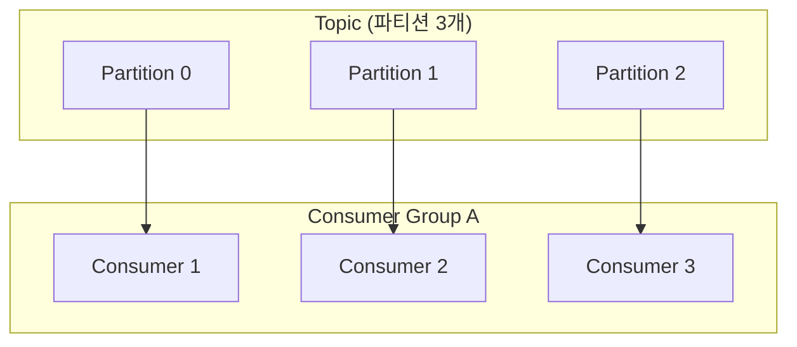
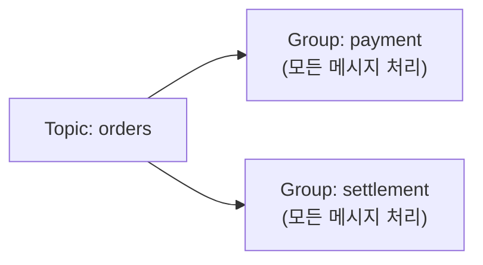

## 메시지를 넣고 빼는 양쪽 이야기

[토픽·파티션·오프셋](/posts/kafka-introduction/)을 봤으니, 실제로 메시지를 **넣는 쪽(Producer)** 과 **빼는 쪽(Consumer)**, 그리고 Kafka의 핵심인 **컨슈머 그룹**을 정리합니다.

## Producer — 어디로 보낼지와 acks

Producer는 메시지를 토픽에 발행합니다. 두 가지가 중요합니다.

- **파티션 결정**: 메시지에 **키가 있으면** `hash(key) % 파티션수`로 파티션이 정해집니다(같은 키 → 같은 파티션 → 순서 보장). 키가 없으면 라운드로빈 등으로 분산.
- **acks(응답 보장)**: 메시지가 얼마나 안전하게 저장됐는지 확인하는 수준.

| acks | 의미 | 특징 |
|------|------|------|
| `0` | 응답 안 기다림 | 가장 빠름, 유실 가능 |
| `1` | 리더만 기록 확인 | 절충 |
| `all` | 리더+ISR 복제 확인 | 가장 안전, 느림 |

데이터 유실이 치명적이면 `acks=all`을 씁니다.

## Consumer Group — 핵심 개념

소비자는 **컨슈머 그룹** 단위로 동작합니다. 규칙은 단순하지만 강력합니다.

> **하나의 파티션은 그룹 내에서 오직 하나의 컨슈머**만 읽는다.

이 규칙 덕분에:

- **병렬 처리**: 파티션 3개를 컨슈머 3개가 나눠 읽어 3배 처리.
- **확장 한계**: 컨슈머가 파티션 수보다 많으면 **남는 컨슈머는 논다**(파티션이 1:1 이상 배정 안 됨). 즉 **최대 병렬도 = 파티션 수**.

## 여러 그룹은 독립적으로 같은 데이터를 읽는다

서로 다른 컨슈머 그룹은 **같은 메시지를 각자** 읽습니다. 결제 서비스와 정산 서비스가 각각의 그룹으로 `orders`를 구독하면, 둘 다 모든 주문 이벤트를 받습니다. (큐의 "하나가 가져가면 끝"과 다른 점)

## 오프셋 커밋 — 어디까지 읽었나

각 그룹은 파티션별로 "어디까지 읽었는지(오프셋)"를 커밋해 둡니다. 그래서 컨슈머가 재시작해도 이어서 읽습니다.

- **자동 커밋**: 편하지만, 처리 전에 커밋되면 장애 시 **유실** 위험.
- **수동 커밋**: 메시지를 **처리 완료한 뒤** 커밋 → "at-least-once"(최소 한 번) 보장. 대신 중복 처리 가능성 → 멱등성(idempotency) 설계 필요.

## 리밸런싱(Rebalancing)

컨슈머가 추가/제거되거나 죽으면, 파티션을 다시 배분하는 **리밸런싱**이 일어납니다. 이 동안 잠깐 소비가 멈출 수 있어요. 너무 잦은 리밸런싱은 성능에 안 좋으니, `session.timeout` 등 설정과 안정적인 컨슈머 운영이 중요합니다.

## 정리

- Producer는 **키로 파티션**을 정하고(순서), **acks**로 안전성 수준을 택한다(`all`=안전).
- 컨슈머 그룹: **파티션 1개 = 그룹 내 컨슈머 1개** → 최대 병렬도는 파티션 수.
- **다른 그룹은 같은 메시지를 독립적으로** 받는다.
- 오프셋은 **수동 커밋 + 멱등 처리**로 유실/중복을 다루고, 리밸런싱 빈도를 관리하자.
