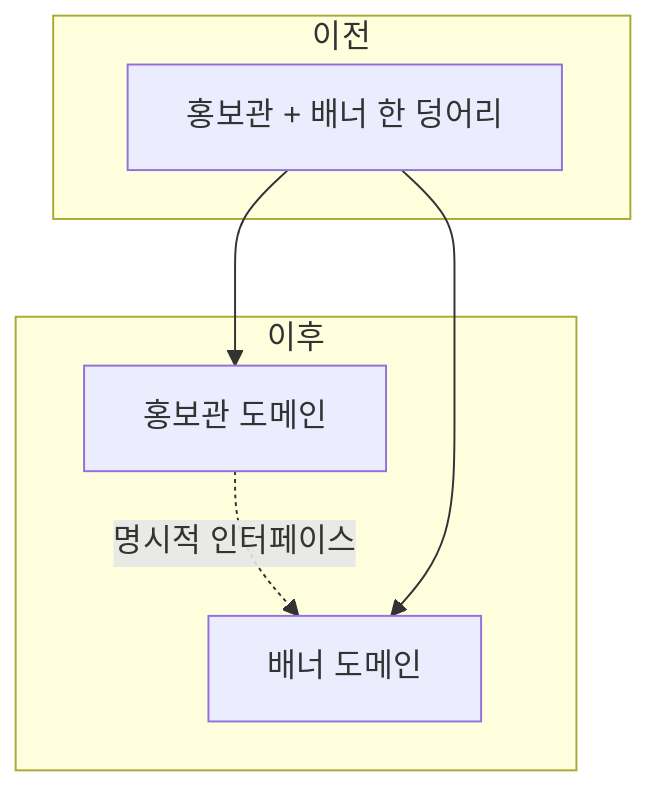

처음엔 한 기능 안에 슬쩍 얹어 두는 게 빨랐다. 부가 기능 하나가 기존 화면 코드 안에서 자라다, 결국 독립시켜야 할 만큼 커졌다. 붙여 두는 게 빠른 건 처음뿐이다. 두 책임이 한 덩어리에 섞이면 한쪽을 고칠 때 다른 쪽이 깨진다. 이걸 둘로 가르는 일은 단순 파일 분리가 아니라 **경계를 다시 긋는 설계 작업**이다.

## 왜 가르는가 — 응집도와 결합도

좋은 모듈은 응집도(cohesion)가 높고 결합도(coupling)가 낮다. 한 덩어리에 두 도메인이 섞이면 정반대가 된다. 한 클래스가 서로 무관한 두 가지 이유로 바뀌게 되는 것 — 단일 책임 원칙 위반이다. 분리 신호는 분명하다.

- 한쪽 요구사항만 바꿨는데 다른 쪽 테스트가 깨진다.
- `if (배너 모드) ... else ...` 같은 분기가 메서드마다 늘어난다.
- 두 기능이 같은 데이터의 다른 부분만 쓴다.



## 분리 지점 찾기 — 데이터부터 본다

코드보다 데이터가 진실을 말한다. 두 기능이 한 테이블을 공유한다면, 어떤 컬럼을 누가 쓰는지 가른다. 한쪽만 쓰는 컬럼은 분리 후보다. 양쪽이 진짜로 공유하는 최소 집합만 경계 데이터로 남긴다.

```java
// 이전: 한 서비스가 두 책임을 다 쥐고 있다
class ShowroomService {
    void renderShowroom() { /* 홍보관 + 배너 */ }
    void rotateBanner()   { /* 배너 로직이 여기 섞임 */ }
}

// 이후: 책임을 가르고, 필요한 것만 인터페이스로 노출
class ShowroomService {
    private final BannerProvider banners;       // 명시적 의존
    void renderShowroom() {
        List<Banner> active = banners.activeBanners();  // 경계 통과
        // 홍보관 본연의 로직만
    }
}

interface BannerProvider {                       // 좁은 계약
    List<Banner> activeBanners();
}
```

핵심은 **공유 지점을 좁은 인터페이스로 만드는 것**이다. 홍보관은 배너 내부를 모르고, "활성 배너 목록"이라는 계약만 안다. 매퍼·쿼리도 같은 원칙으로 가른다. 한 매퍼에서 두 도메인 SQL이 섞여 있다면, 도메인별로 매퍼를 나누고 공유 조회만 별도로 둔다.

## 분리 중 회귀를 막는 법

리팩토링의 진짜 위험은 "동작은 그대로여야 하는데 바뀌는 것"이다. 순서가 중요하다.

1. **먼저 특성화 테스트(characterization test)를 건다.** 현재 동작을 그대로 캡처해 안전망을 만든다. 분리 전 동작이 곧 정답이다.
2. **인터페이스를 추출**해 의존을 명시화한다. 이 단계까진 한 모듈 안에 둬도 된다.
3. **구현을 옮긴다.** 테스트가 계속 초록인지 보며 작은 보폭으로.
4. **공유 데이터를 가른다.** 가장 위험하므로 마지막에, 마이그레이션과 함께.

## 운영 함정

**한 번에 다 가르려는 욕심.** 코드·데이터·배포를 동시에 바꾸면 무엇이 깨졌는지 모른다. 인터페이스만 먼저 넣어 배포하고(동작 동일), 다음에 구현을 옮기고, 마지막에 데이터를 가른다. 각 단계가 독립적으로 롤백 가능해야 한다.

**숨은 양방향 의존.** 배너가 홍보관 상태를 거꾸로 참조하고 있으면, 한 방향 인터페이스로 못 가른다. 순환 의존을 먼저 끊는다 — 이벤트로 뒤집거나, 공통 부분을 제3의 모듈로 빼낸다.

## 핵심 요약

- 분리 신호는 "한쪽 변경이 다른 쪽을 깬다"는 것이다. 응집도↑ 결합도↓를 노린다.
- 데이터부터 보고, 공유 지점을 좁은 인터페이스로 만든다.
- 특성화 테스트로 동작을 고정한 뒤 인터페이스→구현→데이터 순으로, 작은 보폭으로 가른다.
