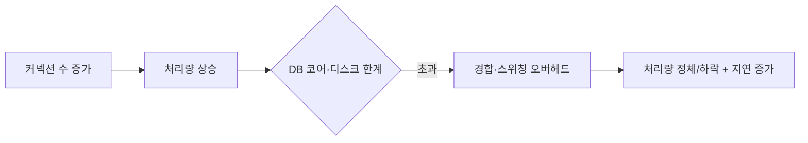

부하가 몰리는 구간을 다룬 적이 있다. 응답이 느려지자 가장 먼저 떠오르는 처방은 "커넥션 풀을 키우자"다. 그런데 풀을 키웠더니 오히려 느려지거나 DB가 더 휘청이는 경우가 있다. 핵심은 "커넥션은 동시 처리량의 상한이 아니라, DB가 동시에 감당할 수 있는 작업 수에 맞춰야 하는 값"이라는 점이다.

## 커넥션이 많다고 빨라지지 않는다

직관은 "일꾼(커넥션)이 많으면 일이 빨리 끝난다"지만, DB에서는 틀린다. DB가 쿼리를 실제로 처리하는 자원은 **CPU 코어와 디스크**다. 코어가 8개인 DB에 커넥션 100개가 동시에 쿼리를 던지면, 100개가 병렬로 처리되는 게 아니라 **8개씩 돌아가며 처리되고 나머지 92개는 컨텍스트 스위칭·락 경합·캐시 오염을 일으킨다.**

커넥션이 일정 수를 넘으면 처리량(throughput)은 더 오르지 않고, 오히려 경합 오버헤드 때문에 **꺾인다.** 동시에 각 쿼리의 지연(latency)은 줄 서는 시간이 길어져 늘어난다. 즉 풀을 무작정 키우면 "느려지는데 DB 부하만 커지는" 최악으로 간다.



## Little's law로 사이징한다

적정 풀 크기는 감이 아니라 식으로 추정한다. 대기 행렬 이론의 **Little's law**:

> 시스템 내 평균 동시 작업 수 L = 도착률 λ × 평균 처리시간 W

여기서 필요한 동시 커넥션 수가 곧 L이다. 예를 들어 초당 500건의 쿼리 요청(λ)이 들어오고 쿼리 한 건의 평균 DB 처리시간(W)이 10ms(0.01초)라면,

```
L = 500 × 0.01 = 5
```

즉 평균적으로 동시에 **5개**의 커넥션만 바쁘다. 피크와 변동을 감안해도 풀이 수백 개일 이유가 없다. 실제로 풀 사이징의 출발점으로 널리 인용되는 공식은 다음과 같다.

```
pool size ≈ (코어 수 × 2) + 유효 스핀들(디스크) 수
```

코어 8개 + SSD 환경이면 대략 **15~20** 정도가 합리적 시작점이다. 이보다 키우는 건 측정으로 정당화될 때만 한다.

```yaml
# HikariCP 설정 — 작게 시작하고 측정으로 조정
spring:
  datasource:
    hikari:
      maximum-pool-size: 20        # 코어 수 기반, 무작정 키우지 않는다
      minimum-idle: 20             # 풀 크기 = 동시 처리 상한
      connection-timeout: 3000     # 커넥션 못 빌리면 3초 후 빠르게 실패
      leak-detection-threshold: 5000  # 5초 넘게 안 돌려주면 누수 경고
```

`maximum-pool-size`보다 많은 요청이 오면 초과분은 `connection-timeout` 동안 대기 큐에서 기다린다. 이게 정상이다. **큐에서 잠깐 기다리는 것이, DB를 과부하로 무너뜨리는 것보다 낫다.** 풀은 일종의 부하 차단기 역할을 한다.

## 누수 탐지

풀이 적정 크기여도 **커넥션 누수**가 있으면 결국 고갈된다. 빌린 커넥션을 닫지 않으면(트랜잭션 누락, 예외 경로에서 close 누락) 풀에서 영영 사라진다. HikariCP의 `leak-detection-threshold`는 지정 시간(예: 5초)을 넘겨 반납되지 않는 커넥션의 대여 스택트레이스를 로그로 남겨, 어느 코드가 안 돌려주는지 짚어 준다.

```java
// try-with-resources로 close 누락을 구조적으로 차단
try (Connection conn = dataSource.getConnection();
     PreparedStatement ps = conn.prepareStatement(sql)) {
    // ...
}   // 예외가 나도 여기서 반드시 닫힌다
```

## 운영 함정

**함정 1 — 트랜잭션 안 외부 I/O.** 커넥션을 점유한 채 느린 외부 호출이나 무거운 연산을 하면, 풀이 적정 크기여도 점유 시간(W)이 길어져 사실상 고갈된다. W를 짧게 유지하는 게 풀 크기보다 중요하다.

**함정 2 — 앱 인스턴스 × 풀 크기 합산 누락.** 인스턴스 10대가 각각 풀 50개면 DB는 동시 500 커넥션을 마주한다. 사이징은 단일 앱이 아니라 **DB가 받는 총합** 기준으로 한다.

## 핵심 요약

- 커넥션 풀은 처리량을 늘리는 장치가 아니라, DB의 동시 처리 한계에 맞춘 **부하 상한**이다.
- 적정 크기는 Little's law(λ×W)와 `코어×2 + 디스크` 공식으로 추정하고, 작게 시작해 측정으로 조정한다.
- 풀이 작아 큐에서 잠깐 대기하는 건 정상이다. 그게 DB 과부하보다 안전하다.
- 누수는 try-with-resources로 막고 leak detection으로 감시한다. 점유 시간 W를 짧게 유지하는 게 핵심이다.
