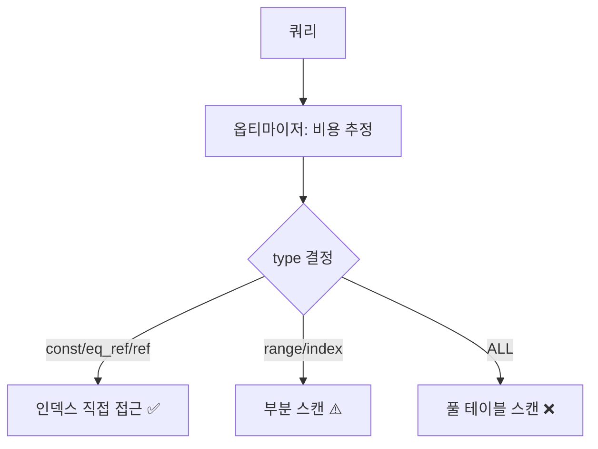

느린 쿼리를 붙잡고 씨름한 적이 있다. 같은 쿼리인데 어떤 조건에선 빠르고 어떤 조건에선 수십 배 느렸다. 추측으로 인덱스를 이리저리 붙여 보는 건 도박이다. 핵심은 "DB가 이 쿼리를 어떻게 실행하기로 결정했는지를 직접 보는 것" — 바로 **실행계획(EXPLAIN)** 이다.

## 옵티마이저는 무엇을 결정하는가

우리가 작성하는 SQL은 "무엇을 원하는지"이지 "어떻게 가져올지"가 아니다. 그 "어떻게"를 정하는 게 **쿼리 옵티마이저**다. 같은 결과를 내는 실행 경로는 여러 가지다 — 인덱스를 탈지 테이블을 통째로 훑을지, 어느 테이블을 먼저 읽고 어느 것과 조인할지, 어떤 조인 알고리즘을 쓸지. 옵티마이저는 각 경로의 **비용(cost)** 을 통계(테이블 행 수, 인덱스 카디널리티 등)로 추정해 가장 싸 보이는 것을 고른다.

EXPLAIN은 그 결정을 보여 준다. 추정만 보려면 `EXPLAIN`, 실제 실행 결과까지 보려면 `EXPLAIN ANALYZE`다.

```sql
EXPLAIN SELECT u.id, u.name, o.total
FROM users u
JOIN orders o ON o.user_id = u.id
WHERE u.status = 'ACTIVE'
ORDER BY u.created_at DESC
LIMIT 20;
```

## 핵심 컬럼 읽기 (MySQL/MariaDB 기준)

- **type** — 가장 중요하다. 접근 방식의 효율 등급이다.
  - `const`/`eq_ref` — PK·유니크로 1행 직접 접근. 최고.
  - `ref` — 인덱스로 몇 행 접근. 좋다.
  - `range` — 인덱스 범위 스캔. 양호.
  - `index` — 인덱스 전체 스캔.
  - `ALL` — **풀 테이블 스캔.** 큰 테이블에서 보이면 경보.
- **key** — 실제로 사용된 인덱스. `NULL`이면 인덱스를 안 탔다는 뜻.
- **rows** — 이 단계에서 읽을 것으로 **추정**한 행 수. 적을수록 좋다.
- **Extra** — `Using index`(커버링 인덱스, 좋음), `Using filesort`/`Using temporary`(정렬·임시테이블, 비쌈), `Using where`(인덱스 후 추가 필터).



## 풀스캔 vs 인덱스 스캔, 왜 갈리나

옵티마이저가 인덱스가 있어도 풀스캔을 고르는 경우가 있다. 조건에 매칭되는 행이 **테이블의 상당 비율**이면, 인덱스로 행을 찾고 다시 테이블 본체를 읽는(random I/O) 비용이 그냥 순차로 다 읽는 것보다 비싸기 때문이다. 보통 전체의 20~30%를 넘게 가져오면 풀스캔이 더 싸다. 즉 **인덱스가 있다고 항상 타는 게 아니라, 선택도(selectivity)가 높을 때만** 탄다. `status = 'ACTIVE'` 처럼 값이 몇 종류 안 되는 낮은 카디널리티 컬럼에 단독 인덱스를 걸어도 잘 안 쓰이는 이유다.

## 추정과 실제의 간극

`EXPLAIN`의 `rows`는 **통계 기반 추정치**다. 통계가 오래됐거나 데이터 분포가 편향되면 추정이 크게 빗나가고, 옵티마이저가 엉뚱한 계획을 고른다. 그래서 `EXPLAIN ANALYZE`로 추정 행수와 실제 행수를 비교하는 게 결정적이다.

```sql
EXPLAIN ANALYZE SELECT ... ;
-- (rows=10) 으로 추정했는데 (actual rows=480000) 이면
-- → 통계 갱신(ANALYZE TABLE) 또는 인덱스/쿼리 재설계 신호
```

추정과 실제가 자릿수 단위로 벌어지면, 그 단계가 바로 튜닝 지점이다.

## 운영 함정

**함정 1 — 인덱스 컬럼에 함수/연산.** `WHERE DATE(created_at) = '2025-06-15'` 처럼 컬럼을 함수로 감싸면 인덱스를 못 탄다(`type=ALL`). 범위 조건(`created_at >= ... AND < ...`)으로 풀어 인덱스를 살린다.

**함정 2 — 복합 인덱스 선행 컬럼 누락.** `(a, b)` 인덱스는 `a` 조건 없이 `b`만으로는 효율적으로 못 탄다. 인덱스 컬럼 순서와 쿼리 조건을 맞춰야 `key`에 잡힌다.

## 면접 한 줄 Q&A

- **Q. EXPLAIN에서 가장 먼저 보는 건?** A. `type`. `ALL`(풀스캔)이면 인덱스 미사용을 의심하고, `key`가 NULL인지 확인한다.
- **Q. 인덱스가 있는데 왜 풀스캔을 하나?** A. 가져올 행이 테이블의 큰 비율이면 인덱스 접근의 random I/O보다 순차 풀스캔이 싸다고 옵티마이저가 판단하기 때문. 선택도가 낮은 컬럼이 원인인 경우가 많다.
- **Q. 추정과 실제가 다른지 어떻게 보나?** A. `EXPLAIN ANALYZE`로 추정 rows와 actual rows를 비교한다. 자릿수로 벌어지면 통계 갱신 또는 재설계 신호다.
