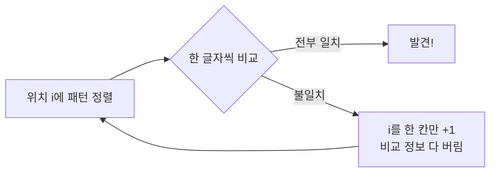

## "찾기"는 생각보다 깊은 문제다

`Ctrl+F`, `grep`, 로그 분석, DNA 서열 검색, 검색 엔진의 본문 매칭 — 전부 같은 질문입니다. **텍스트 `T`(길이 n) 안에 패턴 `P`(길이 m)가 어디에 나오는가?** 단순해 보이지만, 어떻게 푸느냐에 따라 $O(nm)$과 $O(n+m)$이 갈립니다. 핵심은 **불일치가 났을 때 얼마나 똑똑하게 다음 위치로 넘어가느냐**입니다.

## 나이브 — 어긋나면 한 칸만 물러난다

가장 단순한 방법: 텍스트의 모든 위치에 패턴을 갖다 대고 한 글자씩 비교, 어긋나면 **한 칸 밀어서** 처음부터 다시. 최악은 `T="aaaa...a"`, `P="aaa...b"`처럼 거의 다 맞다가 마지막에 어긋날 때 — 매 위치에서 m번 비교하므로 $O(nm)$입니다.

문제는 마지막 줄입니다. **이미 일치했던 정보를 통째로 버리고** 한 칸만 미는 것. KMP는 바로 이 낭비를 없앱니다.

## KMP — 이미 맞춘 부분은 다시 안 본다

KMP(Knuth–Morris–Pratt)의 통찰: 패턴 안에서 `j`번째까지 맞다가 어긋났다면, **이미 그 부분 텍스트의 내용을 안다**(패턴의 앞 `j`글자와 같다). 그러니 텍스트 포인터는 **절대 뒤로 가지 않고**, 패턴만 똑똑하게 점프시키면 됩니다.

그 점프 거리를 알려주는 게 **실패 함수(failure function, LPS 배열)** 입니다. `lps[j]` = "패턴의 0..j 부분문자열에서, **접두사이면서 동시에 접미사인** 가장 긴 길이". 어긋나면 `j`를 `lps[j-1]`로 보내 이미 일치가 보장된 만큼은 건너뜁니다. 아래는 불일치 순간 패턴이 한 칸이 아니라 실패 함수가 가리키는 만큼 **점프**하는 모습입니다.

<svg viewBox="0 0 660 180" role="img" aria-label="KMP에서 불일치가 나면 패턴을 한 칸이 아니라 실패 함수가 가리키는 만큼 점프시켜 텍스트 포인터를 되돌리지 않는 애니메이션">
  <text class="sub" x="20" y="22">텍스트 T</text>
  <g transform="translate(60,34)">
    <rect class="cell" x="0"   y="0" width="44" height="40"/><text class="ch" x="22"  y="26" text-anchor="middle">a</text>
    <rect class="cell" x="44"  y="0" width="44" height="40"/><text class="ch" x="66"  y="26" text-anchor="middle">b</text>
    <rect class="cell" x="88"  y="0" width="44" height="40"/><text class="ch" x="110" y="26" text-anchor="middle">a</text>
    <rect class="cell" x="132" y="0" width="44" height="40"/><text class="ch" x="154" y="26" text-anchor="middle">b</text>
    <rect class="cell" x="176" y="0" width="44" height="40"/><text class="ch" x="198" y="26" text-anchor="middle">a</text>
    <rect class="cell" x="220" y="0" width="44" height="40"/><text class="ch" x="242" y="26" text-anchor="middle">c</text>
    <rect class="cell" x="264" y="0" width="44" height="40"/><text class="ch" x="286" y="26" text-anchor="middle">a</text>
    <rect class="ok"  x="2" y="2" width="40" height="36"/>
    <rect class="ok"  x="46" y="2" width="40" height="36"/>
    <rect class="ok"  x="90" y="2" width="40" height="36"/>
    <rect class="bad" x="134" y="2" width="40" height="36"/>
  </g>
  <text class="sub" x="20" y="118">패턴 P</text>
  <g class="patgrp" transform="translate(60,104)">
    <rect class="pat" x="0"   y="0" width="44" height="40"/>
    <rect class="pat" x="44"  y="0" width="44" height="40"/>
    <rect class="pat" x="88"  y="0" width="44" height="40"/>
    <rect class="pat" x="132" y="0" width="44" height="40"/>
    <text class="ch" x="22"  y="26" text-anchor="middle">a</text>
    <text class="ch" x="66"  y="26" text-anchor="middle">b</text>
    <text class="ch" x="110" y="26" text-anchor="middle">a</text>
    <text class="ch" x="154" y="26" text-anchor="middle">a</text>
  </g>
  <text class="jump" x="330" y="130">실패 함수만큼 점프 (한 칸 아님)</text>
</svg>

텍스트 포인터가 되돌아가지 않으니 텍스트는 정확히 한 번 훑습니다 → 매칭 $O(n)$, 실패 함수 전처리 $O(m)$, 합쳐 **$O(n+m)$**. 같은 원리를 한꺼번에 여러 패턴에 확장한 게 Aho–Corasick(트라이 + 실패 링크)이고, 이건 [접미사 트라이/트리]()와 함께 검색·필터링 엔진의 뼈대입니다.

## 라빈-카프 — 비교 대신 해시로 빠르게 거른다

다른 발상. 패턴과 텍스트 윈도우를 **숫자(해시)** 로 바꿔, 해시가 다르면 글자 비교조차 생략합니다. 핵심은 **롤링 해시(rolling hash)**: 윈도우가 한 칸 이동할 때 해시를 처음부터 다시 계산하지 않고, **나가는 글자를 빼고 들어오는 글자를 더해** $O(1)$에 갱신합니다.

$$H_{i+1} = \big( (H_i - T[i]\cdot b^{m-1})\cdot b + T[i+m] \big) \bmod q$$

아래는 길이 m 윈도우가 텍스트를 한 칸씩 미끄러지며, 나가는 글자(빨강)를 빼고 들어오는 글자(초록)를 더해 해시를 갱신하는 모습입니다.

<svg viewBox="0 0 660 160" role="img" aria-label="라빈-카프 롤링 해시 윈도우가 텍스트를 한 칸씩 이동하며 나가는 글자를 빼고 들어오는 글자를 더해 해시를 갱신하는 애니메이션">
  <text class="sub" x="20" y="22">길이 m 윈도우가 한 칸씩 이동 · 해시는 O(1) 갱신</text>
  <g transform="translate(40,46)">
    <rect class="win" x="0" y="0" width="132" height="44"/>
    <rect class="cell" x="0"   y="0" width="44" height="44"/><text class="ch" x="22"  y="28" text-anchor="middle">s</text>
    <rect class="cell" x="44"  y="0" width="44" height="44"/><text class="ch" x="66"  y="28" text-anchor="middle">e</text>
    <rect class="cell" x="88"  y="0" width="44" height="44"/><text class="ch" x="110" y="28" text-anchor="middle">a</text>
    <rect class="cell" x="132" y="0" width="44" height="44"/><text class="ch" x="154" y="28" text-anchor="middle">r</text>
    <rect class="cell" x="176" y="0" width="44" height="44"/><text class="ch" x="198" y="28" text-anchor="middle">c</text>
    <rect class="cell" x="220" y="0" width="44" height="44"/><text class="ch" x="242" y="28" text-anchor="middle">h</text>
    <rect class="out" x="2"  y="2" width="40" height="40"/>
    <rect class="in"  x="134" y="2" width="40" height="40"/>
  </g>
  <text class="hash" x="330" y="130">H₍ᵢ₊₁₎ = (Hᵢ − 나간 글자)·b + 들어온 글자  (mod q)</text>
</svg>

해시가 같으면 **혹시 모를 충돌**을 배제하려 실제 글자를 한 번 더 비교합니다(거짓 양성 방지). 좋은 소수 `q`와 base `b`를 쓰면 평균 $O(n+m)$, 최악(해시 충돌 폭주)은 $O(nm)$. 진짜 강점은 **다중 패턴**과 부분 문자열 해시 — [해시 테이블]()에서 본 해싱이 그대로 문자열로 확장된 셈입니다.

## 세 알고리즘 비교

| | 나이브 | KMP | 라빈-카프 |
|---|--------|-----|-----------|
| 전처리 | 없음 | 실패 함수 $O(m)$ | 패턴 해시 $O(m)$ |
| 매칭(평균) | $O(nm)$ | $O(n)$ | $O(n+m)$ |
| 최악 | $O(nm)$ | $O(n+m)$ | $O(nm)$(충돌) |
| 텍스트 포인터 | 뒤로 감 | **안 감** | 안 감 |
| 강점 | 단순 | 단일 패턴 보장 | 다중 패턴·부분 해시 |

## 프로덕션에서 마주치는 함정

| 함정 | 증상 | 해법 |
|------|------|------|
| 라빈-카프 해시 충돌 | 최악 $O(nm)$로 퇴화 | 큰 소수 `q`·랜덤 base, 일치 시 실제 비교 |
| 정규식 백트래킹 폭발(ReDoS) | 악성 입력에 CPU 100% | 선형 시간 엔진(RE2), 입력 길이 제한 |
| 유니코드/정규화 무시 | 같아 보이는데 매칭 실패 | NFC 정규화 후 매칭, 코드포인트 단위 |
| 대소문자·로케일 | 검색 누락 | 명시적 폴딩, 인덱싱 시 분석기 통일 |

## 면접/리뷰 단골 질문

- **Q. KMP가 $O(n+m)$인 이유?** → 텍스트 포인터가 되돌아가지 않아 텍스트를 한 번만 훑음. 실패 함수로 패턴만 점프.
- **Q. 실패 함수(LPS)란?** → 패턴 접두사 중 "접두사=접미사인 가장 긴 길이". 불일치 시 거기로 패턴을 보냄.
- **Q. 롤링 해시가 빠른 이유?** → 윈도우 이동 시 해시를 재계산하지 않고 나간 글자 빼고 들어온 글자 더해 $O(1)$ 갱신.
- **Q. 라빈-카프 최악이 $O(nm)$인데 왜 씀?** → 다중 패턴·부분 문자열 비교에 강점. 좋은 소수·랜덤화로 충돌 회피.
- **Q. 수백만 패턴을 동시에 찾으려면?** → Aho–Corasick(트라이 + 실패 링크) 또는 접미사 구조 기반 인덱스.

## 정리

- 문자열 매칭의 본질은 **불일치 시 얼마나 똑똑하게 다음으로 넘어가느냐**다 — 나이브는 정보를 버려 $O(nm)$.
- **KMP**는 실패 함수로 텍스트 포인터를 되돌리지 않아 $O(n+m)$, 단일 패턴의 최악 보장.
- **라빈-카프**는 롤링 해시로 윈도우를 $O(1)$ 갱신, 다중 패턴·부분 해시에 강하다.
- 실무에선 정규식 ReDoS·유니코드 정규화가 진짜 함정. 대량 패턴은 Aho–Corasick.

> 이 글로 「알고리즘 A-Z」의 '기법' 묶음([동적계획법]() → [그리디]() → 문자열 매칭)이 마무리됩니다. 다음은 확률로 공간을 줄이는 '요즘 알고리즘'으로 넘어갑니다.
