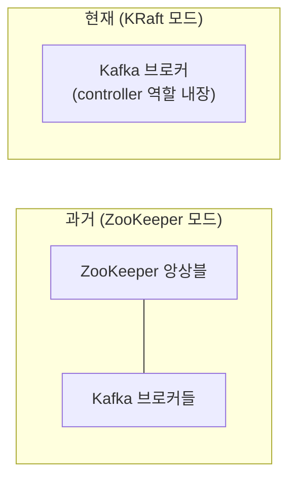

## ZooKeeper, 이제 안 써도 된다

예전 Kafka는 메타데이터(브로커·토픽·파티션 정보) 관리를 위해 **ZooKeeper**라는 별도 시스템이 꼭 필요했습니다. 구성도 복잡하고 운영 포인트가 둘이었죠. 그런데 **KRaft(Kafka Raft)** 가 도입되면서 ZooKeeper 없이 Kafka 자체가 메타데이터를 관리하게 됐고, **Kafka 4.0부터는 ZooKeeper가 완전히 제거**되어 KRaft가 유일한 방식이 됐습니다.



덕분에 구성요소가 하나로 줄어, 특히 로컬/소규모 구성이 훨씬 간단해졌습니다.

## docker-compose로 단일 브로커 (KRaft)

개발용 단일 브로커는 ZooKeeper 없이 Kafka 컨테이너 하나로 끝납니다.

```yaml
# docker-compose.yml
services:
  kafka:
    image: apache/kafka:3.9.0
    ports:
      - "9092:9092"
    environment:
      KAFKA_NODE_ID: 1
      KAFKA_PROCESS_ROLES: broker,controller        # 브로커+컨트롤러 겸임
      KAFKA_CONTROLLER_QUORUM_VOTERS: 1@localhost:9093
      KAFKA_LISTENERS: PLAINTEXT://:9092,CONTROLLER://:9093
      KAFKA_ADVERTISED_LISTENERS: PLAINTEXT://localhost:9092
      KAFKA_CONTROLLER_LISTENER_NAMES: CONTROLLER
      KAFKA_LISTENER_SECURITY_PROTOCOL_MAP: CONTROLLER:PLAINTEXT,PLAINTEXT:PLAINTEXT
      KAFKA_OFFSETS_TOPIC_REPLICATION_FACTOR: 1
```

```bash
docker compose up -d
```

> `PROCESS_ROLES: broker,controller`가 KRaft의 핵심입니다. 한 노드가 데이터 처리(broker)와 메타데이터 관리(controller)를 함께 맡습니다. 운영 클러스터에선 controller를 별도 노드로 분리하기도 합니다.
{: .prompt-tip }

## 토픽 만들고 메시지 주고받기

컨테이너 안의 CLI로 빠르게 확인할 수 있습니다.

```bash
# 토픽 생성 (파티션 3개)
docker exec -it kafka /opt/kafka/bin/kafka-topics.sh \
  --create --topic orders --partitions 3 --replication-factor 1 \
  --bootstrap-server localhost:9092

# 토픽 목록
docker exec -it kafka /opt/kafka/bin/kafka-topics.sh \
  --list --bootstrap-server localhost:9092

# 콘솔 프로듀서로 메시지 발행
docker exec -it kafka /opt/kafka/bin/kafka-console-producer.sh \
  --topic orders --bootstrap-server localhost:9092
> hello kafka

# 콘솔 컨슈머로 처음부터 소비
docker exec -it kafka /opt/kafka/bin/kafka-console-consumer.sh \
  --topic orders --from-beginning --bootstrap-server localhost:9092
```

## advertised.listeners 주의

도커에서 가장 자주 막히는 부분이 **`ADVERTISED_LISTENERS`** 입니다. 이건 "클라이언트가 접속할 때 안내받는 주소"라, 잘못 설정하면 연결은 되는데 메시지 송수신이 안 됩니다.

- 호스트(로컬 PC)에서 붙으면: `localhost:9092`
- 다른 컨테이너에서 붙으면: 서비스명(`kafka:9092`)

두 경로가 다 필요하면 리스너를 여러 개로 분리해 각각 다른 advertised 주소를 줘야 합니다.

## 정리

- **KRaft** 덕분에 ZooKeeper 없이 Kafka 단독 운영(**4.0부터 ZK 제거**).
- 개발용은 `apache/kafka` 이미지 + `PROCESS_ROLES: broker,controller`로 단일 노드 구성.
- CLI로 토픽 생성·콘솔 프로듀서/컨슈머로 빠르게 검증.
- **`ADVERTISED_LISTENERS`** 설정이 연결 문제의 단골 원인 — 접속 경로에 맞게.
