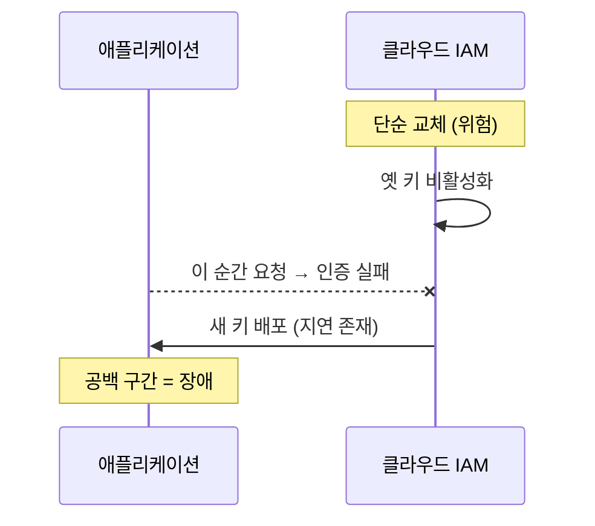
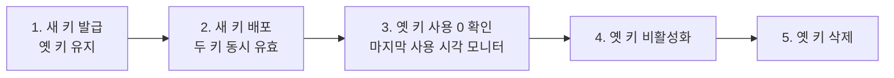

그 주엔 클라우드 스토리지에 쓰던 액세스 키를 교체하는 일을 다뤘다. 외부 API 서비스 키 교체와 결이 비슷하지만, 인프라 자격증명은 한 번 끊기면 파일 업로드·다운로드가 통째로 멈춘다. 키를 "그냥 바꾸면" 갈아끼우는 찰나에 옛 키로 인증하던 요청이 무더기로 실패한다. 핵심은 **두 키가 동시에 유효한 구간을 만들어 그 사이에 갈아끼우는 것**, 그리고 애초에 **장기 키 대신 역할 기반 인증으로 가는 분기**다.

## 왜 "바로 교체"가 위험한가

장기 액세스 키(액세스 키 ID + 시크릿)는 그 자체가 인증 수단이다. 옛 키를 비활성화하고 새 키를 배포하는 사이에는 필연적으로 공백이 생긴다.



설정 리로드, 인스턴스 롤링, 캐시된 클라이언트 갱신에는 시간이 걸린다. 그 사이의 요청은 `403 InvalidAccessKeyId`로 떨어진다. 무중단의 핵심은 이 공백을 없애는 것이다.

## 무중단 교체 — 두 키 동시 유효 구간

대부분의 클라우드 IAM은 사용자당 액세스 키를 **두 개까지** 동시에 활성 상태로 둘 수 있다. 이를 이용한다.



1. **새 키 발급.** 옛 키는 그대로 둔 채 두 번째 키를 만든다. 이 시점부터 두 키 모두 유효하다.
2. **새 키 배포.** 시크릿 저장소를 새 값으로 갱신하고 인스턴스를 롤링한다. 일부는 새 키, 일부는 옛 키로 동작하지만 **둘 다 유효**하므로 누구도 실패하지 않는다.
3. **옛 키 사용량 0 확인.** 키의 "마지막 사용 시각"을 모니터링해 옛 키로 들어오는 트래픽이 사라졌는지 확인한다.
4. **옛 키 비활성화 → 삭제.** 비활성화로 먼저 막아 보고(롤백 여지), 문제 없으면 삭제한다.

이 절차의 전제는 **키가 코드/설정에 박혀 있지 않은 것**이다.

## 키를 코드에서 분리한다

키가 소스나 설정 파일에 하드코딩돼 있으면 교체할 때마다 재배포가 필요하고, 저장소 히스토리에 영구히 남는다. 키는 런타임에 외부에서 주입받아야 한다.

```java
// 안티패턴: 코드/설정에 박힌 키
// String accessKey = "AKIA...";   // 금지

// 권장 1) 환경변수/시크릿 매니저에서 주입
public S3Client buildClient() {
    // SDK 기본 자격증명 체인: 환경변수 → 시크릿 → 인스턴스 역할 순으로 탐색
    return S3Client.builder()
        .credentialsProvider(DefaultCredentialsProvider.create())
        .build();
}

// 권장 2) 시크릿 매니저에서 동적 조회 + 캐시 (TTL 짧게)
public AwsCredentials loadFromSecretManager() {
    var secret = secretsClient.getSecretValue(b -> b.secretId("app/storage-key"));
    var json = parse(secret.secretString());   // {accessKeyId, secretAccessKey}
    return AwsBasicCredentials.create(json.get("accessKeyId"), json.get("secretAccessKey"));
}
```

시크릿 매니저를 쓰면 교체 시 **저장된 값만 바꾸고** 애플리케이션은 짧은 TTL 후 새 값을 읽어간다. 코드 배포가 필요 없다.

## 더 나은 분기 — 장기 키를 아예 없앤다

가장 견고한 답은 **장기 액세스 키를 쓰지 않는 것**이다. 애플리케이션이 클라우드 위(예: 가상 머신·컨테이너)에서 돈다면, 인스턴스에 **역할(IAM Role)**을 부여한다. 그러면 SDK가 메타데이터 서비스에서 **단기 임시 자격증명**을 자동으로 받아오고, 만료 전에 알아서 갱신한다. 교체할 키 자체가 없으니 "키 교체"라는 운영 작업이 사라진다.

분기 기준은 이렇다. 클라우드 내부에서 도는 워크로드면 인스턴스 역할(또는 워크로드 아이덴티티)을 쓴다. 외부(온프레미스·로컬·서드파티)에서 접근해야 한다면 장기 키가 불가피하므로, 그땐 위의 두 키 무중단 교체 절차와 시크릿 매니저를 적용한다.

## 운영 함정

**첫째, 클라이언트 재사용으로 옛 자격증명이 굳음.** SDK 클라이언트를 싱글톤으로 만들어 두면 생성 시점의 자격증명을 그대로 들고 간다. 시크릿을 바꿔도 살아 있는 클라이언트는 옛 키를 계속 쓴다. 자격증명 제공자가 **갱신을 지원하는지** 확인하거나, 교체 후 클라이언트를 재생성하도록 설계한다.

**둘째, 옛 키를 너무 빨리 지움.** 사용량 0을 확인하지 않고 바로 삭제하면, 캐시·롱폴링·재시도 큐에 남아 있던 옛 키 요청이 실패한다. 비활성화→관찰→삭제의 단계를 건너뛰지 않는다.

## 핵심 요약

- 단순 교체는 옛 키 비활성화와 새 키 배포 사이에 공백을 만들어 장애가 된다.
- 무중단 교체는 두 키가 동시에 유효한 구간을 만들어 그 사이에 롤링하고, 옛 키 사용량 0을 확인한 뒤 비활성화→삭제한다.
- 키는 코드/설정에서 분리해 시크릿 매니저로 주입한다. 클라우드 내부 워크로드라면 장기 키 대신 인스턴스 역할로 임시 자격증명을 받는 것이 가장 견고하다.

**면접 한 줄 Q&A** — "액세스 키를 무중단으로 교체하려면?" → "두 키를 동시에 활성화해 둔 채 새 키를 배포하고, 옛 키 사용량이 0이 된 것을 확인한 뒤 비활성화·삭제한다. 가능하면 인스턴스 역할로 전환해 교체 자체를 없앤다."
