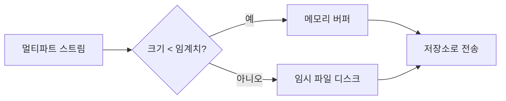

파일 업로드 기능을 다룬 주였다. 작은 이미지 몇 개일 때는 멀쩡하던 서버가, 누군가 수백 MB짜리를 동시에 올리면 힙이 터진다. 업로드의 본질은 "들어오는 바이트를 어디에 둘 것인가"이고, 답은 "힙에 통째로 두지 않는다"이다.

## 왜 메모리가 터지나

HTTP 멀티파트(`multipart/form-data`) 본문은 바이트 스트림으로 들어온다. 이걸 `byte[]`나 `String`으로 전부 읽으면 파일 크기만큼 힙을 점유한다. 100MB 파일을 동시에 10명이 올리면 1GB가 순간적으로 잡힌다. 게다가 GC가 큰 객체를 회수하기 전에 다음 요청이 또 들어오면 `OutOfMemoryError`로 직행한다.

해법은 **임계치 기반 스풀(spool)**이다. 작은 파트는 메모리에, 임계치를 넘으면 임시 파일(디스크)로 흘려보낸다. 서블릿 멀티파트 처리(Commons FileUpload, 서블릿 3.0 `Part`)가 모두 이 모델을 쓴다.



## 스트리밍으로 받기

핵심은 전체를 한 번에 들고 있지 않고, 일정 크기 버퍼로 읽어 쓰면서 흘려보내는 것이다.

```java
// InputStream → 목적지로 버퍼 단위 복사. 파일 전체를 힙에 올리지 않는다.
try (InputStream in = part.getInputStream();
     OutputStream out = Files.newOutputStream(target)) {
    byte[] buf = new byte[8192];
    int n;
    while ((n = in.read(buf)) != -1) {
        out.write(buf, 0, n);
    }
}
// 또는 자바 표준 한 줄:
// Files.copy(part.getInputStream(), target, StandardCopyOption.REPLACE_EXISTING);
```

스프링 MVC라면 설정으로 임계치·최대 크기를 강제한다.

```properties
# 임계치 초과분은 디스크로 스풀, 단일 파일/요청 전체 상한
spring.servlet.multipart.file-size-threshold=2KB
spring.servlet.multipart.max-file-size=50MB
spring.servlet.multipart.max-request-size=100MB
```

`max-file-size`를 넘으면 컨테이너가 본문을 다 읽기 전에 끊고 예외를 던진다. 즉 악의적 거대 업로드가 힙에 닿기 전에 차단된다.

## 운영 함정

- **임시 파일 누수**: 디스크로 스풀된 temp 파일은 요청 처리 후 정리돼야 한다. 예외 경로에서 cleanup을 안 하면 `/tmp`가 차면서 디스크 풀로 서버가 멈춘다. temp 디렉터리 용량 모니터링은 필수다.
- **타임아웃 부재**: 느린 클라이언트가 본문을 찔끔찔끔 보내면(slowloris류) 커넥션·스레드를 오래 점유한다. 커넥션 읽기 타임아웃과 요청 최대 크기를 함께 걸어야 한다.
- **전체 읽은 뒤 검증**: 파일을 다 받은 후에야 확장자·매직넘버를 보면 이미 디스크/메모리를 다 쓴 뒤다. 크기 상한은 컨테이너 레벨에서 먼저 막는다.

## 핵심 요약

- 업로드는 `byte[]`로 통째로 읽지 말고 버퍼 단위로 스트리밍한다.
- 임계치 기반 스풀(작으면 메모리, 크면 디스크)로 힙을 보호한다.
- `max-file-size`/`max-request-size`/읽기 타임아웃을 컨테이너에서 강제하고, temp 파일 정리와 디스크 용량을 모니터링한다.
