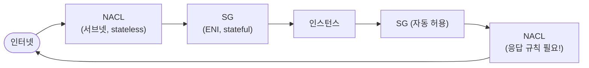
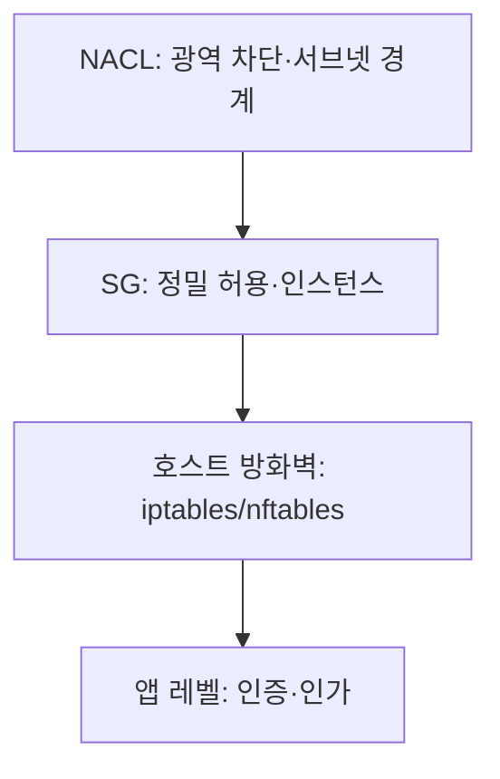

## "분명 인바운드 80을 열었는데 응답이 안 돌아온다"

이 한 문장이 방화벽 디버깅의 절반입니다. 똑같이 "80번 포트를 열었"는데, AWS 보안그룹(SG)에서는 멀쩡히 되고 네트워크 ACL(NACL)에서는 응답이 막힙니다. 똑같은 `iptables` 규칙인데 어떤 건 한 줄로 끝나고 어떤 건 양방향 두 줄이 필요합니다.

차이는 단 하나, **연결을 기억하느냐(stateful)** 입니다. 이 글은 패킷 필터링을 "포트 여닫기"가 아니라 **상태 추적의 유무로 갈리는 두 세계**로 정리합니다. 그 차이를 모르면 SG와 NACL을 평생 헷갈리고, "단방향으로만 되는" 버그를 영원히 만납니다.

## stateful vs stateless — 움직임으로 먼저

위는 **stateful**: 나가는 요청을 방화벽이 *기억*해 두므로(연결 추적), 돌아오는 응답은 규칙 없이도 <span style="color:#2f9e44;font-weight:600">자동 허용</span>됩니다. 아래는 **stateless**: 방화벽이 아무것도 기억하지 않아, 나가는 규칙과 **돌아오는 규칙을 따로** 열어줘야 합니다. 한쪽만 열면 응답이 <span style="color:#e03131;font-weight:600">차단</span>됩니다.

<div class="fw-state" markdown="0">
<style>
.fw-state{margin:1.4rem 0;overflow-x:auto}
.fw-state svg{width:100%;max-width:720px;height:auto;display:block;margin:0 auto;font-family:inherit}
.fw-state .wall{fill:none;stroke:currentColor;stroke-width:1.6;opacity:.5}
.fw-state .lbl{fill:currentColor;font-size:12px;font-weight:600}
.fw-state .sub{fill:currentColor;font-size:10px;opacity:.55}
.fw-state .ln{stroke:currentColor;opacity:.2;stroke-width:2}
.fw-state .req{fill:#1971c2}
.fw-state .ok{fill:#2f9e44}
.fw-state .no{fill:#e03131}
.fw-state .sf-out{animation:fwout 4.5s linear infinite}
.fw-state .sf-in{animation:fwin 4.5s linear infinite}
.fw-state .sl-out{animation:fwout 4.5s linear infinite}
.fw-state .sl-blk{animation:fwblk 4.5s linear infinite}
.fw-state .mem{opacity:0;animation:fwmem 4.5s ease-in-out infinite}
@keyframes fwout{0%{transform:translateX(0);opacity:0}5%{opacity:1}45%{transform:translateX(250px);opacity:1}50%{transform:translateX(250px);opacity:0}100%{opacity:0}}
@keyframes fwin{0%{opacity:0}50%{opacity:0;transform:translateX(0)}55%{opacity:1}95%{transform:translateX(-250px);opacity:1}100%{opacity:0}}
@keyframes fwblk{0%{opacity:0}50%{opacity:0;transform:translateX(0)}56%{opacity:1}72%{transform:translateX(-118px);opacity:1}82%{transform:translateX(-118px);opacity:0}100%{opacity:0}}
@keyframes fwmem{0%{opacity:0}20%{opacity:0}30%{opacity:.9}80%{opacity:.9}100%{opacity:0}}
</style>
<svg viewBox="0 0 700 250" role="img" aria-label="stateful 방화벽은 나간 연결을 기억해 응답을 자동 허용하고, stateless 방화벽은 양방향 규칙이 없으면 응답을 차단하는 비교 애니메이션">
  <text class="lbl" x="8" y="22">stateful · 나간 연결을 기억 → 응답 자동 허용</text>
  <rect class="wall" x="330" y="35" width="40" height="70" rx="6"/>
  <text class="sub" x="350" y="125" text-anchor="middle">방화벽</text>
  <text class="mem" x="350" y="50" text-anchor="middle" style="fill:#2f9e44;font-size:14px">⊙</text>
  <text class="sub" x="40" y="74" text-anchor="middle">호스트</text>
  <text class="sub" x="660" y="74" text-anchor="middle">외부</text>
  <line class="ln" x1="70" y1="70" x2="640" y2="70"/>
  <rect class="req sf-out" x="70" y="62" width="16" height="14" rx="2"/>
  <rect class="ok sf-in"  x="624" y="62" width="16" height="14" rx="2"/>

  <text class="lbl" x="8" y="165">stateless · 기억 없음 → 돌아오는 규칙 없으면 차단</text>
  <rect class="wall" x="330" y="178" width="40" height="70" rx="6"/>
  <text class="sub" x="350" y="245" text-anchor="middle">방화벽</text>
  <text class="sub" x="40" y="217" text-anchor="middle">호스트</text>
  <text class="sub" x="660" y="217" text-anchor="middle">외부</text>
  <line class="ln" x1="70" y1="213" x2="640" y2="213"/>
  <rect class="req sl-out" x="70" y="205" width="16" height="14" rx="2"/>
  <rect class="no sl-blk"  x="624" y="205" width="16" height="14" rx="2"/>
  <text class="sub" x="455" y="200" text-anchor="middle" style="fill:#e03131">✕ 응답 규칙 없음</text>
</svg>
</div>

이 그림이 SG와 NACL의 차이 전체를 압축합니다. **SG는 위(stateful), NACL은 아래(stateless)** 입니다. "인바운드만 열었는데 응답이 막힌다"는 NACL에서만 일어납니다.

## 1. 방화벽의 본질: 규칙 리스트를 순서대로 평가

방화벽은 패킷의 **5-튜플**(출발지 IP·포트, 목적지 IP·포트, 프로토콜)을 규칙 리스트와 대조해 통과/차단을 정합니다. 핵심은 **평가 순서**입니다.

<div class="fw-rules" markdown="0">
<style>
.fw-rules{margin:1.4rem 0;overflow-x:auto}
.fw-rules svg{width:100%;max-width:640px;height:auto;display:block;margin:0 auto;font-family:inherit}
.fw-rules .row{fill:none;stroke:currentColor;stroke-width:1.4;opacity:.4}
.fw-rules .lbl{fill:currentColor;font-size:12px}
.fw-rules .tag{font-size:11px;font-weight:700}
.fw-rules .allow{fill:#2f9e44}
.fw-rules .deny{fill:#e03131}
.fw-rules .pk{fill:#1971c2;animation:fwscan 5s ease-in-out infinite}
.fw-rules .hit{opacity:0;animation:fwhit 5s ease-in-out infinite}
@keyframes fwscan{0%{transform:translateY(0);opacity:0}6%{opacity:1}18%{transform:translateY(0)}30%{transform:translateY(44px)}50%{transform:translateY(88px)}60%{transform:translateY(88px);opacity:1}70%{transform:translateY(88px) translateX(120px);opacity:0}100%{opacity:0}}
@keyframes fwhit{0%{opacity:0}55%{opacity:0}62%{opacity:1}80%{opacity:1}100%{opacity:0}}
</style>
<svg viewBox="0 0 620 210" role="img" aria-label="패킷이 규칙 리스트를 위에서 아래로 순차 평가하다 일치하는 규칙에서 멈추는 애니메이션">
  <text class="lbl" x="8" y="20" style="font-weight:600">규칙은 위에서 아래로, 처음 일치에서 멈춤(first-match)</text>
  <rect class="row" x="120" y="36" width="380" height="34" rx="6"/>
  <rect class="row" x="120" y="80" width="380" height="34" rx="6"/>
  <rect class="row" x="120" y="124" width="380" height="34" rx="6"/>
  <text class="lbl tag deny"  x="138" y="58">DENY</text>
  <text class="lbl" x="210" y="58">src 198.51.100.0/24 (차단 IP)</text>
  <text class="lbl tag allow" x="138" y="102">ALLOW</text>
  <text class="lbl" x="210" y="102">tcp dport 443 (HTTPS)</text>
  <text class="lbl tag allow" x="138" y="146">ALLOW</text>
  <text class="lbl" x="210" y="146">tcp dport 22 from office</text>
  <rect class="pk" x="60" y="46" width="16" height="14" rx="2"/>
  <text class="hit lbl" x="520" y="102" style="fill:#2f9e44;font-weight:700">통과 ✓</text>
</svg>
</div>

여기서 두 가지 설계가 갈립니다.

- **first-match + 명시적 순서**(iptables, NACL): 위에서 아래로 훑다 **처음 일치한 규칙**으로 결정하고 멈춥니다. 그래서 순서가 곧 정책입니다. 마지막엔 보통 **default deny**(걸린 게 없으면 차단).
- **allow-only 합집합**(AWS SG): 순서가 없습니다. 규칙은 전부 "허용" 뿐이고, **하나라도 일치하면 허용**, 아니면 묵시적 거부. deny 규칙 자체가 없습니다.

## 2. 리눅스의 방화벽: netfilter / iptables 체인

리눅스 커널의 패킷 필터는 **netfilter** 훅이고, 그 위 규칙 도구가 `iptables`(요즘은 `nftables`)입니다. 패킷은 통과 위치에 따라 정해진 **체인**을 지납니다.

```mermaid
flowchart LR
    NIC([수신]) --> PRE[PREROUTING]
    PRE --> RD{라우팅 결정}
    RD -->|내 호스트 행| IN[INPUT] --> LOCAL[로컬 프로세스]
    RD -->|통과(forward)| FWD[FORWARD] --> POST
    LOCAL --> OUT[OUTPUT] --> POST[POSTROUTING] --> TX([송신])
```

- **INPUT**: 이 호스트가 받는 패킷 / **OUTPUT**: 이 호스트가 보내는 패킷 / **FORWARD**: 통과(라우터·NAT 게이트웨이 역할).
- **PREROUTING / POSTROUTING**: 라우팅 결정 전·후 — 주로 NAT(주소 변환)가 여기서 일어납니다([NAT 글]()).

iptables가 **stateful**일 수 있는 이유는 `conntrack`(연결 추적) 덕분입니다. 이 한 줄이 "응답 자동 허용"의 정체입니다.

```bash
# 새로 시작하거나(NEW) 이미 성립된(ESTABLISHED) 연결의 응답은 허용
iptables -A INPUT -m conntrack --ctstate ESTABLISHED,RELATED -j ACCEPT
iptables -A INPUT -p tcp --dport 443 -m conntrack --ctstate NEW -j ACCEPT
iptables -P INPUT DROP        # 나머지는 기본 차단(default deny)
```

`ESTABLISHED,RELATED -j ACCEPT` 한 줄이 곧 SG의 stateful 동작입니다. 커널이 `/proc/net/nf_conntrack`에 연결 테이블을 들고 있어, 돌아오는 패킷이 기존 연결에 속하면 규칙을 다시 안 봅니다. **이 테이블이 꽉 차면(`nf_conntrack: table full`) 새 연결이 조용히 드롭**됩니다 — 고트래픽 게이트웨이의 단골 장애입니다.

## 3. AWS의 두 방화벽: SG와 NACL은 다른 계층

AWS는 같은 트래픽을 **두 겹**으로 거릅니다. 보안그룹(SG)은 ENI(인스턴스의 가상 NIC)에, 네트워크 ACL(NACL)은 서브넷 경계에 붙습니다.



| | 보안그룹 (SG) | 네트워크 ACL (NACL) |
|---|---|---|
| 적용 위치 | ENI(인스턴스) | 서브넷 |
| 상태 | **stateful**(응답 자동 허용) | **stateless**(응답 규칙 별도) |
| 규칙 종류 | **allow만** | allow + **deny** |
| 평가 | 모든 규칙 합집합(순서 무관) | **번호 순서대로 first-match** |
| 기본값 | 인바운드 전부 차단, 아웃바운드 전부 허용 | 기본 NACL은 전부 허용 / 커스텀은 전부 거부 |
| source 지정 | IP/CIDR **또는 다른 SG 자체** | IP/CIDR만 |

SG의 강력한 기능 하나: **source로 IP 대신 다른 SG를 지정**할 수 있습니다. "웹 서버 SG에서 오는 트래픽만 DB 포트 허용" 같은 규칙을 IP 없이 표현해, 오토스케일로 IP가 바뀌어도 정책이 유지됩니다. 이 동작의 세부는 [기존 보안그룹 source 글]()에서 더 깊게 다뤘습니다.

## 4. 가장 흔한 함정 셋

**① NACL의 ephemeral 포트 누락 — "단방향 차단"의 주범.**
NACL은 stateless라 응답도 명시해야 합니다. 클라이언트로 가는 응답은 임시 포트(보통 1024–65535)를 목적지로 씁니다. 인바운드 80만 열고 **아웃바운드 ephemeral 범위를 안 열면**, 요청은 들어오는데 응답이 NACL에서 막혀 "연결이 멈춘" 것처럼 보입니다.

```text
인바운드  100  ALLOW  tcp  dport 443        0.0.0.0/0
아웃바운드 100  ALLOW  tcp  dport 1024-65535 0.0.0.0/0   ← 이게 없으면 응답 차단
```

**② SG에는 deny가 없다.** "이 IP만 차단"을 SG로는 못 합니다(allow만 존재). 차단이 필요하면 **NACL의 deny**를 써야 합니다. SG와 NACL은 경쟁이 아니라 **역할 분담**입니다 — 정밀 허용은 SG, 광역 차단은 NACL.

**③ `0.0.0.0/0`의 남발.** 22번(SSH)·3389(RDP)을 전 세계에 여는 순간 봇이 수 분 내 들어옵니다. 최소 권한 원칙: 출처를 회사 IP·배스천 SG로 좁히고, 관리 접근은 SSM Session Manager처럼 포트를 아예 안 여는 방식을 우선하세요.

## 5. 디버깅: 추측 말고 로그를 봐라

**VPC Flow Logs** — 어떤 규칙이 막았는지 가장 빠른 단서. `ACCEPT`/`REJECT`가 그대로 찍힙니다.

```text
2 123456 eni-abc 10.0.1.5 203.0.113.9 443 51514 6 12 5400 ... REJECT OK
                  └ 출발지        └ 목적지   └dport └sport  └프로토콜6=TCP └ 차단됨
```

- 인바운드에 `REJECT`가 보이면 SG/NACL **인바운드** 규칙 문제.
- 인바운드는 `ACCEPT`인데 응답(반대 방향)이 `REJECT`면 십중팔구 **NACL ephemeral 포트** 문제.

리눅스 호스트라면:

```bash
iptables -L -n -v --line-numbers        # 규칙별 매칭 패킷 카운터까지
conntrack -L | wc -l                    # 연결 추적 테이블 사용량(테이블 풀 점검)
```

규칙 옆 패킷 카운터가 0이면 그 규칙에는 트래픽이 도달조차 못 한 것 — 순서나 앞단 차단을 의심합니다.

## 6. 방어는 한 겹이 아니다 (defense in depth)



NACL로 알려진 악성 대역을 통째로 막고(stateless·deny), SG로 "필요한 출처·포트만" 허용(stateful·allow)하고, 호스트와 앱에서 한 번 더 — 한 겹이 뚫려도 다음이 받칩니다. 단일 방화벽에 모든 걸 거는 설계가 가장 위험합니다.

## 면접/리뷰 단골 질문

- **Q. SG와 NACL의 가장 본질적 차이는?** → stateful(SG, 응답 자동 허용) vs stateless(NACL, 응답 규칙 별도). 여기서 적용 위치·deny 유무·평가 방식이 전부 따라온다.
- **Q. 인바운드만 열었는데 응답이 안 온다, 어디부터?** → stateless 경계(NACL/순수 iptables)의 ephemeral 포트 아웃바운드를 확인. SG는 stateful이라 이 문제가 안 생긴다.
- **Q. 특정 IP를 차단하려면?** → SG로는 불가(allow만). NACL의 deny 규칙 또는 호스트 방화벽으로.
- **Q. iptables가 어떻게 응답을 자동 허용하나?** → `conntrack`이 연결 상태를 추적하고 `ESTABLISHED,RELATED`를 ACCEPT. 이 테이블이 풀나면 새 연결이 드롭된다.

## 정리

- 패킷 필터의 세계는 **연결을 기억하는가(stateful)** 로 갈린다 — 이 한 축이 규칙 개수·디버깅·함정을 전부 결정한다.
- 리눅스는 **netfilter 체인(INPUT/OUTPUT/FORWARD/PRE·POSTROUTING)** + `conntrack`으로 stateful을 구현한다.
- AWS는 **SG(ENI·stateful·allow만·SG를 source로) + NACL(서브넷·stateless·deny 가능·순서평가)** 두 겹.
- 단골 버그는 **NACL ephemeral 포트 누락(단방향 차단)**, "SG에는 deny 없음", `0.0.0.0/0` 남발. 디버깅은 **Flow Logs(ACCEPT/REJECT)** 와 `iptables -L -v`로.

> 관련 글: 이 필터가 붙는 무대인 [VPC & 클라우드 네트워킹](), 주소를 바꿔치기하는 [NAT](), 그리고 패킷의 길을 정하는 [라우팅]().
