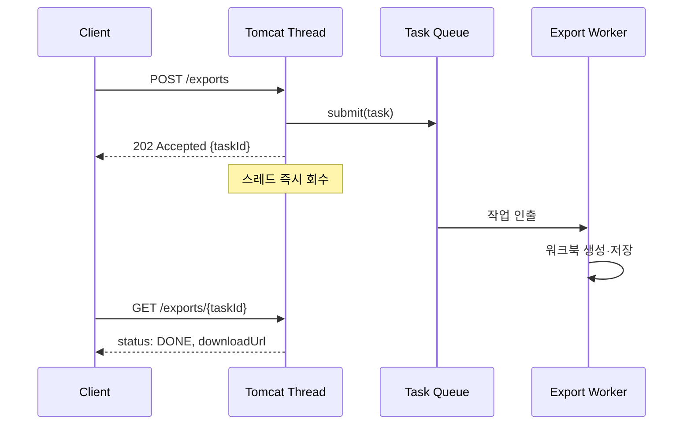

그 주엔 대량 데이터를 엑셀로 떨어뜨리는 추출 기능을 다뤘다. 수십만 행을 모아 워크북을 만들고 스트림으로 내려보내는 작업은 길면 수십 초가 걸린다. 문제는 이 시간 내내 **톰캣 요청 스레드 하나가 통째로 묶인다**는 것이다. 동시에 몇 명만 추출 버튼을 누르면 스레드 풀이 마르고, 전혀 무겁지 않은 일반 요청까지 큐에서 굶는다. 핵심 지식은 "오래 걸리는 작업을 요청 스레드에서 떼어내는 비동기 실행자 설계"다.

## 요청 스레드를 왜 풀어야 하는가

톰캣은 요청을 처리할 워커 스레드를 풀로 관리한다(`server.tomcat.threads.max`, 기본 200). 이 스레드는 **요청-응답 한 사이클 동안만 점유되어야** 회전율이 높다. 그런데 추출처럼 CPU·I/O를 오래 쓰는 작업이 끼면 스레드가 회수되지 않고, 풀이 고갈되면 신규 연결은 accept 큐에서 대기하다 타임아웃난다. 톰캣 스레드는 "받고 빨리 돌려주는" 자원이지 "오래 계산하는" 자원이 아니다.

해법은 추출 로직을 **별도 워커 풀**로 떼는 것이다. 요청 스레드는 작업을 큐에 던지고 즉시 "접수했다"를 응답하면 회수된다. 실제 계산은 전용 `ThreadPoolTaskExecutor`가 처리한다.



## 전용 실행자 설계

Spring의 `@Async`는 기본적으로 `SimpleAsyncTaskExecutor`를 쓰는데, 이건 **요청마다 새 스레드를 만들고 상한이 없다**. 부하가 몰리면 스레드를 무한정 찍어내다 OOM으로 죽는다. 반드시 경계가 있는 풀을 직접 정의해 이름으로 지정한다.

```java
@Configuration
@EnableAsync
public class ExportAsyncConfig {

    @Bean("exportExecutor")
    public Executor exportExecutor() {
        ThreadPoolTaskExecutor executor = new ThreadPoolTaskExecutor();
        executor.setCorePoolSize(4);      // 상시 워커
        executor.setMaxPoolSize(8);       // 최대 워커
        executor.setQueueCapacity(100);   // 대기 큐
        executor.setThreadNamePrefix("export-");
        // 큐도 풀도 꽉 차면 제출 스레드가 직접 실행 → 자연스러운 백프레셔
        executor.setRejectedExecutionHandler(
            new ThreadPoolExecutor.CallerRunsPolicy());
        executor.initialize();
        return executor;
    }
}
```

여기서 풀이 커지는 순서를 정확히 알아야 한다. `ThreadPoolExecutor`는 **코어 풀이 차면 곧장 max로 늘리는 게 아니라 먼저 큐를 채우고, 큐까지 가득해야 max까지 늘린다**. 즉 큐 용량을 크게 잡으면 maxPoolSize는 사실상 도달하지 않는다. 추출처럼 CPU를 오래 쓰는 작업은 코어 풀을 너무 크게 잡으면 컨텍스트 스위칭만 늘어나니, 보통 코어를 보수적으로 두고 큐로 버틴다.

```java
@Service
public class ExportService {

    @Async("exportExecutor")  // 메서드명이 아니라 빈 이름을 지정
    public void runExport(Long taskId, ExportQuery query) {
        updateStatus(taskId, RUNNING);
        try {
            byte[] file = buildWorkbook(query); // 무거운 작업
            String url = storeFile(taskId, file);
            updateStatus(taskId, DONE, url);
        } catch (Exception e) {
            updateStatus(taskId, FAILED, e.getMessage());
        }
    }
}
```

컨트롤러는 작업 행을 하나 만들고 `runExport`를 호출한 뒤 `202 Accepted`와 `taskId`를 돌려준다. 클라이언트는 그 id로 상태를 폴링하다 `DONE`이 되면 다운로드 URL을 받는다.

## 운영 함정

**첫째, `@Async`는 같은 클래스 내부 호출에 안 먹는다.** Spring AOP는 프록시 기반이라, 같은 빈 안에서 `this.runExport()`로 부르면 프록시를 거치지 않아 그냥 동기 실행된다. 반드시 다른 빈을 거쳐 호출해야 비동기가 적용된다.

**둘째, 비동기 스레드에는 요청 컨텍스트가 따라오지 않는다.** `SecurityContext`, `RequestContextHolder`, 트랜잭션, MDC 로깅 키 등은 ThreadLocal 기반이라 워커 스레드에서는 비어 있다. 추출에 필요한 사용자 정보·파라미터는 **호출 시점에 인자로 다 넘겨** 워커가 ThreadLocal에 의존하지 않게 해야 한다. 트랜잭션도 새 스레드에서 새로 시작되므로 `@Async`와 `@Transactional`을 한 메서드에 같이 거는 건 의도대로 안 될 때가 많다.

## 핵심 요약

- 톰캣 요청 스레드는 빨리 돌려주는 자원이다. 오래 걸리는 작업은 전용 `TaskExecutor`로 뗀다.
- `@Async` 기본 실행자는 무한 스레드 생성 위험이 있으니 경계 있는 풀을 직접 정의한다.
- `ThreadPoolExecutor`는 코어 → 큐 → max 순으로 커진다. 큐 용량이 max 도달 여부를 좌우한다.
- Q: "`@Async`를 같은 클래스 메서드에서 호출했는데 동기로 돈다. 왜?" → A: 프록시 기반 AOP라 자기 호출(self-invocation)은 프록시를 우회한다. 별도 빈으로 분리해 호출해야 한다.
