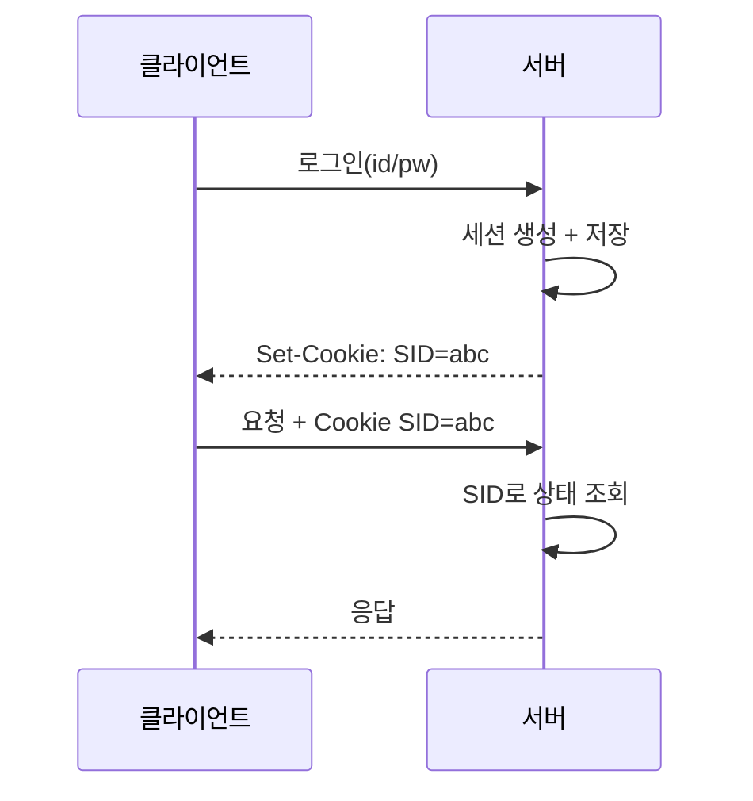

로그인 처리를 다룬 주였다. "세션이냐 토큰이냐"는 취향 싸움처럼 보이지만, 본질은 단 하나의 질문으로 갈린다 — **인증 상태를 누가 들고 있는가, 서버인가 클라이언트인가.** 여기서 스케일아웃, 즉시 로그아웃, 저장 위치의 모든 차이가 파생된다.

## 세션 — 상태는 서버에 있다

로그인 성공 시 서버가 세션 객체를 만들어 메모리(또는 세션 저장소)에 두고, 그 식별자(session id)만 쿠키로 내려준다. 이후 요청은 쿠키의 session id를 들고 오고, 서버는 그것으로 저장소에서 사용자 상태를 찾는다. 즉 **진짜 상태는 서버에**, 클라이언트는 열쇠(id)만 가진다.



장점: 서버가 세션을 들고 있으니 **즉시 무효화**가 쉽다(저장소에서 지우면 끝). 단점: 서버가 1대를 넘어가는 순간 문제다. 요청이 다른 서버로 가면 그 서버엔 세션이 없다. 그래서 세션을 공유 저장소(예: Redis)로 빼거나, 같은 사용자를 같은 서버로 보내는 sticky session이 필요하다. 즉 **무상태 스케일아웃을 깨뜨린다.**

## 토큰 — 상태는 클라이언트에 있다

토큰(예: JWT)은 사용자 정보와 만료시각을 담고 **서버 비밀키로 서명**한 문자열이다. 서버는 토큰을 저장하지 않는다. 요청이 오면 서명만 검증하면 위변조 여부를 알 수 있다. 상태가 토큰 자체에 들어 있으므로 어느 서버가 받아도 독립 검증이 된다 — **stateless**, 스케일아웃에 자연스럽다.

```java
// 검증은 서명 + 만료만 확인. 저장소 조회 없음 → 어떤 서버든 처리 가능
Claims claims = Jwts.parserBuilder()
    .setSigningKey(secretKey)
    .build()
    .parseClaimsJws(token)   // 서명 불일치/만료면 예외
    .getBody();
String userId = claims.getSubject();
```

단점이 정확히 장점의 뒤통수다. 서버가 토큰을 들고 있지 않으니 **만료 전 즉시 폐기가 어렵다.** 탈취되거나 로그아웃해도 토큰은 만료 전까지 유효하다. 그래서 실무에선 만료를 짧게(access) 두고 갱신용(refresh)을 따로 두거나, 폐기 목록(blacklist)을 서버에 둔다 — 그 순간 다시 상태를 갖게 되어 "완전 무상태"는 깨진다.

## 트레이드오프 정리

| 축 | 세션(stateful) | 토큰(stateless) |
|----|----|----|
| 상태 위치 | 서버 | 클라이언트(토큰 내부) |
| 스케일아웃 | 공유 저장소/sticky 필요 | 자연스러움 |
| 즉시 폐기 | 쉬움 | 어려움(blacklist 필요) |
| 저장소 부하 | 매 요청 조회 | 서명 검증만 |
| 페이로드 크기 | 작음(id만) | 큼(매 요청 토큰 전송) |

## 운영 함정

- **JWT에 민감정보**: 토큰 페이로드는 서명될 뿐 암호화가 아니다. Base64라 누구나 디코드해 내용을 본다. 비밀번호·개인정보를 넣지 않는다.
- **로그아웃 환상**: 토큰 기반에서 "로그아웃"은 클라이언트가 토큰을 버리는 것일 뿐, 탈취된 토큰은 만료까지 살아 있다. 강제 폐기가 필요하면 서버 측 폐기 목록이 필수다.

## 핵심 요약

- 세션은 상태를 서버가, 토큰은 클라이언트가 들고 있다. 모든 차이가 여기서 나온다.
- 세션은 즉시 폐기가 쉽지만 스케일아웃에 공유 저장소가 필요하고, 토큰은 스케일아웃이 쉽지만 즉시 폐기가 어렵다.
- JWT는 서명이지 암호화가 아니다 — 민감정보 금지.
