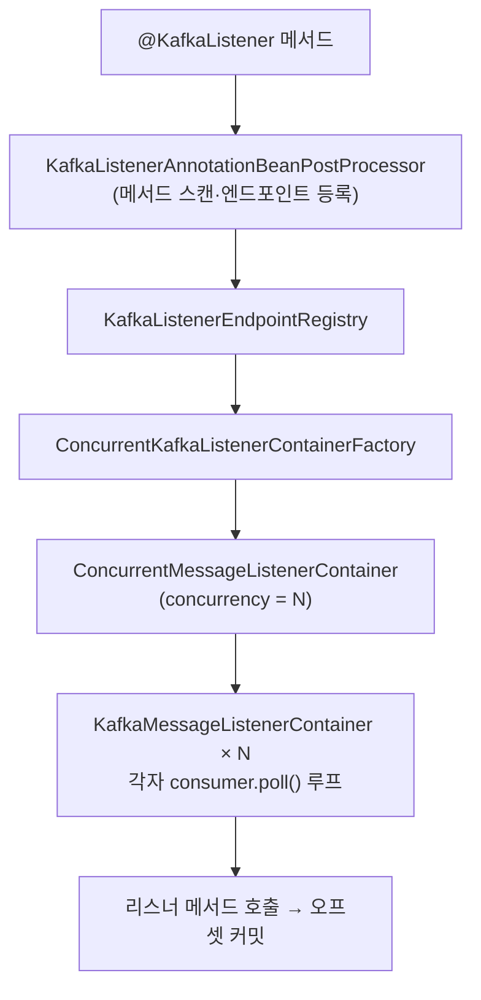

## 발행 한 줄, 소비 한 줄 뒤에 숨은 것들

[Docker로 Kafka](/posts/kafka-docker-kraft/)를 띄웠으니, 이제 Spring Boot에서 메시지를 **발행(`KafkaTemplate`)** 하고 **소비(`@KafkaListener`)** 합니다. `spring-kafka`가 이 과정을 정말 단순하게 만들어주는데, 문제는 그 단순함 뒤에 **오프셋 커밋·리밸런싱·재시도**라는 분산 시스템의 본질이 숨어 있다는 것입니다. 이걸 모르면 운영에서 "메시지가 사라졌어요" / "같은 메시지가 두 번 처리됐어요" / "컨슈머가 갑자기 멈췄어요"를 반드시 만납니다.

이 글은 `@KafkaListener` 한 줄이 내부적으로 어떤 객체로 펼쳐지고, **언제 오프셋이 커밋되며**, 실패하면 무슨 일이 일어나는지까지 내려갑니다.

## 발행하고 소비하는 흐름 먼저 — 움직임으로

프로듀서가 **키로 파티션을 골라** 메시지를 보내면, 컨슈머 그룹의 컨슈머들이 파티션을 **나눠 가져** 소비하고 오프셋을 전진시킵니다. <span style="color:#1971c2;font-weight:600">파랑</span>·<span style="color:#2f9e44;font-weight:600">초록</span>·<span style="color:#f08c00;font-weight:600">주황</span>은 서로 다른 키(=다른 파티션으로 향하는 메시지)입니다.

<div class="kfk-flow" markdown="0">
<style>
.kfk-flow{margin:1.4rem 0;overflow-x:auto}
.kfk-flow svg{width:100%;max-width:720px;height:auto;display:block;margin:0 auto;font-family:inherit}
.kfk-flow .lbl{fill:currentColor;font-size:12px;font-weight:600}
.kfk-flow .sub{fill:currentColor;font-size:9px;opacity:.55}
.kfk-flow .box{fill:none;stroke:currentColor;stroke-width:1.5;opacity:.4}
.kfk-flow .lane{fill:currentColor;opacity:.06}
.kfk-flow .arr{stroke:currentColor;opacity:.3;stroke-width:1.4;fill:none}
.kfk-flow .cons{animation:kfkpulse 3s ease-in-out infinite}
.kfk-flow .cons2{animation:kfkpulse 3s ease-in-out infinite 1.5s}
.kfk-flow .m0{fill:#1971c2;animation:kfkflow 3.2s linear infinite}
.kfk-flow .m1{fill:#2f9e44;animation:kfkflow 3.2s linear infinite 1.1s}
.kfk-flow .m2{fill:#f08c00;animation:kfkflow 3.2s linear infinite 2.1s}
.kfk-flow .off{fill:#e8590c;opacity:.7;animation:kfkoffset 6s ease-in-out infinite}
@keyframes kfkflow{0%{transform:translateX(0);opacity:0}10%{opacity:1}90%{opacity:1}100%{transform:translateX(430px);opacity:0}}
@keyframes kfkpulse{0%,100%{opacity:.4}50%{opacity:.95}}
@keyframes kfkoffset{0%{transform:translateX(0)}100%{transform:translateX(250px)}}
</style>
<svg viewBox="0 0 720 220" role="img" aria-label="프로듀서가 키로 파티션을 골라 메시지를 보내고 컨슈머 그룹이 파티션을 나눠 소비하며 오프셋이 전진하는 애니메이션">
  <rect class="box" x="8" y="80" width="110" height="60" rx="8"/>
  <text class="lbl" x="63" y="106" text-anchor="middle">Producer</text>
  <text class="sub" x="63" y="122" text-anchor="middle">KafkaTemplate</text>
  <rect class="lane" x="180" y="40" width="300" height="34" rx="6"/>
  <rect class="lane" x="180" y="93" width="300" height="34" rx="6"/>
  <rect class="lane" x="180" y="146" width="300" height="34" rx="6"/>
  <text class="sub" x="190" y="34">Partition 0</text>
  <text class="sub" x="190" y="139">Partition 1</text>
  <text class="sub" x="190" y="200">Partition 2</text>
  <rect class="off" x="186" y="93" width="6" height="34" rx="2"/>
  <rect class="box cons" x="560" y="46" width="150" height="58" rx="8"/>
  <text class="lbl" x="635" y="70" text-anchor="middle">Consumer A</text>
  <text class="sub" x="635" y="86" text-anchor="middle">partition 0,1</text>
  <rect class="box cons2" x="560" y="116" width="150" height="58" rx="8"/>
  <text class="lbl" x="635" y="140" text-anchor="middle">Consumer B</text>
  <text class="sub" x="635" y="156" text-anchor="middle">partition 2 · group order-service</text>
  <line class="arr" x1="118" y1="110" x2="180" y2="57"/>
  <line class="arr" x1="118" y1="110" x2="180" y2="110"/>
  <line class="arr" x1="118" y1="110" x2="180" y2="163"/>
  <line class="arr" x1="480" y1="57"  x2="560" y2="75"/>
  <line class="arr" x1="480" y1="110" x2="560" y2="75"/>
  <line class="arr" x1="480" y1="163" x2="560" y2="145"/>
  <circle class="m0" cx="125" cy="57"  r="6"/>
  <circle class="m1" cx="125" cy="110" r="6"/>
  <circle class="m2" cx="125" cy="163" r="6"/>
</svg>
</div>

> 핵심 직관 두 개: **(1) 순서는 토픽 전체가 아니라 "파티션 단위"로만 보장된다.** 그래서 같은 주문 이벤트는 같은 키로 보내 같은 파티션에 줄 세웁니다. **(2) 컨슈머 그룹 안에서 파티션은 컨슈머에게 1:1로 배분된다.** 그래서 컨슈머 수가 파티션 수를 넘으면 남는 컨슈머는 논다.

## 의존성과 설정

```gradle
implementation 'org.springframework.kafka:spring-kafka'
```

`spring-kafka`를 올리면 `KafkaAutoConfiguration`이 `spring.kafka.*` 프로퍼티를 읽어 `KafkaTemplate`·`ConsumerFactory`·기본 리스너 컨테이너 팩토리를 자동 등록합니다(이 "왜 자동으로 빈이 뜨지"의 원리는 [자동 구성 글]()에서).

```yaml
spring:
  kafka:
    bootstrap-servers: localhost:9092
    producer:
      key-serializer: org.apache.kafka.common.serialization.StringSerializer
      value-serializer: org.springframework.kafka.support.serializer.JsonSerializer
      acks: all                      # 리더+ISR 복제 확인까지 → 무손실 쪽
    consumer:
      group-id: order-service
      auto-offset-reset: earliest    # 커밋된 오프셋이 없을 때만 적용(처음/만료 시)
      key-deserializer: org.apache.kafka.common.serialization.StringDeserializer
      value-deserializer: org.springframework.kafka.support.serializer.JsonDeserializer
    properties:
      spring.json.trusted.packages: "com.example.*"   # 역직렬화 화이트리스트(아래 함정 참고)
```

> 헷갈리는 포인트: `auto-offset-reset`은 "매번 처음부터 읽기"가 아니라 **커밋된 오프셋이 없거나 사라졌을 때만** 적용되는 폴백입니다. 평소엔 마지막 커밋 오프셋부터 이어 읽습니다.

## `@KafkaListener` 한 줄이 펼쳐지는 구조

```java
@Component
public class OrderEventConsumer {
    @KafkaListener(topics = "orders", groupId = "order-service")
    public void consume(OrderEvent event) {
        log.info("주문 이벤트 수신: {}", event.orderId());
    }
}
```

이 한 줄 뒤에서 일어나는 일을 객체 단위로 보면 이렇습니다.



- `KafkaListenerAnnotationBeanPostProcessor`가 부팅 때 `@KafkaListener` 메서드를 찾아 **엔드포인트**로 등록합니다(빈 후처리기라, [Bean 생명주기]()의 BPP와 같은 메커니즘).
- `ConcurrentMessageListenerContainer`는 `concurrency` 수만큼 `KafkaMessageListenerContainer`를 만들고, 각 컨테이너는 **자기 스레드에서 `consumer.poll()` 루프**를 돕니다. 즉 `concurrency`는 "이 인스턴스가 동시에 돌리는 컨슈머 수"이고, **파티션 수를 넘으면 초과분은 놀게** 됩니다.

## 가장 중요한 한 가지: 오프셋은 언제 커밋되나 (AckMode)

"메시지 유실 vs 중복"은 거의 전부 **커밋 타이밍**에서 갈립니다. 그런데 흔한 오해가 있습니다 — **`spring-kafka`는 기본적으로 카프카의 `enable.auto.commit`을 끄고**, 컨테이너가 직접 오프셋을 커밋합니다. 그 타이밍을 정하는 게 `ContainerProperties.AckMode`입니다.

| AckMode | 커밋 시점 | 특징 |
|---------|-----------|------|
| `BATCH`(기본) | poll로 가져온 레코드 묶음을 **전부 처리한 뒤** | 처리량 좋음. 배치 중간 크래시 시 일부 재처리 |
| `RECORD` | **레코드 하나 처리할 때마다** | 재처리 최소, 커밋 오버헤드 큼 |
| `MANUAL` / `MANUAL_IMMEDIATE` | 코드에서 `ack.acknowledge()` 호출 시 | 처리 경계를 직접 통제 |
| `TIME` / `COUNT` | 일정 시간·건수마다 | 튜닝용 |

진짜 위험한 건 **카프카 자체의 자동 커밋(`enable.auto.commit=true`)** 을 켰을 때입니다. 이건 백그라운드 타이머가 "처리 여부와 무관하게" 주기적으로 커밋하므로, **메시지를 받자마자 커밋 → 처리 중 크래시 → 그 메시지 유실**이 됩니다. 무손실이 필요하면 자동 커밋을 끄고(스프링 기본값) 처리 후 커밋하세요.

```java
// 처리 완료 후 커밋(at-least-once) — MANUAL_IMMEDIATE 권장
@KafkaListener(topics = "orders")
public void consume(OrderEvent event, Acknowledgment ack) {
    if (alreadyProcessed(event.eventId())) { ack.acknowledge(); return; } // 멱등
    process(event);
    ack.acknowledge();   // 여기서 커밋
}
```

> **at-least-once의 숙명**: 처리 후 커밋하면 "처리는 됐는데 커밋 직전 크래시" 시 같은 메시지가 다시 옵니다. 그래서 소비 로직은 **반드시 멱등**해야 합니다(이벤트 ID로 중복 차단). 진짜 exactly-once가 필요하면 카프카 트랜잭션(`KafkaTransactionManager`, `isolation.level=read_committed`)을 쓰지만, 비용이 크니 "멱등 + at-least-once"가 현실적 1순위입니다.

## 발행: KafkaTemplate과 순서 보장

```java
@Service
@RequiredArgsConstructor
public class OrderEventPublisher {
    private final KafkaTemplate<String, OrderEvent> kafkaTemplate;

    public void publish(OrderEvent event) {
        // 키(orderId)로 보내 같은 주문은 같은 파티션 → 그 주문 내 순서 보장
        kafkaTemplate.send("orders", event.orderId(), event);
    }
}
```

`send()`는 **비동기**입니다. 즉시 리턴하고 `CompletableFuture`를 돌려주므로, 발행 실패를 잡으려면 콜백을 붙여야 합니다. 무손실 발행 3종 세트: `acks=all` + 프로듀서 재시도(`retries`) + **멱등 프로듀서(`enable.idempotence=true`, 요즘 기본 on)** — 재시도로 인한 중복 적재까지 막아줍니다.

## 에러 처리와 재시도 — DefaultErrorHandler & DLT

리스너가 예외를 던지면 기본적으로 `DefaultErrorHandler`가 받습니다. 여기에 **백오프**와 **회복 불가 시 DLT(Dead Letter Topic) 이동**을 붙이는 게 표준 패턴입니다.

```java
@Bean
DefaultErrorHandler errorHandler(KafkaTemplate<Object, Object> template) {
    // 1초 간격 3회 재시도 후 실패하면 <topic>.DLT 로 발행
    var recoverer = new DeadLetterPublishingRecoverer(template);
    return new DefaultErrorHandler(recoverer, new FixedBackOff(1000L, 3));
}
```

```java
@DltHandler
public void handleDlt(OrderEvent event) {
    log.error("재시도 소진 → DLT 이동: {}", event.orderId());
}
```

DLT의 핵심 가치: **독약 메시지(poison pill) 하나가 파티션 전체 소비를 영원히 막는 것**을 끊어줍니다. 재시도해도 안 되는 메시지는 옆으로 치워 두고 다음으로 넘어갑니다.

## 운영에서 만나는 함정

- **컨슈머가 그룹에서 쫓겨나 리밸런싱 폭풍**: 한 번 poll로 가져온 레코드를 `max.poll.interval.ms`(기본 5분) 안에 다 처리 못 하면, 브로커는 그 컨슈머가 죽었다고 보고 파티션을 회수합니다. 처리 후 커밋도 안 되어 **같은 배치가 또 오고 → 또 초과 → 무한 리밸런싱**. 해법: `max.poll.records`를 줄이거나, 무거운 처리는 별도 스레드로 빼거나, 인터벌을 늘립니다.
- **순서 깨짐**: 순서는 파티션 단위. 같은 엔티티 이벤트는 **반드시 같은 키**로 보내야 합니다. 키 없이 보내면 라운드로빈으로 흩어져 순서가 사라집니다.
- **`JsonDeserializer` 신뢰 패키지 누락**: 역직렬화 대상 패키지를 `spring.json.trusted.packages`에 넣지 않으면 보안상 거부되어 `IllegalArgumentException`. 운영에서 컨슈머만 조용히 실패하는 단골 원인입니다.
- **`concurrency > 파티션 수`**: 초과 컨슈머는 파티션을 못 받아 놀기만 합니다. 병렬도를 올리려면 파티션부터 늘려야 합니다.

## 관찰·디버깅

- `KafkaListenerEndpointRegistry`로 컨테이너를 런타임에 `start()/stop()` 가능(점검 중 일시정지 등).
- 소비 지연(lag)은 `kafka-consumer-groups.sh --describe`로 그룹별 파티션 lag 확인 — 컨슈머가 뒤처지는지 보는 1차 지표.
- Micrometer 연동 시 컨슈머/프로듀서 메트릭이 `/actuator/metrics`로 노출됩니다(상세는 [관측성 글]()).

## 면접/리뷰 단골 질문

- **Q. `@KafkaListener`의 `concurrency`를 10으로 줬는데 병렬 소비가 안 늘어난다?** → 파티션 수가 그보다 적으면 초과 컨슈머는 논다. 병렬도는 `min(concurrency, 파티션 수)`.
- **Q. at-least-once에서 중복을 어떻게 막나?** → 브로커가 아니라 **소비 측 멱등성**으로. 이벤트 ID를 저장·검사하거나 upsert로 처리.
- **Q. 자동 커밋과 수동 커밋의 유실/중복 차이는?** → 자동 커밋은 처리 전 커밋되어 **유실** 위험, 처리 후 수동 커밋은 커밋 전 크래시 시 **중복** 위험. 무손실이 보통 더 중요하므로 후자 + 멱등.

## 정리

- `@KafkaListener`는 `ConcurrentMessageListenerContainer` → `KafkaMessageListenerContainer`의 **poll 루프**로 펼쳐진다. `concurrency`는 파티션 수에 묶인다.
- 유실 vs 중복은 **커밋 타이밍(AckMode)** 이 가른다. `spring-kafka`는 카프카 자동 커밋을 끄고 컨테이너가 커밋한다 — 무손실이면 **처리 후 수동 커밋 + 멱등**.
- 실패는 `DefaultErrorHandler` + 백오프 + **DLT**로 격리해 파티션 전체가 막히지 않게.
- 순서는 **파티션 단위** → 같은 엔티티는 같은 키로. 처리 지연은 `max.poll.interval.ms` 초과 리밸런싱을 부른다.
