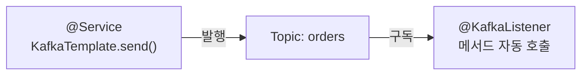

## 이제 애플리케이션에서 발행하고 소비하자

[Docker로 Kafka](/posts/kafka-docker-kraft/)를 띄웠으니, Spring Boot에서 메시지를 **발행(KafkaTemplate)** 하고 **소비(@KafkaListener)** 해봅니다. `spring-kafka`가 이 과정을 아주 단순하게 만들어줍니다.



## 의존성과 설정

```gradle
implementation 'org.springframework.kafka:spring-kafka'
```

```yaml
spring:
  kafka:
    bootstrap-servers: localhost:9092
    producer:
      key-serializer: org.apache.kafka.common.serialization.StringSerializer
      value-serializer: org.springframework.kafka.support.serializer.JsonSerializer
      acks: all                      # 안전하게
    consumer:
      group-id: order-service        # 컨슈머 그룹
      auto-offset-reset: earliest    # 처음 붙을 때 가장 오래된 것부터
      key-deserializer: org.apache.kafka.common.serialization.StringDeserializer
      value-deserializer: org.springframework.kafka.support.serializer.JsonDeserializer
    properties:
      spring.json.trusted.packages: "com.example.*"
```

## 발행: KafkaTemplate

```java
@Service
@RequiredArgsConstructor
public class OrderEventPublisher {
    private final KafkaTemplate<String, OrderEvent> kafkaTemplate;

    public void publish(OrderEvent event) {
        // 키(orderId)로 보내 같은 주문은 같은 파티션 → 순서 보장
        kafkaTemplate.send("orders", event.orderId(), event);
    }
}
```

[앞 글](/posts/kafka-producer-consumer-group/)에서 본 것처럼, **키를 주문 ID로** 지정해 같은 주문 이벤트의 순서를 보장합니다.

## 소비: @KafkaListener

```java
@Component
public class OrderEventConsumer {

    @KafkaListener(topics = "orders", groupId = "order-service")
    public void consume(OrderEvent event) {
        // 메시지 도착 시 자동 호출
        log.info("주문 이벤트 수신: {}", event.orderId());
        // ... 비즈니스 처리
    }
}
```

`@KafkaListener`만 붙이면 Spring이 컨슈머를 만들어 메시지를 메서드로 넘겨줍니다. 그룹을 다르게 주면 [독립적으로 같은 메시지를 받는](/posts/kafka-producer-consumer-group/) 또 다른 컨슈머가 됩니다.

## 신뢰성: 수동 커밋과 멱등성

기본은 자동 커밋이라 편하지만, "처리 실패 시 메시지 유실"을 막으려면 **처리 후 수동 커밋**(`ack-mode: manual`)을 씁니다. 이때는 **at-least-once**라 같은 메시지가 두 번 올 수 있으니, 소비 로직을 **멱등(idempotent)** 하게 짜야 합니다(예: 이벤트 ID로 중복 처리 방지).

```java
@KafkaListener(topics = "orders")
public void consume(OrderEvent event, Acknowledgment ack) {
    if (alreadyProcessed(event.eventId())) { ack.acknowledge(); return; }  // 멱등
    process(event);
    ack.acknowledge();   // 처리 완료 후 커밋
}
```

## 에러 처리와 재시도

`spring-kafka`는 재시도와 **DLT(Dead Letter Topic)** 를 기본 지원합니다. 계속 실패하는 메시지를 별도 토픽으로 보내, 전체 처리가 막히지 않게 합니다.

```java
@DltHandler
public void handleDlt(OrderEvent event) {
    log.error("처리 실패로 DLT 이동: {}", event.orderId());
}
```

## 정리

- 발행은 **`KafkaTemplate.send(topic, key, value)`**, 키로 순서 보장.
- 소비는 **`@KafkaListener`** + `groupId`. 그룹이 다르면 같은 메시지를 독립 수신.
- 신뢰성은 **수동 커밋 + 멱등 처리**(at-least-once)로.
- 실패 메시지는 **재시도/DLT**로 격리해 파이프라인을 보호하자.
