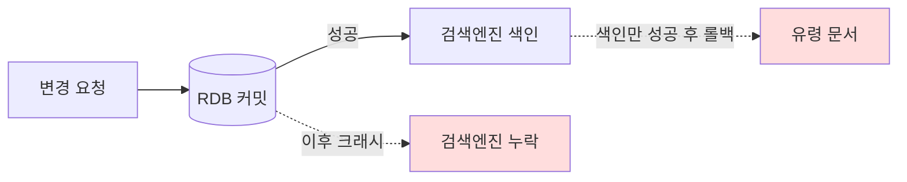

그 주엔 데이터를 관계형 DB에 저장하면서 동시에 검색엔진에도 색인해야 하는 기능을 다뤘다. 검색·필터·정렬은 검색엔진이 압도적으로 빠르지만, 데이터의 진실은 여전히 RDB에 있다. 그래서 한 번의 변경을 **두 저장소에 모두 반영**해야 한다. 이게 "이중 쓰기(dual write)"이고, 분산 데이터의 가장 흔하고 위험한 함정이다.

## 이중 쓰기가 왜 위험한가

두 저장소에 순차로 쓴다고 하자.

```java
@Transactional
public void updateProduct(Product p) {
    productRepository.save(p);     // 1. RDB 커밋
    searchClient.index("product", p.getId(), toDoc(p)); // 2. 검색엔진 색인
}
```

이 코드엔 정합이 깨지는 창이 최소 두 군데다. (1) RDB는 커밋됐는데 색인 직전에 애플리케이션이 죽거나 검색엔진이 일시 장애면, **DB에는 있고 검색엔진엔 없다.** (2) `@Transactional` 안에서 색인을 먼저 하고 DB 커밋이 롤백되면, **검색엔진엔 있는데 DB엔 없다.** 두 저장소에 걸친 단일 원자적 커밋은 존재하지 않는다. 2단계 커밋(XA)은 검색엔진이 지원하지 않고, 지원해도 운영 비용이 크다.



핵심 인식의 전환은 이것이다. **강한 일관성을 포기하고, 결국 맞춰지는 최종 일관성(eventual consistency)을 목표로 한다.** 검색엔진은 "RDB의 읽기 최적화 복제본"일 뿐이며, 잠깐 어긋나도 결국 따라잡으면 된다.

## 완화책 세 가지

**1) 커밋 이후에만 색인한다.** 색인은 트랜잭션 안이 아니라 **커밋 성공이 확정된 뒤** 실행해야 유령 문서를 막는다. Spring이라면 `@TransactionalEventListener(phase = AFTER_COMMIT)`로 커밋 직후에 색인 이벤트를 받는다.

```java
@Transactional
public void updateProduct(Product p) {
    productRepository.save(p);
    events.publishEvent(new ProductChanged(p.getId())); // 발행만
}

@TransactionalEventListener(phase = AFTER_COMMIT)
public void onProductChanged(ProductChanged e) {
    Product p = productRepository.findById(e.id()).orElseThrow();
    searchClient.index("product", p.getId(), toDoc(p)); // 커밋 후 색인
}
```

**2) 색인 실패를 재시도한다.** 검색엔진이 잠깐 죽어 색인이 실패해도 DB는 이미 커밋됐다. 실패를 삼키면 영구히 어긋난다. 색인 작업을 재시도 큐에 넣거나, 실패한 id를 "재색인 대기" 테이블에 적재해 배치가 주워가게 한다.

**3) 주기적 재동기화(full re-sync)로 드리프트를 청소한다.** 아무리 막아도 장기간 누적되는 미세한 드리프트는 생긴다. RDB를 진실의 원천으로 삼아 변경분(또는 전체)을 주기적으로 다시 색인하는 배치를 둔다. 이 배치가 있어야 "결국 일관성"이 보장된다.

```java
// 마지막 동기화 시점 이후 변경분만 재색인
List<Product> changed = productRepository.findUpdatedAfter(lastSyncedAt);
for (Product p : changed) {
    searchClient.index("product", p.getId(), toDoc(p));
}
```

## 운영 함정

**순서 역전(out-of-order) 갱신**이 가장 골치 아프다. 같은 문서에 대해 두 변경 이벤트가 거의 동시에 발생하면, 늦게 출발한 색인이 먼저 도착해 **오래된 값이 최신 값을 덮어쓸 수 있다.** 검색엔진의 외부 버전(external version)이나 `if_seq_no`로 낙관적 동시성 제어를 걸거나, 색인 시 항상 DB에서 **최신 상태를 다시 읽어** 문서를 통째로 구성하면(앞 예시처럼 `findById` 후 색인) 부분 갱신 경합을 피할 수 있다.

## 핵심 요약

- 이중 쓰기는 원자적이지 않다. 강한 일관성 대신 최종 일관성을 목표로 설계한다.
- 색인은 트랜잭션 커밋 이후에 실행한다(`AFTER_COMMIT`). 트랜잭션 안 색인은 유령 문서를 만든다.
- 실패 재시도 + 주기적 재동기화 + 순서 역전 방어, 이 세 겹이 갖춰져야 "결국 맞는다".
- Q: "검색엔진과 DB가 잠깐 다르면 안 되나?" → A: 검색엔진은 읽기 복제본이다. 짧은 불일치를 허용하되 재동기화로 반드시 수렴시키는 것이 현실적이다.
