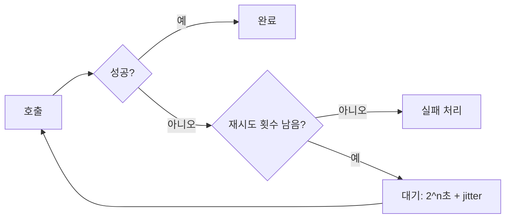

외부 시스템 연동을 다룬 주였다. 외부 API에 관한 단 하나의 진실은 이것이다 — **그것은 언젠가 느려지거나 죽는다.** 내 코드가 완벽해도 상대 서버는 통제 밖이다. 그러니 "정상 응답"이 아니라 "지연·실패"를 전제로 호출을 설계해야 한다.

## 타임아웃 — 무한 대기를 끊는다

가장 위험한 건 실패가 아니라 **응답 없는 지연**이다. 외부 서버가 응답을 안 주면 내 스레드는 그 커넥션을 붙잡고 무한정 기다린다. 동시 호출이 쌓이면 스레드 풀이 고갈되고, 무관한 다른 요청까지 처리 못 해 **장애가 전파**된다. 외부 한 곳의 지연이 내 서비스 전체를 멈추게 한다.

그래서 타임아웃은 선택이 아니다. 두 가지를 모두 건다.

- **connect timeout**: 연결 수립까지의 한계. 상대가 죽었으면 빨리 포기.
- **read timeout**: 연결 후 응답 바이트를 기다리는 한계. 느린 응답을 끊음.

```java
// 둘 다 명시. 기본값 무한대인 클라이언트가 많다 — 반드시 설정한다.
RestTemplate rt = new RestTemplateBuilder()
    .setConnectTimeout(Duration.ofSeconds(2))
    .setReadTimeout(Duration.ofSeconds(3))
    .build();
```

## 재시도 + 지수 백오프

일시적 실패(순간 네트워크 흔들림, 상대의 일시적 503)는 재시도하면 성공할 수 있다. 단, 즉시 연달아 재시도하면 이미 힘든 상대를 더 때려 상황을 악화시킨다(thundering herd). 그래서 **지수 백오프(exponential backoff)**로 간격을 1초 → 2초 → 4초처럼 늘리고, 여기에 **지터(jitter, 무작위 흔들기)**를 더해 여러 클라이언트가 동시에 몰리는 것을 막는다.



```java
// 최대 3회, 지수 백오프
RetryTemplate retry = RetryTemplate.builder()
    .maxAttempts(3)
    .exponentialBackoff(1000, 2.0, 8000) // 초기 1s, 배수 2, 최대 8s
    .retryOn(ResourceAccessException.class)  // 타임아웃 등만 재시도
    .build();
PaymentResult r = retry.execute(ctx -> client.call(req));
```

재시도 대상도 골라야 한다. 4xx(잘못된 요청)는 재시도해도 똑같이 실패한다. 타임아웃·5xx 같은 **일시적 오류**만 재시도하고, 횟수 상한을 둬 무한 재시도를 막는다.

## 멱등성 — 가장 위험한 함정

재시도의 함정은 "요청은 도달했는데 응답만 못 받은" 경우다. 결제·주문 생성처럼 **멱등하지 않은(non-idempotent)** 호출을 이때 재시도하면 **이중 결제·중복 주문**이 난다. 상대는 이미 처리했는데 나는 실패로 알고 또 보낸 것이다.

해법은 멱등성 보장이다. 클라이언트가 요청마다 고유한 **idempotency key**를 부여하고, 상대 서버가 같은 키의 중복 요청을 한 번만 처리하게 한다. 멱등성이 보장되지 않는 호출은 함부로 자동 재시도하지 않는다 — 이게 핵심이다.

## 운영 함정

- **타임아웃 미설정**: 많은 HTTP 클라이언트의 기본 타임아웃은 무한대다. 설정 안 하면 평소엔 멀쩡하다가 상대 장애 시 스레드 풀이 통째로 잠긴다.
- **read timeout = 전체 시간 착각**: read timeout은 "바이트 간 간격"이라 응답이 찔끔찔끔 오면 전체 시간은 더 길어질 수 있다. 필요하면 전체 호출 시간 상한을 따로 건다.

## 핵심 요약

- 외부 호출엔 connect/read 타임아웃을 항상 명시해 무한 대기와 장애 전파를 막는다.
- 일시적 실패만 지수 백오프 + 지터로, 횟수 상한을 두고 재시도한다.
- 멱등하지 않은 호출은 idempotency key 없이 재시도하지 않는다 — 중복 처리 위험.
