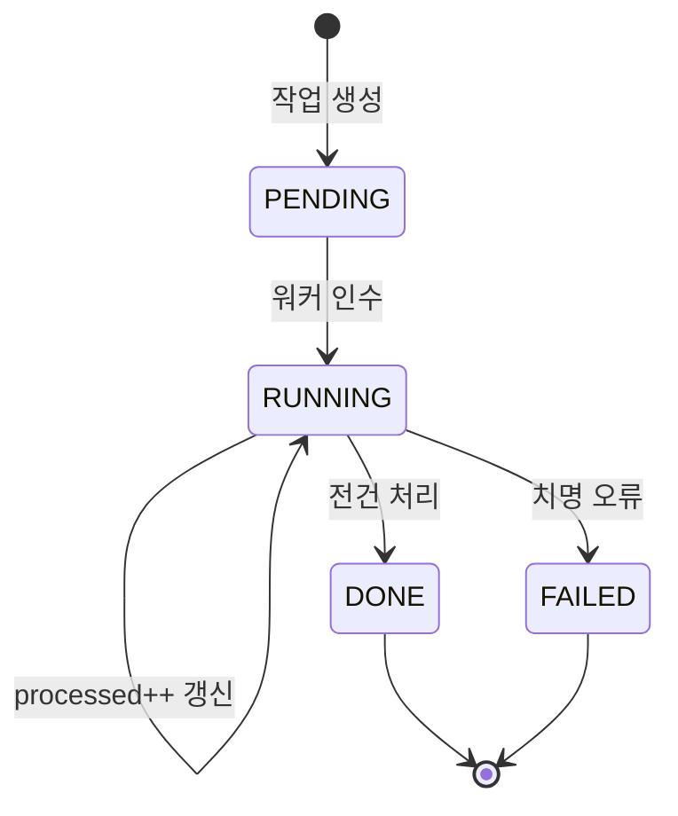

그 주엔 다량의 레코드를 키워드로 매핑하는 작업을 다뤘다. 수천 건을 순회하며 매칭하는 일은 동기로 돌리면 화면이 수십 초간 멈추고, 그 사이 다른 운영자가 같은 버튼을 또 누르면 동일 작업이 중복으로 돈다. 핵심 지식은 "장기 작업을 백그라운드로 떼되, **진행 상태를 관측 가능하게** 만들고 **중복 실행을 막는** 설계"다. 단순히 비동기로 던지는 것과는 다른 문제다.

## 장기 잡의 세 가지 요구

비동기로 떼는 순간 작업은 요청-응답 사이클 밖으로 사라진다. 그래서 다음 세 가지가 추가로 필요해진다.

1. **관측성** — 지금 몇 건 처리했고 몇 건 남았으며 몇 건 실패했는가.
2. **중복 방지** — 같은 작업이 동시에 두 번 돌지 않게.
3. **결과 회수** — 완료/실패를 어떻게 확인하는가.

이를 위해 작업 자체를 **하나의 영속 엔티티(Job)**로 모델링한다. 메모리에만 상태를 두면 서버 재시작에 날아가고, 여러 인스턴스에서 공유도 안 된다.

```java
@Entity
public class MappingJob {
    @Id @GeneratedValue Long id;
    @Enumerated(EnumType.STRING) JobStatus status; // PENDING/RUNNING/DONE/FAILED
    int total;
    int processed;
    int failed;
    String jobKey;       // 중복 판정용 논리 키
    Instant startedAt;
    Instant finishedAt;
}
```



## 진행률을 어떻게 적재하는가

진행률을 한 건마다 DB에 쓰면 수천 번의 UPDATE가 발생해 작업보다 갱신이 더 비싸진다. **배치 단위로 누적 후 주기적으로 flush**한다. 예를 들어 100건마다, 또는 1초마다 한 번 `processed`를 갱신한다.

```java
@Async("bulkExecutor")
public void runMapping(Long jobId, List<Long> targetIds) {
    jobRepository.markRunning(jobId, targetIds.size());
    int processed = 0, failed = 0;
    for (Long id : targetIds) {
        try {
            mapKeywords(id);
        } catch (Exception e) {
            failed++;
            log.warn("매핑 실패 id={}", id, e);
        }
        processed++;
        if (processed % 100 == 0) {        // 100건마다만 flush
            jobRepository.updateProgress(jobId, processed, failed);
        }
    }
    jobRepository.finish(jobId, processed, failed); // 마지막 한 번
}
```

운영자 화면은 `GET /jobs/{id}`로 `processed / total`을 폴링해 진행 막대를 그린다. 작업 로그(실패 건 목록)를 따로 적재하면 어떤 레코드가 왜 실패했는지 사후에 들여다볼 수 있다.

## 중복 실행을 막는 잠금

진짜 어려운 건 중복 방지다. 두 요청이 거의 동시에 들어오면 둘 다 "실행 중인 작업 없음"을 보고 둘 다 시작할 수 있다(경합). 안전한 방법은 **DB 유니크 제약**으로 중복을 원천 차단하는 것이다.

```sql
-- 같은 jobKey의 미완료 작업은 단 하나만 존재 가능
CREATE UNIQUE INDEX uq_active_job
  ON mapping_job (job_key)
  WHERE status IN ('PENDING', 'RUNNING');  -- 부분 인덱스
```

```java
try {
    MappingJob job = jobRepository.save(newPendingJob(jobKey));
    bulkService.runMapping(job.getId(), targetIds);
    return job.getId();
} catch (DataIntegrityViolationException e) {
    throw new ConflictException("이미 진행 중인 작업이 있다");
}
```

애플리케이션 레벨의 `if (exists) return` 체크는 검사와 삽입 사이에 경합 창이 있어 새는 반면, 유니크 제약은 DB가 원자적으로 보장한다. 분산 환경이라면 같은 효과를 Redis `SETNX` 같은 분산 락으로도 낼 수 있다.

## 운영 함정

**고아 잡(orphaned job)**을 조심해야 한다. 워커가 `RUNNING` 상태로 작업을 잡은 채 서버가 죽으면, 그 잡은 영영 `RUNNING`으로 남아 유니크 제약 때문에 재실행조차 막는다. **하트비트(마지막 갱신 시각)**를 두고, 일정 시간 갱신이 없는 `RUNNING` 잡은 스케줄러가 `FAILED`로 거둬들여 다시 시작할 수 있게 해야 한다.

## 핵심 요약

- 장기 잡은 영속 엔티티로 모델링한다. 상태를 메모리에 두면 재시작·다중 인스턴스에서 깨진다.
- 진행률은 건별이 아니라 배치 단위로 flush해 갱신 비용을 줄인다.
- 중복 실행은 애플리케이션 체크가 아니라 DB 유니크 제약(또는 분산 락)으로 원자적으로 막는다.
- Q: "in-memory 플래그로 중복을 막으면 안 되나?" → A: 검사-실행 사이 경합과 서버 재시작·다중 인스턴스를 못 막는다. 영속 + 유니크 제약이 안전하다.
