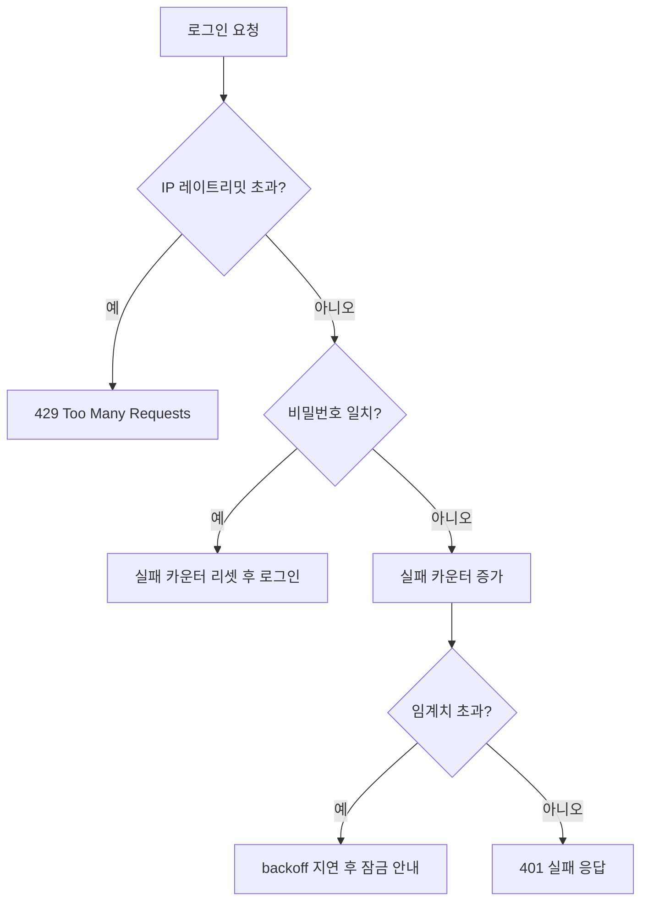

로그인 시도 횟수에 제한을 거는 일을 한 주가 있었다. 단순해 보이지만, 막무가내로 잠그면 공격자가 멀쩡한 사용자의 계정을 잠가버리는 새로운 공격 표면이 열린다. 무차별 대입(brute force) 방어의 본질은 **공격 비용은 올리되 정상 사용자 비용은 올리지 않는 균형**이다.

## 왜 제한이 필요한가

비밀번호는 결국 추측 가능한 비밀이다. 초당 수천 번 시도할 수 있다면 흔한 비밀번호는 분 단위로 뚫린다. 핵심은 **시도당 시간 비용**을 강제로 늘려 추측을 경제적으로 불가능하게 만드는 것이다.

방어 수단은 세 층위로 나뉜다.

1. **레이트리밋** — 단위 시간당 시도 횟수 상한. IP 기준, 계정 기준 둘 다 필요하다. IP만 보면 분산 공격에 뚫리고, 계정만 보면 한 IP가 여러 계정을 훑는 크리덴셜 스터핑을 못 막는다.
2. **점증 지연(exponential backoff)** — 실패가 누적될수록 응답을 점점 늦춘다. 1·2·4·8초… 정상 사용자는 거의 체감 못 하지만 자동화 공격에는 치명적이다.
3. **계정 잠금** — 임계치 초과 시 일시 잠금. 단, 영구 잠금은 위험하다.

## 락아웃 DoS의 함정

가장 흔한 실수가 "5회 실패 시 계정 영구 잠금"이다. 공격자가 피해자의 이메일만 알면, 일부러 5번 틀려 **정상 사용자를 로그인 불가 상태로 만든다.** 이것이 락아웃 DoS다.

해법은 영구 잠금 대신 **시간 기반 일시 잠금 + 점증 지연**이다. 그리고 잠금 카운터는 계정 단위와 함께 IP·디바이스 단위로 분산해, 한 공격원이 계정 전체를 잠그지 못하게 한다.



## 코드 예시

실패 횟수에 따라 지연을 곱하고, 일정 시간 윈도 안에서만 카운트하는 구조다.

```java
public LoginResult authenticate(String username, String rawPassword, String clientIp) {
    if (rateLimiter.isBlocked(clientIp)) {
        throw new TooManyAttemptsException("잠시 후 다시 시도하세요");
    }

    int fails = attemptStore.getFailCount(username); // TTL 윈도 내 실패 수
    // 점증 지연: 자동화 공격 비용을 키운다
    if (fails >= SOFT_THRESHOLD) {
        long delayMs = Math.min((1L << (fails - SOFT_THRESHOLD)) * 1000, MAX_DELAY_MS);
        sleepQuietly(delayMs);
    }

    User user = userRepository.findByUsername(username);
    boolean ok = user != null && passwordEncoder.matches(rawPassword, user.getPasswordHash());

    if (!ok) {
        attemptStore.increment(username, WINDOW_TTL);   // 윈도 만료 시 자동 리셋
        rateLimiter.record(clientIp);
        throw new BadCredentialsException();
    }

    attemptStore.reset(username);
    return LoginResult.success(user);
}
```

여기서 `attemptStore`는 TTL이 있는 캐시/Redis가 적합하다. DB 컬럼에 카운트를 누적하면 매 시도가 쓰기 트랜잭션이 되어 부하가 되고, 윈도 만료 처리도 번거롭다.

## 운영 함정

- **사용자 존재 여부 노출**: "없는 아이디"와 "틀린 비밀번호"를 다른 메시지/응답시간으로 구분하면, 공격자가 유효 계정을 열거할 수 있다. 메시지와 응답 시간을 동일하게 맞춰야 한다.
- **성공 시 카운터 리셋 누락**: 정상 로그인했는데 카운터가 남아 다음번에 곧장 지연이 걸리는 버그가 흔하다. 성공 경로에서 반드시 리셋한다.

## 핵심 요약

- 레이트리밋은 IP와 계정 **둘 다** 기준으로 건다.
- 영구 잠금은 락아웃 DoS를 부른다 — 시간 기반 일시 잠금 + 점증 지연을 쓴다.
- 카운터는 TTL 기반 저장소에 두고, 로그인 성공 시 반드시 리셋한다.
- 면접 한 줄: "계정 잠금의 부작용은?" → "공격자가 남의 계정을 잠그는 락아웃 DoS. 그래서 일시 잠금과 점증 지연을 쓴다."
