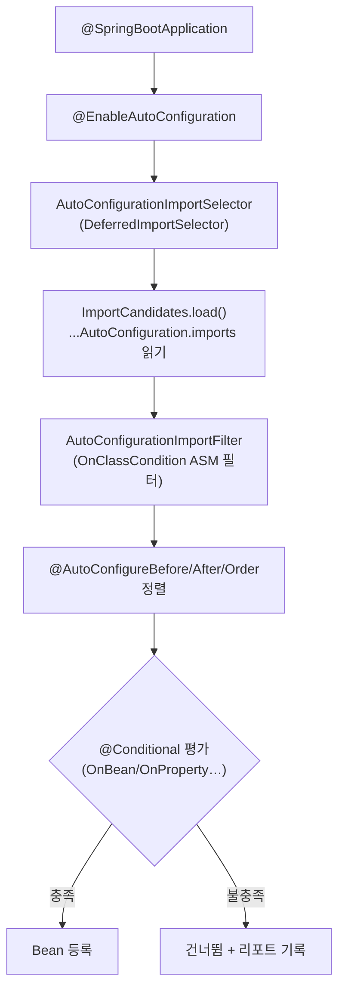

## "아무것도 설정 안 했는데 왜 되지?"

순수 Spring으로 웹 애플리케이션을 만들던 시절엔 `DispatcherServlet`, `DataSource`, `EntityManagerFactory`, 메시지 컨버터까지 전부 직접 등록해야 했습니다. 그런데 Spring Boot는 `spring-boot-starter-web` 의존성 하나면 톰캣이 뜨고 JSON 직렬화가 되고 에러 페이지까지 나옵니다.

이걸 "마법"으로 남겨두면 두 가지 순간에 반드시 무너집니다. **(1) 내가 등록한 Bean이 무시될 때**, **(2) 기대한 자동 구성이 안 걸릴 때.** 이 글의 목표는 자동 구성을 "이름은 아는 블랙박스"에서 "로그를 읽고 직접 작성·디버깅할 수 있는 메커니즘"으로 바꾸는 것입니다. 그래서 개념 소개에서 멈추지 않고 **어떤 클래스가, 어떤 순서로, 왜 그렇게** 동작하는지까지 내려갑니다.

## 한눈에 보는 전체 파이프라인

수백 개의 자동 구성 후보가 **로드 → 필터 → 평가**를 거쳐 일부만 Bean으로 등록되고, 조건이 안 맞는 나머지는 도중에 탈락합니다. 글로 읽기 전에, 그 흐름을 움직임으로 먼저 느껴 보세요 — <span style="color:#2f9e44;font-weight:600">초록</span>은 끝까지 통과한 후보, <span style="color:#e03131;font-weight:600">빨강</span>은 ASM 필터에서 떨어지는 후보입니다.

<div class="ac-pipeline" markdown="0">
<style>
.ac-pipeline{margin:1.4rem 0;overflow-x:auto}
.ac-pipeline svg{width:100%;max-width:720px;height:auto;display:block;margin:0 auto;font-family:inherit}
.ac-pipeline .lbl{fill:currentColor;font-size:13px;font-weight:600}
.ac-pipeline .sub{fill:currentColor;font-size:9.5px;opacity:.55}
.ac-pipeline .arr{stroke:currentColor;opacity:.35;stroke-width:1.5;fill:none}
.ac-pipeline rect.box{fill:none;stroke:currentColor;stroke-width:1.5;opacity:.35}
.ac-pipeline rect.b1{animation:acpulse 4s ease-in-out infinite}
.ac-pipeline rect.b2{animation:acpulse 4s ease-in-out infinite .9s}
.ac-pipeline rect.b3{animation:acpulse 4s ease-in-out infinite 1.8s}
.ac-pipeline rect.b4{animation:acpulse 4s ease-in-out infinite 2.7s}
.ac-pipeline circle.tok{fill:#2f9e44}
.ac-pipeline circle.t1{animation:acflow 4s linear infinite}
.ac-pipeline circle.t2{animation:acflow 4s linear infinite 1.3s}
.ac-pipeline circle.t3{animation:acflow 4s linear infinite 2.6s}
.ac-pipeline circle.rej{fill:#e03131;animation:acreject 4s linear infinite .5s}
@keyframes acflow{0%{transform:translateX(0);opacity:0}6%{opacity:1}94%{opacity:1}100%{transform:translateX(620px);opacity:0}}
@keyframes acreject{0%{transform:translate(0,0);opacity:0}12%{opacity:1}42%{transform:translate(230px,0);opacity:1}60%{transform:translate(230px,78px);opacity:0}100%{opacity:0}}
@keyframes acpulse{0%,100%{opacity:.3}50%{opacity:.9}}
</style>
<svg viewBox="0 0 700 180" role="img" aria-label="자동 구성 후보가 로드·필터·평가를 거쳐 일부만 Bean으로 등록되는 흐름 애니메이션">
  <rect class="box b1" x="8"   y="40" width="140" height="64" rx="8"/>
  <rect class="box b2" x="188" y="40" width="140" height="64" rx="8"/>
  <rect class="box b3" x="368" y="40" width="140" height="64" rx="8"/>
  <rect class="box b4" x="548" y="40" width="140" height="64" rx="8"/>
  <text class="lbl" x="78"  y="68" text-anchor="middle">imports 로드</text>
  <text class="sub" x="78"  y="84" text-anchor="middle">수백 개 후보</text>
  <text class="lbl" x="258" y="68" text-anchor="middle">ASM 필터</text>
  <text class="sub" x="258" y="84" text-anchor="middle">OnClassCondition</text>
  <text class="lbl" x="438" y="68" text-anchor="middle">@Conditional</text>
  <text class="sub" x="438" y="84" text-anchor="middle">OnBean / OnProperty</text>
  <text class="lbl" x="618" y="68" text-anchor="middle">Bean 등록</text>
  <text class="sub" x="618" y="84" text-anchor="middle">컨텍스트 반영</text>
  <line class="arr" x1="148" y1="72" x2="188" y2="72"/>
  <line class="arr" x1="328" y1="72" x2="368" y2="72"/>
  <line class="arr" x1="508" y1="72" x2="548" y2="72"/>
  <circle class="tok t1"  cx="20" cy="72" r="7"/>
  <circle class="tok t2"  cx="20" cy="72" r="7"/>
  <circle class="tok t3"  cx="20" cy="72" r="7"/>
  <circle class="tok rej" cx="20" cy="72" r="7"/>
</svg>
</div>

조금 더 정적으로, 어떤 클래스가 각 단계에 관여하는지까지 보면 이렇습니다.



핵심은 세 단계입니다. **후보 로드 → 빠른 필터링 → 조건 평가**. 각 단계가 왜 분리되어 있는지가 이 글의 본론입니다.

## 1단계: 후보는 어디서 오나 — `imports` 파일과 `DeferredImportSelector`

`@SpringBootApplication` 안에는 `@EnableAutoConfiguration`이 들어 있고, 이건 `@Import(AutoConfigurationImportSelector.class)`를 품고 있습니다. 이 셀렉터가 후보 목록을 읽어옵니다.

목록의 위치는 버전에 따라 다릅니다.

| 버전 | 위치 | 비고 |
|------|------|------|
| ~2.7 | `META-INF/spring.factories` (`EnableAutoConfiguration` 키) | deprecated |
| 2.7~3.x | `META-INF/spring/org.springframework.boot.autoconfigure.AutoConfiguration.imports` | 한 줄에 한 클래스 |
| 4.x | 위와 동일 + 모듈 분할 | 거대 단일 `spring-boot-autoconfigure`가 기능별 jar로 쪼개짐 |

여기서 첫 번째 "왜"가 나옵니다. `AutoConfigurationImportSelector`는 평범한 `ImportSelector`가 아니라 **`DeferredImportSelector`** 입니다. 일반 `@Configuration`과 `@Import`가 **전부 처리된 뒤**에 마지막으로 실행된다는 뜻입니다.

> **이게 자동 구성의 가장 중요한 설계 결정입니다.** 자동 구성이 항상 *맨 나중에* 돌기 때문에, 내가 직접 정의한 Bean은 이미 컨테이너에 등록된 상태입니다. 그래서 `@ConditionalOnMissingBean`이 "사용자가 안 만들었을 때만 기본값 제공"을 **신뢰성 있게** 보장할 수 있습니다. 이 순서가 없으면 자동 구성과 내 설정이 등록 순서에 따라 무작위로 충돌합니다.

### 소스 한 겹 더: `selectImports`의 실제 흐름

`AutoConfigurationImportSelector`가 후보를 만들어 내는 경로를 메서드 단위로 따라가면 이렇습니다.

```text
selectImports()
 └─ getAutoConfigurationEntry()
     ├─ getCandidateConfigurations()     // imports 파일에서 전체 후보 로드
     ├─ removeDuplicates()
     ├─ getExclusions() → 제외 적용       // exclude / spring.autoconfigure.exclude
     ├─ getConfigurationClassFilter()
     │    .filter()                       // ★ AutoConfigurationImportFilter (ASM 1차 필터)
     └─ fireAutoConfigurationImportEvents()
```

즉 우리가 본 "필터 → 평가"는 추상적인 비유가 아니라 `getAutoConfigurationEntry()` 한 메서드 안의 실제 호출 순서입니다. 이 메서드에 브레이크포인트를 걸고 후보 리스트가 수백 개 → 수십 개로 줄어드는 걸 직접 보면, 그 다음부터는 자동 구성이 더 이상 마법으로 보이지 않습니다.

## 2단계: 클래스 로딩 없이 거르기 — ASM 기반 빠른 필터

후보가 수백 개입니다. 각 후보의 `@ConditionalOnClass`를 진짜로 평가하려면 그 클래스를 로딩해야 하고, 없는 클래스를 참조하면 `ClassNotFoundException`이 터집니다. 후보 전부를 로딩하면 **시작 시간이 무너집니다.**

Spring Boot는 이를 두 가지 트릭으로 해결합니다.

1. **`AutoConfigurationImportFilter` (`OnClassCondition`)** 가 본격적인 조건 평가 *이전에* 후보를 1차로 거릅니다.
2. 이 필터는 클래스를 JVM에 로딩하지 않고 **ASM 바이트코드 리딩**으로 애너테이션 메타데이터만 읽습니다. 그리고 컴파일 타임에 생성된 **`META-INF/spring-autoconfigure-metadata.properties`** 를 참고해, "이 자동 구성은 X 클래스가 있어야 함" 같은 조건을 클래스 로딩 없이 판단합니다.

결과적으로 클래스패스에 없는 자동 구성은 *로딩되기도 전에* 탈락합니다. "왜 이렇게까지?"의 답은 **시작 성능**입니다. 이 필터가 없으면 starter 수십 개를 쓰는 앱의 부팅이 눈에 띄게 느려집니다.

## 3단계: 본 조건 평가 — `@Conditional` 패밀리

필터를 통과한 후보만 실제 `@Conditional` 평가로 들어갑니다.

```java
@AutoConfiguration
@ConditionalOnClass(DataSource.class)
@EnableConfigurationProperties(DataSourceProperties.class)
public class DataSourceAutoConfiguration {

    @Bean
    @ConditionalOnMissingBean        // 내가 DataSource를 직접 등록 안 했다면
    public DataSource dataSource(DataSourceProperties properties) {
        return properties.initializeDataSourceBuilder().build();
    }
}
```

자주 쓰는 조건들:

| 애너테이션 | 의미 | 평가 주체 |
|-----------|------|----------|
| `@ConditionalOnClass` / `OnMissingClass` | 클래스패스 존재 여부 | `OnClassCondition` (ASM) |
| `@ConditionalOnBean` / `OnMissingBean` | 같은 타입 Bean 존재 여부 | `OnBeanCondition` |
| `@ConditionalOnProperty` | 설정값 일치 | `OnPropertyCondition` |
| `@ConditionalOnWebApplication` | 웹/서블릿/리액티브 타입 | `OnWebApplicationCondition` |
| `@ConditionalOnMissingBean` | (위와 동일) | `OnBeanCondition` |

`@AutoConfiguration`(2.7+)은 단순한 마커가 아닙니다. 내부적으로 `@Configuration(proxyBeanMethods = false)` 를 의미하고(자동 구성 클래스끼리는 서로의 `@Bean` 메서드를 직접 호출하지 않으므로 CGLIB 프록시가 불필요 → 시작 비용 절약), `@AutoConfigureBefore/After/Order` 메타데이터를 붙일 수 있게 해줍니다.

## 가장 흔한 프로덕션 버그: `@ConditionalOnBean` 순서 함정

`@ConditionalOnBean`/`@ConditionalOnMissingBean`은 **"평가 시점까지 등록된 Bean만"** 봅니다. 사용자 설정 대비로는 안전(자동 구성이 마지막에 도니까)하지만, **자동 구성끼리는 위험**합니다.

```java
@AutoConfiguration
public class MyClientAutoConfiguration {
    @Bean
    @ConditionalOnBean(ObjectMapper.class)   // ObjectMapper가 "먼저" 등록돼야 함
    MyClient myClient(ObjectMapper mapper) { ... }
}
```

`JacksonAutoConfiguration`보다 이 클래스가 먼저 평가되면 `ObjectMapper`가 아직 없어서 `myClient`가 조용히 사라집니다. 로그에 예외도 없습니다. **순서를 명시해야 합니다.**

```java
@AutoConfiguration(after = JacksonAutoConfiguration.class)
public class MyClientAutoConfiguration { ... }
```

이게 자동 구성 디버깅의 절반입니다. "분명 starter 넣었는데 Bean이 없다"의 상당수가 이 순서 문제입니다.

## 무엇이 적용됐는지 — 디버깅 3종 세트

추측하지 말고 리포트를 보세요. 모두 같은 `ConditionEvaluationReport`를 다른 창구로 보여줍니다.

**(1) `--debug` 플래그** — 부팅 로그에 평가 리포트 전체 출력.

```bash
java -jar app.jar --debug
```

```text
Positive matches:
-----------------
   DataSourceAutoConfiguration matched:
      - @ConditionalOnClass found required class 'javax.sql.DataSource' (OnClassCondition)

Negative matches:
-----------------
   RabbitAutoConfiguration:
      Did not match:
      - @ConditionalOnClass did not find required class
        'com.rabbitmq.client.Channel' (OnClassCondition)
```

`Did not match`의 *이유*가 그대로 적혀 있습니다. "내가 기대한 자동 구성이 왜 안 걸렸지?"의 정답이 여기 있습니다.

**(2) Actuator 엔드포인트** — 런타임에 HTTP로 같은 리포트 조회.

```bash
curl localhost:8080/actuator/conditions | jq
```

**(3) 프로그래밍 방식 테스트** — `ApplicationContextRunner`로 자동 구성을 단위 테스트.

```java
@Test
void DataSource가_없으면_자동구성이_빠진다() {
    new ApplicationContextRunner()
        .withConfiguration(AutoConfigurations.of(DataSourceAutoConfiguration.class))
        .withClassLoader(new FilteredClassLoader(DataSource.class))   // 클래스패스에서 가림
        .run(ctx -> assertThat(ctx).doesNotHaveBean(DataSource.class));
}
```

내 라이브러리의 자동 구성을 만든다면, 이 러너가 "특정 조건에서 Bean이 뜬다/안 뜬다"를 검증하는 표준 도구입니다.

## 자동 구성 끄기 — 두 가지 방법, 다른 동작

```java
// 1) 코드로 제외 — 클래스 참조라 컴파일 타임 안전
@SpringBootApplication(exclude = DataSourceAutoConfiguration.class)
```

```yaml
# 2) 설정으로 제외 — 클래스패스에 없는 자동 구성도 문자열로 끌 수 있음
spring:
  autoconfigure:
    exclude:
      - org.springframework.boot.autoconfigure.jdbc.DataSourceAutoConfiguration
```

`exclude` 속성은 *클래스패스에 실제로 존재하는* 자동 구성에만 쓸 수 있어, 오타 시 부팅이 실패합니다(안전장치). 의존성으로만 들어와 직접 import 못 하는 경우엔 `spring.autoconfigure.exclude` 문자열을 씁니다.

## 내 라이브러리에 자동 구성 넣기 (스타터 만들기 미리보기)

```java
@AutoConfiguration
@ConditionalOnClass(MyService.class)
@EnableConfigurationProperties(MyProperties.class)
public class MyServiceAutoConfiguration {
    @Bean
    @ConditionalOnMissingBean
    MyService myService(MyProperties props) { return new MyService(props); }
}
```

그리고 등록 파일 한 줄:

```text
# src/main/resources/META-INF/spring/
#   org.springframework.boot.autoconfigure.AutoConfiguration.imports
com.example.MyServiceAutoConfiguration
```

⚠️ **자동 구성 클래스는 절대 `@ComponentScan` 대상 패키지에 두지 마세요.** 컴포넌트 스캔에 잡히면 조건 평가를 거치지 않고 무조건 등록되어, "선택적 기본값"이라는 설계 의도가 깨집니다.

## 면접/리뷰 단골 질문

- **Q. `@ConditionalOnMissingBean`이 항상 내 Bean을 우선하는 이유는?** → 자동 구성이 `DeferredImportSelector`라 사용자 설정 *이후*에 평가되기 때문. 순서가 보장의 근거다.
- **Q. 클래스패스에 없는 클래스를 참조하는 자동 구성이 왜 `ClassNotFoundException`을 안 내나?** → `OnClassCondition`이 ASM으로 메타데이터만 읽어 클래스 로딩 전에 거른다.
- **Q. starter를 넣었는데 Bean이 안 뜬다, 첫 디버깅은?** → `--debug` 또는 `/actuator/conditions`로 negative match 사유 확인. 십중팔구 `@ConditionalOnClass` 누락 또는 자동 구성 간 순서(`@AutoConfigureAfter`) 문제.

## 정리

- 자동 구성 = **후보 로드(imports) → ASM 빠른 필터 → `@Conditional` 평가**의 3단 파이프라인.
- `AutoConfigurationImportSelector`가 **`DeferredImportSelector`** 라 항상 마지막에 돈다 → `@ConditionalOnMissingBean`의 "내 Bean 우선" 보장의 근거.
- `OnClassCondition`은 **ASM + 컴파일타임 메타데이터**로 클래스 로딩 없이 걸러 시작 성능을 지킨다.
- 자동 구성 *끼리*의 `@ConditionalOnBean`은 순서에 취약 → `@AutoConfiguration(after = ...)`로 명시.
- 추측 금지: **`--debug` / `/actuator/conditions` / `ApplicationContextRunner`** 로 항상 근거를 보고 판단하자.

> 관련 글: 이 메커니즘의 출발점인 `@SpringBootApplication`은 [별도 글]()에서, 조건부 등록의 토대인 IoC/DI와 Bean 생명주기는 [이 글]()에서 다룹니다.
