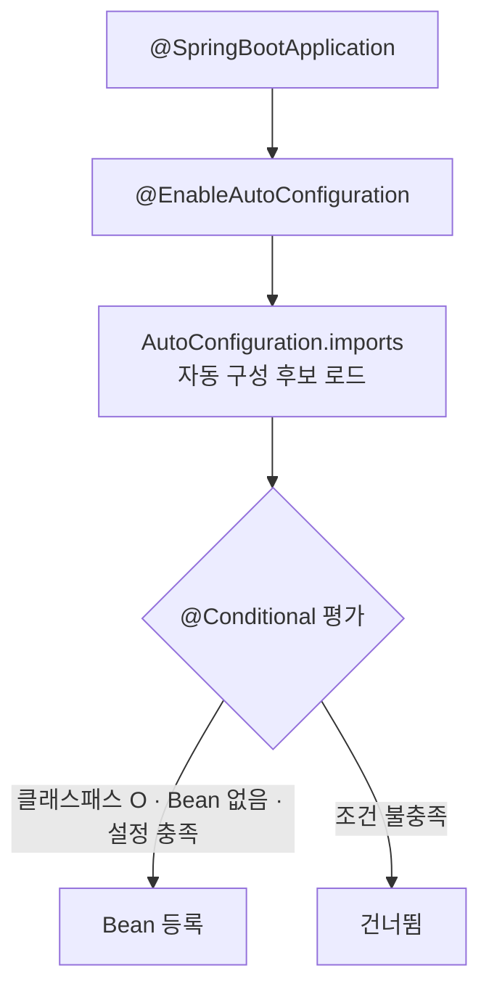

## "아무것도 설정 안 했는데 왜 되지?"

순수 Spring으로 웹 애플리케이션을 만들던 시절엔 `DispatcherServlet`, `DataSource`, `EntityManagerFactory`, 메시지 컨버터까지 전부 직접 등록해야 했습니다. XML이든 Java Config든, 보일러플레이트가 한가득이었죠.

그런데 Spring Boot는 `spring-boot-starter-web` 의존성 하나만 추가하면 톰캣이 뜨고, JSON 직렬화가 되고, 에러 페이지까지 알아서 나옵니다. 처음엔 "마법" 같았는데, 이 마법의 정체가 바로 **자동 구성(Auto-configuration)** 입니다. 원리를 알면 디버깅도, 커스터마이징도 훨씬 쉬워집니다.

## 핵심은 "조건부 Bean 등록"

자동 구성의 본질은 단순합니다. **"클래스패스에 무엇이 있고, 어떤 Bean이 아직 없고, 어떤 설정값이 있는지"** 를 보고 필요한 Bean을 조건적으로 등록해주는 것입니다.

이 조건 판단은 `@Conditional` 계열 애너테이션이 담당합니다.

- `@ConditionalOnClass`: 특정 클래스가 클래스패스에 있을 때만
- `@ConditionalOnMissingBean`: 같은 타입의 Bean이 아직 없을 때만 (그래서 내가 직접 정의하면 그게 우선)
- `@ConditionalOnProperty`: 특정 설정값이 있을 때만

```java
@AutoConfiguration
@ConditionalOnClass(DataSource.class)
public class DataSourceAutoConfiguration {

    @Bean
    @ConditionalOnMissingBean   // 내가 DataSource를 직접 등록하지 않았다면
    public DataSource dataSource(DataSourceProperties properties) {
        return properties.initializeDataSourceBuilder().build();
    }
}
```

`@ConditionalOnMissingBean` 덕분에 **"기본값은 제공하되, 사용자가 직접 정의하면 양보"** 하는 동작이 가능합니다. 우리가 커스텀 `DataSource`를 등록하면 자동 구성은 알아서 빠집니다.

## 자동 구성은 어디에 등록되어 있나

`@SpringBootApplication` 안에 들어 있는 `@EnableAutoConfiguration`이 시작점입니다. 이게 각 라이브러리의 자동 구성 목록을 불러옵니다.

목록의 위치는 버전에 따라 다릅니다.

- 과거(~2.7): `META-INF/spring.factories`
- 현재(3.x · 4.x): `META-INF/spring/org.springframework.boot.autoconfigure.AutoConfiguration.imports`

특히 **Spring Boot 4**부터는 거대한 단일 `spring-boot-autoconfigure` 모듈이 기능별 작은 모듈(jar)로 쪼개졌습니다. 필요한 것만 가져오게 되어 더 가볍고 명확해졌죠.

전체 흐름을 그림으로 보면 이렇습니다.



## 무엇이 적용됐는지 확인하기

"왜 이 Bean이 떴지/안 떴지"가 궁금할 때, 자동 구성 평가 리포트를 보면 됩니다.

```bash
java -jar app.jar --debug
```

실행 로그에 **Positive matches**(적용됨)와 **Negative matches**(조건 미충족)가 쭉 나옵니다. "내가 기대한 자동 구성이 왜 안 걸렸지?"를 추적할 때 가장 확실한 방법입니다.

특정 자동 구성을 끄고 싶다면 명시적으로 제외할 수 있습니다.

```java
@SpringBootApplication(exclude = DataSourceAutoConfiguration.class)
public class MyApplication { }
```

## 정리

- 자동 구성 = **클래스패스 + 기존 Bean 유무 + 설정값**을 보고 `@Conditional`로 Bean을 조건부 등록하는 메커니즘.
- `@ConditionalOnMissingBean` 때문에 내가 직접 정의한 Bean이 항상 우선한다.
- 후보 목록은 `AutoConfiguration.imports`에 있고, Spring Boot 4부터는 모듈이 잘게 쪼개졌다.
- 동작이 궁금하면 `--debug`로 자동 구성 리포트를 확인하자.
