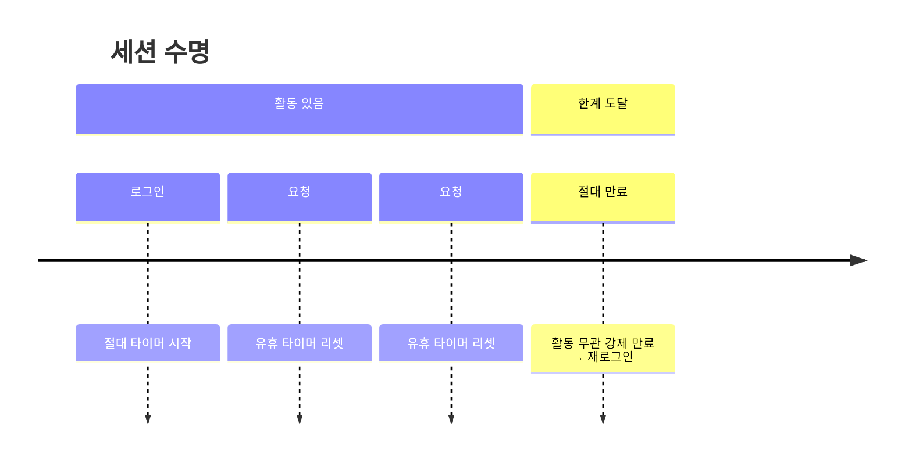

세션 유지 정책을 손본 주가 있었다. "얼마나 안 쓰면 로그아웃시킬 것인가"는 사용성과 보안의 정면 충돌 지점이다. 너무 짧으면 사용자가 계속 다시 로그인하고, 너무 길면 자리를 비운 사이 세션이 탈취된다. 제대로 설계하려면 **유휴 타임아웃과 절대 타임아웃을 분리**해야 한다.

## 두 가지 타임아웃

세션 수명을 결정하는 시계는 두 개다.

- **유휴 타임아웃(idle timeout)**: 마지막 활동으로부터 N분간 요청이 없으면 만료. 활동이 있을 때마다 리셋된다. "자리 비움"을 잡는다.
- **절대 타임아웃(absolute timeout)**: 로그인 시각으로부터 M시간이 지나면 활동 여부와 무관하게 무조건 만료. 갱신되지 않는다. "세션이 영원히 살아 탈취 창이 무한히 열리는 것"을 막는다.

유휴만 있으면 공격자가 탈취한 세션으로 계속 활동하는 한 영원히 유지된다. 그래서 절대 타임아웃이 안전장치로 필요하다.



## 내부 메커니즘

서버 세션은 보통 세션 ID를 쿠키로 주고, 서버는 세션 저장소에 `{lastAccessTime, creationTime}`을 들고 있다. 요청이 올 때마다:

1. 세션 ID로 저장소 조회.
2. `now - lastAccessTime > idleTimeout` → 만료 처리.
3. `now - creationTime > absoluteTimeout` → 만료 처리.
4. 둘 다 통과하면 `lastAccessTime = now`로 갱신.

여기서 핵심은 **절대 타임아웃은 `creationTime` 기준이라 절대 갱신하지 않는다는 점**이다. 갱신하는 순간 절대 타임아웃의 의미가 사라진다.

```java
public Optional<Session> validate(String sessionId, Instant now) {
    Session s = store.find(sessionId);
    if (s == null) return Optional.empty();

    boolean idleExpired = Duration.between(s.getLastAccess(), now).compareTo(IDLE_TTL) > 0;
    boolean absExpired  = Duration.between(s.getCreatedAt(), now).compareTo(ABS_TTL) > 0;

    if (idleExpired || absExpired) {
        store.delete(sessionId);     // 만료 세션은 즉시 폐기
        return Optional.empty();
    }
    s.setLastAccess(now);            // 유휴 타이머만 갱신, 생성 시각은 불변
    store.save(s);
    return Optional.of(s);
}
```

## 클라이언트 측 자동 로그아웃과 keepalive

서버가 만료시켜도 화면은 그대로라 사용자는 모른다. 그래서 클라이언트에서 유휴 타이머를 돌려 만료 직전에 경고 모달("곧 로그아웃됩니다")을 띄우고, 사용자가 계속하려면 가벼운 keepalive 요청으로 세션을 갱신한다. 단, keepalive를 자동·무한 반복하면 유휴 타임아웃이 무력화되므로 **사용자의 명시적 행동**에만 갱신해야 한다.

## 민감 작업 재인증

세션이 살아 있어도 비밀번호 변경·결제 같은 고위험 작업은 **방금 본인임**을 다시 확인해야 한다(step-up authentication). 세션에 `lastReauthAt`을 두고, 해당 작업 진입 시 일정 시간이 지났으면 비밀번호를 다시 요구한다. 이는 "로그인한 채 자리를 비운 화면을 누가 만진" 시나리오를 막는다.

## 운영 함정

- **로그아웃 시 서버 세션 미파기**: 클라이언트 쿠키만 지우고 서버 저장소의 세션을 안 지우면, 같은 ID를 들고 있는 누구든 계속 인증된다. 로그아웃은 반드시 서버 세션을 무효화해야 한다.
- **유휴 타임아웃을 매 정적 요청마다 갱신**: 이미지·폴링 같은 백그라운드 요청까지 활동으로 치면 사실상 만료되지 않는다. 의미 있는 사용자 행동만 갱신 대상으로 둔다.

## 핵심 요약

- 유휴 타임아웃은 활동마다 리셋, 절대 타임아웃은 생성 시각 기준 불변.
- 로그아웃은 서버 세션을 무효화해야 진짜 로그아웃이다.
- 민감 작업은 세션 유효성과 별개로 재인증(step-up)을 요구한다.
