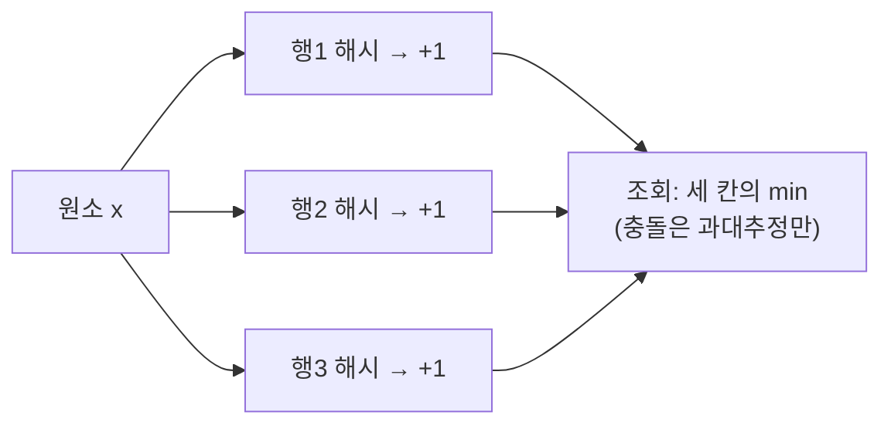

## "정확한 답"을 포기하면 메모리가 천 배 줄어든다

10억 개의 URL 중에 이 URL을 전에 본 적 있나? 방문자 1억 명 중 **유니크 방문자**는 몇 명인가? 검색어 스트림에서 이 단어가 몇 번 나왔나? 정직하게 풀면 전부 **모든 원소를 저장**해야 합니다 — `HashSet`에 10억 개를 담으면 수십 GB입니다.

확률적 자료구조는 다른 거래를 제안합니다. **"틀릴 확률을 아주 작게 통제하는 대신, 메모리를 수백~수천 배 줄인다."** 답이 가끔 틀리지만 *어떻게* 틀리는지가 명확하고(한 방향으로만 틀림), 그 오차율을 수식으로 조절할 수 있다는 게 핵심입니다. 이 글은 그중 가장 널리 쓰이는 셋 — **Bloom filter**(존재 여부), **HyperLogLog**(유니크 개수), **Count-Min Sketch**(빈도) — 를 다룹니다.

## Bloom Filter — "확실히 없음" 또는 "아마 있음"

블룸 필터는 `m`비트짜리 배열과 `k`개의 독립적인 [해시 함수]()로 만듭니다. 원소를 **추가**할 땐 `k`개 해시가 가리키는 `k`개의 비트를 모두 1로 켭니다. **조회**할 땐 그 `k`개 비트를 봅니다 — 하나라도 0이면 **확실히 없음**(추가됐다면 반드시 켜졌을 테니까), 전부 1이면 **아마 있음**(우연히 다 켜졌을 수도 있으니 거짓 양성 가능).

<div class="prob16bloom" markdown="0">
<style>
.prob16bloom{margin:1.4rem 0;overflow-x:auto}
.prob16bloom svg{width:100%;max-width:700px;height:auto;display:block;margin:0 auto;font-family:inherit}
.prob16bloom .lbl{fill:currentColor;font-size:11px;font-weight:600}
.prob16bloom .sub{fill:currentColor;font-size:9.5px;opacity:.6}
.prob16bloom .cell{fill:none;stroke:currentColor;stroke-width:1.3;opacity:.5}
.prob16bloom .on{fill:#2f9e44;opacity:0}
.prob16bloom .arr{stroke:#1971c2;stroke-width:1.6;opacity:0;fill:none}
.prob16bloom .key{fill:#1971c2;font-size:11px;font-weight:700;opacity:0}
.prob16bloom .verdict{font-size:12px;font-weight:700;opacity:0}
.prob16bloom .probe{stroke:#e03131;stroke-width:1.6;opacity:0;fill:none}
.prob16bloom .b2{animation:prob16on 9s ease-in-out infinite}
.prob16bloom .b7{animation:prob16on 9s ease-in-out infinite}
.prob16bloom .b11{animation:prob16on 9s ease-in-out infinite}
@keyframes prob16on{0%,8%{opacity:0}14%,100%{opacity:.85}}
.prob16bloom .ka{animation:prob16key1 9s ease-in-out infinite}
@keyframes prob16key1{0%{opacity:0}5%{opacity:1}30%{opacity:1}34%{opacity:0}100%{opacity:0}}
.prob16bloom .ar1{animation:prob16ar1 9s ease-in-out infinite}
@keyframes prob16ar1{0%,6%{opacity:0}10%,28%{opacity:.8}33%{opacity:0}100%{opacity:0}}
.prob16bloom .kb{animation:prob16key2 9s ease-in-out infinite}
@keyframes prob16key2{0%,40%{opacity:0}45%{opacity:1}66%{opacity:1}70%{opacity:0}100%{opacity:0}}
.prob16bloom .pr1{animation:prob16pr 9s ease-in-out infinite}
@keyframes prob16pr{0%,42%{opacity:0}48%,64%{opacity:.9}69%{opacity:0}100%{opacity:0}}
.prob16bloom .vmaybe{fill:#2f9e44;animation:prob16vm 9s ease-in-out infinite}
@keyframes prob16vm{0%,52%{opacity:0}58%,66%{opacity:1}70%{opacity:0}100%{opacity:0}}
.prob16bloom .kc{animation:prob16key3 9s ease-in-out infinite}
@keyframes prob16key3{0%,72%{opacity:0}77%,96%{opacity:1}100%{opacity:0}}
.prob16bloom .pr2{animation:prob16pr2 9s ease-in-out infinite}
@keyframes prob16pr2{0%,74%{opacity:0}80%,96%{opacity:.9}100%{opacity:0}}
.prob16bloom .vno{fill:#e03131;animation:prob16vn 9s ease-in-out infinite}
@keyframes prob16vn{0%,84%{opacity:0}89%,98%{opacity:1}100%{opacity:0}}
</style>
<svg viewBox="0 0 700 230" role="img" aria-label="블룸 필터에 원소를 추가하면 여러 해시가 가리키는 비트들이 켜지고, 조회 시 비트가 하나라도 0이면 확실히 없음, 전부 1이면 아마 있음으로 판정하는 애니메이션">
  <text class="key ka" x="40" y="36">apple 추가 →</text>
  <text class="key kb" x="40" y="36">apple 조회 →</text>
  <text class="key kc" x="40" y="36">grape 조회 →</text>
  <g>
    <rect class="cell" x="60"  y="90" width="34" height="34" rx="4"/>
    <rect class="cell" x="98"  y="90" width="34" height="34" rx="4"/>
    <rect class="cell" x="136" y="90" width="34" height="34" rx="4"/>
    <rect class="cell" x="174" y="90" width="34" height="34" rx="4"/>
    <rect class="cell" x="212" y="90" width="34" height="34" rx="4"/>
    <rect class="cell" x="250" y="90" width="34" height="34" rx="4"/>
    <rect class="cell" x="288" y="90" width="34" height="34" rx="4"/>
    <rect class="cell" x="326" y="90" width="34" height="34" rx="4"/>
    <rect class="cell" x="364" y="90" width="34" height="34" rx="4"/>
    <rect class="cell" x="402" y="90" width="34" height="34" rx="4"/>
    <rect class="cell" x="440" y="90" width="34" height="34" rx="4"/>
    <rect class="cell" x="478" y="90" width="34" height="34" rx="4"/>
    <rect class="cell" x="516" y="90" width="34" height="34" rx="4"/>
    <rect class="cell" x="554" y="90" width="34" height="34" rx="4"/>
  </g>
  <rect class="on b2"  x="136" y="90" width="34" height="34" rx="4"/>
  <rect class="on b7"  x="326" y="90" width="34" height="34" rx="4"/>
  <rect class="on b11" x="478" y="90" width="34" height="34" rx="4"/>
  <path class="arr ar1" d="M120,52 L153,88"/>
  <path class="arr ar1" d="M150,52 L343,88"/>
  <path class="arr ar1" d="M180,52 L495,88"/>
  <text class="sub" x="153" y="46" text-anchor="middle">h₁</text>
  <text class="sub" x="343" y="46" text-anchor="middle">h₂</text>
  <text class="sub" x="495" y="46" text-anchor="middle">h₃</text>
  <rect class="probe pr1" x="134" y="88" width="38" height="38" rx="5"/>
  <rect class="probe pr1" x="324" y="88" width="38" height="38" rx="5"/>
  <rect class="probe pr1" x="476" y="88" width="38" height="38" rx="5"/>
  <text class="verdict vmaybe" x="350" y="165" text-anchor="middle">세 비트 모두 1 → "아마 있음" (거짓 양성 가능)</text>
  <rect class="probe pr2" x="172" y="88" width="38" height="38" rx="5"/>
  <rect class="probe pr2" x="324" y="88" width="38" height="38" rx="5"/>
  <rect class="probe pr2" x="514" y="88" width="38" height="38" rx="5"/>
  <text class="verdict vno" x="350" y="190" text-anchor="middle">하나라도 0 → "확실히 없음" (거짓 음성 불가능)</text>
</svg>
</div>

비대칭이 포인트입니다. **거짓 음성(false negative)은 절대 없습니다** — 넣은 원소는 비트가 반드시 켜져 있으니까요. 대신 **거짓 양성(false positive)** 은 존재합니다. 다른 원소들이 우연히 같은 비트들을 다 켜놨을 수 있죠. 거짓 양성 확률은 비트 수 `m`, 원소 수 `n`, 해시 수 `k`로 결정됩니다.

$$P_{fp} \approx \left(1 - e^{-kn/m}\right)^{k}$$

이를 최소화하는 최적 해시 개수는 $k = \frac{m}{n}\ln 2$이고, 이때 원소당 약 9.6비트면 거짓 양성 1%를 얻습니다. **`HashSet`이 원소당 수십 바이트**임을 생각하면 수십 배 절약입니다.

```java
// 원소당 약 10비트, 거짓 양성률 1%로 1000만 개를 약 12MB에
BloomFilter<String> filter =
    BloomFilter.create(Funnels.stringFunnel(UTF_8), 10_000_000, 0.01);
filter.put(url);
if (filter.mightContain(url)) { /* 아마 있음 → 진짜 저장소 확인 */ }
else { /* 확실히 없음 → 디스크 조회 자체를 건너뜀 */ }
```

마지막 줄이 블룸 필터의 진짜 가치입니다. **Cassandra·HBase·LevelDB의 SSTable**은 디스크를 읽기 *전에* 블룸 필터로 "이 키는 확실히 이 파일에 없음"을 걸러, 헛디스크 I/O를 없앱니다. 단점은 **삭제 불가** — 비트를 0으로 되돌리면 그 비트를 공유하는 다른 원소까지 지워버립니다. 삭제가 필요하면 비트 대신 카운터를 쓰는 **Counting Bloom Filter**를 씁니다.

## HyperLogLog — 1.5KB로 10억 개의 유니크를 센다

"유니크 방문자 수"를 정확히 세려면 본 적 있는 ID를 전부 기억해야 합니다. HyperLogLog는 이걸 **확률로** 우회합니다. 핵심 직관: 균등하게 해시된 값들에서 **선두 0이 연속 p개** 나오는 사건의 확률은 $2^{-(p+1)}$입니다. 그러니 스트림에서 관찰한 **최대 선두 0 개수**가 `p`라면, 대략 $2^{p}$개쯤은 봤다고 역추정할 수 있습니다 — 동전을 계속 던지다 "앞면 10번 연속"을 봤다면 어림잡아 $2^{10}$번쯤 던졌겠다고 추정하는 것과 같습니다.

<div class="prob16hll" markdown="0">
<style>
.prob16hll{margin:1.4rem 0;overflow-x:auto}
.prob16hll svg{width:100%;max-width:680px;height:auto;display:block;margin:0 auto;font-family:inherit}
.prob16hll .lbl{fill:currentColor;font-size:11px;font-weight:600}
.prob16hll .sub{fill:currentColor;font-size:9.5px;opacity:.6}
.prob16hll .mono{font-family:monospace;font-size:13px;fill:currentColor}
.prob16hll .zero{fill:#1971c2;font-weight:700}
.prob16hll .box{fill:none;stroke:currentColor;stroke-width:1.4;opacity:.5}
.prob16hll .reg{fill:#f08c00;opacity:.85}
.prob16hll .h1{animation:prob16h 10s linear infinite}
.prob16hll .h2{animation:prob16h 10s linear infinite;animation-delay:2.5s}
.prob16hll .h3{animation:prob16h 10s linear infinite;animation-delay:5s}
.prob16hll .h4{animation:prob16h 10s linear infinite;animation-delay:7.5s}
@keyframes prob16h{0%{opacity:0;transform:translateX(-30px)}4%{opacity:1;transform:translateX(0)}22%{opacity:1;transform:translateX(0)}25%{opacity:0}100%{opacity:0}}
.prob16hll .r3{animation:prob16r3 10s linear infinite}
@keyframes prob16r3{0%,25%{height:0px;y:140px}30%{height:18px;y:122px}100%{height:18px;y:122px}}
.prob16hll .r5{animation:prob16r5 10s linear infinite}
@keyframes prob16r5{0%,55%{height:18px;y:122px}60%{height:30px;y:110px}100%{height:30px;y:110px}}
.prob16hll .est{fill:#2f9e44;font-weight:700;animation:prob16est 10s linear infinite}
@keyframes prob16est{0%,30%{opacity:0}35%{opacity:1}100%{opacity:1}}
</style>
<svg viewBox="0 0 680 200" role="img" aria-label="해시값의 선두 0 개수를 관찰해 최대값을 레지스터에 기록하고 2의 거듭제곱으로 유니크 개수를 추정하는 HyperLogLog 애니메이션">
  <text class="sub" x="20" y="28">스트림의 각 원소를 해시 → 선두 0(파랑) 개수 관찰</text>
  <text class="mono h1" x="40" y="70"><tspan class="zero">00</tspan>1011010…  선두 0 = 2</text>
  <text class="mono h2" x="40" y="70"><tspan class="zero">0</tspan>10110101…  선두 0 = 1</text>
  <text class="mono h3" x="40" y="70"><tspan class="zero">000</tspan>10110…  선두 0 = 3 ← 신기록</text>
  <text class="mono h4" x="40" y="70"><tspan class="zero">00000</tspan>10…  선두 0 = 5 ← 신기록</text>
  <text class="sub" x="430" y="96">최대 선두 0 (레지스터)</text>
  <rect class="box" x="430" y="106" width="40" height="52" rx="4"/>
  <rect class="reg r3 r5" x="432" y="140" width="36" height="0"/>
  <line class="box" x1="20" y1="170" x2="660" y2="170"/>
  <text class="est" x="500" y="135">추정 ≈ 2⁵</text>
  <text class="sub" x="20" y="194">실제 HLL은 레지스터를 m개로 쪼개 평균(조화평균)내 오차를 1.04/√m로 줄임</text>
</svg>
</div>

선두 0 하나만 보면 분산이 큽니다(운 나쁘게 한 번 크게 나오면 과대추정). 그래서 HLL은 해시의 앞 비트로 원소를 **`m`개의 버킷**에 나눠 각 버킷의 최대 선두 0을 따로 기록하고, 그 값들의 **조화평균**으로 합칩니다. 표준오차는 $\frac{1.04}{\sqrt{m}}$ — `m=16384`(2¹⁴)이면 오차 약 0.8%로, **고작 12~16KB**에 수십억 카디널리티를 추정합니다. Redis의 `PFADD`/`PFCOUNT`가 바로 이것입니다.

```bash
redis> PFADD visitors:2025-08-19 user:42 user:99 user:42
(integer) 1
redis> PFCOUNT visitors:2025-08-19      # 유니크만 카운트 (user:42 중복 무시)
(integer) 2
# 키 하나당 최대 12KB 고정. 1억 유니크든 10억이든 메모리 동일.
```

여러 날짜의 유니크 합집합도 `PFMERGE`로 즉시 구합니다 — 정확한 집합 연산이라면 불가능한 일입니다.

## Count-Min Sketch — 빈도를 작은 표로

블룸이 "있나/없나"라면, Count-Min Sketch는 "**몇 번 나왔나**"입니다. `d`개의 해시와 `d × w` 카운터 표를 두고, 원소가 올 때마다 각 행에서 해시가 가리킨 칸을 +1 합니다. 빈도를 물으면 **그 원소가 가리키는 `d`개 칸 중 최솟값**을 답합니다 — 해시 충돌은 카운트를 *부풀리기만* 하므로, 최솟값이 가장 덜 오염된 추정이기 때문입니다.



블룸 필터처럼 **한 방향으로만 틀립니다**(과소추정은 없고 과대추정만). 헤비 히터(가장 빈번한 검색어·핫키) 탐지, 네트워크 트래픽 통계에 쓰입니다. AWS **Kinesis**·실시간 분석 파이프라인에서 무한 스트림의 상위 빈도를 상수 메모리로 잡을 때 이 계열을 씁니다.

| 구조 | 답하는 질문 | 틀리는 방향 | 메모리 |
|------|------------|------------|--------|
| Bloom filter | 있나/없나 | 거짓 양성만 | 원소당 ~10비트 |
| HyperLogLog | 유니크 몇 개 | ±표준오차 | 키당 ~12KB 고정 |
| Count-Min Sketch | 몇 번 나왔나 | 과대추정만 | d×w 카운터 |

## 프로덕션 함정

| 함정 | 증상 | 해법 |
|------|------|------|
| 블룸 `n` 과소예측 | 원소가 예상보다 많아 비트 포화 → 거짓 양성률 폭등 | 용량 여유 있게, 포화 시 재구축/스케일러블 블룸 |
| 블룸에서 삭제 시도 | 비트 0으로 끄자 다른 원소가 거짓 음성 | Counting Bloom 또는 재구축 |
| HLL을 소량 카디널리티에 | 작은 n에서 상대오차 큼 | HLL++ 선형카운팅 보정(작은 범위 별도 추정) |
| Count-Min 폭 부족 | 핫키 충돌로 과대추정 심함 | w를 ε 기준으로 산정, conservative update |
| 해시 품질 불량 | 비균등 분포로 추정 붕괴 | MurmurHash/xxHash 등 균등 해시 사용 |

## 면접/리뷰 단골 질문

- **Q. 블룸 필터가 거짓 음성이 없는 이유?** → 추가 시 해당 비트들을 반드시 켜므로, 넣은 원소의 비트는 항상 1. 0이 보이면 추가된 적 없다는 확정. 거짓 양성만 가능.
- **Q. 블룸 필터에서 삭제가 안 되는 이유와 대안?** → 비트를 공유하므로 끄면 다른 원소를 거짓 음성으로 만듦. 대안은 카운터를 쓰는 Counting Bloom.
- **Q. HyperLogLog는 어떻게 메모리가 고정인가?** → 원소를 저장하지 않고 버킷별 "최대 선두 0"만 기록. 카디널리티가 아무리 커도 레지스터 개수(m)는 그대로 → 12KB 고정.
- **Q. Count-Min에서 왜 min을 답하나?** → 충돌은 카운트를 더하기만(과대추정) 하므로, 여러 행 중 최솟값이 충돌 오염이 가장 적은 추정.
- **Q. 이런 구조를 언제 쓰나?** → 정확한 답이 불필요하고 메모리/속도가 결정적일 때. SSTable 사전필터(블룸), 유니크 방문자(HLL), 헤비히터(CMS).

## 정리

- 확률적 자료구조는 **통제된 오차를 받아들이는 대신 메모리를 수백~수천 배** 줄인다 — 그리고 **한 방향으로만** 틀린다.
- **Bloom**: 거짓 음성 0, 거짓 양성만. SSTable·캐시 사전필터. 삭제는 Counting Bloom.
- **HyperLogLog**: 선두 0 관찰로 카디널리티를 추정, 키당 ~12KB 고정. Redis `PFADD`/`PFCOUNT`.
- **Count-Min Sketch**: 빈도를 작은 표로 과대추정만 하며 추정. 스트림 헤비히터 탐지.

> 「알고리즘 A-Z」는 [복잡도 분석]()의 "정확함의 비용"에서 출발해, 여기서 그 비용을 **확률로 흥정**하는 데까지 왔습니다. 다음 글은 같은 해시를 분산 시스템의 데이터 배치에 쓰는 [일관된 해싱]()입니다.
</content>
