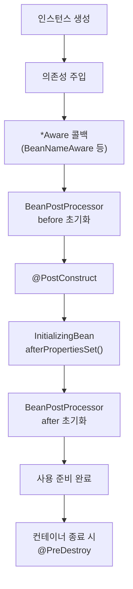

## new 키워드가 문제였다

처음엔 서비스 안에서 필요한 객체를 그냥 `new`로 만들었습니다.

```java
public class OrderService {
    private final PaymentClient paymentClient = new PaymentClient(); // 직접 생성
}
```

문제는 테스트할 때 드러났습니다. `PaymentClient`를 가짜(mock)로 바꿀 방법이 없어서, `OrderService`만 떼어내 테스트하는 게 불가능했죠. 객체를 **누가 만들고 연결하느냐**가 결합도를 좌우한다는 걸 그때 알았습니다.

여기서 등장하는 게 **IoC(제어의 역전)** 와 **DI(의존성 주입)** 입니다.

## IoC와 DI

- **IoC(Inversion of Control)**: 객체의 생성·연결·생명주기 관리를 개발자가 아니라 **컨테이너**가 담당하는 것. 제어의 주체가 뒤집힙니다.
- **DI(Dependency Injection)**: IoC를 구현하는 방법. 필요한 의존성을 객체가 직접 만들지 않고 **외부에서 넣어주는 것**.

Spring에서는 `ApplicationContext`라는 IoC 컨테이너가 Bean들을 만들고, 서로의 의존성을 주입해줍니다.

```java
@Service
public class OrderService {
    private final PaymentClient paymentClient;

    // 생성자 주입: 컨테이너가 PaymentClient Bean을 넣어준다
    public OrderService(PaymentClient paymentClient) {
        this.paymentClient = paymentClient;
    }
}
```

## 왜 생성자 주입을 권장하나

DI 방식은 생성자/필드/세터 주입이 있는데, **생성자 주입**이 권장됩니다.

- `final`로 선언해 **불변성**을 보장할 수 있다.
- 의존성이 없으면 객체 생성 자체가 안 되므로 **누락을 컴파일/구동 시점에 발견**한다.
- 테스트에서 그냥 `new OrderService(mockClient)`로 주입할 수 있다.
- 순환 의존성이 있으면 **구동 시점에 바로 터져서** 설계 문제를 빨리 알 수 있다.

> 생성자가 하나면 `@Autowired`도 생략 가능합니다. Lombok을 쓴다면 `@RequiredArgsConstructor`로 `final` 필드 생성자를 자동 생성할 수 있어요.
{: .prompt-tip }

## Bean 생명주기

컨테이너는 Bean을 단순히 만들기만 하는 게 아니라, 정해진 순서로 **생성 → 초기화 → 소멸** 단계를 거칩니다.



가장 자주 쓰는 건 `@PostConstruct`(초기화)와 `@PreDestroy`(정리)입니다. 참고로 `@PostConstruct`/`@PreDestroy`는 Jakarta EE(`jakarta.annotation`) 소속이고, Spring Boot 3/4는 Jakarta 네임스페이스를 사용합니다.

```java
@Component
public class CacheWarmer {

    @PostConstruct
    public void init() {
        // 의존성 주입이 끝난 뒤, 애플리케이션이 트래픽을 받기 전에 실행
        log.info("캐시 예열 시작");
    }

    @PreDestroy
    public void cleanup() {
        log.info("리소스 정리");
    }
}
```

## 정리

- `new` 직접 생성은 결합도를 높이고 테스트를 어렵게 만든다. → **컨테이너에 맡기자(IoC)**.
- DI는 **생성자 주입**을 기본으로. `final` + 불변 + 테스트 용이 + 순환 의존성 조기 발견.
- Bean은 생성 → 주입 → `@PostConstruct` → 사용 → `@PreDestroy`의 생명주기를 가진다.
- 순환 의존성에 대해서는 따로 다룰 만큼 함정이 많으니, 다음 글들에서 이어가겠습니다.
