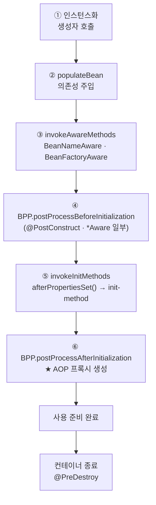

## `new` 키워드가 문제였다

처음엔 서비스 안에서 필요한 객체를 그냥 `new`로 만들었습니다.

```java
public class OrderService {
    private final PaymentClient paymentClient = new PaymentClient(); // 직접 생성
}
```

문제는 테스트할 때 드러났습니다. `PaymentClient`를 가짜(mock)로 바꿀 방법이 없어서, `OrderService`만 떼어내 테스트하는 게 불가능했죠. 객체를 **누가 만들고 연결하느냐**가 결합도를 좌우합니다.

이 글의 목표는 "생명주기 다이어그램을 외우는 것"이 아니라, **컨테이너가 Bean을 만드는 과정을 메서드 단위로 따라가서** 순환 참조 경고나 "프록시가 안 걸리는" 버그를 만났을 때 *원인을 짚을 수 있게* 되는 것입니다.

## IoC와 DI: 누가 객체를 만드는가

- **IoC(제어의 역전)**: 객체의 생성·연결·생명주기 관리를 개발자가 아니라 **컨테이너**가 담당. 제어의 주체가 뒤집힙니다.
- **DI(의존성 주입)**: IoC를 구현하는 방법. 필요한 의존성을 객체가 직접 만들지 않고 **외부에서 넣어주는 것**.

```java
@Service
public class OrderService {
    private final PaymentClient paymentClient;

    // 생성자 주입: 컨테이너가 PaymentClient Bean을 넣어준다
    public OrderService(PaymentClient paymentClient) {
        this.paymentClient = paymentClient;
    }
}
```

### `BeanFactory` vs `ApplicationContext`

IoC 컨테이너의 핵심 인터페이스는 두 개입니다. 이 둘의 관계가 헷갈리면 이후가 다 흐릿해집니다.

| | `BeanFactory` | `ApplicationContext` |
|---|---|---|
| 역할 | Bean 생성·DI의 **최소 기능** | `BeanFactory` + 부가기능 |
| 추가 기능 | — | 이벤트 발행, 국제화(i18n), 리소스 로딩, `BeanPostProcessor`/`BeanFactoryPostProcessor` **자동 등록** |
| 인스턴스화 시점 | 요청 시 지연 생성 | **싱글톤은 기동 시 미리 생성**(eager) |
| 실제 구현 | `DefaultListableBeanFactory` | `AnnotationConfigApplicationContext` 등 (내부에 위 BeanFactory를 품음) |

Spring Boot가 쓰는 건 `ApplicationContext`입니다. 그리고 모든 부팅의 시작점은 `AbstractApplicationContext.refresh()` 메서드입니다. 이 한 메서드 안에서 컨테이너의 전 생애가 결정됩니다.

```text
refresh()
 ├─ invokeBeanFactoryPostProcessors()   // ① BFPP: "설계도(BeanDefinition)"를 가공
 │     └─ ConfigurationClassPostProcessor → @Configuration/@Bean/@Import 처리
 ├─ registerBeanPostProcessors()        // ② BPP들을 먼저 등록(아직 실행 X)
 └─ finishBeanFactoryInitialization()   // ③ 싱글톤 Bean을 실제로 인스턴스화
```

여기서 가장 중요한 구분: **`BeanFactoryPostProcessor`(BFPP)는 인스턴스가 생기기 *전*에 "설계도(`BeanDefinition`)"를 고치고, `BeanPostProcessor`(BPP)는 인스턴스가 생긴 *후*에 "객체"를 가공합니다.** 자동 구성·`@Bean` 파싱이 ①에서 끝나야 ③에서 진짜 객체를 만들 수 있습니다.

## Bean 한 개가 태어나는 과정 — `doCreateBean`

③ 단계에서 싱글톤 하나가 만들어질 때, 내부적으로 `getBean()` → `createBean()` → `doCreateBean()`을 거칩니다. 그 안의 순서를 움직임으로 보면 이렇습니다.

<div class="bl-life" markdown="0">
<style>
.bl-life{margin:1.4rem 0;overflow-x:auto}
.bl-life svg{width:100%;max-width:720px;height:auto;display:block;margin:0 auto;font-family:inherit}
.bl-life .lbl{fill:currentColor;font-size:11px;font-weight:600}
.bl-life .sub{fill:currentColor;font-size:8.5px;opacity:.55}
.bl-life .arr{stroke:currentColor;opacity:.3;stroke-width:1.5;fill:none}
.bl-life rect.box{fill:none;stroke:currentColor;stroke-width:1.5;opacity:.3}
.bl-life rect.s1{animation:blpulse 6s ease-in-out infinite}
.bl-life rect.s2{animation:blpulse 6s ease-in-out infinite 1s}
.bl-life rect.s3{animation:blpulse 6s ease-in-out infinite 2s}
.bl-life rect.s4{animation:blpulse 6s ease-in-out infinite 3s}
.bl-life rect.s5{animation:blpulse 6s ease-in-out infinite 4s}
.bl-life rect.s6{animation:blpulse 6s ease-in-out infinite 5s}
.bl-life circle.bean{fill:#1971c2;animation:blflow 6s ease-in-out infinite}
.bl-life text.beanlbl{fill:#fff;font-size:8px;font-weight:700;animation:blflow 6s ease-in-out infinite}
@keyframes blpulse{0%,100%{opacity:.25}50%{opacity:.95}}
@keyframes blflow{
  0%{transform:translateX(0)}
  16%{transform:translateX(118px)}
  33%{transform:translateX(236px)}
  50%{transform:translateX(354px)}
  66%{transform:translateX(472px)}
  83%{transform:translateX(590px)}
  100%{transform:translateX(590px)}
}
</style>
<svg viewBox="0 0 720 150" role="img" aria-label="Bean 생명주기 단계: 인스턴스화, 의존성 주입, Aware, 초기화 전 후처리, 초기화, 초기화 후 후처리(프록시)를 토큰이 순서대로 통과하는 애니메이션">
  <rect class="box s1" x="6"   y="44" width="104" height="58" rx="8"/>
  <rect class="box s2" x="124" y="44" width="104" height="58" rx="8"/>
  <rect class="box s3" x="242" y="44" width="104" height="58" rx="8"/>
  <rect class="box s4" x="360" y="44" width="104" height="58" rx="8"/>
  <rect class="box s5" x="478" y="44" width="104" height="58" rx="8"/>
  <rect class="box s6" x="596" y="44" width="104" height="58" rx="8"/>
  <text class="lbl" x="58"  y="68" text-anchor="middle">① 인스턴스화</text>
  <text class="sub" x="58"  y="84" text-anchor="middle">생성자 호출</text>
  <text class="lbl" x="176" y="68" text-anchor="middle">② DI</text>
  <text class="sub" x="176" y="84" text-anchor="middle">populateBean</text>
  <text class="lbl" x="294" y="68" text-anchor="middle">③ Aware</text>
  <text class="sub" x="294" y="84" text-anchor="middle">BeanName/Factory</text>
  <text class="lbl" x="412" y="64" text-anchor="middle">④ BPP before</text>
  <text class="sub" x="412" y="78" text-anchor="middle">@PostConstruct</text>
  <text class="sub" x="412" y="90" text-anchor="middle">ApplicationContextAware</text>
  <text class="lbl" x="530" y="68" text-anchor="middle">⑤ init</text>
  <text class="sub" x="530" y="84" text-anchor="middle">afterPropertiesSet</text>
  <text class="lbl" x="648" y="64" text-anchor="middle">⑥ BPP after</text>
  <text class="sub" x="648" y="78" text-anchor="middle">AOP 프록시 생성</text>
  <text class="sub" x="648" y="90" text-anchor="middle">→ 사용/소멸</text>
  <line class="arr" x1="110" y1="73" x2="124" y2="73"/>
  <line class="arr" x1="228" y1="73" x2="242" y2="73"/>
  <line class="arr" x1="346" y1="73" x2="360" y2="73"/>
  <line class="arr" x1="464" y1="73" x2="478" y2="73"/>
  <line class="arr" x1="582" y1="73" x2="596" y2="73"/>
  <circle class="bean" cx="58" cy="30" r="11"/>
  <text class="beanlbl" x="58" y="33" text-anchor="middle">Bean</text>
</svg>
</div>

말로 정리하면 이렇습니다.



여기서 자주 틀리는 포인트가 있습니다. **`@PostConstruct`는 별도 단계가 아니라 ④ "BPP before" 단계에서 `CommonAnnotationBeanPostProcessor`라는 BPP가 실행하는 것**입니다. 즉 `@PostConstruct` → `afterPropertiesSet()` → `init-method` 순서로 돕니다. "초기화 콜백 3총사"의 우선순위가 바로 이것입니다.

## 핵심 함정 ⑥: 프록시는 "BPP after"에서 태어난다

`@Transactional`, `@Async`, `@Cacheable`이 만드는 **AOP 프록시는 ⑥ 단계**(`AbstractAutoProxyCreator`라는 BPP)에서 원본 Bean을 감싸 만들어집니다. 이 사실이 실무 버그 하나를 설명합니다.

부팅 로그에서 이런 경고를 본 적이 있을 겁니다.

```text
Bean 'someService' of type [..] is not eligible for getting processed
by all BeanPostProcessors (for example: not eligible for auto-proxying)
```

원인은 거의 항상 **"어떤 Bean을 너무 일찍 참조"** 했기 때문입니다. 예를 들어 `BeanPostProcessor`나 `@Configuration`에서 다른 Bean을 직접 주입받으면, 그 Bean이 *다른 BPP들이 다 돌기 전에* 만들어져 버립니다. 그러면 `@Transactional` 프록시를 씌우는 BPP가 그 Bean에 손을 못 대고, 결과적으로 **트랜잭션이 안 걸립니다.** "분명 `@Transactional` 붙였는데 안 먹는다"의 숨은 원인 중 하나가 이것입니다.

> 교훈: `BeanPostProcessor`/`@Configuration`에서 일반 Bean을 필드 주입하지 말고, 필요하면 `ObjectProvider`로 **지연 조회**하세요.

## 생성자 주입을 권장하는 진짜 이유

| 방식 | 불변(`final`) | 누락 탐지 | 순환참조 | 테스트 |
|---|---|---|---|---|
| **생성자** | ✅ | 기동 즉시 실패 | 기동 즉시 감지 | `new Svc(mock)` 가능 |
| 세터 | ❌ | 런타임 NPE | 우회 가능(위험) | 가능하나 번거로움 |
| 필드(`@Autowired`) | ❌ | 런타임 NPE | 우회 가능(위험) | 리플렉션 필요 |

필드 주입이 위험한 진짜 이유는 **숨은 의존성**입니다. 생성자 주입은 의존성이 시그니처에 다 드러나서, 파라미터가 5개를 넘으면 "이 클래스가 너무 많은 일을 한다"는 설계 신호로 읽힙니다. 필드 주입은 이 신호를 가려버립니다.

> 생성자가 하나면 `@Autowired`도 생략 가능합니다. Lombok `@RequiredArgsConstructor`가 `final` 필드 생성자를 만들어줍니다.
{: .prompt-tip }

## 순환 의존성: 3단계 캐시와 Boot의 기본 금지

A → B, B → A로 서로를 필요로 하면 어떻게 될까요? **생성자 주입끼리는 닭-달걀 문제라 부팅이 실패**합니다(`BeanCurrentlyInCreationException`). 반면 필드/세터 주입은 Spring이 **3단계 캐시**로 우회할 수 있습니다.

```text
DefaultSingletonBeanRegistry
 ├─ singletonObjects        (1차: 완성된 싱글톤)
 ├─ earlySingletonObjects   (2차: 아직 초기화 안 끝난 "조기 참조")
 └─ singletonFactories      (3차: 조기 참조를 만들어 줄 팩터리)
```

A를 만들다 B가 필요하면, A를 *완성 전에* 3차 캐시에 "조기 노출"해 두고 B가 그걸 참조하게 합니다. 단 이 트릭은 **생성자 주입엔 안 통합니다**(생성 자체가 안 끝났으니 노출할 객체가 없음).

중요한 정책 변화: **Spring Boot 2.6부터 순환 참조는 기본 금지**입니다. 필요하면 명시적으로 풀어야 하지만, 그 전에 **설계를 의심**하세요.

```yaml
spring:
  main:
    allow-circular-references: true   # 권장하지 않음. 임시 우회용
```

제대로 된 해법은 (1) 책임 분리로 사이클 제거, (2) 한쪽을 `@Lazy`로 늦게 주입, (3) `ObjectProvider`로 사용 시점에 조회.

## 스코프 함정: prototype을 singleton에 주입하면

`@Scope("prototype")`은 "요청할 때마다 새 인스턴스"입니다. 그런데 **singleton Bean에 prototype을 그냥 주입하면**, 주입은 *singleton이 생성될 때 단 한 번*만 일어나므로 결국 같은 인스턴스를 계속 씁니다. "prototype인데 왜 매번 같지?"의 정체입니다.

```java
@Service                       // singleton
public class ReportService {
    private final ObjectProvider<ReportJob> jobProvider;  // ✅ 매번 새로 조회

    public void run() {
        ReportJob job = jobProvider.getObject();  // 호출마다 새 prototype
    }
}
```

해법은 `ObjectProvider`(또는 `@Lookup`, scoped proxy). 매 사용 시점에 컨테이너에서 새로 꺼내야 prototype의 의미가 산다.

## 디버깅: 컨테이너 안을 들여다보기

```java
// 어떤 Bean들이 등록됐나
for (String name : context.getBeanDefinitionNames()) { ... }
```

운영 중이라면 Actuator로 같은 정보를 봅니다.

```bash
curl localhost:8080/actuator/beans | jq    # 등록된 Bean·의존관계·스코프
```

"이 Bean이 프록시인지"는 타입을 찍어보면 됩니다. `class com.example.OrderService$$SpringCGLIB$$...`처럼 나오면 프록시가 씌워진 것입니다.

## 면접/리뷰 단골 질문

- **Q. `BeanFactoryPostProcessor`와 `BeanPostProcessor`의 차이는?** → 전자는 *인스턴스화 전* `BeanDefinition`(설계도)을, 후자는 *인스턴스화 후* 객체를 가공한다. `@Configuration` 파싱은 BFPP(`ConfigurationClassPostProcessor`), AOP 프록시는 BPP(`AbstractAutoProxyCreator`).
- **Q. 초기화 콜백 `@PostConstruct` / `afterPropertiesSet()` / `init-method`의 순서는?** → 이 순서. `@PostConstruct`는 BPP가 "before init" 단계에서 호출한다.
- **Q. 생성자 주입이 순환 참조를 "조기에" 드러내는 이유는?** → 3단계 캐시의 조기 노출이 생성자 주입엔 불가능해 부팅이 즉시 실패하기 때문.

## 정리

- 컨테이너의 전 생애는 `refresh()` 한 메서드 — **BFPP(설계도 가공) → BPP 등록 → 싱글톤 인스턴스화** 순.
- Bean 한 개는 `doCreateBean`에서 **인스턴스화 → DI → Aware → BPP(before, `@PostConstruct`) → init → BPP(after, 프록시)** 를 거친다.
- **AOP 프록시는 마지막 "BPP after"에서 생성** → Bean을 너무 일찍 참조하면 프록시가 안 걸려 `@Transactional`이 조용히 무력화된다.
- DI는 **생성자 주입** 기본. 순환 참조는 Boot 2.6+ 기본 금지 — 우회보다 설계 수정.
- prototype을 singleton에 주입할 땐 `ObjectProvider`로 매번 조회.

> 관련 글: 이 컨테이너 위에서 도는 [자동 구성](), 그 모든 것의 진입점 [`@SpringBootApplication`](). 프록시가 안 걸리는 함정의 연장선은 [`@Transactional` 함정]()에서 이어집니다.
