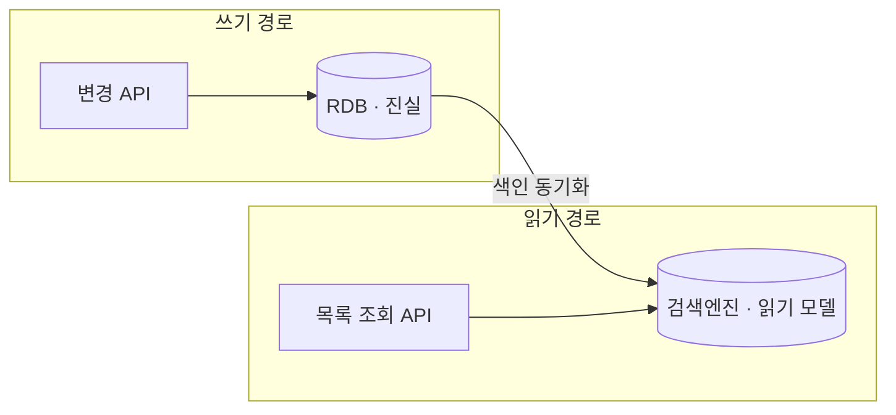

그 주엔 무거운 목록 조회를 관계형 DB에서 검색엔진으로 옮기고, 레포지토리의 조회 메서드들을 걷어냈다. 필터가 많고 정렬·카운트가 섞인 목록 화면은 DB에서 JOIN과 인덱스로 버티다 결국 한계에 부딪힌다. 핵심 지식은 "**읽기 경로를 쓰기 경로와 분리**해 검색엔진을 읽기의 소스로 삼는" 설계 판단이다.

## 왜 읽기를 검색엔진으로 옮기는가

목록 화면의 부하는 보통 세 가지가 겹친다. **다중 조건 필터**(여러 컬럼 AND/OR), **다양한 정렬**, 그리고 **전체 카운트**(페이지네이션 totalCount). 관계형 DB에서 이걸 다 빠르게 하려면 조건 조합마다 복합 인덱스가 필요한데, 조합이 폭발하면 인덱스로 못 버틴다. 특히 `COUNT(*)`는 조건이 붙으면 전체를 훑어야 해 가장 비싸다.

검색엔진은 이 작업에 구조적으로 강하다. 역색인 덕에 다중 필터가 빠르고, 정렬·집계가 1급 시민이며, 카운트는 색인 단계에서 사실상 준비돼 있다. 그래서 **읽기(조회)는 검색엔진, 쓰기(진실)는 RDB**로 역할을 나눈다. 이것이 CQRS(명령-조회 책임 분리)의 실용적 형태다.



## 읽기 경로를 어떻게 갈아끼우는가

기존 코드는 보통 레포의 `findByConditions(...)` + `countByConditions(...)` 한 쌍이다. 이걸 검색 쿼리로 대체한다.

```java
// 이전: DB 다중 조건 + 별도 카운트
public Page<ProductView> search(ProductSearchRequest req) {
    List<Product> rows = productRepository.findByConditions(req);
    long total = productRepository.countByConditions(req);
    return new PageImpl<>(map(rows), req.pageable(), total);
}

// 이후: 검색엔진 한 번 호출로 hits + 총건수를 함께 받는다
public Page<ProductView> search(ProductSearchRequest req) {
    SearchResponse res = searchClient.search(
        index("product"),
        boolQuery(req),                 // 필터 조합
        sort(req), req.page(), req.size());
    long total = res.totalHits();       // 카운트 별도 쿼리 불필요
    return new PageImpl<>(map(res.hits()), req.pageable(), total);
}
```

검색엔진은 hits와 total을 한 응답에 함께 주므로 **카운트 전용 쿼리가 사라진다**. 이것만으로도 DB 부하의 큰 덩어리가 빠진다. 읽기 모델은 화면이 필요로 하는 필드를 비정규화해 색인해 둔다 — 조회 시 JOIN이 필요 없도록.

## 캐시를 걷어낸 판단

이전엔 무거운 DB 목록 조회 위에 `@Cacheable`을 얹어 버티곤 한다. 그런데 읽기를 검색엔진으로 옮기고 나면 이 캐시는 **득보다 실이 크다.**

- 검색엔진 자체가 이미 빠르고, 필터·정렬·페이지 조합마다 캐시 키가 폭발해 적중률이 낮다.
- 데이터가 바뀌면 캐시를 무효화해야 하는데, 어떤 키를 깨야 할지 특정하기 어렵다.
- 검색엔진 색인에도 약간의 지연이 있는데, 그 위에 캐시 지연까지 겹치면 **묵은 데이터(staleness)가 이중으로 쌓인다.**

그래서 검색 기반 읽기로 옮기면서 애플리케이션 캐시는 걷어내는 편이 깔끔하다. 빠른 읽기 모델 위에 또 캐시를 쌓는 건 staleness만 키운다.

## 운영 함정

**색인 지연(read-after-write 깨짐)**이 사용자 눈에 가장 먼저 띈다. 사용자가 방금 등록한 항목이 목록에 바로 안 보이면 버그로 오해한다. 검색엔진은 색인 직후 `refresh`가 일어나기 전까지(기본 1초 안팎) 검색 결과에 안 나타나기 때문이다. 해법은 (1) 등록 직후 **방금 만든 단건만은 RDB에서 직접 읽어** 보여주거나, (2) 본인 변경 직후 화면에는 낙관적으로 결과를 합성해 끼워 넣는 것이다. 모든 읽기를 검색엔진으로 보내되, "방금 내 변경"만은 예외 처리하는 셈이다.

## 핵심 요약

- 다중 필터·정렬·카운트가 무거운 목록은 검색엔진이 구조적으로 유리하다 — 읽기는 검색엔진, 진실은 RDB.
- 검색엔진은 hits와 total을 함께 주므로 비싼 카운트 전용 쿼리가 사라진다.
- 빠른 읽기 모델 위의 애플리케이션 캐시는 적중률이 낮고 staleness만 이중으로 키운다 — 걷어내라.
- Q: "방금 등록한 게 목록에 안 보인다는 민원은?" → A: 색인 refresh 지연 때문이다. 본인 직후 변경만 RDB에서 직접 읽어 보완한다.
