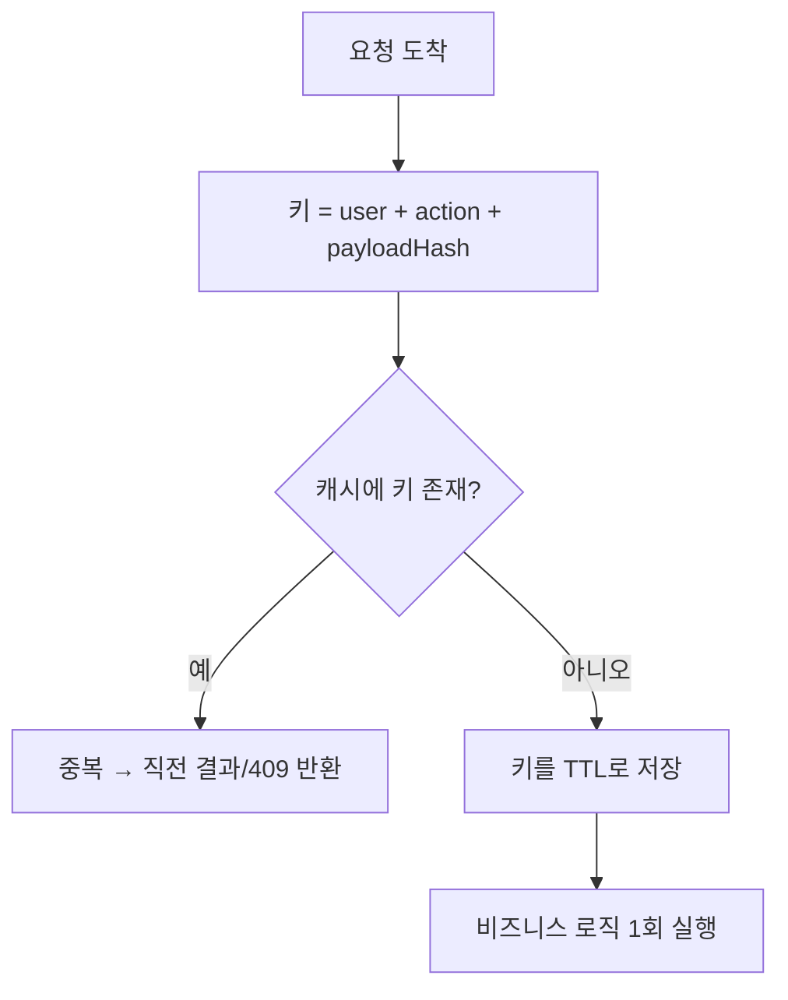

버튼을 빠르게 두 번 눌러 같은 주문이 두 건 들어오는 문제를 다룬 주가 있었다. 클라이언트에서 버튼을 비활성화해도 네트워크 지연·새로고침·중복 탭 앞에서는 뚫린다. 결국 **서버가 짧은 시간 내 동일 요청을 한 번만 처리**하도록 막아야 한다. 이때 등장하는 게 디바운스 윈도와 멱등키인데, 둘은 다른 문제를 푼다.

## 중복은 왜 생기나

동일 요청이 N번 들어오는 원인은 다양하다.

- 사용자 연타(double submit).
- 클라이언트 자동 재시도(타임아웃 후 재요청 — 사실 첫 요청은 성공했을 수도 있다).
- 프록시/로드밸런서 재전송.

여기서 헷갈리지 말아야 할 것: **"의도적으로 같은 행동을 두 번 한 것"과 "한 행동이 네트워크상 두 번 도착한 것"은 다르다.** 디바운스 윈도는 전자에 가깝고, 멱등키는 후자를 정확히 푼다.

## 디바운스 윈도

가장 단순한 방어는 "같은 사용자 + 같은 동작 + 같은 페이로드"를 키로 만들어, 짧은 TTL(예: 2초) 캐시에 넣고, 윈도 안에 같은 키가 또 오면 무시(또는 직전 결과 반환)하는 것이다.



```java
public OrderResult placeOrder(Long userId, OrderForm form) {
    String key = "dedup:order:" + userId + ":" + sha256(form.canonical());

    // setIfAbsent: 처음 보는 키만 true. 원자적이라 동시 두 요청 중 하나만 통과
    Boolean first = cache.setIfAbsent(key, "1", Duration.ofSeconds(2));
    if (Boolean.FALSE.equals(first)) {
        throw new DuplicateRequestException("이미 처리 중인 요청입니다");
    }
    return orderService.create(userId, form);
}
```

핵심은 `setIfAbsent`(SET NX) 같은 **원자적 연산**이다. "조회 후 없으면 저장"을 두 줄로 나누면 동시 요청이 둘 다 조회를 통과하는 경쟁이 생긴다.

## 멱등키와의 차이

멱등키(idempotency key)는 클라이언트가 요청마다 UUID를 발급해 헤더로 보내고, 서버는 그 키별로 **처리 결과를 저장**해 재시도 시 같은 결과를 그대로 돌려준다. 핵심 차이는 이렇다.

| | 디바운스 윈도 | 멱등키 |
|---|---|---|
| 키 출처 | 서버가 페이로드로 생성 | 클라이언트가 발급 |
| 목적 | 짧은 시간 우발적 중복 차단 | 재시도해도 결과 동일 보장 |
| 두 번째 요청 처리 | 무시/거부 | 저장된 동일 결과 반환 |
| 적용 범위 | 임시(초 단위) | 요청 단위(분~시간) |

결제처럼 "재시도는 정상이고, 단 결과만 한 번이어야 하는" 경우엔 멱등키가 맞다. 단순 연타 방지면 디바운스 윈도로 충분하다.

## 운영 함정

- **페이로드 해시에 타임스탬프·논스 포함**: 의미상 같은 요청인데 매번 키가 달라져 디바운스가 무력화된다. 키는 의미 있는 필드만 정규화(canonicalize)해서 만든다.
- **윈도를 너무 길게**: 사용자가 진짜로 같은 상품을 다시 주문하려는데 거부된다. 디바운스는 어디까지나 우발적 중복용 — 초 단위로 짧게 둔다.

## 핵심 요약

- 서버측 중복 방어는 원자적 `setIfAbsent`로 키 선점이 정석이다.
- 디바운스 윈도는 우발적 연타, 멱등키는 재시도 안전성 — 푸는 문제가 다르다.
- 키 생성 시 의미 없는 필드(타임스탬프 등)는 빼고 정규화한다.
