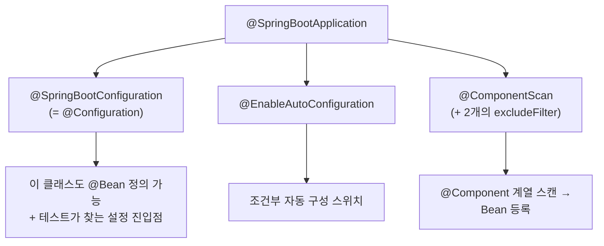

## 메인 클래스의 그 한 줄

Spring Boot 프로젝트를 만들면 항상 이 코드가 있습니다.

```java
@SpringBootApplication
public class DemoApplication {
    public static void main(String[] args) {
        SpringApplication.run(DemoApplication.class, args);
    }
}
```

너무 당연하게 써왔지만, 이 한 줄은 **세 개의 애너테이션을 합친 메타 애너테이션**이고 `run()`은 **부트 시퀀스 전체를 오케스트레이션**합니다. 이걸 모르면 "왜 내 `@Service`가 안 잡히지", "왜 `@Bean` 내부 호출이 새 인스턴스를 만들지", "왜 부팅이 느리지"를 추측으로만 때우게 됩니다. 이 글은 그 한 줄을 끝까지 분해합니다.

## 먼저, `run()`이 실제로 도는 순서

`SpringApplication.run()`은 "컨텍스트 하나 만들고 끝"이 아니라, 정해진 단계를 순서대로 밟습니다. 각 단계가 켜지는 흐름을 먼저 눈으로 보세요.

<div class="sba-boot" markdown="0">
<style>
.sba-boot{margin:1.4rem 0;overflow-x:auto}
.sba-boot svg{width:100%;max-width:760px;height:auto;display:block;margin:0 auto;font-family:inherit}
.sba-boot .lbl{fill:currentColor;font-size:12px;font-weight:600}
.sba-boot .sub{fill:currentColor;font-size:9px;opacity:.55}
.sba-boot .arr{stroke:currentColor;opacity:.35;stroke-width:1.5;fill:none}
.sba-boot rect.box{fill:none;stroke:currentColor;stroke-width:1.5;opacity:.3}
.sba-boot rect.s1{animation:kfsbapulse 5s ease-in-out infinite}
.sba-boot rect.s2{animation:kfsbapulse 5s ease-in-out infinite 1s}
.sba-boot rect.s3{animation:kfsbapulse 5s ease-in-out infinite 2s}
.sba-boot rect.s4{animation:kfsbapulse 5s ease-in-out infinite 3s}
.sba-boot rect.s5{animation:kfsbapulse 5s ease-in-out infinite 4s}
.sba-boot circle.run{fill:#1971c2;animation:kfsbarun 5s linear infinite}
@keyframes kfsbarun{0%{transform:translateX(0);opacity:0}5%{opacity:1}95%{opacity:1}100%{transform:translateX(652px);opacity:0}}
@keyframes kfsbapulse{0%,100%{opacity:.28}50%{opacity:.9}}
</style>
<svg viewBox="0 0 760 150" role="img" aria-label="SpringApplication.run의 부트 시퀀스가 환경 준비부터 러너 실행까지 순서대로 켜지는 애니메이션">
  <rect class="box s1" x="8"   y="36" width="132" height="58" rx="8"/>
  <rect class="box s2" x="156" y="36" width="132" height="58" rx="8"/>
  <rect class="box s3" x="304" y="36" width="132" height="58" rx="8"/>
  <rect class="box s4" x="452" y="36" width="132" height="58" rx="8"/>
  <rect class="box s5" x="600" y="36" width="132" height="58" rx="8"/>
  <text class="lbl" x="74"  y="62" text-anchor="middle">Environment</text>
  <text class="sub" x="74"  y="78" text-anchor="middle">프로퍼티·프로파일</text>
  <text class="lbl" x="222" y="62" text-anchor="middle">Context 생성</text>
  <text class="sub" x="222" y="78" text-anchor="middle">ApplicationContext</text>
  <text class="lbl" x="370" y="62" text-anchor="middle">refresh()</text>
  <text class="sub" x="370" y="78" text-anchor="middle">스캔 + 자동구성</text>
  <text class="lbl" x="518" y="62" text-anchor="middle">서버 기동</text>
  <text class="sub" x="518" y="78" text-anchor="middle">내장 Tomcat</text>
  <text class="lbl" x="666" y="62" text-anchor="middle">Runner 실행</text>
  <text class="sub" x="666" y="78" text-anchor="middle">CommandLineRunner</text>
  <line class="arr" x1="140" y1="65" x2="156" y2="65"/>
  <line class="arr" x1="288" y1="65" x2="304" y2="65"/>
  <line class="arr" x1="436" y1="65" x2="452" y2="65"/>
  <line class="arr" x1="584" y1="65" x2="600" y2="65"/>
  <circle class="run" cx="20" cy="65" r="7"/>
</svg>
</div>

이 단계들은 `SpringApplication.run()` 내부에서 거의 그대로 호출됩니다.

```text
run()
 ├─ getRunListeners()              // SpringApplicationRunListeners (이벤트 발행)
 ├─ prepareEnvironment()           // ① 프로퍼티/프로파일 결정 → environmentPrepared 이벤트
 ├─ createApplicationContext()     // ② 웹이면 Servlet/Reactive 컨텍스트 선택
 ├─ prepareContext()               // ApplicationContextInitializer 적용, 소스 등록
 ├─ refreshContext()               // ③ AbstractApplicationContext.refresh() → 스캔·자동구성·서버
 ├─ afterRefresh()
 └─ callRunners()                  // ⑤ ApplicationRunner / CommandLineRunner
```

`④ 서버 기동`이 `③ refresh` 안에 포함된다는 게 핵심입니다. 내장 톰캣은 `ServletWebServerApplicationContext.onRefresh()`에서 떠서, "Bean 다 만들고 → 서버 오픈" 순서가 보장됩니다(서버가 트래픽을 받기 전에 모든 Bean이 준비됨).

## 세 애너테이션의 합성



실제 정의는 이렇게 생겼습니다. `@AliasFor`로 속성을 하위 애너테이션에 위임하는 부분까지 봐야 절반을 본 겁니다.

```java
@SpringBootConfiguration
@EnableAutoConfiguration
@ComponentScan(excludeFilters = {
    @Filter(type = CUSTOM, classes = TypeExcludeFilter.class),
    @Filter(type = CUSTOM, classes = AutoConfigurationExcludeFilter.class)
})
public @interface SpringBootApplication {

    @AliasFor(annotation = ComponentScan.class, attribute = "basePackages")
    String[] scanBasePackages() default {};

    @AliasFor(annotation = EnableAutoConfiguration.class, attribute = "exclude")
    Class<?>[] exclude() default {};

    boolean proxyBeanMethods() default true;
}
```

> `@SpringBootApplication(scanBasePackages = "...")`이 동작하는 이유가 바로 `@AliasFor`입니다. 내가 준 값이 합성 과정에서 `@ComponentScan`의 `basePackages`로 **그대로 위임**됩니다. 마찬가지로 `exclude`는 `@EnableAutoConfiguration`으로 흘러갑니다.

### 숨은 디테일: 두 개의 `excludeFilter`

`@ComponentScan`에 `AutoConfigurationExcludeFilter`가 끼워져 있는 게 중요합니다. 자동 구성 클래스도 결국 `@Configuration`이라, 컴포넌트 스캔이 그냥 두면 **조건 평가 없이** 주워서 등록해 버립니다. 이 필터가 "이미 자동 구성 목록(`imports`)에 있는 클래스는 스캔에서 제외"해, 자동 구성이 `@Conditional`을 거쳐 등록되도록 보장합니다. `TypeExcludeFilter`는 테스트 슬라이스(`@WebMvcTest` 등)가 스캔 범위를 좁힐 때 쓰는 확장점입니다.

## 각 애너테이션을 한 겹 더

**① @SpringBootConfiguration** — 그냥 `@Configuration`이지만 "이 앱의 *기본 설정 진입점*"이라는 의미가 추가됩니다. `@SpringBootTest`는 테스트 클래스에서 패키지 트리를 거슬러 올라가며 `@SpringBootConfiguration`이 붙은 클래스를 찾아 설정으로 씁니다. 그래서 **한 컨텍스트에 `@SpringBootConfiguration`은 하나여야** 합니다(둘이면 테스트가 `Found multiple @SpringBootConfiguration`로 실패).

**② @EnableAutoConfiguration** — 자동 구성의 스위치. 동작 원리는 [자동 구성 글]()에서 끝까지 파헤쳤습니다.

**③ @ComponentScan** — 별도 설정이 없으면 **메인 클래스가 위치한 패키지와 그 하위**를 스캔합니다. 이 기본값이 다음 함정의 근원입니다.

## 프로덕션 함정 1: "Bean이 안 잡혀요"의 90%는 패키지 위치

```text
com.example.demo            ← DemoApplication (여기 두면 하위 전부 스캔)
├── controller
├── service
└── repository

com.another.pkg             ← 스캔 안 됨! @Service 붙여도 Bean 등록 실패
```

`@Service`를 분명히 붙였는데 주입이 안 된다면, 십중팔구 그 컴포넌트가 메인 클래스 패키지 **바깥**에 있습니다. 해결은 메인 클래스를 루트 패키지로 올리거나 범위를 명시하는 것.

```java
@SpringBootApplication(scanBasePackages = {"com.example.demo", "com.another.pkg"})
public class DemoApplication { }
```

라이브러리/모듈을 만들 땐 스캔에 의존하지 말고 자동 구성으로 Bean을 공급하는 게 정석입니다(스캔은 *애플리케이션*의 것).

## 프로덕션 함정 2: `proxyBeanMethods`와 `@Bean` 내부 호출

`@Configuration`(기본 `proxyBeanMethods = true`)은 CGLIB로 프록시되어, `@Bean` 메서드를 **내부에서 호출해도 항상 같은 싱글턴**을 돌려줍니다.

```java
@Configuration   // proxyBeanMethods = true (기본)
class AppConfig {
    @Bean A a() { return new A(b()); }   // b()는 프록시를 거쳐 "그" 싱글턴 b 반환
    @Bean B b() { return new B(); }
}
```

`proxyBeanMethods = false`(Lite 모드)로 바꾸면 `b()`는 *매번 새 인스턴스*를 만듭니다. 자동 구성 클래스가 `@Configuration(proxyBeanMethods = false)`인 이유가 이것(메서드 간 호출을 안 하니 프록시 비용을 없애 시작을 빠르게). 즉 이 옵션은 "성능 ↔ 메서드 호출 시맨틱"의 트레이드오프입니다.

## 부팅을 관측하기 — 추측 대신 데이터

- **무슨 Bean이 떴나** → `/actuator/beans` 또는 컨텍스트에서 `getBeanDefinitionNames()`.
- **부팅의 어느 단계가 느린가** → `ApplicationStartup`을 `BufferingApplicationStartup`으로 교체하고 `/actuator/startup` 조회. 각 단계(`spring.beans.instantiate` 등) 소요가 step 단위로 찍힙니다.

```java
public static void main(String[] args) {
    SpringApplication app = new SpringApplication(DemoApplication.class);
    app.setApplicationStartup(new BufferingApplicationStartup(2048)); // 부팅 프로파일링
    app.run(args);
}
```

"부팅이 느리다"를 느낌으로 말하지 말고, 이 step 데이터로 *어느 단계*가 느린지 짚는 게 시작입니다.

## 면접/리뷰 단골 질문

- **Q. `@SpringBootApplication`을 세 애너테이션으로 풀어 쓸 수 있나?** → 가능. `@SpringBootConfiguration` + `@EnableAutoConfiguration` + `@ComponentScan`. 합성 애너테이션일 뿐이다.
- **Q. 메인 클래스의 `@ComponentScan`이 왜 자동 구성 클래스를 중복 등록하지 않나?** → `AutoConfigurationExcludeFilter`가 `imports` 목록의 클래스를 스캔에서 제외하기 때문.
- **Q. `@Bean` 메서드를 다른 `@Bean`에서 호출하면 매번 새 객체인가?** → `proxyBeanMethods`에 달렸다. 기본(true)이면 CGLIB 프록시로 같은 싱글턴, false면 새 객체.

## 정리

- `@SpringBootApplication` = `@SpringBootConfiguration` + `@EnableAutoConfiguration` + `@ComponentScan`, 그리고 `@AliasFor`로 `scanBasePackages`·`exclude`를 하위에 위임.
- `@ComponentScan`엔 `AutoConfigurationExcludeFilter`가 들어 있어 자동 구성이 **조건 평가를 거쳐** 등록되도록 보장한다.
- 스캔 기준은 **메인 클래스 패키지 하위** → "Bean이 안 잡힌다"면 패키지 위치부터 의심.
- `proxyBeanMethods`(기본 true)가 `@Bean` 내부 호출의 싱글턴 보장을 좌우한다.
- `run()`은 환경 준비 → 컨텍스트 생성 → refresh(스캔·자동구성·서버) → 러너의 순서. 느리면 `/actuator/startup`으로 단계를 측정하자.

> 관련 글: 합성된 [자동 구성]()의 내부 동작과, 스캔으로 등록된 Bean들이 거치는 [IoC/DI와 Bean 생명주기]()를 함께 보면 부팅의 전체 그림이 완성됩니다.
