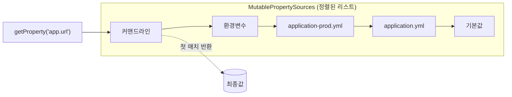

## 환경마다 다른 값, 어떻게 관리하지

개발 DB와 운영 DB 주소가 다르고, 로컬에선 로그를 자세히, 운영에선 간략히 찍고 싶습니다. 이런 값을 코드에 박아두면 환경이 바뀔 때마다 재빌드해야 하죠. Spring Boot의 **외부 설정(Externalized Configuration)** 이 이 문제를 풀어줍니다.

그런데 외부 설정에서 사람들이 가장 자주 데이는 지점은 따로 있습니다. **"분명 application.yml에 적었는데 다른 값이 나와요."** 이건 거의 항상 *우선순위(precedence)* 를 몰라서 생기는 일입니다. 그래서 이 글은 "yml에 값 적는 법"이 아니라, **값이 어디서 와서 어떤 순서로 덮이고, 그게 코드로 어떻게 바인딩되는지** 그 메커니즘에 집중합니다.

## 모든 설정은 하나의 `Environment`로 합쳐진다

Spring Boot는 부팅 시 여러 출처(커맨드라인, 환경변수, yml 파일…)를 각각 하나의 **`PropertySource`** 로 만들고, 이들을 우선순위 순서대로 정렬한 **`MutablePropertySources`** 리스트에 담습니다. 이 리스트를 들고 있는 게 `ConfigurableEnvironment`입니다.

값을 조회할 때(`environment.getProperty("app.url")`)는 `PropertySourcesPropertyResolver`가 **리스트를 위에서부터 훑어 첫 번째로 발견된 값을 반환**합니다. 그게 전부입니다. "우선순위"란 곧 *이 리스트에서 누가 위에 있느냐* 이고, **먼저 찾으면 이긴다(first wins)**.

아래는 같은 키 `app.datasource.url`이 여러 출처에 정의돼 있을 때, 위쪽 출처가 아래를 덮으며 최종값이 결정되는 모습입니다.

<div class="cfg-stack" markdown="0">
<style>
.cfg-stack{margin:1.4rem 0;overflow-x:auto}
.cfg-stack svg{width:100%;max-width:720px;height:auto;display:block;margin:0 auto;font-family:inherit}
.cfg-stack .row{fill:currentColor;opacity:.06;stroke:currentColor;stroke-opacity:.3;stroke-width:1}
.cfg-stack .name{fill:currentColor;font-size:13px;font-weight:600}
.cfg-stack .val{fill:currentColor;font-size:12px;opacity:.55;font-family:ui-monospace,monospace}
.cfg-stack .rank{fill:currentColor;font-size:10px;opacity:.45}
.cfg-stack .win{fill:none;stroke:#2f9e44;stroke-width:2.5;animation:kfcfgclimb 5s ease-in-out infinite}
.cfg-stack .winval{fill:#2f9e44;font-weight:700;font-family:ui-monospace,monospace;font-size:12px;opacity:0;animation:kfcfgshow 5s ease-in-out infinite}
.cfg-stack .arrow{stroke:#2f9e44;stroke-width:2;fill:none;opacity:0;animation:kfcfgshow 5s ease-in-out infinite}
.cfg-stack .arrowhead{fill:#2f9e44;opacity:0;animation:kfcfgshow 5s ease-in-out infinite}
@keyframes kfcfgclimb{0%{transform:translateY(192px)}12%{transform:translateY(192px)}60%{transform:translateY(0)}100%{transform:translateY(0)}}
@keyframes kfcfgshow{0%,62%{opacity:0}72%,100%{opacity:.95}}
</style>
<svg viewBox="0 0 700 280" role="img" aria-label="여러 PropertySource가 우선순위로 쌓여 위쪽 출처가 아래를 덮고 커맨드라인 인자가 최종값으로 채택되는 애니메이션">
  <rect class="row" x="20" y="14"  width="440" height="40" rx="6"/>
  <rect class="row" x="20" y="62"  width="440" height="40" rx="6"/>
  <rect class="row" x="20" y="110" width="440" height="40" rx="6"/>
  <rect class="row" x="20" y="158" width="440" height="40" rx="6"/>
  <rect class="row" x="20" y="206" width="440" height="40" rx="6"/>
  <text class="rank" x="32" y="30">1 ▲ 높음</text>
  <text class="name" x="32" y="42">커맨드라인 --app.datasource.url</text>
  <text class="val"  x="300" y="42">prod-db</text>
  <text class="name" x="32" y="90">OS 환경변수 APP_DATASOURCE_URL</text>
  <text class="val"  x="300" y="90">stage-db</text>
  <text class="name" x="32" y="138">application-prod.yml</text>
  <text class="val"  x="300" y="138">prod-internal</text>
  <text class="name" x="32" y="186">application.yml</text>
  <text class="val"  x="300" y="186">localhost</text>
  <text class="rank" x="32" y="222">5 ▼ 낮음</text>
  <text class="name" x="32" y="234">기본값(default properties)</text>
  <text class="val"  x="300" y="234">none</text>
  <rect class="win" x="18" y="12" width="444" height="44" rx="7"/>
  <path class="arrow" d="M470 34 H560"/>
  <polygon class="arrowhead" points="560,28 574,34 560,40"/>
  <text class="winval" x="582" y="38">prod-db ✓</text>
</svg>
</div>

녹색 테두리가 아래에서 위로 올라오며 멈추는 지점이 **resolver가 최종 채택하는 출처**입니다. 커맨드라인 인자가 가장 위라, OS 환경변수·yml에 같은 키가 있어도 전부 무시되고 `prod-db`가 이깁니다.

## 우선순위 전체 순서 (자주 헷갈리는 부분)

실무에서 중요한 구간만 추리면 — **위일수록 우선**:

| 순위 | 출처 | 메모 |
|------|------|------|
| 높음 | 커맨드라인 인자 `--key=value` | 배포 스크립트에서 강제 오버라이드 |
| ↑ | `SPRING_APPLICATION_JSON` | JSON 한 덩어리로 주입 |
| ↑ | Java 시스템 프로퍼티 `-Dkey=value` | |
| ↑ | **OS 환경변수** | ⚠️ **yml보다 우선** |
| ↑ | `application-{profile}.yml` (jar 밖 > jar 안) | 프로파일별 |
| ↓ | `application.yml` (jar 밖 > jar 안) | 공통 |
| 낮음 | `@PropertySource` / `setDefaultProperties` | 최후 기본값 |

> ⚠️ **가장 흔한 착각 1위**: "yml에 적었으니 이 값이 쓰이겠지." 컨테이너 환경변수(`APP_DATASOURCE_URL`)나 CI가 주입한 `SPRING_DATASOURCE_URL`이 **조용히 yml을 덮습니다.** "왜 운영에서 다른 DB를 보지?"의 단골 원인입니다. 확신이 안 서면 `/actuator/env`로 *어느 PropertySource가 그 값을 제공 중인지* 직접 확인하세요.



## 환경변수 ↔ 프로퍼티: relaxed binding

환경변수는 `app.datasource.url` 같은 점 표기를 못 씁니다. 그래서 Spring은 **느슨한 바인딩(relaxed binding)** 으로 표기법 차이를 흡수합니다. 아래는 전부 같은 프로퍼티에 매핑됩니다.

```text
app.datasource.url          (yml, 정규형 — kebab-case)
APP_DATASOURCE_URL          (환경변수 — 대문자 + 언더스코어)
app.datasource.url          (시스템 프로퍼티)
```

규칙: 환경변수는 `.` → `_`, 대문자, 리스트 인덱스는 `_0_` 식. `@ConfigurationProperties` 바인딩에만 적용되고, 뒤에 나올 `@Value`에는 **적용되지 않습니다.**

## @Value vs @ConfigurationProperties — 왜 후자인가

값을 코드로 가져오는 두 방법은 동작 자체가 다릅니다.

| | `@Value("${...}")` | `@ConfigurationProperties` |
|---|---|---|
| 해석 | SpEL + 임베디드 값 리졸버 | `Binder` API |
| relaxed binding | ❌ 정확히 일치해야 | ✅ |
| 타입 변환 | 제한적 | `DataSize`/`Duration`/중첩 객체/`List`/`Map` |
| 검증 | ❌ | ✅ `@Validated` + JSR-380 |
| 메타데이터(IDE 자동완성) | ❌ | ✅ `spring-boot-configuration-processor` |

```java
@ConfigurationProperties(prefix = "app.upload")
@Validated
public record UploadProperties(
        @NotNull DataSize maxSize,          // "10MB" → DataSize 자동 변환
        @NotEmpty List<String> allowedTypes // allowed-types → allowedTypes
) {}
```

record는 Spring Boot 3.0+에서 **생성자 바인딩**이 기본이라 `@ConstructorBinding`을 붙일 필요가 없습니다(불변 설정 객체에 이상적). 등록은 둘 중 하나로:

```java
@SpringBootApplication
@ConfigurationPropertiesScan   // 패키지 스캔으로 모든 @ConfigurationProperties 등록
public class DemoApplication { }

// 또는 특정 타입만 콕 집어
@EnableConfigurationProperties(UploadProperties.class)
```

> ⚠️ **함정**: 둘 중 어느 쪽도 안 하면 `@ConfigurationProperties` 클래스가 그냥 일반 객체가 되어 **값이 전부 null/기본값**입니다. 예외도 안 납니다. "바인딩이 안 돼요"의 절반이 이 등록 누락입니다.
>
> ⚠️ **`@Value`로 리스트가 안 들어와요**: `@Value("${app.types}")`는 `List`로 못 받습니다. SpEL로 쪼개야 합니다 — `@Value("#{'${app.types}'.split(',')}")`. 컬렉션·중첩 구조가 필요하면 그냥 `@ConfigurationProperties`를 쓰세요.

## Profile과 spring.config.import

환경 분리는 `application-{profile}.yml`로 나누고, 단일 파일 안에서 나눌 땐 멀티 도큐먼트(`---`)를 씁니다. 옛날 `spring.profiles` 키는 **deprecated** — 지금은 `spring.config.activate.on-profile`입니다.

```yaml
# application.yml — 한 파일에 여러 프로파일
app:
  feature-x: false
---
spring:
  config:
    activate:
      on-profile: prod        # ✅ 신형 (구 spring.profiles 아님)
app:
  feature-x: true
```

```bash
java -jar app.jar --spring.profiles.active=prod
```

쿠버네티스 시크릿/컨피그맵은 파일로 마운트되는데, 이를 PropertySource로 끌어올 땐 **Config Tree**가 깔끔합니다.

```yaml
spring:
  config:
    import: "configtree:/etc/secrets/"   # /etc/secrets/db.password → db.password
```

`spring.config.import`는 Vault·외부 파일·configtree를 *우선순위를 지키며* 합류시키는 표준 통로입니다.

## 면접/리뷰 단골 질문

- **Q. 환경변수와 application.yml 중 뭐가 이기나?** → 환경변수. PropertySource 리스트에서 환경변수가 yml보다 위라 먼저 매칭된다.
- **Q. `@Value`와 `@ConfigurationProperties`의 결정적 차이는?** → relaxed binding·타입 변환·검증·메타데이터. `@Value`는 SpEL 단발 치환이라 이 모두가 없다.
- **Q. 설정값이 의도와 다를 때 첫 디버깅은?** → `/actuator/env`로 "어느 PropertySource가 그 키를 제공 중인지" 확인. 추측 금지.

## 정리

- 모든 출처는 하나의 `Environment`(정렬된 `PropertySource` 리스트)로 합쳐지고, 조회는 **위에서부터 첫 매치(first wins)**.
- **환경변수가 yml을 덮는다** — 운영 값 미스매치의 1순위 원인. `/actuator/env`로 출처를 확인하자.
- 값은 `@Value`가 아니라 **`@ConfigurationProperties`**(relaxed binding·타입 변환·`@Validated`)로 묶고, `@ConfigurationPropertiesScan`/`@EnableConfigurationProperties` 등록을 잊지 말 것.
- 프로파일은 `spring.config.activate.on-profile`(구 `spring.profiles` 아님), 시크릿은 `spring.config.import: configtree:`.

> 관련 글: 이 설정값들이 결국 Bean으로 묶이는 과정은 [자동 구성]()과, 그 Bean들의 등록·생명주기는 [IoC/DI와 Bean 생명주기]()에서 이어집니다.
