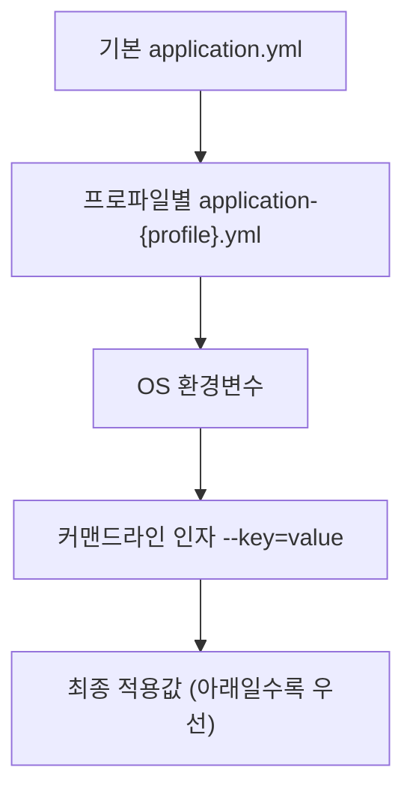

## 환경마다 다른 값, 어떻게 관리하지

개발 DB와 운영 DB 주소가 다르고, 로컬에선 로그를 자세히, 운영에선 간략히 찍고 싶습니다. 이런 값을 코드에 박아두면 환경이 바뀔 때마다 재빌드해야 하죠. Spring Boot의 **외부 설정(Externalized Configuration)** 은 이 문제를 깔끔하게 풀어줍니다.

## application.yml과 우선순위

설정은 `application.properties` 또는 `application.yml`에 둡니다. 계층 구조라 `yml`이 읽기 좋아 저는 주로 yml을 씁니다.

```yaml
spring:
  datasource:
    url: jdbc:postgresql://localhost:5432/dev
app:
  upload:
    max-size: 10MB
    allowed-types: [jpg, png, pdf]
```

중요한 건 **여러 곳의 설정이 정해진 우선순위로 덮어쓰기** 된다는 점입니다. 대략 아래로 갈수록 우선합니다.



덕분에 운영 서버에서는 코드 수정 없이 환경변수나 실행 인자로 값을 덮을 수 있습니다.

```bash
java -jar app.jar --spring.datasource.url=jdbc:postgresql://prod-db:5432/app
```

## @Value보다 @ConfigurationProperties

값을 코드로 가져올 때 `@Value("${app.upload.max-size}")`를 쓸 수도 있지만, 값이 많아지면 흩어지고 타입 안전성도 떨어집니다. 관련 설정을 **하나의 타입으로 묶는** `@ConfigurationProperties`가 훨씬 깔끔합니다.

```java
@ConfigurationProperties(prefix = "app.upload")
public record UploadProperties(
        DataSize maxSize,
        List<String> allowedTypes
) {}
```

```java
@SpringBootApplication
@ConfigurationPropertiesScan   // @ConfigurationProperties 타입 스캔
public class DemoApplication { }
```

이러면 `app.upload.max-size`가 `DataSize` 타입으로 자동 변환되고, `allowed-types`(케밥케이스)가 `allowedTypes`(카멜케이스)에 자동 매핑됩니다. 이를 **느슨한 바인딩(relaxed binding)** 이라고 합니다. 검증도 붙일 수 있습니다.

```java
@ConfigurationProperties(prefix = "app.upload")
@Validated
public record UploadProperties(
        @NotNull DataSize maxSize,
        @NotEmpty List<String> allowedTypes
) {}
```

## Profile로 환경 분리

환경별 설정은 `application-{profile}.yml`로 나눕니다.

```text
application.yml          # 공통
application-local.yml    # 로컬
application-prod.yml     # 운영
```

활성 프로파일을 지정하면 공통 + 해당 프로파일 설정이 합쳐집니다.

```bash
java -jar app.jar --spring.profiles.active=prod
```

특정 프로파일에서만 Bean을 등록하고 싶다면 `@Profile`을 씁니다.

```java
@Bean
@Profile("local")
public CommandLineRunner seedData(UserRepository repo) {
    return args -> repo.saveAll(testUsers()); // 로컬에서만 테스트 데이터 주입
}
```

## 정리

- 환경마다 다른 값은 코드가 아니라 `application.yml` + 환경변수/실행 인자로.
- 설정은 **우선순위로 덮어쓰기** 된다(커맨드라인 > 환경변수 > 프로파일 yml > 기본 yml).
- 값이 많으면 `@Value` 대신 **`@ConfigurationProperties`**로 타입 안전하게 묶고, `@Validated`로 검증까지.
- 환경 분리는 `application-{profile}.yml` + `@Profile`.
