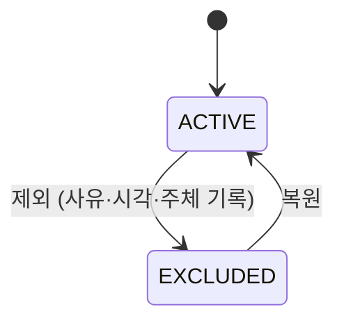

어떤 주에는 두 엔티티를 잇는 매핑에서 일부 항목을 빼는 기능을 다뤘다. 처음 떠오르는 구현은 `DELETE`다. 그런데 운영자가 "어제 뺐던 걸 되돌려달라"고 하는 순간 문제가 드러난다. 행이 사라졌으니 무엇을, 누가, 언제 뺐는지 알 길이 없다. 핵심은 **제외는 삭제가 아니라 상태 전이**라는 점이다.

## soft delete가 아니라 '제외/복원'이다

soft delete(`deleted_at`, `is_deleted`)와 자주 혼동되지만 의미가 다르다.

- **soft delete**: "이 데이터는 더 이상 존재하지 않는 것으로 친다." 되돌림은 예외적 복구다.
- **제외(exclude)**: "이 관계는 지금은 비활성이지만 정상적인 업무 흐름에서 다시 켜질 수 있다." 토글이 일상이다.

따라서 제외는 단순 boolean보다 **상태 + 이력**으로 모델링하는 편이 정확하다. 누가 언제 왜 제외했고, 누가 언제 복원했는지가 업무 질문으로 들어오기 때문이다.



## 모델링

매핑 테이블에 상태 컬럼과 감사 컬럼을 둔다. 행은 절대 지우지 않는다.

```sql
CREATE TABLE user_product_map (
    id            BIGINT PRIMARY KEY,
    user_id       BIGINT NOT NULL,
    product_id    BIGINT NOT NULL,
    status        VARCHAR(10) NOT NULL DEFAULT 'ACTIVE', -- ACTIVE | EXCLUDED
    excluded_at   DATETIME NULL,
    excluded_by   BIGINT   NULL,
    exclude_reason VARCHAR(200) NULL,
    UNIQUE KEY uq_map (user_id, product_id)
);
```

제외와 복원은 `UPDATE`다.

```sql
-- 제외
UPDATE user_product_map
   SET status = 'EXCLUDED', excluded_at = NOW(), excluded_by = :adminId, exclude_reason = :reason
 WHERE id = :id AND status = 'ACTIVE';

-- 복원
UPDATE user_product_map
   SET status = 'ACTIVE', excluded_at = NULL, excluded_by = NULL, exclude_reason = NULL
 WHERE id = :id AND status = 'EXCLUDED';
```

조건절에 현재 상태를 함께 넣는 게 중요하다. 이미 제외된 행을 다시 제외하거나, 활성 행을 복원하는 잘못된 요청이 와도 `affected rows = 0`으로 안전하게 흘려보낼 수 있다.

## 조회는 두 갈래로 나뉜다

일반 조회는 제외 항목을 가려야 하고, 복원 화면은 오히려 제외 항목만 보여야 한다.

```sql
-- 일반 목록: 활성만
SELECT * FROM user_product_map WHERE user_id = :uid AND status = 'ACTIVE';

-- 복원 화면: 제외된 것만, 최근 제외 순
SELECT * FROM user_product_map
 WHERE user_id = :uid AND status = 'EXCLUDED'
 ORDER BY excluded_at DESC;
```

기본 조회에 `status='ACTIVE'`를 빠뜨리면 제외한 항목이 그대로 노출된다. 이런 누락을 막으려면 활성 행만 보는 뷰를 만들어 일반 조회를 거기에 태우는 방법도 있다.

## 운영 함정

**유니크 제약과 재추가의 충돌.** `(user_id, product_id)`에 유니크 제약을 걸어두면, 제외했던 조합을 다시 추가할 때 `INSERT`가 중복 키로 터진다. 행을 지우지 않으니 옛 제외 행이 남아 있기 때문이다. 해법은 재추가를 `INSERT`가 아니라 **제외 행 복원(UPDATE)**으로 처리하는 것이다. "추가" 요청이 오면 먼저 기존 행이 있는지 보고, 있으면 복원, 없으면 삽입한다.

**제외가 누적되는 테이블의 인덱스.** 제외 행이 영구히 쌓이면 활성 행 비율이 떨어진다. 조회 대부분이 `status='ACTIVE'`를 타므로, `status`를 선행 컬럼으로 둔 복합 인덱스나 부분 인덱스로 활성 행만 빠르게 좁히는 게 좋다.

## 핵심 요약

- 되살릴 수 있어야 하는 "빼기"는 `DELETE`가 아니라 상태 전이로 모델링한다.
- soft delete는 "없는 셈", 제외는 "지금은 꺼둔 것"으로 의미가 다르다.
- `UPDATE` 조건절에 현재 상태를 넣어 잘못된 전이를 무해하게 만든다.
- 유니크 제약이 있다면 재추가는 삽입이 아니라 제외 행 복원으로 처리한다.

> **면접 Q.** soft delete와 '제외/복원'을 같은 boolean으로 구현하면 무엇이 부족한가?
> **A.** boolean만으로는 누가·언제·왜 제외했는지 이력이 남지 않고, 토글이 일상인 업무에서 복원 화면·재추가 충돌·감사 요구를 충족하지 못한다.
