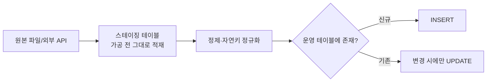

외부에서 받은 데이터를 일괄 적재한 주가 있었다. 외부 데이터는 항상 더럽다. 같은 레코드가 여러 번 들어오고, 어제 받은 것과 오늘 받은 것이 겹친다. 무작정 INSERT하면 중복이 쌓이고, 매 적재가 멱등하지 않으면 재실행할 때마다 데이터가 불어난다. 핵심은 **무엇으로 "같은 레코드"를 판정할 것인가** — 자연키 설계다.

## 자연키 매칭

DB가 부여한 자동 증가 PK(대리키, surrogate key)는 외부 데이터를 식별하지 못한다. 외부 레코드가 같은지 판정하려면 **비즈니스 의미상 유일한 컬럼 조합** — 자연키(natural key)가 필요하다. 예: `(공급사코드, 상품번호)`, `(이메일)`, `(주문일자, 거래번호)`.

이 자연키에 **유니크 제약**을 걸어두는 것이 1차 방어선이다. 제약이 있으면 중복 INSERT는 DB가 거부한다.

```sql
CREATE TABLE product (
    id           BIGINT AUTO_INCREMENT PRIMARY KEY,   -- 대리키
    supplier_id  VARCHAR(32)  NOT NULL,
    sku          VARCHAR(64)  NOT NULL,
    name         VARCHAR(255) NOT NULL,
    price        DECIMAL(12,2),
    UNIQUE KEY uk_natural (supplier_id, sku)            -- 자연키
);
```

## 스테이징 후 머지

대량 데이터를 운영 테이블에 직접 행별로 넣으며 중복 검사를 하면 느리고 위험하다. 정석은 **스테이징 테이블**을 거치는 것이다.



1. 받은 데이터를 스테이징 테이블에 그대로 적재(빠른 벌크 로드).
2. 스테이징 안에서 자연키 기준으로 자기 중복을 먼저 제거(같은 배치에 같은 키가 여러 번 올 수 있다).
3. 운영 테이블과 자연키로 매칭해 **신규는 INSERT, 기존은 변경분만 UPDATE**(merge/upsert).

이렇게 하면 적재가 멱등해진다 — 같은 파일을 두 번 돌려도 결과가 같다.

## UPSERT

DB의 upsert 구문을 쓰면 "있으면 갱신, 없으면 삽입"을 한 문장으로 처리한다(자연키 유니크 제약 필수).

```sql
INSERT INTO product (supplier_id, sku, name, price)
SELECT supplier_id, sku, name, price FROM product_staging
ON DUPLICATE KEY UPDATE
    name  = VALUES(name),
    price = VALUES(price);   -- 자연키 충돌 시 갱신
```

PostgreSQL이면 `INSERT ... ON CONFLICT (supplier_id, sku) DO UPDATE`로 같은 일을 한다. 중요한 건 **충돌 판정 기준이 자연키 유니크 제약과 일치**해야 한다는 점이다.

## 운영 함정

- **자연키 정규화 누락**: `"ABC "`와 `"abc"`를 다른 키로 보면 중복이 그대로 들어온다. 공백·대소문자·전각/반각을 적재 전에 통일해야 유니크 제약이 의미를 갖는다.
- **무변경 행도 UPDATE**: 매 적재마다 모든 행을 UPDATE하면 변경 없는 수십만 행이 쓰기 부하 + 트리거/감사로그를 유발한다. 값이 실제로 달라진 행만 갱신하도록 조건을 건다.

## 핵심 요약

- 중복 판정의 기준은 자연키다 — 정하고 유니크 제약을 건다.
- 대량 적재는 스테이징 → 정제 → merge로, 멱등하게 만든다.
- 자연키는 적재 전에 정규화해야 유니크 제약이 제대로 작동한다.
