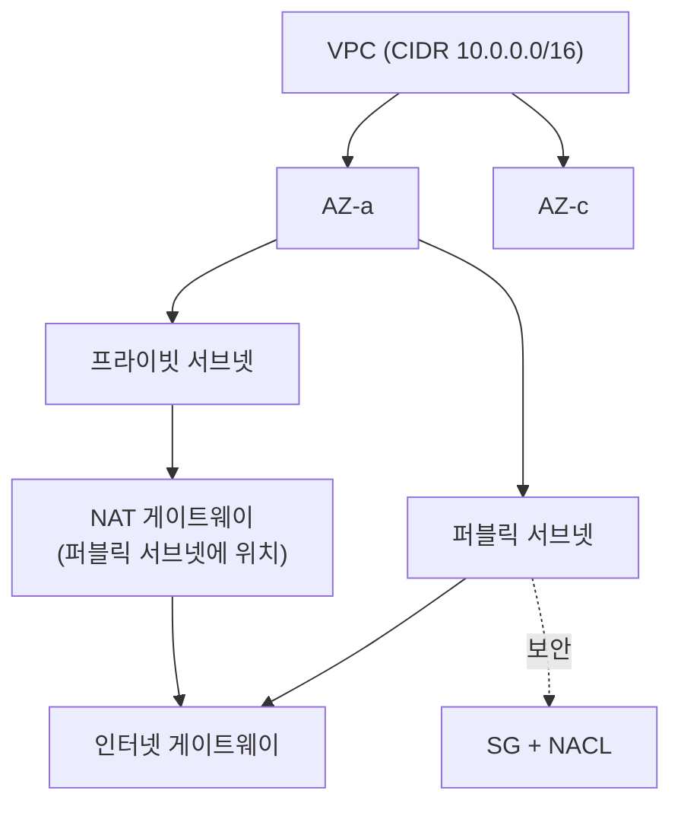

## "서브넷을 퍼블릭으로 만든 게 뭐였더라"

VPC를 처음 다루면 누구나 같은 곳에서 막힙니다. "퍼블릭 서브넷"이라는 체크박스를 찾다 못 찾습니다. 그런 건 없기 때문입니다. **서브넷을 퍼블릭으로 만드는 건 라우팅 테이블의 단 한 줄** — `0.0.0.0/0 → 인터넷 게이트웨이` — 입니다. 이 한 줄이 있으면 퍼블릭, 없으면 프라이빗입니다.

VPC는 마법이 아니라, 이 시리즈에서 쌓은 것들([IP/서브넷](), [라우팅](), [NAT](), [방화벽]())을 소프트웨어로 다시 그린 것입니다. 그래서 라우팅 테이블만 읽을 줄 알면 VPC의 90%가 풀립니다.

## VPC 한 장으로 보기 — 트래픽은 어디로 흐르나

VPC(예 `10.0.0.0/16`)는 클라우드 속 내 사설 네트워크입니다. 그 안을 **서브넷**으로 쪼개고, 각 서브넷이 어떤 **라우팅 테이블**을 보느냐로 성격이 정해집니다. 아래에서 <span style="color:#2f9e44;font-weight:600">초록</span>은 인터넷으로 직접 나가는 퍼블릭 경로, <span style="color:#f08c00;font-weight:600">주황</span>은 프라이빗 서브넷이 **NAT GW를 거쳐** 나가는 경로입니다.

<div class="vpc-map" markdown="0">
<style>
.vpc-map{margin:1.4rem 0;overflow-x:auto}
.vpc-map svg{width:100%;max-width:720px;height:auto;display:block;margin:0 auto;font-family:inherit}
.vpc-map .box{fill:none;stroke:currentColor;stroke-width:1.5}
.vpc-map .vpcbox{opacity:.5;stroke-dasharray:5 4}
.vpc-map .sub{fill:currentColor;font-size:10px;opacity:.6}
.vpc-map .lbl{fill:currentColor;font-size:11px;font-weight:600}
.vpc-map .ln{stroke:currentColor;opacity:.25;stroke-width:1.6;fill:none}
.vpc-map .pub{fill:#2f9e44}
.vpc-map .prv{fill:#f08c00}
.vpc-map .pub1{animation:vpcpub 4s linear infinite}
.vpc-map .prv1{animation:vpcprv 5s linear infinite}
@keyframes vpcpub{0%{transform:translate(0,0);opacity:0}6%{transform:translate(0,0);opacity:1}94%{transform:translate(510px,0);opacity:1}100%{transform:translate(510px,0);opacity:0}}
@keyframes vpcprv{0%{transform:translate(0,0);opacity:0}6%{transform:translate(0,0);opacity:1}36%{transform:translate(210px,0);opacity:1}51%{transform:translate(210px,-105px);opacity:1}94%{transform:translate(510px,-105px);opacity:1}100%{transform:translate(510px,-105px);opacity:0}}
</style>
<svg viewBox="0 0 700 230" role="img" aria-label="VPC 안 퍼블릭 서브넷은 인터넷 게이트웨이로 직접 나가고 프라이빗 서브넷은 NAT 게이트웨이를 거쳐 나가는 트래픽 경로 애니메이션">
  <rect class="box vpcbox" x="20" y="30" width="470" height="180" rx="10"/>
  <text class="lbl" x="30" y="48">VPC 10.0.0.0/16</text>
  <rect class="box" x="60" y="55" width="180" height="38" rx="6"/>
  <text class="lbl" x="150" y="73" text-anchor="middle">퍼블릭 서브넷</text>
  <text class="sub" x="150" y="87" text-anchor="middle">10.0.1.0/24 · 라우트→IGW</text>
  <rect class="box" x="60" y="158" width="180" height="38" rx="6"/>
  <text class="lbl" x="150" y="176" text-anchor="middle">프라이빗 서브넷</text>
  <text class="sub" x="150" y="190" text-anchor="middle">10.0.2.0/24 · 라우트→NATGW</text>
  <rect class="box" x="300" y="55" width="120" height="38" rx="6"/>
  <text class="lbl" x="360" y="78" text-anchor="middle">NAT GW</text>
  <rect class="box" x="510" y="52" width="60" height="44" rx="6"/>
  <text class="lbl" x="540" y="78" text-anchor="middle">IGW</text>
  <text class="sub" x="650" y="78" text-anchor="middle">인터넷</text>
  <line class="ln" x1="240" y1="70" x2="510" y2="70"/>
  <line class="ln" x1="240" y1="175" x2="360" y2="175"/>
  <line class="ln" x1="360" y1="158" x2="360" y2="93"/>
  <line class="ln" x1="570" y1="74" x2="630" y2="74"/>
  <rect class="pub pub1" x="143" y="64" width="14" height="12" rx="2"/>
  <rect class="prv prv1" x="143" y="169" width="14" height="12" rx="2"/>
</svg>
</div>

프라이빗 서브넷의 인스턴스는 **공인 IP가 없어** 인터넷에서 직접 도달할 수 없습니다. 밖으로 나가는 트래픽(패키지 다운로드 등)만 **NAT GW**를 통해 나가고, 그 NAT GW가 퍼블릭 서브넷에서 IGW로 나갑니다. DB·내부 서비스를 이 프라이빗 서브넷에 두는 게 기본 보안 패턴입니다.

## 1. 서브넷을 가르는 건 라우팅 테이블 한 줄

각 서브넷은 정확히 하나의 라우팅 테이블에 연결됩니다. 그 테이블에 **인터넷 게이트웨이(IGW)로 가는 기본 경로가 있느냐**가 퍼블릭/프라이빗을 정의합니다.

<div class="vpc-rt" markdown="0">
<style>
.vpc-rt{margin:1.4rem 0;overflow-x:auto}
.vpc-rt svg{width:100%;max-width:660px;height:auto;display:block;margin:0 auto;font-family:inherit}
.vpc-rt .row{fill:none;stroke:currentColor;stroke-width:1.3;opacity:.4}
.vpc-rt .lbl{fill:currentColor;font-size:11px}
.vpc-rt .hd{fill:currentColor;font-size:12px;font-weight:700}
.vpc-rt .local{fill:#1971c2;font-weight:700}
.vpc-rt .igw{fill:#2f9e44;font-weight:700}
.vpc-rt .nat{fill:#f08c00;font-weight:700}
.vpc-rt .glow{opacity:.0;animation:vpcrtg 4s ease-in-out infinite}
@keyframes vpcrtg{0%,100%{opacity:0}50%{opacity:.18}}
</style>
<svg viewBox="0 0 640 180" role="img" aria-label="퍼블릭 서브넷과 프라이빗 서브넷 라우팅 테이블의 기본 경로 차이를 강조하는 애니메이션">
  <text class="hd" x="20" y="22">퍼블릭 라우팅 테이블</text>
  <text class="lbl" x="20" y="50">10.0.0.0/16</text><text class="lbl local" x="220" y="50">→ local</text>
  <rect class="glow" x="14" y="58" width="290" height="26" rx="5" style="fill:#2f9e44"/>
  <text class="lbl" x="20" y="78">0.0.0.0/0</text><text class="lbl igw" x="220" y="78">→ igw (인터넷)</text>
  <line class="row" x1="14" y1="92" x2="304" y2="92"/>

  <text class="hd" x="350" y="22">프라이빗 라우팅 테이블</text>
  <text class="lbl" x="350" y="50">10.0.0.0/16</text><text class="lbl local" x="550" y="50">→ local</text>
  <text class="lbl" x="350" y="78">0.0.0.0/0</text><text class="lbl nat" x="550" y="78">→ nat-gw</text>
  <line class="row" x1="344" y1="92" x2="634" y2="92"/>
  <text class="lbl" x="20" y="130" style="opacity:.7">두 테이블 모두 VPC 내부(10.0.0.0/16)는 local — VPC 안 통신은 항상 됨.</text>
  <text class="lbl" x="20" y="150" style="opacity:.7">차이는 기본 경로(0.0.0.0/0)의 타깃: <tspan class="igw">IGW</tspan> = 퍼블릭, <tspan class="nat">NAT</tspan> = 프라이빗.</text>
</svg>
</div>

`local` 경로는 자동 생성되어 **지울 수 없습니다** — VPC 안끼리는 SG/NACL이 막지 않는 한 항상 통신됩니다([longest prefix match]()로 더 구체적인 `local`이 항상 우선). 외부 연결성은 오직 `0.0.0.0/0`의 타깃이 결정합니다.

| 서브넷 | 0.0.0.0/0 타깃 | 인터넷에서 들어옴 | 인터넷으로 나감 |
|--------|----------------|------------------|-----------------|
| 퍼블릭 | **IGW** | 가능(공인 IP/EIP 필요) | 가능 |
| 프라이빗 | **NAT GW** | 불가 | 가능(아웃바운드만) |
| 격리(isolated) | 없음 | 불가 | 불가 |

> **퍼블릭 IP만으론 부족하다.** 인스턴스에 공인 IP가 있어도 서브넷 라우팅 테이블에 IGW 경로가 없으면 인터넷이 안 됩니다. "EIP 붙였는데 안 돼요"의 90%가 IGW 라우트 누락입니다. 반대로, **프라이빗 서브넷에 실수로 IGW 라우트를 넣으면** 내부용 자원이 통째로 노출됩니다.

## 2. VPC의 구성요소 지도



- **CIDR 블록**: VPC 생성 시 `10.0.0.0/16` 같은 사설 대역을 잡고, 서브넷으로 쪼갭니다. 한 번 정하면 줄이기 어렵고 **다른 VPC와 겹치면 피어링 불가**하니 처음부터 넓고 안 겹치게.
- **가용영역(AZ)**: 서브넷은 **하나의 AZ에 속합니다.** 고가용성은 같은 역할의 서브넷을 여러 AZ에 두고 그 위에 로드밸런서를 얹어 얻습니다([로드밸런싱]()).
- **IGW**: VPC와 인터넷의 접점(수평 확장되는 관리형, 단일 장애점 아님). VPC당 하나.
- **NAT GW**: 프라이빗 서브넷의 아웃바운드 전용 출구. **퍼블릭 서브넷에 놓고** EIP를 붙입니다(시간·데이터 처리량 과금 — 비용 함정 단골).

## 3. VPC 바깥과 잇기: 피어링 · TGW · 엔드포인트

VPC는 기본적으로 고립돼 있습니다. 다른 네트워크와 잇는 방법이 곧 클라우드 네트워크 설계입니다.

| 방법 | 용도 | 특징 / 함정 |
|------|------|-------------|
| **VPC 피어링** | VPC ↔ VPC 1:1 | 저렴·저지연. **비전이적(non-transitive)**: A–B, B–C가 있어도 A–C는 안 됨. CIDR 겹치면 불가 |
| **Transit Gateway** | 다수 VPC·온프레미스 허브 | 별 구조로 N:N을 한곳에서. 피어링 메시 폭발을 대체 |
| **게이트웨이 엔드포인트** | S3·DynamoDB 접근 | 라우팅 테이블에 prefix-list 추가. NAT GW 없이 사설로, **무료** |
| **인터페이스 엔드포인트(PrivateLink)** | 그 외 AWS·SaaS | 서브넷에 ENI 생성, 트래픽이 인터넷을 안 탐 |

> **피어링 비전이성은 시험과 장애의 단골.** 허브-스포크로 여러 VPC를 엮으려고 피어링을 메시로 깔다 보면, "분명 연결했는데 두 단계 건너편이 안 된다"를 만납니다. 라우팅이 전파되지 않기 때문입니다. 규모가 커지면 **Transit Gateway**가 정답입니다.

## 4. 보안: SG + NACL은 VPC 위에서 동작

VPC는 무대, 트래픽 통제는 [SG와 NACL]()이 합니다. 프라이빗 서브넷(라우팅상 격리) + SG(인스턴스 정밀 허용) + NACL(서브넷 광역 차단)의 **3중 방어**가 표준입니다. 프라이빗 서브넷에 DB를 두고, SG에서 "웹 서버 SG로부터의 5432 포트만" 허용하면 IP를 몰라도 최소 권한이 됩니다.

## 5. 디버깅: 연결이 안 될 때 보는 순서

```bash
# 1) 서브넷이 보는 라우팅 테이블에 올바른 경로가 있나
aws ec2 describe-route-tables --filters Name=association.subnet-id,Values=subnet-xxx

# 2) 어디서 막혔나 (SG/NACL vs 라우팅)
#    Flow Logs에 REJECT면 SG/NACL, 애초에 로그가 없으면 라우팅/도달 문제
```

체크 순서: **라우팅 테이블(경로 존재?) → SG(인바운드 허용?) → NACL(양방향·ephemeral?) → 공인 IP/NAT 경로**. 이 순서로 좁히면 대부분의 "연결 안 됨"이 풀립니다. Flow Logs에 패킷이 아예 안 보이면 SG/NACL 이전, 즉 **라우팅이나 도달성** 문제입니다.

## 면접/리뷰 단골 질문

- **Q. 서브넷을 퍼블릭으로 만드는 건 정확히 무엇인가?** → 그 서브넷의 라우팅 테이블에 `0.0.0.0/0 → IGW` 경로가 있는 것. 체크박스가 아니라 라우트 한 줄.
- **Q. 프라이빗 인스턴스가 외부 API를 호출하려면?** → NAT GW를 통해 아웃바운드. 인바운드는 여전히 불가. AWS 서비스라면 PrivateLink/게이트웨이 엔드포인트가 더 낫다.
- **Q. VPC 피어링으로 3개 이상을 엮을 때 주의점은?** → 비전이성. 메시가 폭발하므로 Transit Gateway 허브로. CIDR 중첩 금지.
- **Q. EIP를 붙였는데 인터넷이 안 된다?** → 라우팅 테이블 IGW 경로, SG 인바운드/아웃바운드, NACL 순으로 점검. 대개 IGW 라우트 누락.

## 정리

- VPC는 IP·서브넷·라우팅·NAT·방화벽을 **소프트웨어로 다시 그린 사설 네트워크**다.
- 퍼블릭/프라이빗을 가르는 건 체크박스가 아니라 **라우팅 테이블의 `0.0.0.0/0` 타깃**(IGW냐 NAT GW냐).
- 서브넷은 **AZ 단위**, 고가용성은 다중 AZ + 로드밸런서. IGW는 VPC당 하나, NAT GW는 퍼블릭 서브넷에 두는 아웃바운드 출구.
- VPC 연결은 **피어링(비전이·CIDR 비중첩) / Transit Gateway(허브) / 엔드포인트(PrivateLink)**. 통제는 그 위의 **SG + NACL**.
- 디버깅은 **라우팅 → SG → NACL → 공인IP/NAT** 순, 그리고 **Flow Logs**.

> 관련 글: 이 무대 위의 트래픽 통제 [방화벽·SG·NACL](), 주소 변환 [NAT](), 다중 AZ로 트래픽을 분산하는 [로드밸런싱]().
