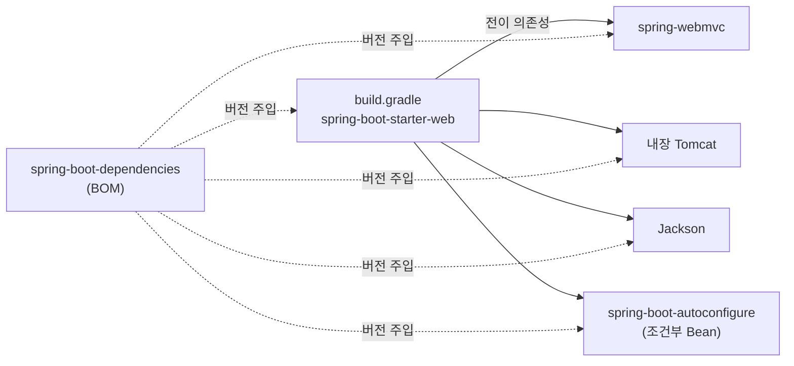

## 라이브러리 버전 맞추기가 왜 이렇게 힘들까

Spring을 직접 쓰던 시절, 가장 짜증 났던 건 **버전 충돌**이었습니다. `spring-web`, `spring-context`, Jackson, 로깅 라이브러리… 각각 호환되는 버전을 일일이 찾아 맞춰야 했고, 하나만 어긋나도 `NoSuchMethodError`/`NoClassDefFoundError` 같은 게 **런타임에** 터졌습니다. 이른바 "jar 지옥"이죠. 😵

Spring Boot의 **Starter**와 **의존성 관리(BOM)** 가 이 고통을 거의 없애줍니다. 그런데 이 글에서는 "편하다"에서 멈추지 않고, **starter 안에 코드가 거의 없다는 사실**, **BOM이 정확히 어떤 메커니즘으로 버전을 결정하는지**, 그리고 **내가 직접 starter를 만들 때 무엇을 어디에 넣어야 하는지**까지 내려갑니다.

## 한눈에 보기: starter 한 줄이 일으키는 일

`build.gradle`에 버전 없이 starter 한 줄을 적으면, **BOM이 버전을 도장 찍고**, 그 starter가 끌고 오는 전이 의존성 — 라이브러리 jar들과 **autoconfigure 모듈** — 이 함께 따라옵니다. <span style="color:#1971c2;font-weight:600">파랑</span>은 라이브러리, <span style="color:#2f9e44;font-weight:600">초록</span>은 자동 구성으로 이어지는 흐름입니다.

<div class="starter-flow" markdown="0">
<style>
.starter-flow{margin:1.4rem 0;overflow-x:auto}
.starter-flow svg{width:100%;max-width:720px;height:auto;display:block;margin:0 auto;font-family:inherit}
.starter-flow .lbl{fill:currentColor;font-size:12.5px;font-weight:600}
.starter-flow .sub{fill:currentColor;font-size:9px;opacity:.55}
.starter-flow .arr{stroke:currentColor;opacity:.3;stroke-width:1.5;fill:none}
.starter-flow rect.box{fill:none;stroke:currentColor;stroke-width:1.5;opacity:.35}
.starter-flow rect.bom{animation:sfpulse 4s ease-in-out infinite 1s}
.starter-flow circle.up{fill:#1971c2;animation:sfup 4s ease-in-out infinite}
.starter-flow circle.up2{fill:#1971c2;animation:sfup 4s ease-in-out infinite 2s}
.starter-flow circle.down{fill:#2f9e44;animation:sfdown 4s ease-in-out infinite .4s}
@keyframes sfpulse{0%,100%{opacity:.3}45%{opacity:.9}}
@keyframes sfup{0%{transform:translate(0,0);opacity:0}8%{opacity:1}38%{transform:translate(255px,0);opacity:1}46%{transform:translate(255px,0)}76%{transform:translate(535px,-58px);opacity:1}100%{transform:translate(560px,-58px);opacity:0}}
@keyframes sfdown{0%{transform:translate(0,0);opacity:0}8%{opacity:1}38%{transform:translate(255px,0);opacity:1}46%{transform:translate(255px,0)}76%{transform:translate(535px,56px);opacity:1}100%{transform:translate(560px,56px);opacity:0}}
</style>
<svg viewBox="0 0 700 200" role="img" aria-label="starter 선언이 BOM을 거쳐 버전이 결정되고 라이브러리 jar와 autoconfigure 모듈이 따라오는 흐름 애니메이션">
  <rect class="box"     x="6"   y="74" width="150" height="52" rx="8"/>
  <rect class="box bom" x="210" y="74" width="150" height="52" rx="8"/>
  <rect class="box"     x="470" y="16" width="170" height="52" rx="8"/>
  <rect class="box"     x="470" y="132" width="170" height="52" rx="8"/>
  <text class="lbl" x="81"  y="98"  text-anchor="middle">starter 선언</text>
  <text class="sub" x="81"  y="114" text-anchor="middle">버전 생략</text>
  <text class="lbl" x="285" y="96"  text-anchor="middle">spring-boot-dependencies</text>
  <text class="sub" x="285" y="112" text-anchor="middle">BOM · 버전 결정</text>
  <text class="lbl" x="555" y="40"  text-anchor="middle">라이브러리 jar</text>
  <text class="sub" x="555" y="56"  text-anchor="middle">Tomcat · Jackson…</text>
  <text class="lbl" x="555" y="156" text-anchor="middle">autoconfigure 모듈</text>
  <text class="sub" x="555" y="172" text-anchor="middle">→ 조건부 Bean</text>
  <line class="arr" x1="156" y1="100" x2="210" y2="100"/>
  <line class="arr" x1="360" y1="92"  x2="470" y2="46"/>
  <line class="arr" x1="360" y1="108" x2="470" y2="156"/>
  <circle class="up"   cx="20" cy="100" r="7"/>
  <circle class="up2"  cx="20" cy="100" r="7"/>
  <circle class="down" cx="20" cy="100" r="7"/>
</svg>
</div>

구조를 정적으로 보면, starter는 사실상 **"무엇을 끌고 올지 적어둔 목록"** 에 가깝습니다.



## 진실 1: Starter에는 코드가 거의 없다

`spring-boot-starter-web`의 jar를 열어보면 클래스가 **거의 없습니다.** starter는 본질적으로 **거의 빈 모듈**이고, 그 안의 `pom.xml`이 "이 기능을 하려면 보통 같이 필요한 것들"을 **전이 의존성**으로 선언해 둔 게 전부입니다.

그래서 starter를 추가하는 행위는 "라이브러리 추가"라기보다 **"의도(웹을 하고 싶다)를 선언"** 하는 것에 가깝습니다.

```gradle
dependencies {
    implementation 'org.springframework.boot:spring-boot-starter-web'
    implementation 'org.springframework.boot:spring-boot-starter-data-jpa'
    runtimeOnly   'org.postgresql:postgresql'
    testImplementation 'org.springframework.boot:spring-boot-starter-test'
}
```

여기서 핵심 연결고리: `spring-boot-starter-web`은 전이적으로 **`spring-boot-autoconfigure`** 를 끌고 옵니다. 즉 starter를 넣는 순간 [자동 구성]()의 후보 클래스들이 클래스패스에 올라오고, `@ConditionalOnClass`가 충족되면서 톰캣·`DispatcherServlet`·`ObjectMapper`가 알아서 등록됩니다. **"starter = 라이브러리 묶음 + 자동 구성 트리거"** 라고 이해하면 정확합니다.

## 진실 2: BOM이 버전을 결정하는 메커니즘

위 예시에서 Spring 의존성에 **버전이 없는 것** 보이시나요? 이걸 가능하게 하는 게 **BOM(Bill of Materials)** 입니다.

`spring-boot-dependencies`는 그 자체가 하나의 POM인데, 내부에 거대한 **`<dependencyManagement>`** 블록과 버전 프로퍼티를 담고 있습니다. 개념적으로 이렇게 생겼습니다.

```xml
<!-- spring-boot-dependencies (요약) -->
<properties>
    <jackson-bom.version>2.18.x</jackson-bom.version>
    <tomcat.version>11.0.x</tomcat.version>
    <!-- ... 수백 개 ... -->
</properties>
<dependencyManagement>
    <dependencies>
        <dependency>
            <groupId>com.fasterxml.jackson</groupId>
            <artifactId>jackson-bom</artifactId>
            <version>${jackson-bom.version}</version>
            <type>pom</type><scope>import</scope>
        </dependency>
        <!-- ... -->
    </dependencies>
</dependencyManagement>
```

`dependencyManagement`는 **"버전을 강제하지만, 의존성을 추가하지는 않는다"** 가 핵심입니다. 내가 `jackson-databind`를 버전 없이 선언하면 → 빌드 도구가 dependencyManagement에서 "이건 2.18.x" 를 찾아 채워 넣습니다. 그래서 **버전을 안 적어도 되고**, 무엇보다 Boot 팀이 **서로 호환된다고 검증한 조합**을 통째로 받습니다.

### Maven vs Gradle: BOM을 적용하는 두 길

| | 적용 방법 | 비고 |
|---|---|---|
| **Maven (parent)** | `spring-boot-starter-parent`를 `<parent>`로 | BOM + 플러그인 설정 + Java 버전 + UTF-8까지 한 번에 |
| **Maven (parent 못 쓸 때)** | `spring-boot-dependencies`를 `dependencyManagement`에 `<scope>import</scope>` | 이미 다른 parent가 있는 회사 표준 POM에서 유용 |
| **Gradle** | Spring Boot 플러그인이 BOM을 **자동 import**, 또는 `platform('...:spring-boot-dependencies:...')` | `io.spring.dependency-management` 플러그인도 가능 |

`spring-boot-starter-parent`는 `spring-boot-dependencies`를 부모로 두고, 거기에 **플러그인 관리·리소스 필터링·기본 Java 버전·인코딩**까지 얹은 "세팅 묶음"입니다. parent를 쓸 수 없는 환경(이미 사내 parent가 있는 경우)이라면 BOM만 `import` 스코프로 가져오면 됩니다.

```xml
<parent>
    <groupId>org.springframework.boot</groupId>
    <artifactId>spring-boot-starter-parent</artifactId>
    <version>4.1.0</version>
</parent>
```

이 버전 하나만 올리면 수백 개 라이브러리가 **검증된 조합으로 한꺼번에** 올라갑니다. 업그레이드가 "라이브러리 술래잡기"에서 "숫자 하나 바꾸기"로 바뀝니다.

## 버전을 덮어써야 할 때 — 그리고 그 위험

특정 라이브러리만 다른 버전이 필요하면, BOM이 정의한 **버전 프로퍼티를 덮어쓰면** 됩니다. (속성 이름은 `spring-boot-dependencies`에 정의돼 있으니 그걸 따라야 합니다.)

```gradle
// Gradle (Spring Boot 플러그인이 노출하는 버전 프로퍼티 override)
ext['jackson-bom.version'] = '2.18.2'
```

```xml
<!-- Maven: 동일 이름의 프로퍼티를 재정의 -->
<properties>
    <jackson-bom.version>2.18.2</jackson-bom.version>
</properties>
```

> **함정.** 버전 하나를 덮어쓰면 그 라이브러리는 Boot가 검증한 조합에서 **이탈**합니다. 특히 Jackson, Spring Framework, Hibernate처럼 **여러 모듈이 한 버전으로 묶여 움직이는** 것들은, BOM 프로퍼티(`jackson-bom.version` 등) 대신 개별 artifact 버전만 강제하면 모듈 간 버전이 어긋나 `NoSuchMethodError`가 재림합니다. 덮어쓸 거면 **묶음 단위(BOM 프로퍼티)** 로, 그리고 정말 필요할 때만.
{: .prompt-warning }

## 무엇이 어떤 버전으로 들어왔는지 — 의존성 트리 확인

"이 라이브러리 버전이 왜 이거지?"는 추측하지 말고 트리로 확인합니다.

```bash
# Gradle — 특정 설정의 의존성 트리 + 버전 선택 이유
./gradlew dependencies --configuration runtimeClasspath
./gradlew dependencyInsight --dependency jackson-databind

# Maven
mvn dependency:tree -Dincludes=com.fasterxml.jackson.core:jackson-databind
```

`dependencyInsight`는 특정 라이브러리가 **왜 그 버전으로 결정됐는지**(BOM이 강제했는지, 다른 의존성이 끌어왔는지)를 보여줘서, 버전 충돌 디버깅의 1순위 도구입니다.

## 직접 starter 만들기 — 2-모듈 관례

사내 공통 모듈(예: 표준 로깅·인증 클라이언트)을 starter로 배포하면, 팀들이 의존성 한 줄로 가져다 씁니다. 공식 관례는 **모듈 2개로 분리**입니다.

```text
acme-spring-boot-autoconfigure/   ← 실제 코드 + @AutoConfiguration + imports 파일
acme-spring-boot-starter/         ← 코드 없음. autoconfigure + 필수 라이브러리를 의존성으로 선언
```

> **이름 규칙.** 공식 starter는 `spring-boot-starter-*`를 씁니다. 서드파티/사내 starter는 **`acme-spring-boot-starter`** 처럼 *이름을 앞*에 둬야 합니다. 이 접두사 영역은 Spring 팀이 예약해 둔 곳이라 충돌·혼동을 피하기 위함입니다.

autoconfigure 모듈의 핵심 (자동 구성 글과 동일한 패턴):

```java
@AutoConfiguration
@ConditionalOnClass(AcmeClient.class)
@EnableConfigurationProperties(AcmeProperties.class)
public class AcmeAutoConfiguration {

    @Bean
    @ConditionalOnMissingBean              // 사용자가 직접 정의하면 양보
    AcmeClient acmeClient(AcmeProperties props) {
        return new AcmeClient(props.endpoint(), props.timeout());
    }
}
```

```text
# acme-spring-boot-autoconfigure/src/main/resources/META-INF/spring/
#   org.springframework.boot.autoconfigure.AutoConfiguration.imports
com.acme.autoconfigure.AcmeAutoConfiguration
```

### starter에 넣을 것 vs autoconfigure에 넣을 것

이게 자작 starter에서 가장 자주 틀리는 지점입니다.

| 무엇을 | 어디에 | 어떻게 |
|--------|--------|--------|
| 기능에 **꼭 필요한** 런타임 라이브러리 | **starter** 모듈 | 일반 의존성 |
| autoconfigure가 컴파일에 참조하지만 **선택적**인 것 | **autoconfigure** 모듈 | `optional` (Gradle `compileOnly`/`optional`) |
| 프로퍼티 IDE 자동완성 메타데이터 | autoconfigure 모듈 | `spring-boot-configuration-processor` (annotationProcessor) |

원칙: **autoconfigure 모듈의 라이브러리 의존성은 가능하면 `optional`** 로 두어, 그 라이브러리를 쓰지 않는 사용자가 강제로 받지 않게 합니다. 그리고 "이 기능을 켜면 반드시 필요한" 것들만 **starter**가 떳떳하게 끌고 옵니다. `spring-boot-configuration-processor`를 넣으면 `application.yml`에서 내 커스텀 프로퍼티가 자동완성됩니다.

## 면접/리뷰 단골 질문

- **Q. starter를 추가했는데 왜 자동으로 Bean까지 뜨나?** → starter가 전이적으로 `*-autoconfigure`를 끌고 오고, 그 안의 `@AutoConfiguration`이 `@ConditionalOnClass` 충족 시 Bean을 등록하기 때문. starter는 "라이브러리 + 자동 구성"의 묶음이다.
- **Q. 버전을 안 적어도 되는 이유는?** → `spring-boot-dependencies` BOM의 `dependencyManagement`가 버전을 강제. dependencyManagement는 "버전만 정하고 의존성은 추가하지 않는다".
- **Q. 특정 라이브러리 버전만 올렸더니 `NoSuchMethodError`가 났다. 왜?** → 여러 모듈이 한 버전으로 묶인 라이브러리를 개별로 덮어써 모듈 간 버전이 어긋난 것. BOM 프로퍼티(묶음 단위)로 올려야 한다.
- **Q. 사내 공통 모듈을 starter로 만든다면 구조는?** → autoconfigure 모듈(코드 + imports) + starter 모듈(빈 모듈, 의존성 선언)로 2분할. 이름은 `acme-spring-boot-starter`.

## 정리

- **Starter** = 거의 빈 모듈. `pom`이 전이 의존성으로 "필요한 라이브러리 + `*-autoconfigure`"를 선언한 것 → 추가하면 자동 구성까지 따라온다.
- **BOM(`spring-boot-dependencies`)** 의 `dependencyManagement`가 호환 버전 조합을 강제 → 그래서 버전을 안 적어도 된다.
- 업그레이드는 **parent/플러그인 버전 하나**만 올리면 검증된 조합으로 일괄 적용.
- 버전 덮어쓰기는 **묶음 단위(BOM 프로퍼티)** 로, 최소한으로. 개별 override는 모듈 간 버전 깨짐의 원인.
- 자작 starter는 **autoconfigure 모듈 + starter 모듈** 2분할, 이름은 `acme-spring-boot-starter`, autoconfigure 의존성은 `optional`.

> 관련 글: starter가 끌고 오는 자동 구성의 동작 원리는 [자동 구성 글]()에서, 그 출발점인 `@SpringBootApplication`은 [이 글]()에서 다룹니다.
