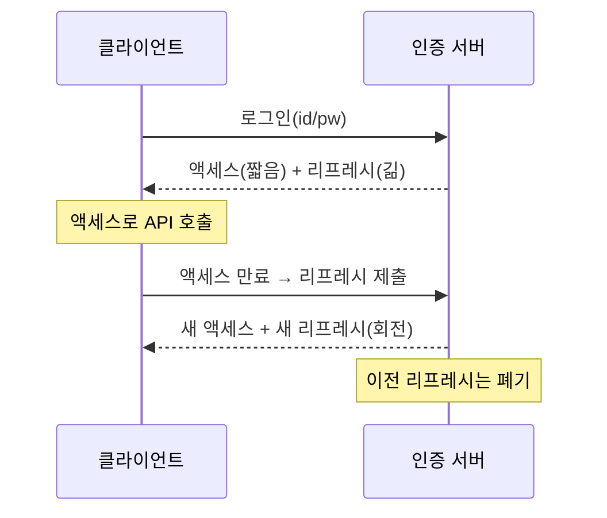

토큰 기반 인증의 갱신 로직을 다룬 주가 있었다. 왜 토큰을 하나로 안 쓰고 굳이 짧은 액세스 토큰과 긴 리프레시 토큰 두 개로 나눌까. 답은 **노출 시간과 사용 빈도의 트레이드오프**에 있다. 이 분리를 이해하면 회전(rotation)과 탈취 대응까지 자연스럽게 따라온다.

## 왜 둘로 나누나

- **액세스 토큰**: 매 API 요청에 실려 다닌다. 노출 빈도가 높다. 그래서 **수명을 짧게**(분 단위) 둬서, 탈취돼도 곧 만료되게 한다. 보통 stateless(JWT) — 서버가 매번 DB를 안 봐도 검증된다.
- **리프레시 토큰**: 오직 "새 액세스 토큰을 받을 때"만 쓴다. 노출 빈도가 낮다. 그래서 **수명을 길게**(일~주 단위) 둬서 잦은 재로그인을 막는다. 대신 서버에 저장해 두고 폐기 가능하게(stateful) 관리한다.

핵심 통찰: 짧은 수명과 긴 수명을 한 토큰으로는 동시에 만족할 수 없다. 그래서 역할을 쪼갠다.



## 리프레시 토큰 회전(rotation)

리프레시 토큰을 한 번 발급하고 며칠간 그대로 쓰면, 탈취 시 그 기간 내내 새 액세스 토큰을 무한 발급당한다. 그래서 **회전**한다 — 리프레시를 쓸 때마다 새 리프레시를 발급하고 직전 것은 즉시 무효화한다.

회전의 진짜 이점은 **탈취 감지**다. 정상 클라이언트는 항상 최신 리프레시만 들고 있다. 그런데 **이미 사용되어 폐기된 리프레시 토큰이 다시 들어오면**, 그건 누군가가 토큰을 복제해 갖고 있다는 강한 신호다(재사용 탐지). 이때는 해당 사용자의 **토큰 패밀리 전체를 폐기**해 강제 재로그인시킨다.

```java
public TokenPair refresh(String presentedRefresh) {
    RefreshToken rt = refreshRepository.findByValue(hash(presentedRefresh));
    if (rt == null) throw new InvalidTokenException();

    // 이미 회전되어 폐기된 토큰이 다시 왔다 → 탈취 의심
    if (rt.isUsed()) {
        refreshRepository.revokeFamily(rt.getFamilyId());  // 패밀리 전체 무효화
        throw new TokenReuseDetectedException();
    }

    rt.markUsed();                                  // 직전 토큰 폐기
    RefreshToken next = rt.rotate();                // 같은 패밀리로 새 리프레시 발급
    refreshRepository.save(next);

    String newAccess = jwt.issueAccess(rt.getUserId(), ACCESS_TTL);
    return new TokenPair(newAccess, next.getValue());
}
```

리프레시 토큰은 원문이 아니라 **해시로 저장**한다 — DB가 유출돼도 토큰 자체가 새지 않게.

## 운영 함정

- **액세스 토큰을 stateless로 두고 즉시 폐기 가능하다고 착각**: JWT는 만료 전까지 서버가 막을 방법이 없다(별도 블랙리스트 없이는). 그래서 액세스 수명을 짧게 두는 것이 곧 폐기 정책이다. "로그아웃 즉시 차단"이 필요하면 짧은 TTL + 리프레시 폐기 조합으로 설계한다.
- **회전 동시성 경쟁**: 클라이언트가 동시에 두 번 리프레시를 보내면(네트워크 재시도 등) 둘 중 하나가 "이미 사용됨"으로 걸려 멀쩡한 세션이 끊긴다. 짧은 유예 윈도를 두거나 회전 요청을 직렬화해 완화한다.

## 핵심 요약

- 액세스는 짧게(노출 잦음), 리프레시는 길게(노출 드묾) — 한 토큰으로는 불가능한 조합을 분리로 얻는다.
- 리프레시는 매 사용 시 회전하고, 폐기된 토큰 재등장 시 패밀리 전체를 무효화한다(탈취 감지).
- 리프레시 토큰은 해시로 저장한다.
