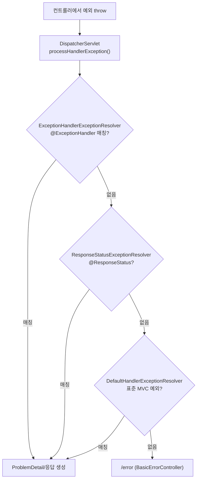
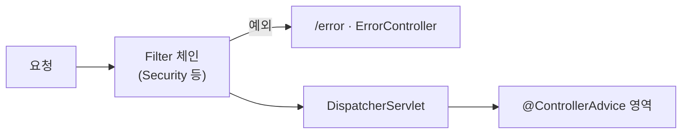

## 에러 응답이 제각각이면 클라이언트가 괴롭다

API를 만들다 보면 예외 상황이 끝도 없습니다. 없는 리소스 조회, 검증 실패, 권한 없음… 처음엔 컨트롤러마다 `try-catch`로 막고 그때그때 다른 JSON을 내려줬는데, 프론트엔드 입장에선 **에러 응답 형식이 API마다 달라서** 처리가 고역이었습니다. 😵

해법은 **예외 처리를 한 곳으로 모으고, 응답 형식을 통일**하는 것입니다. 그런데 `@RestControllerAdvice`를 "붙이면 되는 것"으로만 알면, *왜 어떤 예외는 안 잡히는지*, *왜 트랜잭션이 이미 롤백돼 있는지*를 설명하지 못합니다. 이 글은 예외가 던져진 순간부터 응답이 만들어지기까지 Spring MVC 내부에서 무슨 일이 벌어지는지를 따라갑니다.

## 예외는 어디서 가로채지나 — `HandlerExceptionResolver` 체인

컨트롤러에서 예외가 던져지면 `DispatcherServlet.doDispatch()`가 그것을 잡아 `processHandlerException()`으로 넘깁니다. 여기서 등록된 **`HandlerExceptionResolver` 들을 순서대로** 호출하고, **가장 먼저 결과(ModelAndView)를 반환하는 리졸버가 승리**합니다(이후 리졸버는 시도조차 안 함).

기본으로 등록되는 3개의 순서가 핵심입니다.

<div class="eh-anim" markdown="0">
<style>
.eh-anim{margin:1.4rem 0;overflow-x:auto}
.eh-anim svg{width:100%;max-width:720px;height:auto;display:block;margin:0 auto;font-family:inherit}
.eh-anim .lbl{fill:currentColor;font-size:12px;font-weight:600}
.eh-anim .sub{fill:currentColor;font-size:9px;opacity:.55}
.eh-anim .arr{stroke:currentColor;opacity:.35;stroke-width:1.5;fill:none}
.eh-anim rect.box{fill:none;stroke:currentColor;stroke-width:1.5;opacity:.3}
.eh-anim rect.r1{animation:kfehpulse 4s ease-in-out infinite}
.eh-anim rect.resp{stroke:#2f9e44;opacity:.5}
.eh-anim circle.exc{fill:#e03131;animation:kfehin 4s ease-in infinite}
.eh-anim circle.resp{fill:#2f9e44;animation:kfehout 4s ease-out infinite}
@keyframes kfehin{0%{transform:translateX(0);opacity:0}8%{opacity:1}38%{transform:translateX(86px);opacity:1}48%{transform:translateX(86px);opacity:0}100%{opacity:0}}
@keyframes kfehout{0%,40%{opacity:0;transform:translateX(0)}48%{opacity:1;transform:translateX(0)}82%{opacity:1;transform:translateX(196px)}93%{opacity:0;transform:translateX(196px)}100%{opacity:0}}
@keyframes kfehpulse{0%,30%{opacity:.3}42%{opacity:.95}62%,100%{opacity:.3}}
</style>
<svg viewBox="0 0 720 210" role="img" aria-label="예외가 HandlerExceptionResolver 체인의 첫 매칭 리졸버에 잡혀 ProblemDetail 응답으로 변환되는 흐름">
  <text class="lbl" x="34" y="40" text-anchor="middle">예외</text>
  <text class="sub" x="34" y="54" text-anchor="middle">throw</text>
  <rect class="box r1" x="108" y="20" width="252" height="48" rx="8"/>
  <rect class="box"    x="108" y="80" width="252" height="44" rx="8"/>
  <rect class="box"    x="108" y="136" width="252" height="44" rx="8"/>
  <text class="lbl" x="234" y="40" text-anchor="middle">ExceptionHandlerExceptionResolver</text>
  <text class="sub" x="234" y="56" text-anchor="middle">@ControllerAdvice · @ExceptionHandler</text>
  <text class="lbl" x="234" y="100" text-anchor="middle">ResponseStatusExceptionResolver</text>
  <text class="sub" x="234" y="114" text-anchor="middle">@ResponseStatus · ResponseStatusException</text>
  <text class="lbl" x="234" y="156" text-anchor="middle">DefaultHandlerExceptionResolver</text>
  <text class="sub" x="234" y="170" text-anchor="middle">Spring MVC 표준 예외 → 상태코드</text>
  <rect class="box resp" x="556" y="20" width="150" height="48" rx="8"/>
  <text class="lbl" x="631" y="40" text-anchor="middle">ProblemDetail</text>
  <text class="sub" x="631" y="56" text-anchor="middle">problem+json 응답</text>
  <line class="arr" x1="360" y1="44" x2="556" y2="44"/>
  <circle class="exc"  cx="34" cy="44" r="7"/>
  <circle class="resp" cx="360" cy="44" r="7"/>
</svg>
</div>



세 리졸버 모두 못 잡으면 예외는 서블릿 컨테이너로 올라가 `/error`(즉 `BasicErrorController`)로 흘러갑니다. **`@RestControllerAdvice`로 잡히는 예외는 첫 번째 리졸버(`ExceptionHandlerExceptionResolver`)의 영역**이라는 게 출발점입니다.

## `@RestControllerAdvice`로 한곳에서 처리

`@RestControllerAdvice` = `@ControllerAdvice` + `@ResponseBody`입니다. 컨트롤러 전역의 예외를 한 클래스에서 가로챕니다.

```java
@RestControllerAdvice
public class GlobalExceptionHandler {

    @ExceptionHandler(EntityNotFoundException.class)
    public ProblemDetail handleNotFound(EntityNotFoundException e) {
        ProblemDetail body = ProblemDetail.forStatusAndDetail(HttpStatus.NOT_FOUND, e.getMessage());
        body.setTitle("Resource Not Found");
        body.setType(URI.create("https://api.example.com/errors/not-found"));
        return body;   // ProblemDetail을 그대로 반환하면 상태코드도 자동 반영
    }
}
```

내부적으로는 `ExceptionHandlerExceptionResolver`가 부팅 시 모든 `@ControllerAdvice` 빈을 스캔해 두고, 예외가 나면 **`ExceptionHandlerMethodResolver`** 로 핸들러 메서드를 찾습니다.

### "가장 구체적인 예외"가 이긴다 — `ExceptionDepthComparator`

핸들러가 여러 개일 때 어느 게 선택될까요? Spring은 **던져진 예외와 상속 거리가 가장 가까운** 핸들러를 고릅니다(`ExceptionDepthComparator`). `IllegalArgumentException`을 던졌는데 `@ExceptionHandler(IllegalArgumentException.class)`와 `@ExceptionHandler(RuntimeException.class)`가 둘 다 있으면 전자가 이깁니다.

여러 `@ControllerAdvice` 클래스 간 우선순위는 `@Order`(또는 `Ordered`)로 정합니다. 특정 패키지/타입에만 적용하려면 `@RestControllerAdvice(basePackages = "...")` / `assignableTypes`로 범위를 좁힐 수 있습니다.

## 표준을 제대로: `ResponseEntityExceptionHandler` 상속

직접 핸들러를 다 짜는 대신, **`ResponseEntityExceptionHandler`** 를 상속하면 `MethodArgumentNotValidException`, `HttpMessageNotReadableException`, `NoResourceFoundException` 등 **Spring MVC 표준 예외 전부**가 이미 `ProblemDetail`로 매핑돼 있습니다. 내가 할 일은 비즈니스 예외만 추가하고, 공통 후처리는 `handleExceptionInternal`을 오버라이드하는 것입니다.

```java
@RestControllerAdvice
public class ApiExceptionHandler extends ResponseEntityExceptionHandler {

    @ExceptionHandler(EntityNotFoundException.class)
    ProblemDetail handleNotFound(EntityNotFoundException e) {
        return ProblemDetail.forStatusAndDetail(HttpStatus.NOT_FOUND, e.getMessage());
    }
}
```

## ProblemDetail — RFC 9457 (구 7807)

표준 에러 포맷은 `application/problem+json`입니다. 원래 **RFC 7807**로 정의됐고 지금은 이를 대체한 **RFC 9457**(2023)이 최신입니다. Spring 6 / Boot 3부터 `ProblemDetail` 타입으로 1급 지원합니다.

```json
{
  "type": "https://api.example.com/errors/not-found",
  "title": "Resource Not Found",
  "status": 404,
  "detail": "id=42 인 주문을 찾을 수 없습니다",
  "instance": "/api/orders/42",
  "errors": { "quantity": "1 이상이어야 합니다" }
}
```

`spring.mvc.problemdetails.enabled=true`를 켜면 내가 핸들러를 안 만든 **기본 MVC 예외(404·405·415 등)** 까지 자동으로 ProblemDetail로 나갑니다. (WebFlux는 `spring.webflux.problemdetails.enabled`)

## 예외 → HTTP 상태, 어떤 전략을 쓸까

| 전략 | 방법 | 적합한 경우 |
|------|------|------------|
| 선언적 매핑 | 커스텀 예외에 `@ResponseStatus(NOT_FOUND)` | 단순·고정 상태코드, 응답 바디 안 중요 |
| 즉석 던지기 | `throw new ResponseStatusException(NOT_FOUND, msg)` | 컨트롤러에서 빠르게, advice 없이 |
| 중앙 집중 | `@RestControllerAdvice` + `@ExceptionHandler` | 응답 포맷 통일·로깅·여러 예외 일괄 처리(권장) |
| 표준 상속 | `ResponseEntityExceptionHandler` 확장 | 프레임워크 표준 예외까지 ProblemDetail로 |

실무에선 **세 번째 + 네 번째 조합**이 기본값입니다. 커스텀 예외에 `@ResponseStatus`만 쓰면 응답 바디를 통제하기 어렵습니다.

## 함정 1: 필터에서 던진 예외는 `@ControllerAdvice`가 못 잡는다

`HandlerExceptionResolver` 체인은 **`DispatcherServlet` 안쪽**에서만 돕니다. 그런데 `Filter`(예: Spring Security의 인증 필터, CORS, 인코딩 필터)는 `DispatcherServlet`보다 **바깥**에서 실행됩니다. 여기서 던져진 예외는 디스패처에 도달하기 전이라 `@RestControllerAdvice`가 **절대** 못 잡습니다.



그래서 **401/403 같은 인증·인가 에러는 `@RestControllerAdvice`가 아니라** Security의 `AuthenticationEntryPoint` / `AccessDeniedHandler`, 또는 `/error`를 커스터마이징해야 일관된 포맷으로 내려줄 수 있습니다. "분명 핸들러를 만들었는데 403만 포맷이 다르다"의 정체가 이것입니다.

## 함정 2: 핸들러가 도는 시점엔 트랜잭션이 이미 끝나 있다

서비스의 `@Transactional` 메서드에서 예외가 나면, 트랜잭션 프록시는 메서드를 빠져나가는 순간 **롤백**합니다. 그 *뒤에야* 예외가 MVC 계층으로 올라와 `@ExceptionHandler`가 실행됩니다. 즉 **핸들러 안에서 DB에 뭔가 쓰려고 해도 그건 이미 닫힌(롤백된) 트랜잭션 밖**입니다. 감사 로그를 꼭 남겨야 한다면 별도 트랜잭션(`REQUIRES_NEW`)을 서비스 쪽에서 처리해야지, 예외 핸들러에서 해결하려 들면 안 됩니다. (트랜잭션 경계 얘기는 [@Transactional 글]() 참고)

## 함정 3: 검증 실패를 필드별로 풀어주기

`@Valid` 바디 검증 실패는 `MethodArgumentNotValidException`입니다. `ResponseEntityExceptionHandler`가 기본 처리하지만, **필드별 메시지**를 프론트가 쓰기 좋게 가공하려면 오버라이드합니다.

```java
@Override
protected ResponseEntity<Object> handleMethodArgumentNotValid(
        MethodArgumentNotValidException ex, HttpHeaders headers,
        HttpStatusCode status, WebRequest request) {
    ProblemDetail body = ProblemDetail.forStatus(HttpStatus.BAD_REQUEST);
    body.setTitle("Validation Failed");
    Map<String, String> errors = new HashMap<>();
    ex.getBindingResult().getFieldErrors()
        .forEach(fe -> errors.put(fe.getField(), fe.getDefaultMessage()));
    body.setProperty("errors", errors);
    return ResponseEntity.badRequest().body(body);
}
```

> `@RequestParam`/`@PathVariable` 같은 단일 파라미터 검증 실패는 다른 예외(`HandlerMethodValidationException`, 과거 `ConstraintViolationException`)로 나옵니다. (검증 메커니즘은 [Bean Validation 글]()에서)

## 디버깅: 왜 안 잡히는지 보는 법

추측 대신 로그를 켜세요.

```yaml
logging:
  level:
    org.springframework.web.servlet.mvc.method.annotation.ExceptionHandlerExceptionResolver: TRACE
    org.springframework.web.servlet.DispatcherServlet: DEBUG
```

어떤 리졸버가 예외를 처리했는지, 혹은 *아무도* 처리 못 해 `/error`로 빠졌는지가 로그에 드러납니다. `@RestControllerAdvice`로 안 잡힌다면 십중팔구 **(1) 필터에서 난 예외**거나 **(2) 더 구체적인 다른 핸들러/advice가 먼저 가로챈** 경우입니다.

## 면접/리뷰 단골 질문

- **Q. `@RestControllerAdvice`가 401/403을 못 잡는 이유는?** → Security 필터가 `DispatcherServlet` 바깥에서 돌아 `HandlerExceptionResolver` 체인에 도달하지 못함. `AuthenticationEntryPoint`/`AccessDeniedHandler`로 처리.
- **Q. 같은 예외에 핸들러가 둘이면 누가 이기나?** → `ExceptionDepthComparator` 기준 상속 거리가 가까운 쪽. advice 간에는 `@Order`.
- **Q. ProblemDetail의 RFC는?** → 7807을 대체한 **9457**, 미디어 타입 `application/problem+json`.
- **Q. 예외 핸들러에서 DB 보정 작업을 하면 안 되는 이유?** → 그 시점엔 서비스 트랜잭션이 이미 커밋/롤백된 뒤다.

## 정리

- 예외는 `DispatcherServlet` → **`HandlerExceptionResolver` 체인**(ExceptionHandler → ResponseStatus → Default)을 순서대로 거치고 **첫 매칭이 승리**한다.
- `@RestControllerAdvice`는 첫 리졸버의 영역. 응답은 **`ProblemDetail`(RFC 9457)** 로 표준화하고, `ResponseEntityExceptionHandler`를 상속해 표준 예외까지 커버하자.
- **필터에서 난 예외(인증/인가)는 advice가 못 잡는다** → Security 핸들러/`/error`로.
- 핸들러 실행 시점엔 **트랜잭션이 이미 종료**돼 있다.
- 내부 정보(스택트레이스·SQL 원문)는 `detail`에 담지 말 것 — 사용자에겐 일반화 메시지, 상세는 로그로.
