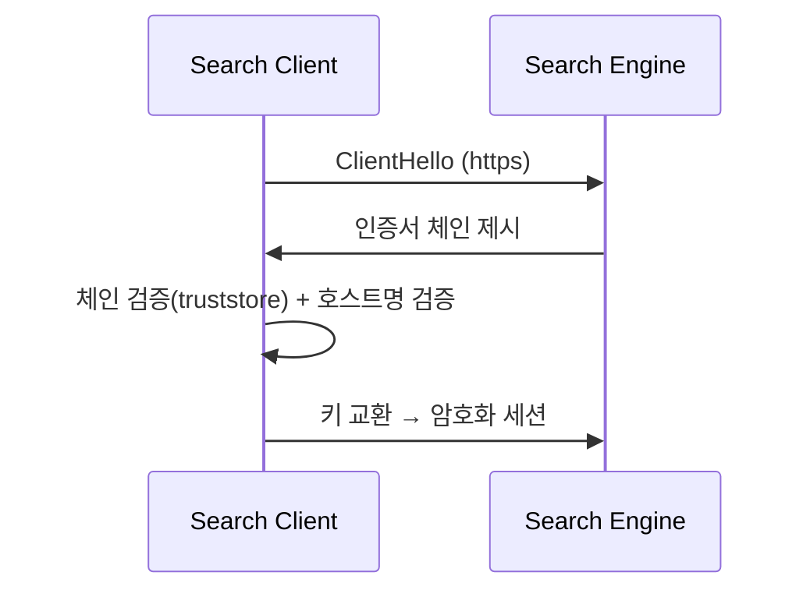

검색엔진 클라이언트에 SSL을 붙이는 작업을 한 주가 있었다. 그전까지 애플리케이션과 검색엔진은 평문 HTTP로 대화했다. 같은 사설망이라 해도 색인되는 데이터가 평문으로 흐른다는 건 그 자체로 위험이다. 핵심은 **클라이언트 측에서 TLS를 켜고, 서버 인증서를 어떻게 신뢰할지 명시적으로 구성**하는 것이다.

## TLS가 연결에서 하는 일

`http://`를 `https://`로 바꾸는 것만으로 끝나지 않는다. TLS 핸드셰이크에서 클라이언트는 세 가지를 한다.

1. 서버가 제시한 **인증서 체인**이 신뢰할 수 있는 루트로 이어지는지 검증한다.
2. 인증서의 **호스트명(SAN/CN)**이 접속 대상 호스트와 일치하는지 검증한다.
3. 검증을 통과하면 세션 키를 교환하고 이후 트래픽을 암호화한다.

사내 검색엔진은 보통 **사설 CA**나 **자체 서명 인증서**를 쓴다. 이 CA는 JVM 기본 truststore에 없으므로, 클라이언트가 그 CA를 신뢰하도록 별도 truststore를 쥐여줘야 한다. 이게 SSL 설정의 본질이다.



## 환경별 구성

포트(평문 9200 → TLS 9243 등), 스킴, 그리고 truststore를 환경 프로파일로 분리한다. 운영의 사설 CA 인증서를 truststore에 넣고, 그 경로/비밀번호를 설정값으로 주입한다.

```java
// 사설 CA를 담은 truststore 로드
KeyStore trust = KeyStore.getInstance("PKCS12");
try (InputStream in = Files.newInputStream(Path.of(props.getTruststorePath()))) {
    trust.load(in, props.getTruststorePassword().toCharArray());
}
SSLContext ssl = SSLContexts.custom()
        .loadTrustMaterial(trust, null)   // null=기본 신뢰 전략(체인 검증 수행)
        .build();

RestClient client = RestClient.builder(
        new HttpHost(props.getHost(), props.getPort(), "https"))
    .setHttpClientConfigCallback(b -> b.setSSLContext(ssl))
    .build();
```

```yaml
# application-prod.yml
search:
  host: search.internal.example
  port: 9243
  scheme: https
  truststore-path: /etc/app/search-ca.p12
  truststore-password: ${SEARCH_TRUSTSTORE_PW}
```

## 흔한 핸드셰이크 오류

| 증상 | 원인 | 처방 |
|------|------|------|
| `PKIX path building failed: unable to find valid certification path` | 검색엔진 인증서를 발급한 CA가 클라이언트 truststore에 없음 | 사설 CA(루트/중간) 인증서를 truststore에 추가 |
| `No subject alternative names matching IP/host` | 인증서 SAN에 접속 호스트가 없음(IP로 붙는데 SAN엔 도메인만) | SAN에 맞는 호스트명으로 접속하거나 인증서 재발급 |
| `Received fatal alert: handshake_failure` | TLS 버전/암호 스위트 불일치 | 클라이언트·서버 프로토콜 버전(TLS 1.2/1.3) 정렬 |

## 운영 함정

**검증을 끄는 유혹.** `PKIX path building failed`를 빨리 없애려고 "모든 인증서를 신뢰"하는 trust-all `TrustManager`를 붙이는 코드를 종종 본다. 이러면 암호화는 되지만 **중간자 공격에 무방비**다. 평문보다 나을 뿐 보안 목적을 거의 달성하지 못한다. 운영에서는 절대 쓰지 않는다. 옳은 해법은 항상 "올바른 CA를 truststore에 넣기"다.

**호스트명 검증 비활성화도 마찬가지.** `NoopHostnameVerifier`로 SAN 검증을 끄면 위 표의 두 번째 오류가 사라지지만, 인증서가 누구 것이든 통과하게 된다. 검증을 끄는 대신 SAN을 맞춘다.

## 핵심 요약

- TLS는 "암호화"만이 아니라 **인증서 체인 검증 + 호스트명 검증**까지 포함한다.
- 사내 검색엔진은 사설 CA를 쓰므로 클라이언트에 별도 truststore가 필요하다.
- 포트/스킴/truststore를 환경 프로파일로 분리해 운영·개발을 다르게 구성한다.
- 핸드셰이크 오류를 trust-all로 덮지 않는다. CA 추가와 SAN 정렬이 정답이다.

> **면접 Q.** 자체 서명 인증서를 쓰는 내부 서비스에 HTTPS로 붙는데 `PKIX path building failed`가 난다. 어떻게 푸는가?
> **A.** 그 인증서(또는 발급 CA)를 클라이언트 truststore에 등록한다. 검증을 끄는 trust-all은 MITM에 노출되므로 운영에서 쓰지 않는다.
