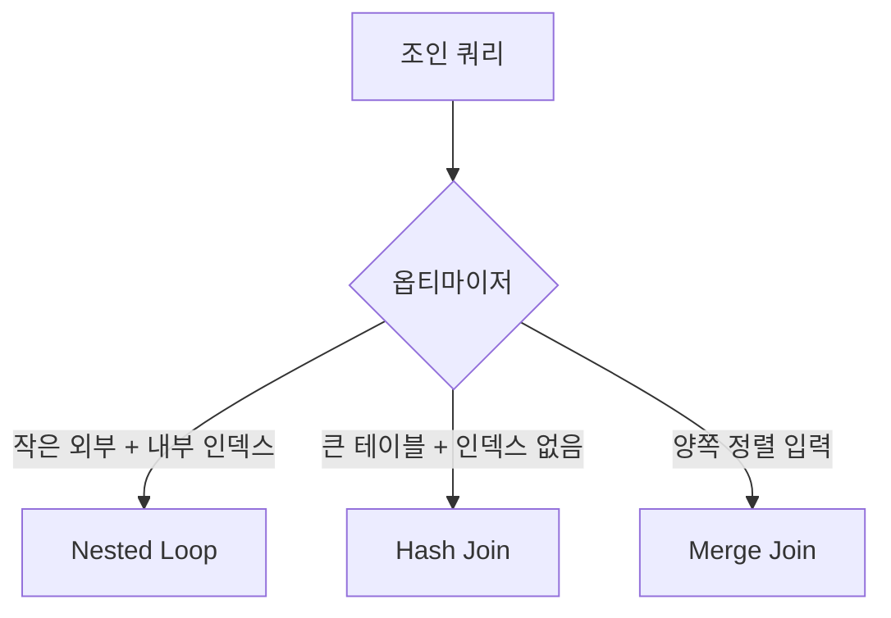

여러 테이블을 묶어 조회하는 작업을 하다 보면, 같은 `JOIN` 문이 어떤 날은 빠르고 어떤 날은 느린 경험을 한다. SQL은 *무엇을* 원하는지만 적을 뿐, *어떻게* 합칠지는 옵티마이저가 정한다. 그 "어떻게"가 조인 알고리즘이다. 세 가지 방식과 그 비용 모델을 알면 실행 계획이 더 이상 블랙박스가 아니다.

## 세 가지 조인 알고리즘

**Nested Loop Join (중첩 루프)**
바깥 테이블의 각 행마다 안쪽 테이블을 뒤진다. 의사 코드로는 이중 루프다.

```
for outer_row in OUTER:        # R건
    for inner_row in INNER:    # 매칭 탐색
        if match: emit
```

안쪽을 매번 풀스캔하면 `O(R × S)`로 끔찍하다. 하지만 조인 키에 **인덱스**가 있으면 안쪽 탐색이 인덱스 룩업(`O(log S)`)으로 줄어든다. 그래서 nested loop는 "바깥은 작고, 안쪽 조인 키에 인덱스가 있을 때" 최적이다. OLTP의 대부분이 여기에 해당한다.

**Hash Join (해시)**
작은 쪽(build) 테이블을 읽어 조인 키로 해시 테이블을 메모리에 만들고, 큰 쪽(probe)을 한 번 훑으며 해시를 조회한다. 비용은 대략 `O(R + S)` — 두 테이블을 각각 한 번씩만 읽는다. 인덱스가 없어도 빠르다. 대신 build 테이블이 메모리(`join_buffer`)를 넘치면 디스크로 분할(grace hash join)되며 느려진다. 큰 테이블 두 개를 인덱스 없이 합치는 분석 쿼리에 강하다.

**Merge Join (정렬 병합)**
양쪽을 조인 키로 정렬한 뒤, 두 포인터를 동시에 전진시키며 합친다. 이미 정렬된(인덱스 순서대로 읽히는) 입력이라면 정렬 비용이 사라져 매우 효율적이다. 정렬이 필요하면 `O(R log R + S log S)`가 추가된다.



## 옵티마이저는 왜 그것을 고르는가

옵티마이저는 통계(행 수, 카디널리티, 인덱스 분포)를 바탕으로 각 계획의 **예상 비용**을 추정해 가장 싼 것을 택한다. 핵심 변수는 (1) 조인 키 인덱스 유무, (2) 조인 후 예상 행 수, (3) 가용 메모리다. 통계가 낡으면 추정이 틀어져 nested loop를 골라야 할 자리에 hash를 쓰거나 그 반대가 된다.

```sql
EXPLAIN
SELECT o.id, u.name
FROM orders o
JOIN users u ON u.id = o.user_id
WHERE o.created_at >= '2025-09-01';
```

`EXPLAIN`의 조인 타입과 `Extra` 컬럼(`Using join buffer (hash join)` 등)을 보면 어떤 알고리즘이 선택됐는지 드러난다.

## 운영 함정

- **통계 노후화로 인한 오선택**: 데이터가 급증했는데 통계를 갱신하지 않으면, 옵티마이저가 작은 테이블로 착각해 nested loop를 골라 수십만 번 루프를 돈다. 대량 적재 후엔 `ANALYZE TABLE`로 통계를 갱신한다.
- **조인 키 타입 불일치**: `user_id`(BIGINT)와 문자열 컬럼을 조인하면 암묵적 형변환이 인덱스를 무력화해 nested loop가 풀스캔으로 퇴화한다. 조인 키 양쪽의 타입·콜레이션을 반드시 일치시킨다.

## 핵심 요약

- nested loop = 작은 외부 + 내부 인덱스(OLTP), hash = 큰 테이블·무인덱스(분석), merge = 정렬된 입력.
- 옵티마이저는 통계 기반 비용 추정으로 고른다 — 통계가 낡으면 계획이 망가진다.
- 면접 한 줄 Q&A: "hash join이 nested loop보다 빠른 경우는?" → 조인 키에 인덱스가 없고 양쪽 테이블이 클 때. nested loop는 인덱스 없는 안쪽을 매 행마다 풀스캔해 `O(R×S)`가 되지만, hash는 각 테이블을 한 번씩만 읽어 `O(R+S)`다.
