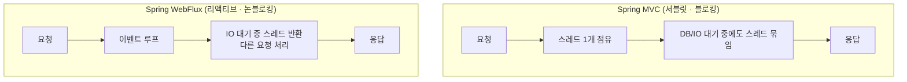

## "요즘은 WebFlux 써야 한다던데?"

리액티브가 한창 유행할 때, "이제 MVC는 옛날 거고 WebFlux를 써야 한다"는 말을 많이 들었습니다. 그런데 실제로 도입해보면 학습 곡선도 가파르고, 디버깅도 어렵고, 생각만큼 무조건 빠른 것도 아니었습니다. 둘의 차이를 제대로 알고 **상황에 맞게** 고르는 게 중요합니다.

## 동작 모델의 차이



- **Spring MVC**: 서블릿 기반, **블로킹 I/O**, 요청당 스레드 하나(thread-per-request). 직관적이고 익숙한 명령형 코드. 기본 서버는 톰캣.
- **Spring WebFlux**: Reactor(`Mono`/`Flux`) 기반, **논블로킹 I/O**. 적은 스레드로 많은 동시 연결을 처리. 기본 서버는 Netty.

## WebFlux가 빛나는 경우

- 수만 개의 **동시 연결**을 적은 스레드로 버텨야 할 때 (예: 게이트웨이, 스트리밍, SSE/실시간)
- 호출하는 외부 API/DB까지 **전 구간이 논블로킹(R2DBC, WebClient)** 으로 갖춰진 경우

핵심은 "끝까지 논블로킹"이어야 한다는 것. 중간에 블로킹 JDBC를 한 번이라도 호출하면 이벤트 루프가 막혀서 장점이 사라집니다.

## 그런데 가상 스레드(Virtual Threads)가 판을 바꿨다

Java 21의 **가상 스레드**와 Spring Boot 3.2+ 지원 덕분에, 이제 **블로킹 MVC 코드로도** 높은 동시성을 얻을 수 있게 됐습니다. 설정 한 줄이면 됩니다.

```yaml
spring:
  threads:
    virtual:
      enabled: true
```

요청당 스레드 모델을 유지하면서도, 스레드가 가벼워져서 수만 개를 띄울 수 있습니다. **"동시성 때문에 어쩔 수 없이 WebFlux"** 라는 이유의 상당 부분이 사라진 셈입니다.

## 그래서 무엇을 고를까

| 상황 | 추천 |
|------|------|
| 일반적인 CRUD/웹 서비스 | **Spring MVC** (단순·익숙·생태계 풍부) |
| 높은 동시성이 필요한 블로킹 코드 | **MVC + 가상 스레드** |
| 전 구간 논블로킹 + 스트리밍/실시간 | **WebFlux** |
| 리액티브 경험·팀 역량이 없음 | MVC로 시작 |

## 정리

- MVC = 블로킹·요청당 스레드·직관적. WebFlux = 논블로킹·적은 스레드·러닝커브 큼.
- WebFlux는 **전 구간 논블로킹**일 때만 진가를 발휘한다.
- **가상 스레드** 등장으로 "동시성 = WebFlux" 공식은 약해졌다.
- 특별한 이유가 없다면 **MVC(+필요시 가상 스레드)** 가 무난한 기본값.
