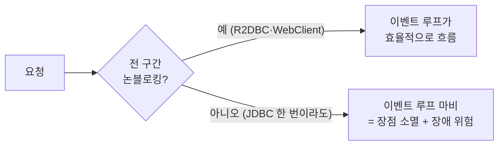

## "요즘은 WebFlux 써야 한다던데?"

리액티브가 한창 유행할 때 "이제 MVC는 옛날 거고 WebFlux를 써야 한다"는 말을 많이 들었습니다. 그런데 막상 도입하면 학습 곡선도 가파르고, 스택 트레이스는 읽기 힘들고, 생각만큼 무조건 빠르지도 않았습니다.

이 글은 "둘 중 뭐가 좋다"를 말하려는 게 아닙니다. **두 모델이 스레드를 어떻게 다루는지**를 소스 레벨에서 이해하면, "언제 무엇을" 같은 선택이 취향이 아니라 근거 있는 판단이 됩니다. 그리고 2025년 현재, **가상 스레드(Virtual Threads)** 가 이 선택지를 어떻게 다시 흔들었는지까지 봅니다.

## 두 모델의 본질: 스레드를 다루는 방식

가장 먼저 직관으로 잡고 갑시다. 위는 **요청마다 스레드 하나(thread-per-request)** — I/O를 기다리는 동안 그 스레드는 <span style="color:#f08c00;font-weight:600">묶여서 정체</span>되고, 풀이 차면 뒤 요청은 큐에서 대기합니다. 아래는 **이벤트 루프** — 적은 스레드가 <span style="color:#2f9e44;font-weight:600">막히지 않고 흘려보냅니다.</span>

<div class="mvf-anim" markdown="0">
<style>
.mvf-anim{margin:1.4rem 0;overflow-x:auto}
.mvf-anim svg{width:100%;max-width:720px;height:auto;display:block;margin:0 auto;font-family:inherit}
.mvf-anim .lane{fill:none;stroke:currentColor;stroke-width:1.5;opacity:.3}
.mvf-anim .lbl{fill:currentColor;font-size:13px;font-weight:600}
.mvf-anim .sub{fill:currentColor;font-size:10px;opacity:.55}
.mvf-anim .zone{fill:currentColor;opacity:.06}
.mvf-anim .zlbl{fill:currentColor;font-size:9.5px;opacity:.6}
.mvf-anim circle.blk{fill:#f08c00}
.mvf-anim circle.k1{animation:mvfblock 5s ease-in-out infinite}
.mvf-anim circle.k2{animation:mvfblock 5s ease-in-out infinite 1.7s}
.mvf-anim circle.k3{animation:mvfblock 5s ease-in-out infinite 3.4s}
.mvf-anim circle.wait{fill:#f08c00;animation:mvfwait 1.6s ease-in-out infinite}
.mvf-anim circle.flow{fill:#2f9e44}
.mvf-anim circle.f1{animation:mvfflow 2.6s linear infinite}
.mvf-anim circle.f2{animation:mvfflow 2.6s linear infinite .65s}
.mvf-anim circle.f3{animation:mvfflow 2.6s linear infinite 1.3s}
.mvf-anim circle.f4{animation:mvfflow 2.6s linear infinite 1.95s}
@keyframes mvfblock{0%{transform:translateX(0);opacity:0}6%{opacity:1}22%{transform:translateX(300px)}60%{transform:translateX(300px)}80%{transform:translateX(520px)}100%{transform:translateX(640px);opacity:0}}
@keyframes mvfflow{0%{transform:translateX(0);opacity:0}8%{opacity:1}92%{opacity:1}100%{transform:translateX(640px);opacity:0}}
@keyframes mvfwait{0%,100%{opacity:.3}50%{opacity:.95}}
</style>
<svg viewBox="0 0 720 250" role="img" aria-label="위: 요청당 스레드 모델에서 토큰이 블로킹 I/O 구간에 정체되고 큐가 쌓이는 모습. 아래: 이벤트 루프에서 토큰이 막히지 않고 흐르는 모습">
  <text class="lbl" x="20" y="22">Spring MVC · 스레드-퍼-리퀘스트 (블로킹)</text>
  <rect class="lane" x="20" y="34" width="680" height="64" rx="8"/>
  <rect class="zone" x="300" y="36" width="150" height="60" rx="6"/>
  <text class="zlbl" x="375" y="92" text-anchor="middle">블로킹 I/O 대기 — 스레드 묶임</text>
  <circle class="wait" cx="42" cy="66" r="6"/>
  <circle class="wait" cx="60" cy="66" r="6" style="animation-delay:.5s"/>
  <text class="sub" x="42" y="50">큐 대기</text>
  <circle class="blk k1" cx="40" cy="66" r="7"/>
  <circle class="blk k2" cx="40" cy="66" r="7"/>
  <circle class="blk k3" cx="40" cy="66" r="7"/>
  <text class="lbl" x="20" y="150">Spring WebFlux · 이벤트 루프 (논블로킹)</text>
  <rect class="lane" x="20" y="162" width="680" height="64" rx="8"/>
  <rect class="zone" x="300" y="164" width="150" height="60" rx="6"/>
  <text class="zlbl" x="375" y="220" text-anchor="middle">논블로킹 — 대기 시 스레드 반환</text>
  <circle class="flow f1" cx="40" cy="194" r="7"/>
  <circle class="flow f2" cx="40" cy="194" r="7"/>
  <circle class="flow f3" cx="40" cy="194" r="7"/>
  <circle class="flow f4" cx="40" cy="194" r="7"/>
</svg>
</div>

- **Spring MVC**: 서블릿 기반. `DispatcherServlet`이 진입점이고, 서블릿 컨테이너(기본 톰캣)의 **스레드풀에서 스레드 하나를 빌려** 요청 전체를 처리합니다. DB·외부 API 같은 **블로킹 I/O**를 기다리는 동안에도 그 스레드는 점유된 채 묶입니다. 코드는 위에서 아래로 읽히는 명령형이라 직관적입니다.
- **Spring WebFlux**: Reactor(`Mono`/`Flux`) 기반. 진입점은 `DispatcherHandler`이고, 그 아래 `HttpHandler`가 **Netty 이벤트 루프**(보통 CPU 코어 수 정도의 적은 스레드) 위에서 돕니다. I/O를 기다릴 땐 스레드를 **반환**하고 콜백으로 이어받아, 적은 스레드로 많은 동시 연결을 감당합니다.

## 왜 스레드-퍼-리퀘스트가 한계에 부딪히나

플랫폼 스레드(OS 스레드) 하나는 **기본 ~1MB의 스택**을 잡고, 컨텍스트 스위칭 비용도 듭니다. 그래서 톰캣 기본값은 보수적입니다.

```yaml
server:
  tomcat:
    threads:
      max: 200          # 기본값. 동시 처리 상한이 사실상 여기서 정해진다
```

요청 하나가 느린 외부 API를 2초 기다리면, 그 2초 동안 스레드 하나가 **아무 일도 안 하면서** 점유됩니다. 이런 요청이 200개를 넘는 순간 스레드풀이 마르고, 그 뒤 요청은 큐에서 대기하다 타임아웃됩니다. **CPU는 한가한데 처리량이 안 나오는** 전형적인 I/O 바운드 병목입니다. 위 애니메이션에서 토큰이 가운데서 멈춰 있고 왼쪽에 큐가 쌓이는 그림이 바로 이 상황입니다.

## WebFlux는 어떻게 적은 스레드로 버티나

WebFlux는 작업을 "지금 실행"이 아니라 **`Mono`/`Flux`라는 '나중에 값이 흐를 파이프라인' 선언**으로 다룹니다.

```java
@GetMapping("/users/{id}")
Mono<User> user(@PathVariable String id) {
    return userRepository.findById(id)        // R2DBC: 논블로킹
        .flatMap(u -> profileClient.fetch(u)) // WebClient: 논블로킹
        .timeout(Duration.ofSeconds(2));
}
```

이 코드는 호출 시점에 DB를 때리지 않습니다. 파이프라인을 **조립만** 하고, 구독(subscribe)될 때 실행됩니다. I/O 응답을 기다리는 구간엔 이벤트 루프 스레드가 다른 요청으로 넘어가고, 결과가 도착하면 콜백으로 이어집니다.

여기엔 명령형엔 없는 개념이 하나 더 있습니다 — **백프레셔(backpressure)**. 구독자가 `request(n)`으로 "n개만 더 줘"라고 생산 속도를 역으로 제어합니다. 생산자가 너무 빨라 소비자가 못 따라갈 때 메모리가 터지는 걸 프로토콜 수준에서 막아주는 장치입니다. 스트리밍(SSE)·대용량 페치에서 진가를 발휘합니다.

## 함정: 이벤트 루프에 블로킹 호출 "한 번"이면 끝

WebFlux의 모든 장점은 **"끝까지 논블로킹"** 이라는 전제 위에 있습니다. 파이프라인 중간에 블로킹 JDBC나 `RestTemplate`을 한 번이라도 호출하면, 그 호출이 **이벤트 루프 스레드를 통째로 점유**합니다. 이벤트 루프는 몇 개뿐이라 — 전체 서버가 마비됩니다. MVC였다면 스레드 하나만 묶이고 끝났을 일이, WebFlux에선 장애로 번집니다.

```java
// ❌ 이벤트 루프 위에서 블로킹 — 최악의 안티패턴
Mono.fromCallable(() -> jdbcTemplate.queryForObject(...));   // 이러면 이벤트 루프가 막힌다

// ⭕ 꼭 블로킹을 써야 한다면 별도 스케줄러로 격리
Mono.fromCallable(() -> jdbcTemplate.queryForObject(...))
    .subscribeOn(Schedulers.boundedElastic());
```

이걸 사람 눈으로 잡기는 어렵습니다. **BlockHound** 같은 에이전트를 테스트에 붙이면, 논블로킹 스레드에서 블로킹 호출이 일어나는 순간 예외를 던져 잡아줍니다. 그리고 데이터 접근은 JDBC가 아니라 **R2DBC**(논블로킹 드라이버)여야 하고, HTTP 호출은 `RestTemplate`이 아니라 `WebClient`여야 합니다.



## 그런데 가상 스레드가 판을 다시 흔들었다

WebFlux를 택하는 이유의 상당수는 성능이 아니라 **"동시성"** 이었습니다. "스레드가 비싸서 많이 못 띄우니까, 적은 스레드로 버티려고 리액티브를 쓴다"는 논리였죠. 그런데 그 전제가 깨졌습니다.

Java 21의 **가상 스레드**는 JVM이 관리하는 초경량 스레드라, 블로킹 I/O를 만나면 캐리어(OS) 스레드에서 **언마운트**되어 OS 스레드를 놓아줍니다. 즉 **블로킹 명령형 코드를 그대로 쓰면서도** 수만 개의 동시 요청을 감당할 수 있습니다. Spring Boot 3.2+에서 설정 한 줄이면 켜집니다.

```yaml
spring:
  threads:
    virtual:
      enabled: true     # 톰캣이 요청마다 가상 스레드를 쓴다 (Java 21+ 필요)
```

요청당 스레드라는 **익숙하고 디버깅 쉬운 모델을 유지**하면서 동시성을 얻는 겁니다. "동시성 때문에 어쩔 수 없이 WebFlux"라는 이유의 큰 축이 사라졌습니다. (가상 스레드의 동작 원리와 `synchronized` pinning 같은 함정은 [가상 스레드 글]()에서 따로 다룹니다.)

다만 가상 스레드가 WebFlux를 완전히 대체하진 않습니다. **백프레셔, 스트리밍 합성(`Flux` 연산자), 함수형 파이프라인** 같은 리액티브 고유의 표현력은 가상 스레드가 주지 못합니다.

## 그래서 무엇을 고를까

| 상황 | 추천 | 이유 |
|------|------|------|
| 일반 CRUD/웹 서비스 | **Spring MVC** | 단순·익숙·생태계(JPA·대부분 라이브러리)가 블로킹 전제 |
| 높은 동시성 + 블로킹 라이브러리(JDBC 등) | **MVC + 가상 스레드** | 코드 그대로, 설정 한 줄로 동시성 확보 |
| 전 구간 논블로킹 + 스트리밍/SSE/백프레셔 | **WebFlux** | 이벤트 루프·`Flux`의 표현력이 필요한 영역 |
| 게이트웨이·프록시(I/O 중계 위주) | **WebFlux** | 적은 스레드로 막대한 동시 연결 중계에 최적 |
| 팀에 리액티브 경험이 없음 | **MVC로 시작** | 러닝커브·디버깅 난이도 리스크가 큼 |

## 면접/리뷰 단골 질문

- **Q. WebFlux를 썼는데 MVC보다 느리거나 장애가 났다, 1순위 의심은?** → 파이프라인 어딘가의 **블로킹 호출**(JDBC·`RestTemplate`)이 이벤트 루프를 막는 것. BlockHound로 확인.
- **Q. 가상 스레드가 있으면 WebFlux는 필요 없나?** → 동시성만이 목적이면 상당 부분 대체 가능. 하지만 **백프레셔·스트리밍 합성**이 필요하면 여전히 WebFlux.
- **Q. MVC의 thread-per-request가 왜 동시성 한계를 만드나?** → 플랫폼 스레드는 무겁고(스택 ~1MB) 톰캣 풀 상한(기본 200)에 묶여, I/O 대기 중에도 점유돼 풀이 마른다.

## 정리

- MVC = 서블릿·블로킹·요청당 스레드·명령형(직관적). WebFlux = Netty·논블로킹·이벤트 루프·`Mono`/`Flux`(러닝커브 큼).
- 스레드-퍼-리퀘스트의 한계는 **I/O 대기 중 스레드 점유 + 톰캣 풀 상한**. WebFlux는 적은 스레드로 이를 우회한다.
- WebFlux는 **전 구간 논블로킹**일 때만 진가를 낸다. 블로킹 한 번이면 이벤트 루프가 마비된다 — `Schedulers.boundedElastic()`로 격리하거나 R2DBC/`WebClient` 사용.
- **가상 스레드**가 "동시성 = WebFlux" 공식을 약화시켰다. 특별한 이유(스트리밍·백프레셔)가 없다면 **MVC(+필요시 가상 스레드)** 가 무난한 기본값.

> 관련 글: [가상 스레드]() · 두 스택 모두 [자동 구성]()으로 서버가 떠오릅니다.
