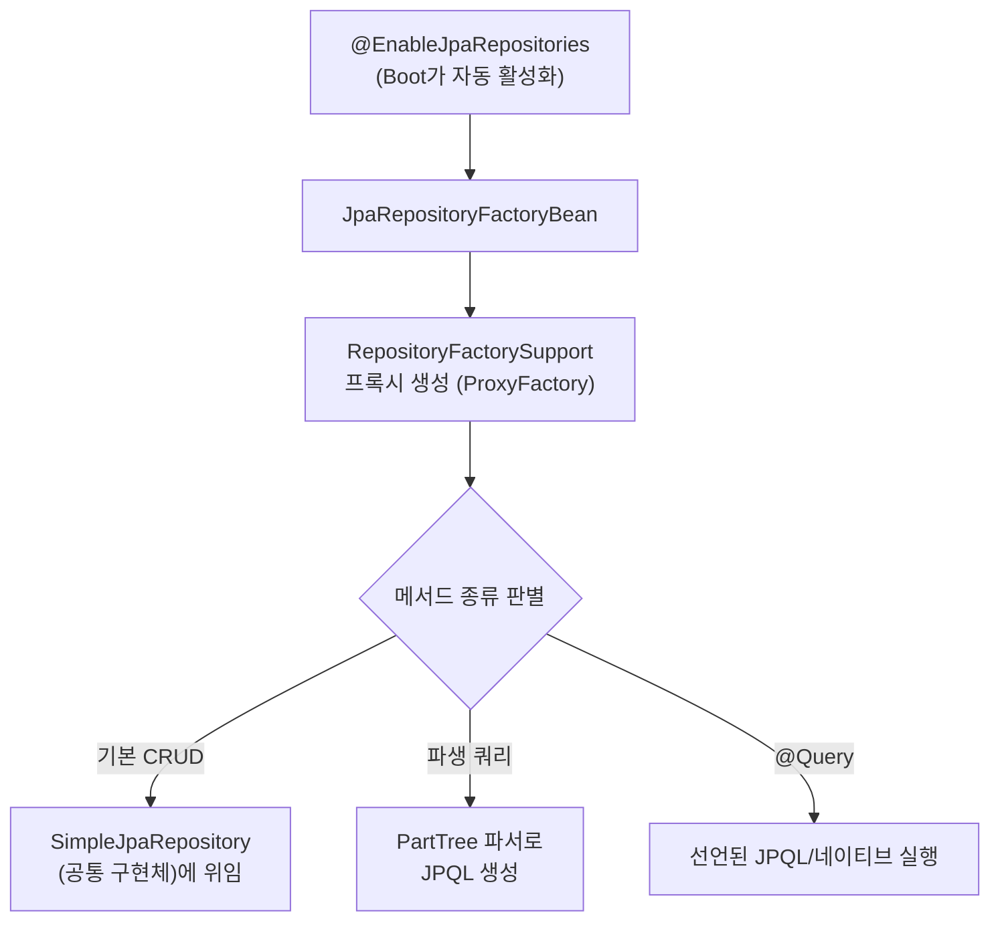
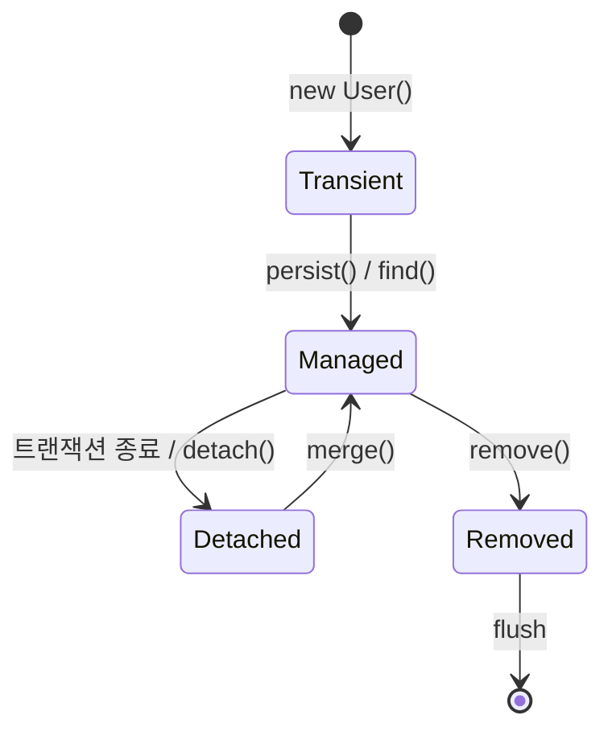

## SQL을 한 줄도 안 썼는데 조회가 된다

Spring Data JPA를 처음 봤을 때 가장 신기했던 건, **인터페이스만 선언했는데 구현체 없이 동작**한다는 점이었습니다. `findByEmail`이라고 메서드 이름만 지었더니 알아서 쿼리가 나가더라고요.

그런데 이 편리함을 "마법"으로 남겨두면, 실무에서 두 가지로 반드시 발목을 잡힙니다. **(1) 분명히 값을 바꿨는데 `save()`도 안 했는데 UPDATE가 나가거나(또는 안 나가거나)**, **(2) 목록 한 번 띄웠더니 쿼리가 수백 개 나가거나.** 둘 다 *Repository 프록시*와 *영속성 컨텍스트*가 어떻게 동작하는지 모르면 못 피합니다. 이 글은 그 두 메커니즘을 소스 레벨까지 내려가 정리합니다.

## 핵심부터: "값만 바꿔도 UPDATE가 나간다"

JPA를 처음 만질 때 가장 충격적인 건 이겁니다. 조회해 온 엔티티의 필드를 그냥 바꾸기만 해도, `update()`를 호출하지 않았는데 트랜잭션이 끝날 때 UPDATE SQL이 나갑니다. 이걸 **더티 체킹(dirty checking, 변경 감지)** 이라고 합니다. 글로 읽기 전에 흐름을 먼저 보세요 — 영속성 컨텍스트가 <span style="color:#f08c00;font-weight:600">변경된 필드</span>를 감지해 flush 시점에 <span style="color:#1971c2;font-weight:600">UPDATE</span>를 DB로 흘려보냅니다.

<div class="jpa-dirty" markdown="0">
<style>
.jpa-dirty{margin:1.4rem 0;overflow-x:auto}
.jpa-dirty svg{width:100%;max-width:720px;height:auto;display:block;margin:0 auto;font-family:inherit}
.jpa-dirty .lbl{fill:currentColor;font-size:12.5px;font-weight:600}
.jpa-dirty .sub{fill:currentColor;font-size:10px;opacity:.6}
.jpa-dirty .box{fill:none;stroke:currentColor;stroke-width:1.5;opacity:.4}
.jpa-dirty .arr{stroke:currentColor;opacity:.35;stroke-width:1.5;fill:none}
.jpa-dirty .dirty{fill:#f08c00;animation:jpadirty 4s ease-in-out infinite}
.jpa-dirty .flush{fill:currentColor;animation:jpaflush 4s ease-in-out infinite}
.jpa-dirty .db{fill:none;stroke:currentColor;stroke-width:1.5;opacity:.4;animation:jpadbpulse 4s ease-in-out infinite}
.jpa-dirty .upd{animation:jpaflow 4s ease-in-out infinite}
.jpa-dirty .upd rect{fill:none;stroke:#1971c2;stroke-width:1.5}
.jpa-dirty .upd text{fill:#1971c2;font-size:10px;font-weight:600}
@keyframes jpadirty{0%,100%{opacity:.12}22%,46%{opacity:.5}}
@keyframes jpaflush{0%,44%{opacity:.3}52%{opacity:1}62%,100%{opacity:.3}}
@keyframes jpaflow{0%{transform:translateX(0);opacity:0}48%{opacity:0}56%{opacity:1}90%{opacity:1}100%{transform:translateX(300px);opacity:0}}
@keyframes jpadbpulse{0%,82%{opacity:.4}90%{opacity:.95}100%{opacity:.4}}
</style>
<svg viewBox="0 0 720 200" role="img" aria-label="영속성 컨텍스트가 변경된 엔티티 필드를 감지해 flush 시점에 UPDATE SQL을 DB로 보내는 더티 체킹 애니메이션">
  <text class="lbl" x="140" y="24" text-anchor="middle">영속성 컨텍스트 (1차 캐시)</text>
  <rect class="box" x="10" y="34" width="260" height="140" rx="10"/>
  <rect class="box" x="34" y="70" width="212" height="74" rx="8"/>
  <text class="lbl" x="140" y="96" text-anchor="middle">User#1 · managed</text>
  <rect class="dirty" x="58" y="108" width="164" height="22" rx="4"/>
  <text class="sub" x="140" y="123" text-anchor="middle">name: "Kim" → "Lee"</text>
  <text class="flush lbl" x="400" y="86" text-anchor="middle">flush()</text>
  <text class="flush sub" x="400" y="104" text-anchor="middle">스냅샷 비교 = 더티 체킹</text>
  <line class="arr" x1="270" y1="120" x2="570" y2="120"/>
  <rect class="db" x="575" y="84" width="135" height="74" rx="10"/>
  <text class="lbl" x="642" y="118" text-anchor="middle">Database</text>
  <text class="sub" x="642" y="135" text-anchor="middle">users 테이블</text>
  <g class="upd">
    <rect x="276" y="106" width="120" height="28" rx="6"/>
    <text x="336" y="124" text-anchor="middle">UPDATE users …</text>
  </g>
</svg>
</div>

이 한 장면 안에 이 글의 절반이 들어 있습니다. 나머지 절반은 "그 엔티티를 처음에 어떻게 가져왔나", 즉 **Repository**입니다.

## Repository가 구현체 없이 동작하는 원리

엔티티와 기본 CRUD는 `JpaRepository`를 상속하면 끝입니다.

```java
public interface UserRepository extends JpaRepository<User, Long> {
}
```

구현체를 우리가 안 만드는데 어떻게 Bean이 될까요? 자동 구성 글에서 본 패턴이 여기서도 반복됩니다 — Boot의 `JpaRepositoriesAutoConfiguration`이 `@EnableJpaRepositories`를 켜고, 스캔된 각 인터페이스마다 **`RepositoryFactorySupport`가 런타임 프록시**를 만들어 Bean으로 등록합니다.



즉 `UserRepository` 타입으로 주입받는 건 사실 **JDK 동적 프록시**이고, `findById` 같은 공통 메서드는 모두 `SimpleJpaRepository` 한 클래스가 처리합니다. "인터페이스가 어떻게 스스로 동작하지?"의 답은 **"동작하는 건 인터페이스가 아니라 프록시"** 입니다. ([@Transactional도 같은 프록시 메커니즘]()을 쓴다는 걸 기억하면, Repository 호출에 트랜잭션이 왜 자연스럽게 엮이는지도 보입니다.)

## 쿼리 메서드 파생 — `PartTree` 파서

메서드 이름은 정해진 문법으로 파싱됩니다. 이 파싱을 담당하는 게 `PartTree`입니다.

```java
public interface UserRepository extends JpaRepository<User, Long> {
    Optional<User> findByEmail(String email);
    List<User> findByAgeGreaterThanEqualAndStatus(int age, Status status);
    boolean existsByEmail(String email);
    long countByStatus(Status status);
}
```

`findBy` / `And` / `GreaterThanEqual` / `Between` / `In` / `OrderBy` 같은 토큰을 트리로 분해해 JPQL을 조립합니다. 여기서 의외로 중요한 **설계 이점**이 하나 있습니다.

> 메서드 이름에 존재하지 않는 속성(`findByEmial` 같은 오타)을 쓰면, 그 쿼리를 *처음 호출할 때*가 아니라 **애플리케이션 부팅 시점에** `PropertyReferenceException`으로 실패합니다. 런타임이 아니라 기동 시 터지므로, 배포 전에 잡힙니다.
{: .prompt-tip }

이름이 `findByTeamNameAndStatusAndCreatedAtBetween…`처럼 길어지면 가독성이 무너지니, 그 지점이 `@Query`로 갈아탈 신호입니다.

```java
@Query("select u from User u where u.team.name = :teamName")
List<User> findByTeamName(@Param("teamName") String teamName);
```

## 영속성 컨텍스트 — JPA의 심장

위 애니메이션의 "영속성 컨텍스트(persistence context)"는 트랜잭션 범위의 **1차 캐시**입니다. 같은 트랜잭션 안에서 같은 식별자를 두 번 조회하면 SELECT는 한 번만 나가고, 두 번째는 캐시가 반환됩니다(동일성 보장: `==`).

엔티티는 이 컨텍스트와의 관계에 따라 네 가지 상태를 오갑니다.



| 상태 | 의미 | 더티 체킹 대상? |
|------|------|:---:|
| transient | `new`로 막 만든, 컨텍스트가 모르는 객체 | ✗ |
| **managed** | 컨텍스트가 관리 중(조회/persist 직후) | **✓** |
| detached | 트랜잭션이 끝나 분리된 상태 | ✗ |
| removed | 삭제 예약됨 | ✗ |

**더티 체킹은 오직 `managed` 상태에서만** 동작합니다. Hibernate는 엔티티를 로드할 때 필드 값의 **스냅샷**을 떠두고, flush 시점에 현재 값과 스냅샷을 비교해 달라진 컬럼만 UPDATE합니다. 그래서 `save()`를 부르지 않아도 변경이 반영되는 것이고, 반대로 컨트롤러에서 받은 detached 엔티티는 아무리 고쳐도 안 나가는 것입니다.

flush가 일어나는 시점은 셋입니다: **① 트랜잭션 커밋 직전**, **② JPQL 쿼리 실행 직전**(AUTO 모드 — 쿼리 결과 정합성 보장), **③ 명시적 `flush()` 호출**.

## 함정 1: N+1 — 가장 자주, 가장 조용히

사용자 목록 100건을 가져온 뒤 각 사용자의 팀을 지연 로딩하면, 팀 조회가 100번 더 나갑니다(1 + N). 테스트 데이터 3건일 땐 안 보이다가 운영에서 터지는 전형입니다.

해결책은 셋이고, 각각 트레이드오프가 다릅니다.

| 방법 | 코드 | 특징 |
|------|------|------|
| fetch join | `@Query("select u from User u join fetch u.team")` | 한 방 쿼리. 단 페이징·다중 컬렉션과 충돌(함정 2) |
| `@EntityGraph` | 메서드에 `@EntityGraph(attributePaths="team")` | 쿼리 메서드/`@Query`에 얹는 선언적 fetch join |
| batch size | `default_batch_fetch_size: 100` | N번을 `IN (...)` 쿼리 1~몇 번으로 합침. 컬렉션에 특히 유용 |

```java
@EntityGraph(attributePaths = "team")
List<User> findByStatus(Status status);
```

## 함정 2: 페이징 + 컬렉션 fetch join = 메모리 폭탄

`@OneToMany` 컬렉션을 fetch join하면서 `Pageable`을 같이 쓰면, 로그에 이 경고가 뜹니다.

```text
HHH000104: firstResult/maxResults specified with collection fetch;
applying in memory
```

조인 결과 행이 뻥튀기되기 때문에, Hibernate가 **전체를 메모리로 다 읽은 뒤 거기서 페이징**합니다. 데이터가 많으면 그대로 OOM입니다. 해결은 **컬렉션을 fetch join하지 말고** `default_batch_fetch_size`(또는 `@BatchSize`)로 IN 절 배치 로딩을 쓰는 것입니다. to-one(`@ManyToOne`) fetch join은 행이 안 늘어나므로 페이징과 함께 써도 안전합니다.

## 함정 3: OSIV — 편리함의 대가

Spring Boot는 `spring.jpa.open-in-view`가 **기본 `true`** 라, 부팅 시 친절한 경고를 한 줄 남깁니다. OSIV가 켜져 있으면 영속성 컨텍스트가 **요청이 끝날 때까지** 살아 있어, 뷰/컨트롤러에서 지연 로딩이 됩니다. 편하지만 대가가 있습니다 — DB 커넥션을 요청 내내 붙잡고 있어, 트래픽이 몰리면 커넥션 풀이 마릅니다.

```yaml
spring:
  jpa:
    open-in-view: false   # 운영에서는 끄고, 서비스 계층에서 fetch를 끝내는 것을 권장
```

끄면 지연 로딩을 트랜잭션(서비스 계층) 안에서 모두 끝내야 하므로 설계가 강제되지만, 그게 더 건강합니다.

## 함정 4: 양방향 연관관계 무한 루프

`User ↔ Team`을 양방향으로 매핑하고 `toString()`/Lombok `@Data`나 JSON 직렬화를 그대로 두면 서로를 무한 참조해 `StackOverflowError`가 납니다. `@ToString(exclude=...)`, JSON엔 `@JsonManagedReference`/`@JsonBackReference` 또는 **DTO로 변환**해서 내보내는 것이 정석입니다.

## 디버깅: 추측 말고 SQL을 보라

```yaml
# 개발용. 운영 로깅엔 p6spy(바인딩 값까지)를 권장
spring:
  jpa:
    show-sql: true
    properties:
      hibernate:
        format_sql: true
        generate_statistics: true   # 쿼리 수·캐시 히트 통계 로그
```

`generate_statistics`를 켜면 한 요청에 쿼리가 몇 개 나갔는지 숫자로 찍힙니다. N+1은 "느낌"이 아니라 이 숫자로 확정해야 합니다.

## 면접/리뷰 단골 질문

- **Q. `save()`를 호출하지 않았는데 UPDATE가 나가는 이유는?** → managed 엔티티의 변경을 flush 시점에 스냅샷과 비교하는 **더티 체킹**. 단, 트랜잭션(영속 상태) 안에서만.
- **Q. N+1을 코드 리뷰에서 어떻게 잡나?** → `generate_statistics`/p6spy로 쿼리 수 확인. 해결은 fetch join·`@EntityGraph`·`batch_fetch_size` 중 페이징/컬렉션 여부로 선택.
- **Q. `open-in-view`를 끄면 무엇이 바뀌나?** → 지연 로딩을 서비스 계층 트랜잭션 안에서 끝내야 함. 대신 커넥션을 요청 내내 점유하지 않음.
- **Q. Repository 인터페이스의 구현체는 누가 만드나?** → `RepositoryFactorySupport`가 만든 프록시. 공통 CRUD는 `SimpleJpaRepository`.

## 정리

- `JpaRepository`로 주입받는 건 **프록시**다. 공통 CRUD는 `SimpleJpaRepository`, 파생 쿼리는 `PartTree`가 이름을 파싱해 만든다.
- **영속성 컨텍스트 = 1차 캐시 + 더티 체킹**. managed 상태에서만 변경이 감지되어 flush 때 UPDATE가 나간다.
- **N+1**은 항상 의심하고 쿼리 수로 확정 → fetch join / `@EntityGraph` / batch size로 해결.
- **페이징 + 컬렉션 fetch join**은 메모리 폭탄(HHH000104) → batch size로 우회.
- 운영에선 **`open-in-view: false`**, 응답은 **DTO**로.

> 관련 글: 영속성 컨텍스트의 경계를 만드는 [@Transactional 동작과 함정](), 그리고 Repository 프록시가 Bean으로 등록되는 토대인 [IoC/DI와 Bean 생명주기]().
