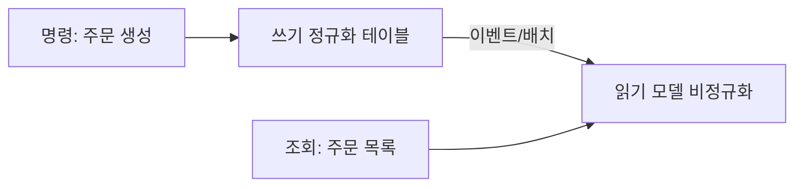

조회 화면이 무거워지면 인덱스를 아무리 손봐도 한계가 온다. 여러 테이블을 매번 조인해 합산·집계하는 비용 자체가 병목이기 때문이다. 이때 등장하는 카드가 **의도적 비정규화**다. 정규화는 옳지만, 조회 성능 앞에서는 깨야 할 때가 있다. 단 그 대가를 정확히 알아야 한다.

## 정규화가 만드는 조회 비용

정규화의 목표는 중복 제거와 갱신 이상 방지다. 데이터를 한 곳에만 두므로 쓰기는 깔끔하다. 대신 의미 있는 화면 하나를 그리려면 여러 테이블을 조인하고 집계해야 한다. 주문 목록에 "회원 등급명"과 "주문 상품 수"를 같이 보여주려면 매 조회마다 회원·등급·주문상품 테이블을 조인하고 `COUNT`를 돌린다. 트래픽이 늘면 이 조인·집계가 그대로 부하가 된다.

## 비정규화: 읽을 모양으로 미리 저장한다

비정규화는 **자주 읽는 형태를 미리 펼쳐 한 테이블에 중복 저장**하는 것이다. 조회 시점의 조인·집계를 쓰기 시점으로 옮기는 시간 이동이다.

```sql
-- 정규화: 매 조회마다 조인 + COUNT
SELECT o.id, u.grade_name, COUNT(oi.id) AS item_count
FROM orders o
JOIN users u ON u.id = o.user_id
JOIN order_items oi ON oi.order_id = o.id
GROUP BY o.id;

-- 비정규화: orders에 미리 박아두고 단순 조회
ALTER TABLE orders ADD COLUMN grade_name VARCHAR(20);
ALTER TABLE orders ADD COLUMN item_count INT DEFAULT 0;

SELECT id, grade_name, item_count FROM orders;  -- 조인·집계 없음
```

읽기는 극적으로 빨라진다. 대가는 **중복 데이터의 동기화 책임**이다. 회원 등급이 바뀌면 그 회원의 주문 행 `grade_name`을 모두 갱신해야 하고, 주문 항목이 추가되면 `item_count`를 증가시켜야 한다. 동기화를 빠뜨리면 데이터가 거짓말을 한다.

## 읽기 모델 분리 (CQRS의 절반)

한발 더 나가면, 쓰기용 정규화 테이블은 그대로 두고 조회 전용 **읽기 모델**을 별도로 만든다. 쓰기가 일어나면 이벤트나 배치로 읽기 모델을 갱신한다. 쓰기 모델은 정합성, 읽기 모델은 속도라는 각자의 목적에 최적화된다.



이 구조는 읽기 모델이 쓰기보다 **약간 늦게 갱신되는 것을 허용**한다(최종 일관성). 따라서 "정확히 지금 이 순간의 잔액" 같은 강한 일관성이 필요한 데이터에는 부적합하다.

## 운영 함정

- **부분 갱신 누락**: 비정규화 컬럼을 갱신하는 경로가 여러 곳이면 한 경로에서 갱신을 빠뜨려 값이 어긋난다. 갱신은 한 군데(서비스 메서드/트리거/이벤트 핸들러)로 모으고, 주기적 정합성 검증 배치로 원본과 대조해 보정한다.
- **무분별한 중복 확대**: "빠르니까" 하고 모든 화면마다 컬럼을 늘리면 쓰기 경로가 갱신 지옥이 된다. 비정규화는 측정된 병목에만, 읽기/쓰기 비율이 압도적으로 읽기에 쏠릴 때만 적용한다.

## 핵심 요약

- 비정규화는 조회 시점의 조인·집계를 쓰기 시점으로 옮기는 트레이드오프다.
- 대가는 중복 데이터 동기화 — 갱신 경로를 한 곳으로 모으고 검증 배치로 보정한다.
- 강한 일관성이 필요하면 읽기 모델 분리(최종 일관성)는 답이 아니다.
