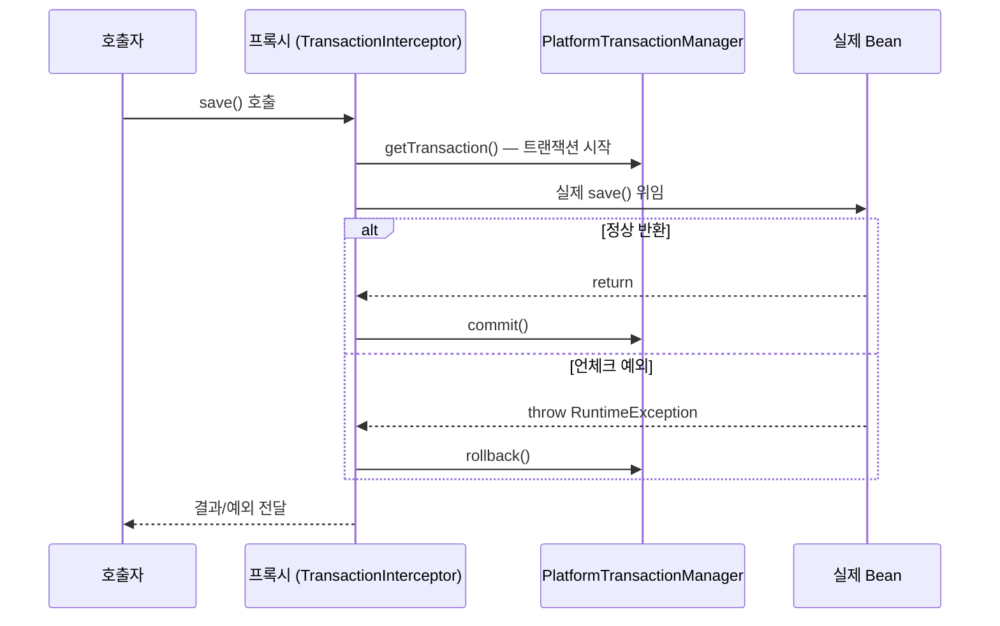

## "분명 @Transactional 붙였는데 롤백이 안 돼요"

트랜잭션은 `@Transactional` 한 줄이면 된다고 배우지만, 실무에선 "붙였는데 안 먹는다"를 자주 만납니다. 거의 전부 **이 애너테이션이 어떻게 동작하는지**를 모르면 못 피하는 함정입니다.

이 글의 목표는 하나입니다. `@Transactional`을 "DB를 묶어주는 마법"이 아니라 **"`TransactionInterceptor`가 프록시에서 가로채 `PlatformTransactionManager`로 경계를 긋는 메커니즘"**으로 바꾸는 것. 이 한 문장이 몸에 붙으면 함정의 90%는 애초에 안 밟습니다.

## 동작 원리: 프록시 안에서 벌어지는 일

`@Transactional`은 **AOP 프록시**로 동작합니다. Spring이 해당 Bean을 감싼 프록시를 만들고, 메서드 호출이 프록시를 거칠 때 `TransactionInterceptor`가 끼어들어 트랜잭션을 시작·커밋·롤백합니다.



말보다 흐름으로 보면 이렇습니다 — <span style="color:#2f9e44;font-weight:600">정상</span>이면 커밋 경로로, <span style="color:#e03131;font-weight:600">예외</span>면 롤백 경로로 분기합니다.

<div class="tx-flow" markdown="0">
<style>
.tx-flow{margin:1.4rem 0;overflow-x:auto}
.tx-flow svg{width:100%;max-width:720px;height:auto;display:block;margin:0 auto;font-family:inherit}
.tx-flow .lbl{fill:currentColor;font-size:12.5px;font-weight:600}
.tx-flow .sub{fill:currentColor;font-size:9px;opacity:.55}
.tx-flow .arr{stroke:currentColor;opacity:.3;stroke-width:1.5;fill:none}
.tx-flow rect.box{fill:none;stroke:currentColor;stroke-width:1.5;opacity:.4}
.tx-flow rect.ok{stroke:#2f9e44;opacity:.7}
.tx-flow rect.bad{stroke:#e03131;opacity:.7}
.tx-flow text.okc{fill:#2f9e44}
.tx-flow text.badc{fill:#e03131}
.tx-flow .pulse{animation:kftxpulse 4s ease-in-out infinite}
.tx-flow circle.tok-ok{fill:#2f9e44;animation:kftxok 4.4s ease-in-out infinite}
.tx-flow circle.tok-bad{fill:#e03131;animation:kftxbad 4.4s ease-in-out infinite 2.2s}
@keyframes kftxok{0%{transform:translate(0,0);opacity:0}6%{opacity:1}40%{transform:translate(360px,0);opacity:1}70%{transform:translate(540px,-52px);opacity:1}88%{opacity:1}100%{transform:translate(548px,-52px);opacity:0}}
@keyframes kftxbad{0%{transform:translate(0,0);opacity:0}6%{opacity:1}40%{transform:translate(360px,0);opacity:1}70%{transform:translate(540px,52px);opacity:1}88%{opacity:1}100%{transform:translate(548px,52px);opacity:0}}
@keyframes kftxpulse{0%,100%{opacity:.35}50%{opacity:.85}}
</style>
<svg viewBox="0 0 700 220" role="img" aria-label="호출이 프록시에서 트랜잭션을 시작하고 실제 메서드 실행 후 정상이면 커밋 예외면 롤백으로 분기되는 흐름 애니메이션">
  <rect class="box" x="8"   y="84" width="104" height="52" rx="8"/>
  <rect class="box pulse" x="158" y="84" width="132" height="52" rx="8"/>
  <rect class="box pulse" x="336" y="84" width="120" height="52" rx="8"/>
  <rect class="box ok"  x="556" y="28"  width="120" height="48" rx="8"/>
  <rect class="box bad" x="556" y="144" width="120" height="48" rx="8"/>
  <text class="lbl" x="60"  y="108" text-anchor="middle">호출자</text>
  <text class="lbl" x="224" y="106" text-anchor="middle">프록시</text>
  <text class="sub" x="224" y="122" text-anchor="middle">tx 시작</text>
  <text class="lbl" x="396" y="106" text-anchor="middle">실제 메서드</text>
  <text class="sub" x="396" y="122" text-anchor="middle">비즈니스 로직</text>
  <text class="lbl okc"  x="616" y="50"  text-anchor="middle">commit()</text>
  <text class="sub" x="616" y="65" text-anchor="middle">정상 반환</text>
  <text class="lbl badc" x="616" y="166" text-anchor="middle">rollback()</text>
  <text class="sub" x="616" y="181" text-anchor="middle">언체크 예외</text>
  <line class="arr" x1="112" y1="110" x2="158" y2="110"/>
  <line class="arr" x1="290" y1="110" x2="336" y2="110"/>
  <line class="arr" x1="456" y1="105" x2="556" y2="58"/>
  <line class="arr" x1="456" y1="115" x2="556" y2="164"/>
  <circle class="tok-ok"  cx="24" cy="110" r="7"/>
  <circle class="tok-bad" cx="24" cy="110" r="7"/>
</svg>
</div>

이 "프록시를 거쳐야 한다"는 전제 하나에서 거의 모든 함정이 파생됩니다.

## 함정 1: self-invocation (내부 호출)

같은 클래스 안에서 메서드가 다른 `@Transactional` 메서드를 **직접 호출**하면, 그 호출은 프록시가 아니라 `this`를 통하므로 인터셉터가 끼어들 자리가 없습니다. 트랜잭션이 통째로 무시됩니다.

```java
@Service
public class OrderService {

    public void process() {
        save();   // ❌ this.save() → 프록시를 안 거침 → 트랜잭션 X
    }

    @Transactional
    public void save() { ... }
}
```

해결책은 결국 "프록시를 거치게 만들기"입니다. 상황별로 셋 중 하나를 씁니다.

| 해법 | 방법 | 평가 |
|------|------|------|
| **구조 분리** | `save()`를 다른 Bean으로 빼서 주입받아 호출 | 가장 깔끔, 1순위 |
| **자기 주입** | 자신을 `@Lazy`로 주입받아 `self.save()` 호출 | 빠르지만 순환참조 냄새 |
| **`AopContext`** | `((OrderService) AopContext.currentProxy()).save()` | `exposeProxy = true` 필요, 최후의 수단 |

`TransactionTemplate`(프로그래밍 방식)으로 메서드 내부에서 직접 경계를 그어도 프록시 문제 자체가 사라집니다.

## 함정 2: 체크 예외는 기본 롤백이 안 된다

`@Transactional`은 기본적으로 **언체크 예외(`RuntimeException`)와 `Error`** 에서만 롤백합니다. **체크 예외**는 던져도 그대로 **커밋**됩니다. (EJB 시절의 관례를 물려받은 기본값입니다.)

```java
@Transactional
public void save() throws IOException {
    repo.save(entity);
    throw new IOException();   // ❌ 체크 예외 → 롤백 안 됨, 커밋됨!
}
```

해결: 롤백 대상을 명시합니다.

```java
@Transactional(rollbackFor = Exception.class)
public void save() throws IOException { ... }
```

> 더 무서운 변형: 예외를 잡아서 로그만 찍고 삼키면(`catch`) 프록시는 "정상 반환"으로 보고 **커밋**합니다. 롤백시키려면 다시 던지거나 `TransactionAspectSupport.currentTransactionStatus().setRollbackOnly()`를 호출해야 합니다.

## 함정 3: public 아니면 안 먹는다

프록시 방식(기본)에서는 **`public` 메서드에만** 트랜잭션이 적용됩니다. `private`·`protected`·package-private에 붙이면 조용히 무시됩니다. `final` 메서드/클래스도 CGLIB가 서브클래싱을 못 해 프록시 생성이 막힙니다.

- JDK 동적 프록시: 인터페이스 기반. 인터페이스에 없는 메서드는 프록시가 못 가로챕니다.
- CGLIB 프록시(Boot 기본): 클래스 상속 기반. 그래서 `final`/`private`이 문제.

정말 내부 호출·비-public까지 다 걸어야 한다면 프록시가 아닌 **AspectJ 로드/컴파일 타임 위빙**(`mode = ASPECTJ`)이 답이지만, 빌드가 복잡해지므로 보통은 구조를 바꾸는 게 낫습니다.

## 함정 4: 전파(propagation)를 모르고 쓰면 생기는 일

전파는 "이미 트랜잭션이 진행 중일 때 이 메서드는 어떻게 행동할까"를 정합니다.

| propagation | 트랜잭션 있을 때 | 없을 때 | 비고 |
|-------------|----------------|---------|------|
| `REQUIRED`(기본) | 참여 | 새로 시작 | 가장 흔함 |
| `REQUIRES_NEW` | **중단(suspend)** 후 새 트랜잭션 | 새로 시작 | 별도 커넥션 사용 |
| `NESTED` | 세이브포인트 생성 | 새로 시작 | JDBC 세이브포인트, 부분 롤백 |
| `SUPPORTS` | 참여 | 트랜잭션 없이 실행 | |
| `MANDATORY` | 참여 | **예외** | 반드시 누가 열어둬야 |
| `NEVER` | **예외** | 트랜잭션 없이 실행 | |
| `NOT_SUPPORTED` | 중단 후 비트랜잭션 실행 | 비트랜잭션 실행 | |

가장 자주 쓰는 `REQUIRES_NEW`의 함정 두 가지:

1. **커넥션을 하나 더 점유**합니다. 부모 트랜잭션이 커넥션을 쥔 채 자식이 또 빌리므로, 루프 안에서 남발하면 **커넥션 풀이 말라 데드락**에 빠집니다.
2. 부모와 **격리**됩니다. 부모가 방금 쓴(아직 커밋 안 된) 데이터를 자식은 못 봅니다.

`NESTED`는 새 트랜잭션이 아니라 **세이브포인트**입니다. 자식만 롤백하고 부모는 계속 갈 수 있지만, JDBC 세이브포인트를 지원하는 드라이버에서만 동작합니다.

```java
// 본 작업이 실패해도 감사 로그는 반드시 남겨야 할 때
@Transactional(propagation = Propagation.REQUIRES_NEW)
public void writeAuditLog(...) { ... }
```

## 함정 5: readOnly와 격리 수준 — "성능 옵션" 그 이상

`@Transactional(readOnly = true)`는 단순한 주석이 아닙니다.

- Hibernate 기준 `FlushMode`를 `MANUAL`로 낮춰 **더티 체킹/플러시를 건너뜁니다** → 조회 성능 향상, 의도치 않은 UPDATE 방지.
- DB·드라이버에 따라 읽기 전용 커넥션으로 라우팅되기도 합니다(리플리카 분기의 토대).

격리 수준(`isolation`)은 기본적으로 DB 기본값(보통 `READ_COMMITTED`)을 따르며, `@Transactional(isolation = ...)`로 메서드별 조정이 가능합니다. 단, 한 트랜잭션 도중에는 바꿀 수 없습니다.

## 가장 자주 터지는 운영 이슈: OSIV와 LazyInitializationException

Boot는 기본적으로 **OSIV(Open Session In View)** 가 켜져 있어, 영속성 컨텍스트를 뷰 렌더링까지 열어 둡니다. 덕분에 컨트롤러에서 지연 로딩이 "되는 것처럼" 보이지만, 트래픽이 몰리면 **DB 커넥션을 요청 끝까지 붙잡고 있어** 커넥션 풀이 고갈됩니다.

```yaml
spring:
  jpa:
    open-in-view: false   # 운영에선 끄고, 트랜잭션 안에서 필요한 연관을 명시적으로 로딩
```

끄면 트랜잭션 경계 밖에서 지연 로딩 시 `LazyInitializationException`이 나는데, 이건 버그가 아니라 **"경계를 명확히 하라"는 신호**입니다.

## 디버깅: 트랜잭션이 실제로 열렸는지 보는 법

추측 대신 로그로 확인합니다.

```yaml
logging:
  level:
    org.springframework.transaction.interceptor: TRACE   # 경계 시작/커밋/롤백
    org.springframework.orm.jpa: DEBUG
    org.hibernate.SQL: DEBUG
```

`Getting transaction for [...]`, `Completing transaction for [...]`, `Initiating transaction rollback` 로그가 메서드 단위로 찍힙니다. "안 걸린다"던 메서드에 이 로그가 **아예 안 보이면** → 십중팔구 함정 1·3(프록시 우회). 로그는 보이는데 롤백이 안 되면 → 함정 2(예외 종류).

## 면접/리뷰 단골 질문

- **Q. `@Transactional`이 self-invocation에서 안 먹는 이유는?** → 인터셉터는 프록시 경유 호출에서만 동작하는데, `this.method()`는 프록시를 우회한다.
- **Q. 체크 예외가 기본 롤백이 안 되는데 어떻게 롤백시키나?** → `rollbackFor` 명시, 또는 삼킨 예외라면 `setRollbackOnly()`.
- **Q. `REQUIRES_NEW`를 루프에서 쓰면 위험한 이유는?** → 부모 커넥션을 쥔 채 자식이 별도 커넥션을 빌려 풀 고갈/데드락 위험.
- **Q. 운영에서 `open-in-view`를 끄는 이유는?** → 요청 끝까지 커넥션을 점유하는 것을 막기 위해. 대신 트랜잭션 경계 안에서 연관을 로딩.

## 정리

- `@Transactional`은 **`TransactionInterceptor`가 AOP 프록시에서 가로채** `PlatformTransactionManager`로 경계를 긋는다. 이 한 줄이 핵심.
- **self-invocation**(함정 1)·**비-public/`final`**(함정 3)은 프록시를 우회·차단 → 트랜잭션 자체가 안 걸린다.
- **체크 예외는 기본 커밋**(함정 2) → `rollbackFor`, 삼킨 예외는 `setRollbackOnly()`.
- 전파는 표로 외우되 **`REQUIRES_NEW`는 커넥션 2개·격리**, **`NESTED`는 세이브포인트**임을 기억.
- 운영에선 **`open-in-view=false`** + 트랜잭션 인터셉터 TRACE 로그로 경계를 눈으로 확인하자.

> 관련 글: 프록시·인터셉터가 어떻게 Bean에 끼어드는지는 [IoC/DI와 Bean 생명주기]()에서, 영속성 컨텍스트·지연 로딩의 토대는 [Spring Data JPA 기초]()에서 다룹니다.
