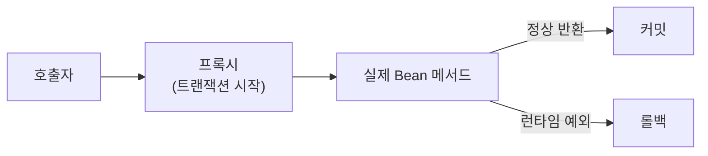

## "분명 @Transactional 붙였는데 롤백이 안 돼요"

트랜잭션은 `@Transactional` 한 줄이면 된다고 배우지만, 실무에서 "붙였는데 안 먹는다"는 상황을 꽤 자주 만납니다. 대부분은 **@Transactional이 어떻게 동작하는지**를 모르면 못 피하는 함정들입니다.

## 동작 원리: AOP 프록시

`@Transactional`은 마법이 아니라 **AOP 프록시**로 동작합니다. Spring이 해당 Bean을 감싼 프록시를 만들고, 메서드 호출이 프록시를 거칠 때 트랜잭션을 시작하고, 정상 종료면 커밋, 예외면 롤백합니다.



이 "프록시를 거쳐야 한다"는 전제 때문에 함정들이 생깁니다.

## 함정 1: self-invocation (내부 호출)

같은 클래스 안에서 메서드가 다른 `@Transactional` 메서드를 **직접 호출**하면, 프록시를 거치지 않아서 트랜잭션이 적용되지 않습니다.

```java
@Service
public class OrderService {

    public void process() {
        save();   // ❌ this.save() → 프록시를 안 거침 → 트랜잭션 X
    }

    @Transactional
    public void save() { ... }
}
```

해결: 별도 Bean으로 분리하거나, 자기 자신을 주입받아 호출하거나, `process()`에 트랜잭션을 거는 식으로 구조를 바꿉니다.

## 함정 2: 체크 예외는 기본 롤백이 안 된다

`@Transactional`은 기본적으로 **언체크 예외(RuntimeException)와 Error**에서만 롤백합니다. **체크 예외**는 던져도 커밋됩니다.

```java
@Transactional
public void save() throws IOException {
    repo.save(entity);
    throw new IOException();   // ❌ 체크 예외 → 롤백 안 됨, 커밋됨!
}
```

해결: `rollbackFor`를 명시합니다.

```java
@Transactional(rollbackFor = Exception.class)
public void save() throws IOException { ... }
```

## 함정 3: public 아니면 안 먹는다

프록시 방식(기본)에서는 **`public` 메서드에만** 트랜잭션이 적용됩니다. `private`, `protected`, package-private 메서드에 붙이면 무시됩니다. `final` 메서드/클래스도 프록시를 못 만들어 문제가 됩니다.

## 함정 4: readOnly와 전파(propagation)

- 조회 전용 메서드엔 `@Transactional(readOnly = true)` → 약간의 최적화 + 의도 명확화.
- 부모 트랜잭션과 무관하게 **독립 트랜잭션**이 필요하면 `propagation = REQUIRES_NEW` (예: 실패해도 꼭 남겨야 하는 로그). 단, 별도 커넥션을 쓰므로 남발하면 커넥션 풀이 마릅니다.

```java
@Transactional(propagation = Propagation.REQUIRES_NEW)
public void writeAuditLog(...) { ... }
```

## 정리

- `@Transactional`은 **AOP 프록시**로 동작한다. 이 한 가지만 기억해도 대부분의 함정을 피한다.
- **내부 호출(self-invocation)** 은 트랜잭션이 안 걸린다.
- **체크 예외는 기본 롤백 X** → 필요하면 `rollbackFor`.
- **public 메서드**에만 적용된다.
- 조회엔 `readOnly = true`, 독립 트랜잭션엔 `REQUIRES_NEW`(남용 금지).
