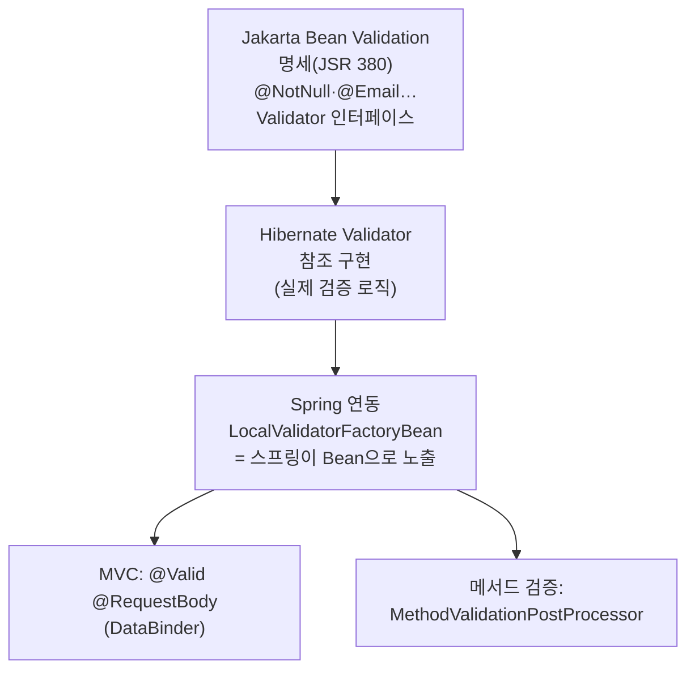

## 검증 코드를 `if`문으로 도배하던 시절

컨트롤러에서 요청을 받으면 "이름은 비었나? 이메일 형식 맞나? 나이는 음수 아닌가?"를 일일이 `if`로 검사했습니다. 검증 로직이 비즈니스 로직과 뒤섞이고 API마다 중복됐죠. **Bean Validation(Jakarta Validation)** 은 이걸 애너테이션으로 선언적으로 바꿔줍니다.

그런데 실무에서 "분명 `@NotBlank` 붙였는데 검증이 안 먹는다", "`@RequestBody`는 400인데 `@RequestParam`은 500이 난다" 같은 일이 끊이지 않습니다. 전부 **명세(Jakarta) · 구현(Hibernate Validator) · Spring 연동**이 각각 어디까지 책임지는지를 모르면 못 피하는 함정들입니다. 이 글은 그 경계를 소스 레벨에서 그어 봅니다.

## 누가 무엇을 하나: 명세 vs 구현 vs Spring



- **명세**(`jakarta.validation.*`): 애너테이션과 `Validator` API의 *계약*만 정의. 동작은 없음.
- **구현**(Hibernate Validator): 실제로 제약을 평가. `spring-boot-starter-validation`이 끌어온다.
- **Spring**: `ValidationAutoConfiguration`이 `LocalValidatorFactoryBean`을 Bean으로 등록해, MVC 바인딩과 메서드 검증 양쪽에 연결한다. (자동 구성이 어떻게 이 Bean을 조건부로 다는지는 [자동 구성 글]()과 같은 원리다.)

## 기본 사용법

```java
public record SignupRequest(
        @NotBlank String name,
        @Email String email,
        @Min(0) @Max(150) int age,
        @Size(min = 8, message = "비밀번호는 8자 이상이어야 합니다") String password
) {}
```

```java
@PostMapping("/users")
public ResponseEntity<Void> signup(@Valid @RequestBody SignupRequest req) {
    userService.signup(req);
    return ResponseEntity.status(HttpStatus.CREATED).build();
}
```

> `spring-boot-starter-validation` 의존성이 있어야 동작합니다. Spring Boot 3.x부터 네임스페이스는 `javax`가 아니라 **`jakarta.validation.constraints.*`** 입니다.
{: .prompt-tip }

## 검증이 흐르는 모습

요청 DTO가 제약 게이트들을 통과하며, 위반은 하나의 `BindingResult`로 모입니다. **하나라도 위반이 있으면** 메서드 본문은 실행되지 않고 곧장 예외로 분기합니다 — <span style="color:#2f9e44;font-weight:600">초록</span>은 통과, <span style="color:#e03131;font-weight:600">빨강</span>은 누적되는 위반입니다.

<div class="bv-flow" markdown="0">
<style>
.bv-flow{margin:1.4rem 0;overflow-x:auto}
.bv-flow svg{width:100%;max-width:720px;height:auto;display:block;margin:0 auto;font-family:inherit}
.bv-flow .lbl{fill:currentColor;font-size:12.5px;font-weight:600}
.bv-flow .sub{fill:currentColor;font-size:9.5px;opacity:.55}
.bv-flow .arr{stroke:currentColor;opacity:.35;stroke-width:1.5;fill:none}
.bv-flow rect.gate{fill:none;stroke:currentColor;stroke-width:1.5;opacity:.4}
.bv-flow rect.g1{animation:kfbvpulse 4.5s ease-in-out infinite}
.bv-flow rect.g2{animation:kfbvpulse 4.5s ease-in-out infinite .8s}
.bv-flow rect.g3{animation:kfbvpulse 4.5s ease-in-out infinite 1.6s}
.bv-flow rect.tray{fill:#e0313112;stroke:#e03131;stroke-width:1.3;opacity:.7}
.bv-flow text.tray{fill:#e03131;font-size:11px;font-weight:600}
.bv-flow circle.dto{fill:#1971c2;animation:kfbvflow 4.5s linear infinite}
.bv-flow circle.v1{fill:#e03131;animation:kfbvdrop 4.5s linear infinite 1.1s}
.bv-flow circle.v2{fill:#e03131;animation:kfbvdrop2 4.5s linear infinite 2.0s}
@keyframes kfbvflow{0%{transform:translateX(0);opacity:0}5%{opacity:1}70%{opacity:1;transform:translateX(470px)}100%{transform:translateX(470px);opacity:.25}}
@keyframes kfbvdrop{0%,18%{transform:translate(0,0);opacity:0}24%{transform:translate(150px,0);opacity:1}48%{transform:translate(150px,86px);opacity:1}100%{transform:translate(150px,86px);opacity:.5}}
@keyframes kfbvdrop2{0%,30%{transform:translate(0,0);opacity:0}36%{transform:translate(320px,0);opacity:1}60%{transform:translate(320px,86px);opacity:1}100%{transform:translate(320px,86px);opacity:.5}}
@keyframes kfbvpulse{0%,100%{opacity:.35}50%{opacity:.9}}
</style>
<svg viewBox="0 0 700 200" role="img" aria-label="요청 DTO가 제약 게이트를 통과하고 위반이 하나의 결과로 모여 예외로 분기되는 흐름 애니메이션">
  <text class="lbl" x="34" y="46" text-anchor="middle">요청</text>
  <text class="sub" x="34" y="62" text-anchor="middle">DTO</text>
  <rect class="gate g1" x="120" y="20" width="110" height="48" rx="8"/>
  <rect class="gate g2" x="290" y="20" width="110" height="48" rx="8"/>
  <rect class="gate g3" x="460" y="20" width="110" height="48" rx="8"/>
  <text class="lbl" x="175" y="40" text-anchor="middle">@NotBlank</text>
  <text class="sub" x="175" y="56" text-anchor="middle">name</text>
  <text class="lbl" x="345" y="40" text-anchor="middle">@Email</text>
  <text class="sub" x="345" y="56" text-anchor="middle">email</text>
  <text class="lbl" x="515" y="40" text-anchor="middle">@Size(min=8)</text>
  <text class="sub" x="515" y="56" text-anchor="middle">password</text>
  <rect class="gate" x="600" y="20" width="86" height="48" rx="8"/>
  <text class="lbl" x="643" y="48" text-anchor="middle">분기</text>
  <line class="arr" x1="64" y1="44" x2="120" y2="44"/>
  <line class="arr" x1="230" y1="44" x2="290" y2="44"/>
  <line class="arr" x1="400" y1="44" x2="460" y2="44"/>
  <line class="arr" x1="570" y1="44" x2="600" y2="44"/>
  <rect class="tray" x="120" y="140" width="450" height="44" rx="8"/>
  <text class="tray" x="345" y="166" text-anchor="middle">BindingResult — 위반 누적 → MethodArgumentNotValidException (400)</text>
  <circle class="dto" cx="64" cy="44" r="8"/>
  <circle class="v1" cx="34" cy="44" r="6"/>
  <circle class="v2" cx="34" cy="44" r="6"/>
</svg>
</div>

검증 실패 시 발생하는 예외(여기서는 `MethodArgumentNotValidException`)를 [전역 예외 핸들러]()에서 잡아 필드별 메시지로 표준화해 내려주면 됩니다. **그런데 "어떤 예외가 나오느냐"가 경로마다 다릅니다** — 이게 가장 큰 함정입니다.

## ★ 가장 큰 함정: 검증 경로가 둘이고, 예외도 다르다

같은 `@Min(1)` 제약이라도 **어디에 거느냐**에 따라 완전히 다른 경로로 검증되고 다른 예외가 납니다.

| 대상 | 트리거 | 검증 주체 | 실패 예외 | 기본 HTTP |
|------|--------|----------|-----------|-----------|
| `@Valid @RequestBody DTO` | 메서드 인자 바인딩 | `DataBinder` + `Validator` | `MethodArgumentNotValidException` | 400 |
| `@RequestParam`/`@PathVariable` 직접 제약 | `@Validated` **클래스** | `MethodValidationPostProcessor`(AOP) | `ConstraintViolationException`(또는 `HandlerMethodValidationException`) | 처리 안 하면 **500** |

```java
@Validated                         // ← 이게 없으면 메서드 파라미터 검증 자체가 꺼져 있음
@RestController
public class ProductController {

    @GetMapping("/products")
    public List<Product> list(@RequestParam @Min(1) int page) { ... }
    // page=0 → ConstraintViolationException → 핸들러 없으면 500!
}
```

`@RequestBody`만 검증해 본 사람은 "검증 실패면 당연히 400"이라 믿다가, 파라미터 검증에서 500을 만나고 당황합니다. **두 예외를 모두 `@RestControllerAdvice`에서 처리**해야 합니다. (Spring 6.1+에서는 컨트롤러 메서드 검증이 `HandlerMethodValidationException`으로 일원화되어 MVC가 기본 400으로 처리해 주지만, 서비스 계층 메서드 검증은 여전히 `ConstraintViolationException`입니다.)

## 메서드 레벨 검증은 왜 `@Validated` 클래스에서만 되나

`@RequestBody` 검증은 MVC의 `DataBinder`가 직접 호출하지만, `@RequestParam`이나 서비스 메서드 인자 검증은 **AOP 프록시**(`MethodValidationPostProcessor`)가 가로채 `ExecutableValidator`로 검증합니다. 그래서 **클래스에 `@Validated`가 있어야** 프록시가 생기고, 프록시를 거치는 호출에만 검증이 걸립니다.

> 눈치챘다면 좋습니다 — 이건 [`@Transactional`의 프록시 함정]()과 정확히 같은 메커니즘입니다. **self-invocation이면 메서드 검증도 안 먹습니다.**

## `@Valid`(표준) vs `@Validated`(Spring)

| | `@Valid` | `@Validated` |
|---|---|---|
| 출처 | Jakarta 표준 | Spring |
| 그룹(groups) | ✕ | ✔ |
| 중첩 캐스케이드(필드에 부착) | ✔ | ✕ |
| 메서드 파라미터 검증 활성화(클래스 부착) | ✕ | ✔ |

규칙: **DTO 바디·중첩은 `@Valid`**, **그룹/메서드 파라미터 검증은 `@Validated`**.

## 검증 그룹과 순서

상황에 따라 적용할 제약을 나누고 싶을 때 그룹을 씁니다 (예: 생성 시엔 `id`가 없어야, 수정 시엔 있어야).

```java
public interface OnCreate {}
public interface OnUpdate {}

public record UserRequest(
        @Null(groups = OnCreate.class) @NotNull(groups = OnUpdate.class) Long id,
        @NotBlank String name        // 그룹 미지정 = Default 그룹
) {}

@PostMapping("/users")
public void create(@Validated(OnCreate.class) @RequestBody UserRequest req) { ... }
```

> **함정**: 특정 그룹(`OnCreate`)으로 검증하면 **그룹 미지정 제약(`@NotBlank name`)은 검증되지 않습니다.** 그룹 미지정은 `Default` 그룹에 속하므로, 같이 검증하려면 `@Validated({OnCreate.class, Default.class})`로 명시하거나 제약에 그룹을 달아야 합니다.

`@GroupSequence`로 그룹 간 **순서**(앞 그룹 실패 시 뒤 그룹 스킵)도 줄 수 있습니다 — 비싼 검증(DB 조회 등)을 싼 검증 통과 후에만 돌릴 때 유용합니다.

## 중첩·컬렉션 요소 검증

캐스케이드는 자동이 아닙니다. **안쪽까지 내려가려면 필드에 `@Valid`**, 컬렉션은 **요소에 `@Valid`**:

```java
public record OrderRequest(
        @NotNull @Valid Address address,            // Address 내부 제약까지
        @NotEmpty List<@Valid OrderLine> lines,     // 각 요소를 검증
        Map<String, @NotBlank String> labels        // 값에 제약
) {}
```

`@Valid`를 빼면 `address`는 null 여부(`@NotNull`)만 보고 내부 필드는 통과해 버립니다 — "검증했는데 이상한 값이 들어왔다"의 단골 원인.

## 커스텀 제약: 단일 필드와 교차 필드

단일 필드 제약은 `ConstraintValidator`로:

```java
@Target(ElementType.FIELD)
@Retention(RetentionPolicy.RUNTIME)
@Constraint(validatedBy = PhoneValidator.class)
public @interface Phone {
    String message() default "올바른 휴대폰 번호가 아닙니다";
    Class<?>[] groups() default {};
    Class<? extends Payload>[] payload() default {};
}

public class PhoneValidator implements ConstraintValidator<Phone, String> {
    @Override
    public boolean isValid(String value, ConstraintValidatorContext ctx) {
        return value == null || value.matches("01[0-9]-\\d{3,4}-\\d{4}");
        // null 허용 여부는 @NotNull과 조합으로 결정하는 게 표준 관례
    }
}
```

**"비밀번호 == 비밀번호 확인" 같은 교차 필드 검증**은 클래스 레벨 제약으로 만듭니다 (validator의 대상 타입을 객체로). 또한 `ConstraintValidator`는 **스프링 Bean을 주입받을 수 있어** (예: 중복 검사용 `Repository`) `initialize()`에서 설정을 읽고 `isValid()`에서 DB를 조회하는 동적 제약도 가능합니다.

## 디버깅 체크리스트

- 검증이 아예 안 먹는다 → `@Valid`/`@Validated` 누락, 또는 `spring-boot-starter-validation` 미포함.
- 파라미터 검증이 500을 낸다 → 클래스에 `@Validated` 없거나 `ConstraintViolationException` 핸들러 없음.
- 일부 제약만 검증된다 → 그룹 지정으로 `Default`가 빠졌거나, 중첩에 `@Valid` 누락.
- 메시지 커스터마이즈 → `ValidationMessages.properties` 또는 `message` 속성, `{0}`/`{value}` 플레이스홀더.

## 면접/리뷰 단골 질문

- **Q. `@Valid`와 `@Validated`의 차이는?** → `@Valid`는 Jakarta 표준(바디·중첩 캐스케이드), `@Validated`는 Spring 확장으로 그룹과 클래스 레벨 메서드 파라미터 검증을 제공.
- **Q. `@RequestParam` 검증이 500을 내는 이유는?** → 메서드 검증은 AOP(`MethodValidationPostProcessor`)로 동작하고 `ConstraintViolationException`을 던지므로, 클래스에 `@Validated`가 필요하고 예외 핸들러로 400 매핑이 필요.
- **Q. 중첩 객체가 검증을 안 거치는 이유는?** → 캐스케이드는 명시적이라, 필드에 `@Valid`를 붙여야 안쪽 제약까지 내려간다.

## 정리

- **명세(Jakarta) · 구현(Hibernate Validator) · 연동(Spring)** 의 책임 경계를 알면 대부분의 함정이 풀린다.
- 검증 경로는 **둘**(바디 바인딩 vs 메서드 AOP)이고, 예외도 다르다 → 둘 다 핸들링.
- `@Valid`(표준·중첩) vs `@Validated`(그룹·메서드 검증). 메서드 검증은 프록시 기반이라 `@Validated` 클래스 + self-invocation 주의.
- 그룹 지정 시 `Default` 누락, 중첩/컬렉션 `@Valid` 누락이 "검증했는데 통과"의 주범.
- 커스텀 제약은 `ConstraintValidator`(Bean 주입 가능), 교차 필드는 클래스 레벨 제약으로.
