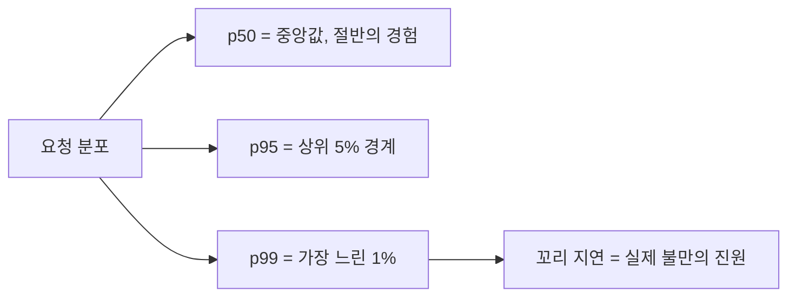

"느려요"라는 제보를 받으면 가장 먼저 할 일은 추측이 아니라 측정이다. 응답 지연을 점검할 때 의지할 도구가 **슬로우쿼리 로그**와 **백분위 지표**다. 둘 다 평균이라는 함정을 피하기 위한 장치다. 어떻게 임계치를 잡고, 무엇을 봐야 하는지 정리한다.

## 슬로우쿼리 로그: 임계치를 넘는 쿼리를 기록한다

MySQL은 실행 시간이 `long_query_time`을 넘는 쿼리를 로그에 남긴다.

```sql
SET GLOBAL slow_query_log = 'ON';
SET GLOBAL long_query_time = 1;          -- 1초 초과 기록
SET GLOBAL log_queries_not_using_indexes = 'ON';  -- 인덱스 안 탄 쿼리도
```

임계치를 너무 높게 잡으면(예: 10초) 빈번하게 0.5초씩 걸리는, 누적으로 시스템을 갉아먹는 쿼리를 놓친다. 처음엔 낮게(0.5~1초) 잡아 전체 그림을 보고, 로그가 너무 방대하면 올린다. `pt-query-digest` 같은 도구로 로그를 집계하면 **총 누적 시간 기준 상위 쿼리**가 드러난다 — 한 번에 느린 쿼리보다, 자주 불려 누적이 큰 쿼리가 진짜 범인인 경우가 많다.

## 평균이 거짓말하는 이유 — 그래서 p99

평균 응답 시간은 꼬리(tail) 지연을 가린다. 100건 중 99건이 10ms, 1건이 2초라면 평균은 약 30ms로 "괜찮아 보인다". 하지만 그 1건을 만난 사용자에게 서비스는 멈춘 것이다.



**p99**는 "전체 요청의 99%가 이 시간 안에 끝난다"는 값이다. 즉 가장 느린 1%의 경계다. 사용자 체감 품질은 평균이 아니라 이 꼬리가 좌우한다. 한 페이지가 여러 백엔드 호출을 합치면, 각 호출이 p99에 걸릴 확률이 누적돼 **페이지 전체가 느려질 확률은 개별 p99보다 훨씬 높아진다**(fan-out 증폭). 그래서 마이크로 단위의 꼬리도 무시할 수 없다.

## 백분위는 평균낼 수 없다

흔한 실수는 여러 서버의 p99를 다시 평균내는 것이다. 백분위는 분포에서 나오므로 산술 평균이 불가능하다. 정확히 하려면 원시 분포(히스토그램 버킷)를 합산해 다시 백분위를 계산해야 한다. 모니터링 도구가 히스토그램 기반 집계를 지원하는지 확인한다.

## 운영 함정

- **샘플링 편향**: 트래픽이 폭증할 때만 느린 쿼리는 평상시 샘플에 안 잡힌다. 부하 피크 시간대를 따로 관찰하고, 로그를 시간대별로 쪼개 본다. 평균을 보는 대시보드만 띄워두면 피크의 꼬리를 영원히 못 본다.
- **로그 자체가 부하**: 임계치 0으로 모든 쿼리를 기록하면 디스크 I/O가 폭증해 오히려 DB가 느려진다. 진단이 끝나면 임계치를 정상으로 되돌리고, 운영 상시 수집은 샘플링 비율을 조절한다.

## 핵심 요약

- 슬로우쿼리 로그 임계치는 낮게 시작해 누적 시간 기준 상위 쿼리부터 잡는다.
- 평균은 꼬리를 가린다 — 사용자 체감은 p99가 좌우한다.
- 백분위는 평균낼 수 없다. 분포(히스토그램)에서 다시 계산한다.
