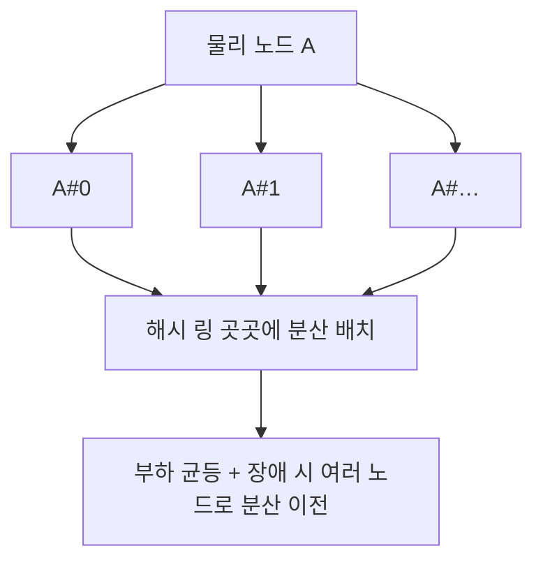

## `hash % N`의 저주

키를 여러 서버에 나눠 담는 가장 단순한 방법은 **`서버 = hash(key) % N`** 입니다. N개 서버에 고르게 퍼지고 조회도 O(1)이죠. 문제는 **N이 바뀌는 순간** 터집니다. 서버를 4대에서 5대로 늘리면 나누는 수가 바뀌어, 거의 **모든 키의 귀속 서버가 재계산**됩니다. 분산 캐시라면 캐시 거의 전체가 한순간에 미스가 되어(캐시 스탬피드) 백엔드가 폭주하고, 분산 DB라면 데이터 대부분이 노드 사이를 이사 다닙니다.

스케일 아웃·장애 복구가 일상인 분산 시스템에서 이건 치명적입니다. **일관된 해싱(consistent hashing)** 은 "노드 1대가 늘거나 줄 때, 이동하는 키를 전체의 약 **1/N**로 최소화한다"는 목표로 이 저주를 풉니다.

## 해시 링 — 키와 노드를 같은 원 위에 놓는다

아이디어는 우아합니다. 키도 노드도 **같은 해시 공간**(예: 0 ~ 2³²)에 올린 뒤, 그 공간을 **원(ring)** 으로 잇습니다. 각 키는 자기 위치에서 **시계 방향으로 처음 만나는 노드**에 귀속됩니다. 노드를 하나 제거하면, 그 노드가 갖던 키들만 **다음 노드로** 넘어가고 — 나머지 키들은 전혀 움직이지 않습니다.

<div class="chash17ring" markdown="0">
<style>
.chash17ring{margin:1.4rem 0;overflow-x:auto}
.chash17ring svg{width:100%;max-width:520px;height:auto;display:block;margin:0 auto;font-family:inherit}
.chash17ring .ring{fill:none;stroke:currentColor;stroke-width:2;opacity:.35}
.chash17ring .lbl{fill:currentColor;font-size:11px;font-weight:700}
.chash17ring .sub{fill:currentColor;font-size:9.5px;opacity:.6}
.chash17ring .node{fill:#1971c2}
.chash17ring .key{fill:#f08c00}
.chash17ring .nB{animation:chash17fade 8s ease-in-out infinite}
@keyframes chash17fade{0%,55%{opacity:1}62%,100%{opacity:.12}}
.chash17ring .nBlbl{animation:chash17fade 8s ease-in-out infinite}
.chash17ring .moves{animation:chash17move 8s ease-in-out infinite}
@keyframes chash17move{0%,55%{transform:translate(0,0)}70%,100%{transform:translate(118px,-44px)}}
.chash17ring .reassign{animation:chash17ra 8s ease-in-out infinite}
@keyframes chash17ra{0%,58%{opacity:0}66%,100%{opacity:1}}
.chash17ring .stay{opacity:.95}
</style>
<svg viewBox="0 0 520 300" role="img" aria-label="해시 링 위에 노드와 키가 놓이고 노드 하나가 사라지면 그 구간의 키만 시계방향 다음 노드로 이동하고 나머지 키는 그대로 있는 일관된 해싱 애니메이션">
  <circle class="ring" cx="200" cy="150" r="110"/>
  <circle class="node" cx="200" cy="40"  r="9"/>
  <text class="lbl" x="200" y="28" text-anchor="middle">A</text>
  <circle class="node nB" cx="295" cy="205" r="9"/>
  <text class="lbl nBlbl" x="312" y="212">B</text>
  <circle class="node" cx="105" cy="205" r="9"/>
  <text class="lbl" x="84" y="212" text-anchor="middle">C</text>
  <circle class="key stay" cx="262" cy="78" r="6"/>
  <circle class="key stay" cx="88"  cy="118" r="6"/>
  <circle class="key stay" cx="150" cy="252" r="6"/>
  <circle class="key moves" cx="248" cy="240" r="6"/>
  <text class="sub reassign" x="200" y="288" text-anchor="middle">B 제거 → B가 갖던 키만 시계방향 다음 노드(A)로. 나머지는 그대로</text>
  <text class="sub" x="200" y="150" text-anchor="middle">해시 링</text>
  <text class="sub" x="200" y="166" text-anchor="middle">(0 ~ 2³²)</text>
</svg>
</div>

이게 전부입니다. 조회는 "키 해시 ≥ 노드 해시인 첫 노드"를 찾는 것이라, 노드 위치를 정렬해두면 [이진 탐색]()으로 **O(log N)** 에 끝납니다.

```python
import bisect, hashlib

class HashRing:
    def __init__(self, nodes, vnodes=150):
        self.ring = {}              # 해시 → 노드
        self.sorted_keys = []
        for n in nodes:
            for v in range(vnodes): # 가상 노드로 균등 분산
                h = self._hash(f"{n}#{v}")
                self.ring[h] = n
                bisect.insort(self.sorted_keys, h)

    def _hash(self, key):
        return int(hashlib.md5(key.encode()).hexdigest(), 16)

    def get(self, key):
        h = self._hash(key)
        i = bisect.bisect(self.sorted_keys, h) % len(self.sorted_keys)
        return self.ring[self.sorted_keys[i]]   # 시계방향 첫 노드
```

## 모듈로 vs 일관된 해싱 — 노드가 하나 바뀔 때

차이는 **노드가 변할 때 몇 개의 키가 이사하는가**입니다. 아래에서 직접 비교해 보세요. 위쪽 `hash % N`은 N이 4→5로 바뀌자 거의 모든 칸의 색(귀속 노드)이 바뀌고, 아래쪽 일관된 해싱은 일부만 바뀝니다.

<div class="chash17cmp" markdown="0">
<style>
.chash17cmp{margin:1.4rem 0;overflow-x:auto}
.chash17cmp svg{width:100%;max-width:680px;height:auto;display:block;margin:0 auto;font-family:inherit}
.chash17cmp .lbl{fill:currentColor;font-size:11px;font-weight:700}
.chash17cmp .sub{fill:currentColor;font-size:9.5px;opacity:.6}
.chash17cmp .cell{stroke:currentColor;stroke-width:.8;opacity:.9}
.chash17cmp .mod{animation:chash17mod 7s ease-in-out infinite}
@keyframes chash17mod{0%,40%{fill:#1971c2}50%,90%{fill:#e03131}100%{fill:#1971c2}}
.chash17cmp .modkeep{animation:chash17modk 7s ease-in-out infinite}
@keyframes chash17modk{0%,40%{fill:#1971c2}50%,90%{fill:#1971c2}100%{fill:#1971c2}}
.chash17cmp .ch{fill:#1971c2}
.chash17cmp .chmove{animation:chash17chm 7s ease-in-out infinite}
@keyframes chash17chm{0%,40%{fill:#1971c2}50%,90%{fill:#2f9e44}100%{fill:#1971c2}}
.chash17cmp .flash{opacity:0;animation:chash17fl 7s ease-in-out infinite}
@keyframes chash17fl{0%,38%{opacity:0}44%,52%{opacity:1}58%,100%{opacity:0}}
</style>
<svg viewBox="0 0 680 220" role="img" aria-label="노드 수가 4에서 5로 바뀔 때 모듈로 방식은 거의 모든 키가 재배치되고 일관된 해싱은 일부만 재배치되는 비교 애니메이션">
  <text class="flash" x="340" y="20" text-anchor="middle" fill="#f08c00" font-weight="700" font-size="13">노드 4 → 5 추가!</text>
  <text class="lbl" x="20" y="56">hash % N  (빨강 = 이사한 키)</text>
  <g>
    <rect class="cell mod"     x="20"  y="66" width="38" height="30"/>
    <rect class="cell modkeep" x="58"  y="66" width="38" height="30"/>
    <rect class="cell mod"     x="96"  y="66" width="38" height="30"/>
    <rect class="cell mod"     x="134" y="66" width="38" height="30"/>
    <rect class="cell mod"     x="172" y="66" width="38" height="30"/>
    <rect class="cell modkeep" x="210" y="66" width="38" height="30"/>
    <rect class="cell mod"     x="248" y="66" width="38" height="30"/>
    <rect class="cell mod"     x="286" y="66" width="38" height="30"/>
    <rect class="cell mod"     x="324" y="66" width="38" height="30"/>
    <rect class="cell mod"     x="362" y="66" width="38" height="30"/>
    <rect class="cell mod"     x="400" y="66" width="38" height="30"/>
    <rect class="cell modkeep" x="438" y="66" width="38" height="30"/>
  </g>
  <text class="sub" x="500" y="86">거의 전부 재배치 → 캐시 전멸</text>
  <text class="lbl" x="20" y="152">일관된 해싱 (초록 = 이사한 키)</text>
  <g>
    <rect class="cell ch"     x="20"  y="162" width="38" height="30"/>
    <rect class="cell ch"     x="58"  y="162" width="38" height="30"/>
    <rect class="cell chmove" x="96"  y="162" width="38" height="30"/>
    <rect class="cell ch"     x="134" y="162" width="38" height="30"/>
    <rect class="cell ch"     x="172" y="162" width="38" height="30"/>
    <rect class="cell ch"     x="210" y="162" width="38" height="30"/>
    <rect class="cell ch"     x="248" y="162" width="38" height="30"/>
    <rect class="cell chmove" x="286" y="162" width="38" height="30"/>
    <rect class="cell ch"     x="324" y="162" width="38" height="30"/>
    <rect class="cell ch"     x="362" y="162" width="38" height="30"/>
    <rect class="cell ch"     x="400" y="162" width="38" height="30"/>
    <rect class="cell ch"     x="438" y="162" width="38" height="30"/>
  </g>
  <text class="sub" x="500" y="182">약 1/N만 이동 → 나머지 캐시 생존</text>
</svg>
</div>

평균적으로 일관된 해싱은 노드 변동 시 **K/N개의 키**(K=전체 키, N=노드 수)만 이동시킵니다. 4→5로 갈 때 약 20%만 움직이고 80%는 그대로 — 캐시 적중률이 보존됩니다.

## 가상 노드 — 균등 분산과 부드러운 부하 이전

순진하게 노드를 링에 1점씩만 올리면 두 가지 문제가 생깁니다. (1) 노드들이 링에 **불균등**하게 떨어져 어떤 노드가 훨씬 큰 구간을 떠맡습니다. (2) 노드가 죽으면 그 부하가 **다음 한 노드에 통째로** 쏠립니다.

해결책은 각 물리 노드를 **여러 개의 가상 노드(virtual node)** 로 링에 흩뿌리는 것입니다(노드 A를 A#0, A#1, … A#149처럼). 그러면 부하가 고르게 펴지고, 한 노드가 빠질 때 그 부하가 **여러 노드로 분산**되어 이전됩니다. 가상 노드 수가 많을수록 표준편차는 $\frac{1}{\sqrt{vnodes}}$로 줄어듭니다.



## 랑데부(HRW) 해싱 — 링 없이 같은 목표를

같은 문제를 푸는 또 다른 방법이 **랑데부 해싱(Rendezvous / HRW, Highest Random Weight)** 입니다. 링을 만들지 않고, 키마다 **모든 노드와의 `hash(key, node)` 점수를 계산해 최댓값인 노드**를 고릅니다. 노드가 빠지면 그 노드를 1등으로 뽑았던 키들만 차순위로 옮겨가, 일관된 해싱과 같은 최소 이동성을 얻습니다. 구현이 간결하고 가중치 부여가 자연스러워, 노드 수가 적당할 때 즐겨 쓰입니다(조회는 O(N)).

| 방식 | 조회 비용 | 균등성 | 특징 |
|------|----------|--------|------|
| `hash % N` | O(1) | 좋음 | N 변하면 거의 전부 이동 ✗ |
| 일관된 해싱 + vnode | O(log N) | vnode로 우수 | 표준, 부하 이전 부드러움 |
| 랑데부(HRW) | O(N) | 우수 | 링 불필요, 가중치 용이 |

## 어디에 쓰이나 — DynamoDB부터 CDN까지

일관된 해싱은 분산 시스템의 기본 골격입니다. **Amazon DynamoDB·Cassandra**가 파티션을 노드에 배치하는 방식, **memcached 클라이언트(Ketama)** 의 키 분배, **CDN/로드밸런서**가 같은 사용자를 같은 엣지/오리진에 붙이는 sticky 라우팅이 모두 이 계열입니다. 노드가 수시로 들고나는(오토스케일·장애) 환경에서 **데이터 이동을 최소화**한다는 한 가지 성질이 이 모든 곳에서 결정적이기 때문입니다.

## 프로덕션 함정

| 함정 | 증상 | 해법 |
|------|------|------|
| 가상 노드 없음/과소 | 노드 간 부하 불균등(핫노드) | vnode 100~200개 이상 |
| 핫키 편중 | 인기 키 하나가 한 노드를 폭주 | 핫키만 별도 복제/분할, 요청 코얼레싱 |
| 노드 추가 시 스탬피드 | 이전 구간 키가 일시에 미스 | 점진적 데이터 워밍, 백엔드 요청 병합 |
| 해시 비균등 | 특정 구간 쏠림 | MD5/Murmur 등 균등 해시 |
| 복제 시 같은 노드 중복 | 복제본이 물리적으로 한 노드에 | 링에서 *서로 다른 물리 노드*로 N개 선택 |

## 면접/리뷰 단골 질문

- **Q. `hash % N`의 문제와 일관된 해싱의 해결?** → N이 바뀌면 거의 전 키 재배치(캐시 전멸). 일관된 해싱은 노드 변동 시 약 1/N만 이동.
- **Q. 가상 노드는 왜 필요한가?** → 링 상 균등 분산과, 노드 장애 시 부하를 여러 노드로 분산 이전하기 위해. 표준편차를 1/√vnode로 감소.
- **Q. 조회 복잡도?** → 노드 해시를 정렬해두고 이진 탐색 → O(log(노드·vnode 수)). 랑데부는 O(N).
- **Q. 랑데부 해싱과의 차이?** → 둘 다 최소 이동. 랑데부는 링 없이 키-노드 점수 최대값 선택, 가중치/구현이 간결하나 조회 O(N).
- **Q. 복제는 어떻게?** → 시계방향으로 만나는 *서로 다른 물리 노드* N개에 사본을 둔다(vnode가 같은 물리 노드면 건너뜀).

## 정리

- `hash % N`은 노드 수가 변하면 거의 전부 재배치 — 분산 캐시·DB에서 치명적.
- **일관된 해싱**은 키·노드를 같은 해시 링에 올려 "시계방향 첫 노드"에 귀속시켜, 노드 변동 시 **약 1/N만 이동**.
- **가상 노드**로 부하를 균등화하고 장애 시 부하를 여러 노드로 분산 이전한다.
- **랑데부 해싱**은 링 없이 같은 최소 이동성을 얻는 대안. DynamoDB·Cassandra·Ketama·CDN의 공통 골격.

> 같은 [해시 함수]()가 자료구조 안에서는 충돌 회피에, 분산 시스템에서는 데이터 배치에 쓰입니다. 노드들이 데이터뿐 아니라 *상태에 대한 합의*까지 맞춰야 할 때, 다음 글 [합의 알고리즘]()으로 이어집니다.
</content>
