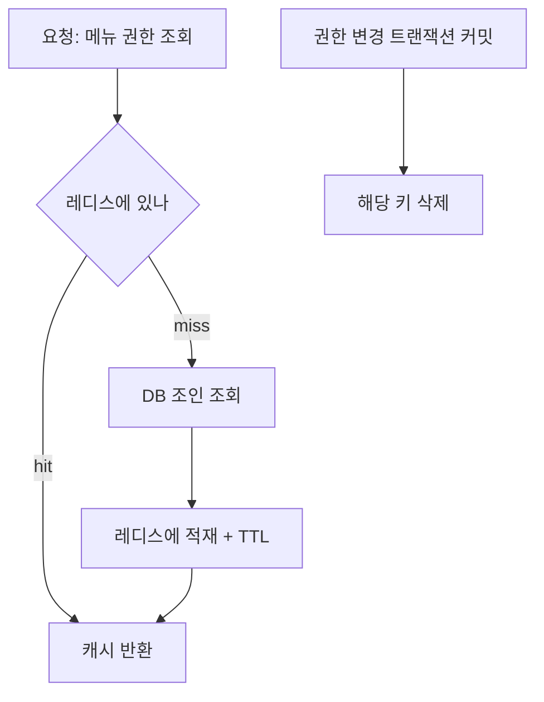

권한에 따라 메뉴를 그리는 화면을 다룬 주가 있었다. 사용자가 화면을 열 때마다 "이 사람이 어떤 메뉴/기능에 접근할 수 있는가"를 DB로 묻는데, 이 조회는 보통 사용자→역할→권한을 여러 번 조인하는 무거운 쿼리다. 페이지 이동마다 이게 돌면 권한 조회가 병목이 된다. 핵심은 **권한을 캐시하되, 권한이 바뀌는 순간을 놓치지 않는 것**이다. 캐시 미스보다 무서운 게 스테일 권한이다.

## 왜 권한 캐시는 특별한가

일반 캐시는 "잠깐 옛 데이터를 봐도 큰일 없다"가 전제다. 권한은 다르다.

- **스테일이 곧 보안 사고**: 권한을 회수했는데 캐시에 옛 권한이 남아 있으면, 회수된 사용자가 계속 접근한다. 반대로 잘못 부여한 권한이 캐시에 박히면 노출이 길어진다.
- **읽기 압도적, 쓰기 드묾**: 권한 조회는 매 요청마다 일어나지만 권한 변경은 드물다. 캐시 효율이 매우 높은 동시에, 드문 쓰기에서 무효화만 정확하면 안전하다.

따라서 권한 캐시의 설계 무게중심은 적중률보다 **무효화의 정확성**에 있다.

## 캐시 키와 읽기 경로

키는 권한이 무엇에 종속되는지로 정한다. 메뉴 권한이 보통 역할에 묶이면 **역할 단위**로 캐싱해 한 사용자의 권한 변경 폭발을 줄인다.

```java
public Set<String> allowedMenus(long userId) {
    long roleId = userRoleResolver.resolve(userId);
    String key = "perm:role:" + roleId;          // 역할 단위 키

    Set<String> cached = redis.opsForSet().members(key);
    if (cached != null && !cached.isEmpty()) return cached;

    Set<String> menus = permissionRepository.findMenuCodesByRole(roleId); // 무거운 조인
    redis.opsForSet().add(key, menus.toArray(String[]::new));
    redis.expire(key, Duration.ofMinutes(30));     // TTL은 최후 안전망
    return menus;
}
```

TTL은 무효화를 깜빡했을 때를 대비한 **마지막 안전망**이지, 1차 방어가 아니다. 1차 방어는 변경 시점의 명시적 무효화다.



## 권한 변경 시 무효화

권한을 바꾸는 모든 경로에서 영향받는 키를 지운다. 역할 단위로 캐싱했다면 그 역할 키 하나만 지워도 그 역할 전원에게 즉시 반영된다.

```java
@Transactional
public void updateRoleMenus(long roleId, Set<String> menus) {
    permissionRepository.replaceRoleMenus(roleId, menus);
    // 커밋 후에 무효화한다 (롤백되면 캐시도 건드리면 안 됨)
    afterCommit(() -> redis.delete("perm:role:" + roleId));
}
```

**커밋 이후에 지우는 것**이 중요하다. 트랜잭션 도중 캐시를 지우면, 다른 요청이 그 사이 DB를 읽어 (아직 커밋 안 된) 옛 값으로 캐시를 다시 채울 수 있다. 그리고 만약 이 트랜잭션이 롤백되면 캐시는 멀쩡한데 괜히 지워진 셈이 된다. 무효화는 항상 변경 확정 후에.

## 운영 함정

**무효화 누락 = 권한 회수 실패.** 권한을 바꾸는 경로가 여러 곳(관리자 화면, 배치, 마이그레이션)이면 그중 하나만 무효화를 빠뜨려도 회수된 권한이 계속 통한다. 권한 변경을 한 서비스 메서드로 모으고, 그 안에서만 캐시를 건드리게 강제하는 게 안전하다.

**과도하게 좁은 키.** 사용자 단위로만 캐싱하면 역할의 권한을 바꿀 때 그 역할을 가진 수천 명의 키를 일일이 지워야 한다. 누락 위험과 무효화 비용이 같이 커진다. 권한이 종속된 가장 상위 단위(보통 역할)를 키로 잡는 편이 무효화가 단순하다.

## 핵심 요약

- 매 요청 권한 조인은 병목이 되므로 캐시한다. 단, 권한은 스테일이 곧 보안 사고다.
- 캐시는 권한이 종속된 단위(보통 **역할**)로 잡아 무효화를 단순하게 만든다.
- 무효화는 변경 트랜잭션 **커밋 이후**에 키를 삭제한다. TTL은 보조 안전망일 뿐.
- 권한 변경 경로를 한 곳으로 모아 무효화 누락을 구조적으로 막는다.

> **면접 Q.** 권한 캐시에서 무효화를 트랜잭션 커밋 전에 하면 무엇이 문제인가?
> **A.** 커밋 전에 지우면 다른 요청이 아직 확정되지 않은 옛 값으로 캐시를 재충전할 수 있고, 트랜잭션이 롤백되면 무효화가 무의미해진다. 그래서 무효화는 커밋 후에 한다.
