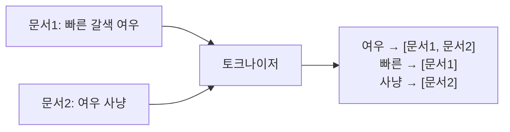

본문 검색을 `LIKE '%키워드%'`로 시작했다가 데이터가 쌓이면 반드시 벽에 부딪힌다. 앞에 와일드카드가 붙는 순간 인덱스를 못 쓰고 풀스캔이 되기 때문이다. 검색을 고도화하려면 **풀텍스트 인덱스**로 넘어가야 한다. 그 안에 무엇이 들었는지 안다면 검색 품질과 성능을 둘 다 손에 쥘 수 있다.

## LIKE의 한계: 왜 인덱스를 못 쓰나

B-Tree 인덱스는 값의 **앞부분**으로 정렬돼 있다. `LIKE '서울%'`은 접두사가 고정이라 인덱스 범위 스캔이 가능하다. 하지만 `LIKE '%서울%'`은 시작 지점을 알 수 없어 모든 행을 다 읽어 문자열을 검사해야 한다. 데이터가 늘면 선형으로 느려진다. 단어 단위 검색, 관련도 순 정렬도 불가능하다.

## 역색인: 검색의 핵심 자료구조

풀텍스트 인덱스는 **역색인(inverted index)**으로 동작한다. 문서를 단어로 쪼갠 뒤, "단어 → 그 단어가 등장한 문서 목록"을 거꾸로 저장한다.



"여우"를 검색하면 풀스캔 대신 역색인에서 `여우` 항목 하나만 찾아 문서 목록을 즉시 얻는다. 책 뒤의 찾아보기(색인)와 같은 원리다. 그래서 풀스캔과 무관하게 빠르다.

핵심 부품은 **토크나이저**다. 텍스트를 어떻게 단어로 쪼개느냐가 검색 결과를 결정한다. 영어는 공백으로 나누면 되지만, 한국어·중국어처럼 띄어쓰기가 단어 경계와 일치하지 않는 언어는 **n-gram**(연속된 n글자로 분해)이나 형태소 분석기를 쓴다. MySQL의 `ngram` 파서가 대표적이다.

## 자연어 모드와 불리언 모드

```sql
ALTER TABLE articles ADD FULLTEXT INDEX ft_body (title, body) WITH PARSER ngram;

-- 자연어 모드: 관련도 점수로 정렬
SELECT id, MATCH(title, body) AGAINST('데이터베이스 인덱스') AS score
FROM articles
WHERE MATCH(title, body) AGAINST('데이터베이스 인덱스')
ORDER BY score DESC;

-- 불리언 모드: 포함(+)·제외(-)·구문 연산자
SELECT id FROM articles
WHERE MATCH(title, body) AGAINST('+인덱스 -해시' IN BOOLEAN MODE);
```

자연어 모드는 단어 빈도와 희소성(TF-IDF 계열)으로 **관련도 점수**를 매겨 정렬한다. 흔한 단어는 점수가 낮고, 드문 단어가 매칭되면 점수가 높다. 불리언 모드는 점수 대신 논리 조건으로 필터링한다 — 반드시 포함할 단어, 제외할 단어를 명시할 수 있다.

## 운영 함정

- **최소 토큰 길이**: 파서에는 색인할 최소 글자 수 설정이 있다(`ngram_token_size` 등). 이보다 짧은 검색어는 결과가 비어 "검색이 안 된다"는 오해를 부른다. 서비스 언어와 검색 패턴에 맞춰 토큰 크기를 정하고, 변경하면 인덱스를 재구축해야 한다.
- **DB 풀텍스트의 한계**: 동의어, 오타 보정, 형태소 정규화, 복잡한 랭킹이 필요해지면 RDB 풀텍스트로는 부족하다. 그 지점이 전용 검색엔진으로 넘어갈 신호다. DB 풀텍스트는 "LIKE보다 낫고 검색엔진 도입 전"의 좋은 중간 단계다.

## 핵심 요약

- `LIKE '%x%'`는 인덱스를 못 써 풀스캔 — 본문 검색엔 역색인 기반 풀텍스트가 답이다.
- 역색인은 "단어 → 문서 목록"을 저장하고, 토크나이저가 검색 품질을 좌우한다(한국어는 n-gram/형태소).
- 자연어 모드는 관련도 점수 정렬, 불리언 모드는 포함·제외 논리 필터.
