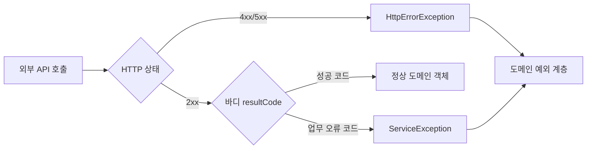

그 주의 작업은 외부 오픈 API를 호출해 데이터를 가져오는 클라이언트를 다루는 일이었다. 본질은 단순해 보이지만, 실제로 까다로운 지점은 호출이 "성공했는가"를 판정하는 기준이 하나가 아니라는 데 있다. 외부 API는 **두 층위**에서 실패한다. 이 둘을 뭉뚱그리면 호출부 코드가 외부 벤더의 상태코드 체계에 그대로 종속된다.

## 실패는 두 종류다

외부 API 호출에서 실패는 출처가 다르다.

1. **전송 계층 실패** — HTTP 상태코드가 4xx/5xx로 떨어진다. 인증 실패(401), 잘못된 요청(400), 게이트웨이 오류(502), 타임아웃 등. 이건 "응답 바디를 읽기도 전에" 결정된다.
2. **응답 바디 안의 업무 오류** — HTTP는 200 OK인데, 바디에 `{"resultCode": "30", "resultMsg": "유효하지 않은 식별자"}` 같은 업무 오류코드가 담겨 온다. 외부 시스템 입장에서 "요청은 정상 처리했고, 그 결과가 '조회 실패'다"라는 의미다.

이 둘을 같은 예외로 던지면 호출부는 외부 코드 체계를 직접 해석해야 한다. 그러면 외부 벤더가 코드 값을 바꾸는 순간 우리 도메인 로직이 깨진다. 이것이 **anti-corruption layer**가 필요한 이유다. 외부의 표현을 우리 내부 표현으로 **번역(translate)** 해서, 경계 안쪽 코드가 외부 어휘를 모르게 만든다.



## 출처별로 예외 계층을 가른다

핵심 설계는 **실패 출처마다 예외 타입을 분리**하는 것이다.

```java
// 전송 계층 실패: HTTP 상태가 비정상
public class HttpErrorException extends RuntimeException {
    private final int statusCode;
    public HttpErrorException(int statusCode, String message, Throwable cause) {
        super(message, cause);
        this.statusCode = statusCode;
    }
    public int getStatusCode() { return statusCode; }
}

// 응답 바디 업무오류: HTTP는 정상, 바디 코드가 실패
public class ServiceException extends RuntimeException {
    private final String externalCode;
    public ServiceException(String externalCode, String message) {
        super(message);
        this.externalCode = externalCode;
    }
    public String getExternalCode() { return externalCode; }
}
```

클라이언트는 이 둘을 명시적으로 분기해 던진다.

```java
public class ExternalApiClient {

    public OpenApiResponse fetch(String identifier) {
        ResponseEntity<OpenApiResponse> entity;
        try {
            entity = restTemplate.getForEntity(buildUri(identifier), OpenApiResponse.class);
        } catch (HttpStatusCodeException e) {
            // 1) 전송 계층 실패 — 상태코드를 우리 예외로 번역
            throw new HttpErrorException(
                e.getStatusCode().value(),
                "외부 API 전송 실패",
                e);
        }

        OpenApiResponse body = entity.getBody();
        // 2) 응답 바디 업무오류 — 외부 코드를 우리 어휘로 번역
        if (body == null || !body.isSuccess()) {
            throw translate(body);
        }
        return body;
    }

    private ServiceException translate(OpenApiResponse body) {
        String code = (body == null) ? "EMPTY" : body.getResultCode();
        // 외부 코드 → 우리 메시지로 매핑. 외부 코드 체계는 여기 안에만 갇힌다.
        String msg = switch (code) {
            case "30" -> "요청한 식별자가 존재하지 않는다";
            case "20" -> "외부 시스템 일시 오류";
            default   -> "알 수 없는 외부 응답: " + code;
        };
        return new ServiceException(code, msg);
    }
}
```

여기서 결정적인 점: **외부 코드 값("30", "20")은 `translate` 메서드 안에서만 등장한다.** 호출부는 `ServiceException`만 보면 되고, 외부가 코드 체계를 바꿔도 번역 테이블만 고치면 된다.

## 우리가 발행하는 코드와 방향이 반대다

우리 API가 클라이언트에게 내려주는 에러코드 카탈로그는 **outbound** — 우리 어휘를 밖으로 내보낸다. 반면 이 번역 계층은 **inbound** — 외부 어휘를 안으로 들여오면서 우리 어휘로 바꾼다. 방향이 반대다. 그래서 같은 "에러코드"라도 설계 의도가 다르다. inbound 경계의 목적은 단 하나, 외부의 변화가 도메인까지 전파되지 않게 막는 것이다.

## 운영 함정

- **타임아웃을 5xx와 같이 취급하면 안 된다.** `ConnectException`/`SocketTimeoutException`은 HTTP 상태가 아예 없다. `HttpStatusCodeException`만 잡으면 이들은 그대로 새어 나간다. 별도 catch로 묶어 `HttpErrorException(statusCode=0, ...)` 처럼 명시 표현을 줘야 한다.
- **바디가 200인데 실패인 경우를 놓친다.** 많은 오픈 API가 오류를 200으로 내려준다. HTTP 상태만 보고 성공으로 단정하면 빈 결과나 오류 바디를 정상 객체로 매핑해 NPE가 한참 뒤에 터진다. 반드시 바디의 결과코드를 검사하라.

## 핵심 요약

- 외부 API 실패는 **전송 계층(HTTP 상태)**과 **응답 바디 업무오류** 두 출처로 나뉜다.
- 출처별로 예외 타입을 가르고(`HttpErrorException` vs `ServiceException`), 외부 코드 체계는 번역 메서드 안에 가둔다.
- **면접 Q.** 외부 API가 200 OK로 오류를 내려줄 때 어떻게 처리하나? **A.** HTTP 상태만 믿지 않고 응답 바디의 결과코드를 검사해, 실패면 도메인 예외로 번역한다. 외부 코드는 경계 안에만 머물게 해 호출부가 외부 체계에 의존하지 않게 만든다.
