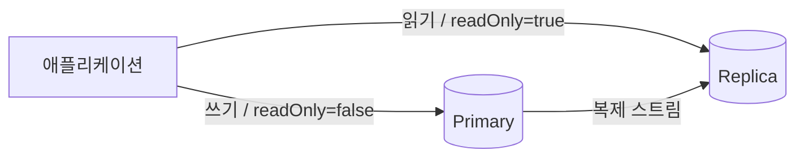

조회 트래픽이 쓰기보다 압도적으로 많은 서비스에서, 한 대의 DB가 읽기와 쓰기를 모두 받으면 읽기 부하가 쓰기까지 끌어내린다. 해법은 **읽기/쓰기 분리**다. 쓰기는 주 DB(Primary)로, 읽기는 복제본(Replica)으로 보낸다. 단, 복제는 공짜가 아니다 — 지연이라는 대가를 정확히 이해해야 한다.

## 라우팅: 트랜잭션 성격으로 데이터소스를 고른다

Spring에서는 `AbstractRoutingDataSource`로 현재 트랜잭션이 읽기 전용인지에 따라 데이터소스를 바꿔 끼울 수 있다. `@Transactional(readOnly = true)` 플래그를 라우팅 키로 삼는 패턴이 흔하다.

```java
public class RoutingDataSource extends AbstractRoutingDataSource {
    @Override
    protected Object determineCurrentLookupKey() {
        // 읽기 전용 트랜잭션이면 REPLICA, 아니면 PRIMARY
        return TransactionSynchronizationManager
                .isCurrentTransactionReadOnly() ? "REPLICA" : "PRIMARY";
    }
}
```



이러면 읽기 부하를 복제본으로 흘려보내 주 DB의 쓰기 처리량을 보존한다. 복제본을 여러 대 두면 읽기 수평 확장도 된다.

## 복제 지연: 방금 쓴 걸 못 읽는다

복제는 비동기다. 주 DB가 커밋한 변경이 복제본에 반영되기까지 수 밀리초~수 초의 **지연(replication lag)**이 있다. 그래서 "글을 작성하고 → 곧바로 목록을 조회"하는 흐름에서, 쓰기는 Primary로 갔지만 읽기는 Replica로 가면 **방금 쓴 데이터가 안 보인다**(read-your-writes 위반). 사용자는 "저장이 안 됐다"고 느낀다.

원인은 단순하다. 읽기 시점에 복제본이 아직 그 변경을 못 받았기 때문이다. 부하가 높을수록 지연이 커지므로 피크 때 더 자주 터진다.

## 일관성 요구에 따라 라우팅을 나눈다

해법은 "모든 읽기를 복제본으로"가 아니라 **일관성 요구 수준별로 나누는 것**이다.

- **강한 일관성이 필요한 읽기**(쓰기 직후 확인, 결제 잔액 등): Primary로 보낸다. 같은 트랜잭션 안에서 쓰고 읽거나, 쓰기 직후 일정 시간/요청은 Primary로 고정한다(sticky routing).
- **느슨해도 되는 읽기**(목록, 통계, 검색): Replica로 보낸다. 약간 늦은 데이터를 보여도 무방하다.
- **지연 모니터링**: 복제 지연을 지표로 수집하고, 지연이 임계치를 넘은 복제본은 라우팅에서 잠시 빼 stale 데이터 노출을 막는다.

## 운영 함정

- **readOnly 트랜잭션 안의 쓰기**: 라우팅 키를 `readOnly`로 잡았는데 그 트랜잭션이 실수로 쓰기를 하면 복제본에 쓰려다 실패하거나(복제본은 읽기 전용) 정의되지 않은 동작이 된다. 읽기 전용 경로의 쓰기 혼입을 코드 리뷰·정적 분석으로 차단한다.
- **트랜잭션 경계 밖 라우팅**: 라우팅이 트랜잭션 시작 시점에 결정되므로, 트랜잭션 없이 도는 쿼리나 트랜잭션 경계가 모호한 코드에서는 의도와 다른 데이터소스로 갈 수 있다. 데이터소스 결정 시점을 명확히 한다.

## 핵심 요약

- 읽기는 복제본, 쓰기는 주 DB로 분리해 읽기 부하를 떼어낸다(읽기 수평 확장).
- 비동기 복제 지연 때문에 "방금 쓴 걸 못 읽는" 문제가 생긴다.
- 일관성 요구가 강한 읽기는 Primary로, 느슨한 읽기만 Replica로 — 지연을 모니터링해 stale 복제본은 제외한다.
